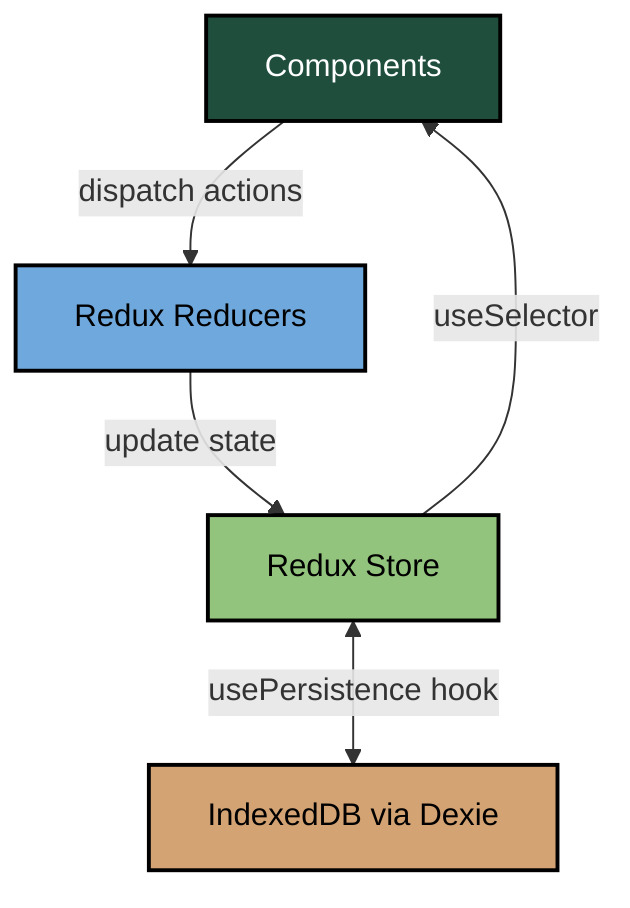
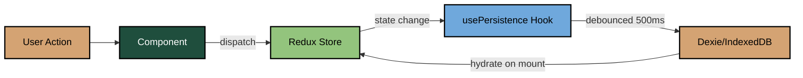

# Zeplar Frontend Architecture Overview

**Last Updated**: 2025-12-27

## Executive Summary

Zeplar is a **spaced repetition learning application** for mastering software engineering patterns. It uses the SM-2 algorithm to schedule review sessions and tracks learning progress through a 6-layer progressive disclosure system. Built with React 19, Redux Toolkit, and Vite, the app stores user progress locally in IndexedDB for offline-first learning.

## Tech Stack

### Core Framework

- **React 19.2.0** - Latest React with functional components and hooks
- **TypeScript 5.9.3** - Type-safe development
- **Vite 7.2.4** - Fast build tool and dev server
- **React Router DOM 7.11.0** - Client-side routing

### State Management

- **Redux Toolkit 2.11.2** - State management with slices
- **React Redux 9.2.0** - React bindings for Redux
- **NO Redux Saga** - Currently using Redux Toolkit only (pure reducers)

### Data Persistence

- **Dexie 4.2.1** - IndexedDB wrapper for local storage
- **Zod 4.2.1** - Runtime schema validation

### UI Components

- **Radix UI** - Headless UI primitives (Progress, Slot, Tabs)
- **Tailwind CSS 4.1.18** - Utility-first CSS framework
- **Framer Motion 12.23.26** - Animation library
- **Lucide React 0.562.0** - Icon library
- **class-variance-authority** - Component variant management
- **tailwind-merge** - Tailwind class merging utility

### Code Display

- **@uiw/react-codemirror 4.25.4** - Code editor component
- **@codemirror/lang-javascript 6.2.4** - JavaScript syntax highlighting

### Diagramming

- **Mermaid 11.12.2** - Diagram rendering

### Testing

- **Vitest 4.0.16** - Test runner
- **@testing-library/react 16.3.1** - React testing utilities
- **@testing-library/jest-dom 6.9.1** - DOM matchers
- **jsdom 27.4.0** - DOM implementation for Node

## Project Structure

```
zeplar/
├── src/
│   ├── app/                    # Core Redux store & router setup
│   │   ├── hooks.ts           # Typed useAppDispatch & useAppSelector
│   │   ├── router.tsx         # React Router configuration
│   │   └── store.ts           # Redux store configuration
│   │
│   ├── components/
│   │   ├── code/              # Code editor components (CodeMirror)
│   │   ├── diagrams/          # Mermaid diagram components
│   │   ├── layout/            # Layout components
│   │   └── ui/                # Radix UI + shadcn/ui primitives
│   │       ├── badge.tsx
│   │       ├── button.tsx
│   │       ├── card.tsx
│   │       ├── progress.tsx
│   │       └── tabs.tsx
│   │
│   ├── data/                  # Static pattern data
│   │   ├── patterns/          # Individual pattern definitions
│   │   │   ├── index.ts       # Pattern exports & utilities
│   │   │   ├── bulkhead.ts
│   │   │   ├── cache-aside.ts
│   │   │   ├── circuit-breaker.ts
│   │   │   ├── rate-limiting.ts
│   │   │   ├── retry.ts
│   │   │   └── timeout.ts
│   │   ├── schema.ts          # Zod schemas for Pattern structure
│   │   └── systems/           # System architecture data (future)
│   │
│   ├── features/              # Feature-based organization
│   │   ├── exploration/       # Pattern exploration UI (future)
│   │   │   └── components/
│   │   ├── learning/          # Spaced repetition learning system
│   │   │   ├── components/
│   │   │   │   ├── Flashcard/
│   │   │   │   │   ├── CardBack.tsx      # Answer side with rating
│   │   │   │   │   ├── CardFlip.tsx      # Flip animation wrapper
│   │   │   │   │   ├── CardFront.tsx     # Question side
│   │   │   │   │   └── RatingButtons.tsx # SM-2 quality ratings (0-5)
│   │   │   │   └── StudySession.tsx      # Session orchestration
│   │   │   └── learningSlice.ts          # Redux slice for learning state
│   │   ├── patterns/          # Pattern browsing UI (future)
│   │   │   └── components/
│   │   └── systems/           # System exploration (future)
│   │       └── components/
│   │
│   ├── lib/                   # Utility libraries
│   │   ├── cardGenerator.ts   # Generates flashcards from pattern data
│   │   ├── db.ts              # Dexie database operations
│   │   ├── persistence.ts     # Redux ↔ IndexedDB sync hook
│   │   ├── sm2.ts             # SM-2 spaced repetition algorithm
│   │   └── utils.ts           # General utilities
│   │
│   ├── pages/                 # Top-level page components
│   │   ├── Dashboard.tsx      # Home: stats, pattern library, due cards
│   │   └── Study.tsx          # Study session wrapper
│   │
│   ├── test/                  # Test configuration
│   │   └── setup.ts
│   │
│   ├── App.tsx                # Root app component
│   ├── main.tsx               # Entry point
│   └── index.css              # Global Tailwind styles
│
├── docs/                      # Documentation
├── public/                    # Static assets
├── dist/                      # Build output
├── index.html                 # HTML template
├── package.json
├── tsconfig.json
├── vite.config.ts
└── vitest.config.ts
```

## Architecture Patterns

### 1. State Management Architecture

**Current**: Redux Toolkit with pure reducers (NO sagas yet)



**State Shape**:

```typescript
{
  learning: {
    progress: Record<cardKey, CardProgress>,  // SM-2 progress per card
    session: StudySession,                    // Current study session
    stats: {
      totalReviews: number,
      streak: number,
      lastStudyDate?: string
    }
  }
}
```

**⚠️ DEVIATION FROM ROLE.MD**: The app currently does NOT use Redux Sagas. All logic is in reducers and React components. This may need architectural review if async operations grow.

### 2. Data Persistence (Offline-First)



**IndexedDB Schema** (Dexie):

- `cardProgress` - Per-card SM-2 progress (cardKey, nextReviewDate, state, interval, etc.)
- `stats` - Global learning stats (singleton record)
- `sessions` - Historical study session records

**Persistence Flow**:

1. On mount: `usePersistence()` hydrates Redux from IndexedDB
2. On state change: 500ms debounced save to IndexedDB
3. All writes go through `db.ts` helpers

### 3. Spaced Repetition (SM-2 Algorithm)

**Card States**: `new` → `learning` → `review` (or `relearning` on lapse)

**Quality Ratings**:

- 0 = Total blackout
- 1 = Wrong, but recognized
- 2 = Wrong, but familiar
- 3 = Correct with difficulty
- 4 = Correct with hesitation
- 5 = Perfect recall

**Algorithm** (`lib/sm2.ts`):

- Initial ease factor: 2.5
- Intervals: 1 day → 6 days → (interval × ease factor)
- Ease factor adjusts based on quality rating
- Minimum ease factor: 1.3

**Progressive Unlocking**:

- Users must master Layer 1 (concepts) before unlocking Layer 2 (structure)
- Requires 3+ successful reviews with interval ≥ 7 days
- Function: `canUnlockNextLayer()` in `sm2.ts`

### 4. Flashcard Generation

**Current**: Only Layer 1 (Concepts) implemented

**Card Types** (L1):

1. **Definition**: "What is X?"
2. **Problem Identification**: "What problem does X solve?"
3. **Pattern Recognition**: "Which pattern is described by [tagline]?"
4. **Tradeoff Pros**: "What are the benefits of X?"
5. **Tradeoff Cons**: "What are the drawbacks of X?"

**Card Key Format**: `{patternId}:L{layer}:{questionType}`

Example: `circuit-breaker:L1:definition`

**Future Layers** (not yet implemented):

- L2: Structure & Behavior
- L3: Code Expression
- L4: System Integration
- L5: Technology Mapping
- L6: System Composition

### 5. Pattern Data Schema

**6-Layer Progressive Disclosure Model**:

```typescript
interface Pattern {
  id: string;
  slug: string;
  hierarchy: {
    quality:
      | "performance"
      | "reliability"
      | "scalability"
      | "security"
      | "observability"
      | "maintainability";
    strategy: string; // e.g., "Fault Tolerance", "Work Reduction"
    family: string; // e.g., "Circuit Breakers", "Caching"
    level: 4 | 5; // Granularity level
    parentId?: string;
  };
  concept: {
    // Layer 1: Concept
    name: string;
    emoji: string;
    tagline: string;
    definition: string;
    problemSolved: string;
    tradeoffs: { pros: string[]; cons: string[] };
    relatedPatterns: string[];
  };
  structure: {
    // Layer 2: Structure & Behavior
    participants: Participant[];
    diagram: string; // Mermaid diagram
    flow: FlowStep[];
    invariants: string[];
  };
  codeExamples: CodeExample[]; // Layer 3: Code Expression
  systemContext: SystemContext; // Layer 4: System Integration
  implementations: Implementation[]; // Layer 5: Technology Mapping
  usedInSystems: SystemReference[]; // Layer 6: System Composition
  philosophy: Philosophy; // SBVP meta-domain
  visualization: Visualization; // SBVP meta-domain
  tags: string[];
  difficulty: "beginner" | "intermediate" | "advanced";
}
```

**Current Patterns** (6 total):

1. Circuit Breaker (reliability, fault tolerance)
2. Retry (reliability, fault tolerance)
3. Cache-Aside (performance, work reduction)
4. Bulkhead (reliability, fault tolerance)
5. Timeout (reliability, fault tolerance)
6. Rate Limiting (performance, work scheduling)

## Key Features

### 1. Dashboard (`pages/Dashboard.tsx`)

- **Cards due today** - Count of cards ready for review
- **Study stats** - Streak, total reviews, last study date
- **Pattern library** - Browseable list with mastery progress bars
- **Quality badges** - Visual grouping by system quality
- **Hierarchy badges** - Quality, strategy, family, difficulty

### 2. Study Session (`pages/Study.tsx` + `features/learning/components/StudySession.tsx`)

- **Flashcard interface** - Front/back flip animation
- **Keyboard shortcuts**:
  - `Space` - Flip card
  - `1-6` - Rate quality
  - `Esc` - End session
- **Progress bar** - Visual feedback on session completion
- **Session summary** - Cards reviewed, accuracy percentage

### 3. Data Persistence

- **Offline-first** - All data stored in IndexedDB
- **Auto-save** - 500ms debounced save on state changes
- **Hydration** - Load progress on app mount

## Component Patterns

### UI Component Organization

**shadcn/ui pattern**: Radix UI primitives + Tailwind variants

```typescript
// components/ui/button.tsx
import { cva } from "class-variance-authority";

const buttonVariants = cva("base classes", {
  variants: {
    variant: { default: "...", destructive: "...", outline: "..." },
    size: { default: "...", sm: "...", lg: "..." },
  },
});
```

**Composition**: Cards, Badges, Buttons, Progress bars, Tabs

### Feature Components

**Flashcard components** (`features/learning/components/Flashcard/`):

- `CardFlip.tsx` - Framer Motion flip animation wrapper
- `CardFront.tsx` - Question display + "Show Answer" button
- `CardBack.tsx` - Answer display + rating buttons
- `RatingButtons.tsx` - SM-2 quality rating UI (0-5)

**Design pattern**: Composition via props, minimal local state

## Routing

**Routes**:

- `/` - Dashboard (home page)
- `/study` - Study session

**Navigation**:

- Dashboard → Study: "Start Study Session" button
- Study → Dashboard: "End Session", "Back to Dashboard", or `Esc` key

## Testing Strategy

**Current setup**:

- Vitest as test runner
- Testing Library for component tests
- jsdom for DOM simulation

**Coverage**: Not yet implemented (no test files present)

## Build & Dev

**Scripts**:

```bash
npm run dev          # Dev server (Vite HMR)
npm run build        # TypeScript compile + Vite build
npm run preview      # Preview production build
npm run test         # Run tests once
npm run test:watch   # Watch mode
npm run test:coverage # Coverage report
npm run lint         # ESLint
npm run format       # Prettier
```

**Dev server**: `http://localhost:5173` (Vite default)

## Dark Mode

**Implementation**: CSS class-based (`dark` class on `<html>`)

**Setup** (`App.tsx`):

```typescript
useEffect(() => {
  document.documentElement.classList.add("dark");
}, []);
```

**Tailwind config**: Using Tailwind 4 with `@tailwindcss/vite` plugin (CSS-based config)

## Accessibility

**Current state**: Basic semantic HTML, keyboard navigation in study session

**Gaps**:

- No ARIA labels on interactive elements
- No focus management
- No screen reader announcements
- No reduced motion support

## Performance Considerations

**Optimizations in place**:

- Vite code splitting
- React 19 automatic batching
- Debounced IndexedDB writes (500ms)
- Memoized selectors in Redux

**Future optimizations needed**:

- `React.memo` for expensive components
- Virtualization for long pattern lists
- Lazy loading for code examples
- Service worker for offline support

## Known Limitations

1. **No Redux Sagas** - Deviates from ROLE.md architecture. May need refactor if async complexity grows.
2. **Only Layer 1 cards** - Layers 2-6 not implemented yet
3. **No user accounts** - All data local-only (no sync across devices)
4. **No analytics** - No tracking of learning effectiveness
5. **Limited accessibility** - Needs ARIA labels, focus management, screen reader support
6. **No error boundaries** - No graceful error handling UI
7. **No PWA** - Not installable, no offline manifest

## Future Architecture Considerations

### Migration to Sagas (if needed)

When async complexity grows (e.g., API calls, background sync), consider:

1. Add `redux-saga` dependency
2. Create `sagas/` directory mirroring `slices/`
3. Move side effects (API calls, etc.) to sagas
4. Keep reducers pure
5. Use saga patterns from ROLE.md

### Multi-device Sync

If adding cloud sync:

1. Add backend API (consideration for data-layer-engineer)
2. Implement conflict resolution (CRDTs or last-write-wins)
3. Use sagas for sync orchestration
4. Add optimistic updates
5. Handle offline queue

### Advanced Features

Potential additions:

- Spaced repetition analytics dashboard
- Customizable study algorithms (Anki, Leitner)
- Collaborative pattern libraries
- Pattern submission/review system
- Code playground for pattern examples
- Gamification (streaks, achievements)

## Mental Model Summary

**Metaphor**: Zeplar is a **progressive learning gym** for software patterns.

- **Patterns** = Exercises to master
- **Layers** = Progressive difficulty levels (unlock as you improve)
- **SM-2 algorithm** = Personal trainer adjusting schedule
- **IndexedDB** = Personal logbook (offline, private)
- **Dashboard** = Training schedule & progress tracker
- **Study session** = Workout routine

**Core Principle**: Spaced repetition with progressive disclosure. Users master concepts before diving into implementation details.
