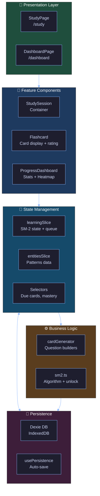
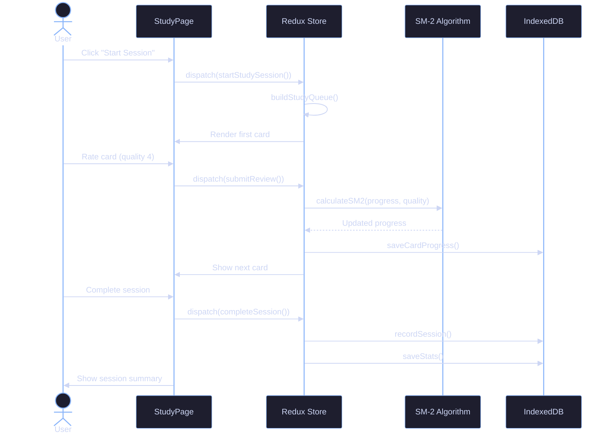

# Phase 1: Core Learning Loop - Architecture Design

**Date**: 2024-12-27
**Architect**: zeplar_architect
**Prerequisites**: Phase 0 must be 100% complete

---

## Overview

Phase 1 implements the **minimum viable learning experience**: users can study Layer 1 flashcards with SM-2 spaced repetition, track their progress, and build a daily habit.

---

## System Architecture



---

## Phase 1.1: SM-2 Algorithm ✅ ALREADY COMPLETE

**Status**: Implemented and tested in Phase 0.

**No action needed** - proceed to Phase 1.2.

---

## Phase 1.2: Card Generation (L1 Only)

### Goal

Generate 4 question types for Layer 1 concept cards from pattern data.

### Architecture Pattern: Factory + Strategy

```typescript
// src/lib/cardGenerator.ts

interface CardGenerator {
  generate(pattern: Pattern): Flashcard[];
}

class L1DefinitionGenerator implements CardGenerator {
  generate(pattern: Pattern): Flashcard[] {
    return [
      {
        id: `${pattern.id}-l1-definition`,
        patternId: pattern.id,
        layer: 1,
        questionType: "definition",
        sbvpDomain: "structure",
        front: {
          text: `What is the ${pattern.concept.name} pattern?`,
        },
        back: {
          text: pattern.concept.definition,
          diagram: pattern.visualization.staticDiagram,
        },
        hints: [pattern.concept.tagline],
        difficulty: 1,
        grammarCoordinates: {
          pattern: pattern.id,
          layer: 1,
          domain: "structure",
          facet: "definition",
          questionType: "what-is",
        },
      },
    ];
  }
}

class L1ProblemIdentificationGenerator implements CardGenerator {
  generate(pattern: Pattern): Flashcard[] {
    return [
      {
        id: `${pattern.id}-l1-problem`,
        patternId: pattern.id,
        layer: 1,
        questionType: "problem-identification",
        sbvpDomain: "philosophy",
        front: {
          text: `What problem does the ${pattern.concept.name} pattern solve?`,
        },
        back: {
          text: pattern.concept.problemSolved,
        },
        hints: [pattern.philosophy.coreProblem],
        difficulty: 1,
        grammarCoordinates: {
          pattern: pattern.id,
          layer: 1,
          domain: "philosophy",
          facet: "problem",
          questionType: "what-problem",
        },
      },
    ];
  }
}

class L1PatternRecognitionGenerator implements CardGenerator {
  generate(pattern: Pattern): Flashcard[] {
    // Multiple choice: given a definition/scenario, identify the pattern
    return [
      {
        id: `${pattern.id}-l1-recognition`,
        patternId: pattern.id,
        layer: 1,
        questionType: "pattern-recognition",
        sbvpDomain: "visualization",
        front: {
          text: pattern.concept.problemSolved,
          choices: generateDistractors(pattern), // Other patterns in same quality
        },
        back: {
          text: pattern.concept.name,
        },
        difficulty: 2,
        grammarCoordinates: {
          pattern: pattern.id,
          layer: 1,
          domain: "visualization",
          facet: "recognition",
          questionType: "which-pattern",
        },
      },
    ];
  }
}

class L1TradeoffAnalysisGenerator implements CardGenerator {
  generate(pattern: Pattern): Flashcard[] {
    return [
      {
        id: `${pattern.id}-l1-tradeoff-pros`,
        patternId: pattern.id,
        layer: 1,
        questionType: "tradeoff-analysis",
        sbvpDomain: "philosophy",
        front: {
          text: `What are the advantages of the ${pattern.concept.name} pattern?`,
        },
        back: {
          text: pattern.concept.tradeoffs.pros.join("\n• "),
        },
        difficulty: 2,
        grammarCoordinates: {
          pattern: pattern.id,
          layer: 1,
          domain: "philosophy",
          facet: "tradeoffs",
          questionType: "what-advantages",
        },
      },
      {
        id: `${pattern.id}-l1-tradeoff-cons`,
        patternId: pattern.id,
        layer: 1,
        questionType: "tradeoff-analysis",
        sbvpDomain: "philosophy",
        front: {
          text: `What are the drawbacks of the ${pattern.concept.name} pattern?`,
        },
        back: {
          text: pattern.concept.tradeoffs.cons.join("\n• "),
        },
        difficulty: 2,
        grammarCoordinates: {
          pattern: pattern.id,
          layer: 1,
          domain: "philosophy",
          facet: "tradeoffs",
          questionType: "what-drawbacks",
        },
      },
    ];
  }
}

// Master generator factory
export function generateL1Cards(pattern: Pattern): Flashcard[] {
  const generators: CardGenerator[] = [
    new L1DefinitionGenerator(),
    new L1ProblemIdentificationGenerator(),
    new L1PatternRecognitionGenerator(),
    new L1TradeoffAnalysisGenerator(),
  ];

  return generators.flatMap((g) => g.generate(pattern));
}

// Generate all cards for all patterns
export function generateAllL1Cards(patterns: Pattern[]): Flashcard[] {
  return patterns.flatMap(generateL1Cards);
}
```

### Card Key Format

**Specification**: `<pattern-id>-l<layer>-<question-type>[-<variant>]`

**Examples**:

- `circuit-breaker-l1-definition`
- `retry-l1-problem`
- `circuit-breaker-l1-tradeoff-pros`
- `cache-aside-l1-recognition`

**Rationale**: Deterministic IDs enable stable progress tracking across sessions.

### Integration with Redux

```typescript
// src/features/patterns/patternsSlice.ts

interface EntitiesState {
  patterns: Record<string, Pattern>;
  cards: Record<string, Flashcard>; // Generated cards cached
  cardsGenerated: boolean;
}

const entitiesSlice = createSlice({
  name: "entities",
  initialState,
  reducers: {
    loadPatterns(state, action) {
      state.patterns = action.payload;
    },
    generateCards(state) {
      const patterns = Object.values(state.patterns);
      const cards = generateAllL1Cards(patterns);
      state.cards = Object.fromEntries(cards.map((c) => [c.id, c]));
      state.cardsGenerated = true;
    },
  },
});
```

**Initialization**: Call `dispatch(generateCards())` after patterns load.

---

## Phase 1.3: Flashcard UI ✅ ALREADY COMPLETE

**Status**: Components exist, just need Redux integration.

### Required Changes

**StudySession.tsx** - Wire to Redux:

```typescript
function StudySession() {
  const dispatch = useAppDispatch()
  const currentCardKey = useAppSelector(selectCurrentCardKey)
  const card = useAppSelector(state => selectCardById(state, currentCardKey))
  const pattern = useAppSelector(state => selectPatternById(state, card?.patternId))

  const handleRate = (quality: Quality) => {
    dispatch(submitReview({ cardKey: currentCardKey, quality }))
    dispatch(advanceToNextCard())
  }

  if (!card || !pattern) return <div>Loading...</div>

  return (
    <FlashcardContainer
      card={card}
      pattern={pattern}
      onRate={handleRate}
    />
  )
}
```

---

## Phase 1.4: Session Flow

### Goal

Users can start a study session, review a queue of due cards, and see a summary.

### Queue Building Algorithm

```typescript
// src/lib/queueBuilder.ts

export interface QueueBuilderConfig {
  newCardsPerSession: number; // Default: 10
  reviewCardsPerSession: number; // Default: 20
  prioritizeOverdue: boolean; // Default: true
}

export function buildStudyQueue(
  allCards: Flashcard[],
  progress: Record<string, CardProgress>,
  config: QueueBuilderConfig,
): string[] {
  const now = new Date();

  // Separate cards into categories
  const newCards: string[] = [];
  const reviewCards: { key: string; overdue: number }[] = [];

  for (const card of allCards) {
    const prog = progress[card.id];

    if (!prog || prog.state === "new") {
      newCards.push(card.id);
    } else if (isDue(prog)) {
      reviewCards.push({
        key: card.id,
        overdue: daysOverdue(prog),
      });
    }
  }

  // Sort reviews by most overdue first (if enabled)
  if (config.prioritizeOverdue) {
    reviewCards.sort((a, b) => b.overdue - a.overdue);
  }

  // Build queue: reviews first, then new cards
  const queue: string[] = [
    ...reviewCards.slice(0, config.reviewCardsPerSession).map((r) => r.key),
    ...newCards.slice(0, config.newCardsPerSession),
  ];

  return queue;
}
```

### Session State Machine

```typescript
// src/features/learning/learningSlice.ts

interface Session {
  queue: string[]           // Card keys in order
  currentIndex: number      // Current position in queue
  startedAt: string         // ISO timestamp
  reviews: ReviewRecord[]   // Completed reviews
}

interface ReviewRecord {
  cardKey: string
  quality: Quality
  timestamp: string
}

// Actions
submitReview(state, action: { cardKey: string; quality: Quality }) {
  const { cardKey, quality } = action.payload

  // Update card progress with SM-2
  const currentProgress = state.cardProgress[cardKey] || createInitialProgress(cardKey)
  const nextProgress = calculateSM2(currentProgress, quality)
  state.cardProgress[cardKey] = {
    ...nextProgress,
    lastReviewDate: new Date(),
  }

  // Record in session
  state.session.reviews.push({
    cardKey,
    quality,
    timestamp: new Date().toISOString(),
  })

  // Update stats
  state.stats.totalReviews++
  if (quality >= 3) {
    // Update streak logic
  }
}

advanceToNextCard(state) {
  state.session.currentIndex++

  if (state.session.currentIndex >= state.session.queue.length) {
    // Session complete
    state.sessionComplete = true
  }
}
```

### Session Summary Screen

**Route**: `/study/summary`

**Display**:

- Cards reviewed: `session.reviews.length`
- Correct answers: `reviews.filter(r => r.quality >= 3).length`
- Session duration: `endTime - session.startedAt`
- Cards due tomorrow: `Object.values(cardProgress).filter(isDueTomorrow).length`

**Actions**:

- "Continue Studying" - Start new session
- "Back to Dashboard" - Navigate to `/dashboard`

---

## Phase 1.5: Progress Dashboard

### Goal

Visual feedback on learning progress to motivate daily habit.

### Dashboard Components

#### 1. Cards Due Today

```typescript
const selectCardsDueToday = createSelector(
  [(state) => state.learning.cardProgress],
  (progress) => {
    return Object.values(progress).filter(isDue).length;
  },
);
```

**Display**: Large number with "Cards Due Today" label + "Start Session" button.

#### 2. Current Streak

```typescript
interface Stats {
  totalReviews: number;
  streak: number; // Consecutive days with at least 1 review
  lastStudyDate?: string; // ISO date (YYYY-MM-DD)
}

function updateStreak(stats: Stats, now: Date): Stats {
  const today = now.toISOString().split("T")[0];
  const yesterday = new Date(now);
  yesterday.setDate(yesterday.getDate() - 1);
  const yesterdayStr = yesterday.toISOString().split("T")[0];

  if (stats.lastStudyDate === today) {
    // Already studied today, no change
    return stats;
  } else if (stats.lastStudyDate === yesterdayStr) {
    // Studied yesterday, increment streak
    return {
      ...stats,
      streak: stats.streak + 1,
      lastStudyDate: today,
    };
  } else {
    // Streak broken, reset to 1
    return {
      ...stats,
      streak: 1,
      lastStudyDate: today,
    };
  }
}
```

**Display**: "🔥 5 day streak" with fire emoji scaling by streak length.

#### 3. Heatmap (Last 7 Days)

```typescript
async function getLast7DaysActivity(): Promise<DayActivity[]> {
  const sessions = await getRecentSessions(50); // Over-fetch to cover 7 days

  const dayMap: Record<string, number> = {};
  for (const session of sessions) {
    const day = session.startedAt.split("T")[0];
    dayMap[day] = (dayMap[day] || 0) + session.cardsReviewed;
  }

  // Generate last 7 days
  const days: DayActivity[] = [];
  for (let i = 6; i >= 0; i--) {
    const date = new Date();
    date.setDate(date.getDate() - i);
    const dayStr = date.toISOString().split("T")[0];
    days.push({
      date: dayStr,
      count: dayMap[dayStr] || 0,
    });
  }

  return days;
}
```

**Display**: 7 squares, color intensity by card count (0 = gray, 1-5 = light blue, 6+ = dark blue).

#### 4. Per-Pattern Mastery

```typescript
const selectPatternMastery = createSelector(
  [
    (state) => state.entities.patterns,
    (state) => state.entities.cards,
    (state) => state.learning.cardProgress,
  ],
  (patterns, cards, progress) => {
    const patternMastery: Record<string, number> = {};

    for (const pattern of Object.values(patterns)) {
      // Get all L1 cards for this pattern
      const patternCards = Object.values(cards).filter(
        (c) => c.patternId === pattern.id && c.layer === 1,
      );

      // Calculate average mastery percentage
      const masteries = patternCards.map((c) =>
        getMasteryPercentage(progress[c.id]),
      );

      patternMastery[pattern.id] =
        masteries.reduce((sum, m) => sum + m, 0) / masteries.length;
    }

    return patternMastery;
  },
);
```

**Display**: List of patterns with progress bars:

```
Circuit Breaker  ████████░░ 80%
Retry            ██████░░░░ 60%
Cache-Aside      ███░░░░░░░ 30%
...
```

---

## Data Flow Diagram



---

## Testing Strategy

### Unit Tests

- SM-2 calculations (already tested)
- Card generation for all question types
- Queue building with various scenarios
- Streak calculation edge cases

### Integration Tests

- Complete study session flow
- Persistence cycle (save → close → reload → verify state)
- Card progress updates reflect in dashboard

### E2E Tests (Optional for Phase 1)

- Start session → review cards → see summary
- Daily usage → verify streak increments

---

## Performance Considerations

### Card Generation

**Decision**: Generate cards once at app load, cache in Redux.

**Rationale**: 6 patterns × 5 cards each = 30 total cards. Negligible memory footprint. Avoids re-generation on every session.

### IndexedDB Queries

**Optimization**: Index `cardProgress` by `nextReviewDate` for efficient "due cards" queries.

### Selector Memoization

**Critical selectors to memoize**:

- `selectCardsDueToday` (used in dashboard and session builder)
- `selectPatternMastery` (expensive aggregation)

---

## UI/UX Patterns

### Loading States

- **Initial Load**: Show spinner while patterns/cards generate
- **Session Start**: Show "Building queue..." while computing due cards
- **Card Review**: Disable rating buttons during Redux update

### Empty States

- **No Due Cards**: "All caught up! 🎉 Check back tomorrow."
- **No Patterns**: "No patterns loaded" (should never happen)

### Error States

- **Failed to Load Progress**: Show warning, offer "Reset Progress" button
- **Failed to Save**: Retry automatically, show toast on repeated failure

---

## Phase 1 Complete Criteria

- [ ] **L1 cards exist for 6 patterns** (30+ total cards)
- [ ] **Can start study session** with queue of due cards
- [ ] **SM-2 schedules reviews** correctly (verify with test data)
- [ ] **Progress persists** across sessions (close browser, reopen, state intact)
- [ ] **Dashboard shows**:
  - [ ] Cards due today count
  - [ ] Current streak
  - [ ] 7-day heatmap
  - [ ] Per-pattern L1 mastery percentages
- [ ] **Session summary** appears after completing queue

---

## Demo Video Requirements

**Duration**: 2 minutes

**Script**:

1. Show dashboard (0 reviews, 0 streak)
2. Click "Start Session"
3. Review 3 cards with different ratings (show flip animation)
4. Complete session, show summary
5. Return to dashboard (show updated stats: 3 reviews, 1 day streak)
6. Close browser tab
7. Reopen, show state persisted

---

## Risk Mitigation

| Risk                        | Mitigation                                          |
| --------------------------- | --------------------------------------------------- |
| Card generation bugs        | Extensive unit tests for each question type         |
| SM-2 edge cases             | Already tested in Phase 0                           |
| Persistence race conditions | Debounce saves, use atomic IndexedDB operations     |
| Poor UX for card flipping   | Use Framer Motion presets, test on multiple devices |

---

## Next Steps After Phase 1

**Phase 2 Preview**: Multi-Layer Cards (L2 structure, L3 code)

- Layer unlock gates (need 80% L1 mastery)
- L2 question types (participants, flow, diagrams)
- L3 question types (context dilation, action-reason, code identification)

**Foundation for Phase 2**: Phase 1's card generator pattern extends cleanly to L2/L3 by adding new generator classes.

---

**Document Status**: Ready for implementation. Awaiting Phase 0 completion.
