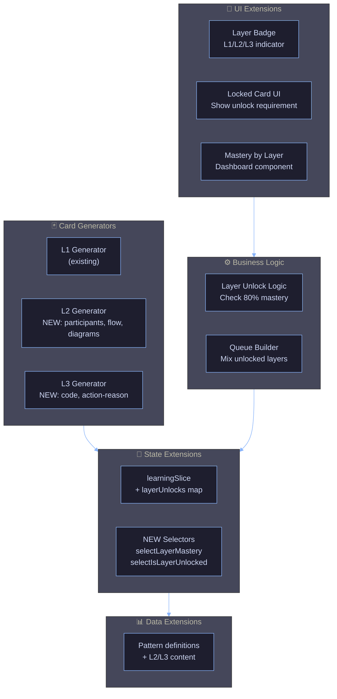

# Phase 2: Multi-Layer Cards - Architecture Design

**Date**: 2025-12-28
**Architect**: zeplar_architect
**Prerequisites**: Phase 1 must be 100% complete

---

## Overview

Phase 2 extends the learning system from **single-layer (L1)** to **three-layer mastery**. Users progress from understanding pattern concepts (L1) to structural knowledge (L2) to code implementation (L3). Each layer unlocks based on mastery of the previous layer.

**Learning Progression:**

- **L1 (Concept)**: What is this pattern? When do you use it?
- **L2 (Structure)**: Who are the participants? How do they interact?
- **L3 (Code)**: Show me the code. Explain this implementation.

---

## System Architecture



---

## Data Model Changes

### 1. Pattern Definition Extension

**File**: `src/data/patterns/{pattern}.ts`

```typescript
export const observerPattern: Pattern = {
  id: "observer",
  name: "Observer Pattern",
  category: "behavioral",

  // L1: Existing concept data
  concept: {
    definition: "...",
    whenToUse: ["..."],
    // ...
  },

  // L2: NEW - Structural information
  structure: {
    participants: [
      { name: "Subject", role: "Maintains state, notifies observers" },
      { name: "Observer", role: "Receives updates from subject" },
      { name: "ConcreteSubject", role: "Implements subject interface" },
      { name: "ConcreteObserver", role: "Implements observer interface" },
    ],
    flow: [
      "Subject state changes",
      "Subject calls notify()",
      "Each Observer receives update()",
      "Observers react to new state",
    ],
    diagram: "/diagrams/observer-structure.svg", // Optional
  },

  // L3: NEW - Code examples
  code: {
    typescript: {
      subject: `interface Subject {
  attach(observer: Observer): void;
  detach(observer: Observer): void;
  notify(): void;
}`,
      observer: `interface Observer {
  update(subject: Subject): void;
}`,
      example: `class NewsPublisher implements Subject {
  private observers: Observer[] = [];
  private latestNews: string = '';

  attach(observer: Observer) {
    this.observers.push(observer);
  }

  detach(observer: Observer) {
    const index = this.observers.indexOf(observer);
    this.observers.splice(index, 1);
  }

  notify() {
    this.observers.forEach(o => o.update(this));
  }

  publishNews(news: string) {
    this.latestNews = news;
    this.notify();
  }
}`,
    },
    contextDilation: {
      question:
        "Why does NewsPublisher call notify() instead of directly updating each observer?",
      answer:
        "Decoupling - observers decide how to respond. Subject doesn't know implementation details.",
    },
  },
};
```

### 2. Redux State Extension

**File**: `src/features/learning/learningSlice.ts`

```typescript
interface LearningState {
  // Existing fields...
  cardProgress: Record<string, CardProgress>;
  sessionQueue: string[];
  currentCardIndex: number;

  // NEW: Layer unlock tracking
  layerUnlocks: Record<string, LayerUnlockStatus>; // patternId → status
}

interface LayerUnlockStatus {
  l1Unlocked: boolean; // Always true
  l2Unlocked: boolean;
  l3Unlocked: boolean;
  l1Mastery: number; // 0-100
  l2Mastery: number;
  l3Mastery: number;
}
```

### 3. Card Progress Extension

**File**: `src/features/learning/types.ts`

```typescript
interface CardProgress {
  cardKey: string;
  patternId: string;
  layer: "L1" | "L2" | "L3"; // NEW field
  // ... existing SM-2 fields
}
```

---

## L2 Card Generator Specification

**File**: `src/lib/cardGenerator/l2Generator.ts`

### Question Types

#### 1. Participants Question

**Format**: "Who are the participants in the {pattern}?"

**Example**:

```
Q: Who are the participants in the Observer Pattern?
A: [Multiple choice]
   ✓ Subject, Observer, ConcreteSubject, ConcreteObserver
   ✗ Publisher, Subscriber, EventHandler
   ✗ Controller, View, Model
```

**Generation Logic**:

```typescript
function generateParticipantsQuestion(pattern: Pattern): Card {
  return {
    question: `Who are the participants in the ${pattern.name}?`,
    type: "multiple-choice",
    choices: [
      pattern.structure.participants.map((p) => p.name).join(", "), // Correct
      ...generateDistractors(pattern.category), // Wrong answers from similar patterns
    ],
    explanation: pattern.structure.participants
      .map((p) => `${p.name}: ${p.role}`)
      .join("\n"),
  };
}
```

#### 2. Flow Question

**Format**: "What is the correct sequence of interactions in {pattern}?"

**Example**:

```
Q: What is the correct sequence in the Observer Pattern?
A: [Ordered list - drag to reorder]
   1. Subject state changes
   2. Subject calls notify()
   3. Each Observer receives update()
   4. Observers react to new state
```

#### 3. Role Question

**Format**: "What is the role of {participant} in {pattern}?"

**Example**:

```
Q: What is the role of the Subject in the Observer Pattern?
A: [Short answer or multiple choice]
   ✓ Maintains state and notifies observers when it changes
```

**Card Generation**: Create 5 L2 cards per pattern:

- 1 participants question
- 1 flow sequence question
- 3 role questions (one for each main participant)

---

## L3 Card Generator Specification

**File**: `src/lib/cardGenerator/l3Generator.ts`

### Question Types

#### 1. Code Identification

**Format**: "Identify which pattern this code demonstrates"

**Example**:

```
Q: Which pattern does this code demonstrate?

class NewsPublisher {
  private observers: Observer[] = [];

  attach(observer: Observer) {
    this.observers.push(observer);
  }

  notify() {
    this.observers.forEach(o => o.update(this));
  }
}

A: [Multiple choice]
   ✓ Observer Pattern
   ✗ Strategy Pattern
   ✗ Decorator Pattern
```

#### 2. Action-Reason

**Format**: "Why does this code do X?"

**Example**:

```
Q: Why does NewsPublisher call notify() instead of directly updating each observer?

A: [Short answer]
   Decoupling - observers decide how to respond. Subject doesn't know observer implementation details.
```

#### 3. Context Dilation

**Format**: "What would break if we changed X?"

**Example**:

```
Q: What would break if we made observers: Observer[] public instead of private?

A: [Multiple choice]
   ✓ External code could modify the observer list, bypassing attach/detach
   ✗ Nothing - it's just a style preference
   ✗ Observers would receive notifications twice
```

#### 4. Fill-in-the-Blank Code

**Format**: Code snippet with blanks

**Example**:

```
Q: Complete this Observer implementation:

class Subscriber implements _______ {
  update(subject: Subject) {
    console.log('Received update from', _______);
  }
}

A:
   Blank 1: Observer
   Blank 2: subject
```

**Card Generation**: Create 5 L3 cards per pattern:

- 1 code identification
- 2 action-reason questions
- 1 context dilation
- 1 fill-in-the-blank

---

## Layer Unlock Logic

**File**: `src/lib/layerUnlock.ts`

### Unlock Thresholds

```typescript
const UNLOCK_THRESHOLDS = {
  L2: 80, // Require 80% L1 mastery to unlock L2
  L3: 80, // Require 80% L2 mastery to unlock L3
} as const;
```

### Mastery Calculation

```typescript
function calculateLayerMastery(
  patternId: string,
  layer: "L1" | "L2" | "L3",
  cardProgress: Record<string, CardProgress>,
): number {
  const layerCards = Object.values(cardProgress).filter(
    (cp) => cp.patternId === patternId && cp.layer === layer,
  );

  if (layerCards.length === 0) return 0;

  // Mastery = percentage of cards with easeFactor >= 2.5 (indicates competence)
  const masteredCards = layerCards.filter((cp) => cp.easeFactor >= 2.5);

  return (masteredCards.length / layerCards.length) * 100;
}
```

### Unlock Check

```typescript
function checkLayerUnlock(
  patternId: string,
  targetLayer: "L2" | "L3",
  layerUnlocks: Record<string, LayerUnlockStatus>,
): boolean {
  const status = layerUnlocks[patternId];

  if (targetLayer === "L2") {
    return status.l1Mastery >= UNLOCK_THRESHOLDS.L2;
  }

  if (targetLayer === "L3") {
    return status.l2Mastery >= UNLOCK_THRESHOLDS.L3 && status.l2Unlocked;
  }

  return false;
}
```

### Redux Integration

Add reducer action:

```typescript
updateLayerUnlocks: (state) => {
  Object.keys(state.layerUnlocks).forEach((patternId) => {
    const status = state.layerUnlocks[patternId];

    // Calculate current mastery
    status.l1Mastery = calculateLayerMastery(
      patternId,
      "L1",
      state.cardProgress,
    );
    status.l2Mastery = calculateLayerMastery(
      patternId,
      "L2",
      state.cardProgress,
    );
    status.l3Mastery = calculateLayerMastery(
      patternId,
      "L3",
      state.cardProgress,
    );

    // Check unlocks
    status.l2Unlocked = status.l1Mastery >= UNLOCK_THRESHOLDS.L2;
    status.l3Unlocked =
      status.l2Mastery >= UNLOCK_THRESHOLDS.L3 && status.l2Unlocked;
  });
};
```

**Call this action** after every card rating update.

---

## UI Components

### 1. Layer Badge Component

**File**: `src/components/LayerBadge.tsx`

```typescript
interface LayerBadgeProps {
  layer: "L1" | "L2" | "L3";
  locked?: boolean;
}

// Visual:
// [L1] - blue background
// [L2] - purple background
// [L3] - gold background
// [L2 🔒] - grayed out if locked
```

### 2. Locked Card Overlay

**File**: `src/components/LockedCardOverlay.tsx`

Show when user encounters locked card in session:

```
🔒 L2 Locked

You need 80% mastery of L1 cards to unlock L2.
Current L1 mastery: 65%

Keep studying L1 cards!
```

### 3. Dashboard Mastery Breakdown

**File**: `src/components/MasteryBreakdown.tsx`

Show per-pattern layer progress:

```
Observer Pattern:
  L1: ████████░░ 80% ✓ (Unlocked L2!)
  L2: ███░░░░░░░ 30%
  L3: 🔒 Unlock at L2 80%

Strategy Pattern:
  L1: ██████░░░░ 60%
  L2: 🔒 Unlock at L1 80%
  L3: 🔒 Unlock at L1 80%
```

---

## Queue Builder Changes

**File**: `src/lib/queueBuilder.ts`

### Current Behavior (Phase 1)

- Only includes L1 cards that are due

### New Behavior (Phase 2)

- Include cards from ALL unlocked layers
- Prioritize by: due date, then layer (L1 > L2 > L3)
- Filter out locked cards

```typescript
function buildSessionQueue(
  cardProgress: Record<string, CardProgress>,
  layerUnlocks: Record<string, LayerUnlockStatus>,
  maxCards: number = 10,
): string[] {
  const now = new Date();

  // Get all due cards from unlocked layers
  const dueCards = Object.values(cardProgress).filter((cp) => {
    const isDue = new Date(cp.nextReviewDate) <= now;
    const isUnlocked = checkCardUnlocked(cp, layerUnlocks);
    return isDue && isUnlocked;
  });

  // Sort by: due date (oldest first), then layer priority
  const sorted = dueCards.sort((a, b) => {
    const dateCompare =
      new Date(a.nextReviewDate).getTime() -
      new Date(b.nextReviewDate).getTime();
    if (dateCompare !== 0) return dateCompare;

    // Layer priority: L1 > L2 > L3
    return layerPriority(a.layer) - layerPriority(b.layer);
  });

  return sorted.slice(0, maxCards).map((cp) => cp.cardKey);
}

function checkCardUnlocked(
  card: CardProgress,
  layerUnlocks: Record<string, LayerUnlockStatus>,
): boolean {
  const status = layerUnlocks[card.patternId];

  if (card.layer === "L1") return true;
  if (card.layer === "L2") return status.l2Unlocked;
  if (card.layer === "L3") return status.l3Unlocked;

  return false;
}
```

---

## Implementation Phases

### Phase 2.1: Data & Logic Foundation

**Owner**: Backend Engineer

- [ ] Extend pattern definitions with L2/L3 content (all 6 patterns)
- [ ] Create L2 card generator (5 cards per pattern)
- [ ] Create L3 card generator (5 cards per pattern)
- [ ] Implement layer unlock logic (`layerUnlock.ts`)
- [ ] Extend `learningSlice` with `layerUnlocks` state
- [ ] Add `updateLayerUnlocks` action
- [ ] Update queue builder to filter by unlocks

**Deliverables**:

- 30 L2 cards (6 patterns × 5 cards)
- 30 L3 cards (6 patterns × 5 cards)
- Layer unlock logic with 80% threshold
- Queue builder respects layer locks

### Phase 2.2: UI Components

**Owner**: Frontend Engineer

- [ ] Create `LayerBadge` component
- [ ] Create `LockedCardOverlay` component
- [ ] Create `MasteryBreakdown` dashboard widget
- [ ] Update `Flashcard` component to show layer badge
- [ ] Update `Dashboard` to show layer mastery breakdown
- [ ] Add unlock celebration animation (when L2/L3 unlocks)
- [ ] Update session summary to show "L2 Unlocked!" if threshold crossed

**Deliverables**:

- Visual layer indicators on all cards
- Dashboard shows mastery by layer
- Unlock notifications

### Phase 2.3: Testing & Verification

**Owner**: Test Engineer

- [ ] Verify 90 total cards exist (30 L1 + 30 L2 + 30 L3)
- [ ] Test layer unlock thresholds (80% mastery triggers unlock)
- [ ] Test queue builder filters locked cards
- [ ] Test unlock celebration triggers at correct time
- [ ] Verify persistence (unlocks persist across sessions)
- [ ] Manual test: Start fresh → achieve 80% L1 → verify L2 unlocks
- [ ] E2E test: Complete learning journey L1 → L2 → L3

---

## Acceptance Criteria

### Data & Logic

- [ ] All 6 patterns have L2 and L3 content defined
- [ ] 90 total cards generated (30 per layer)
- [ ] L2 unlocks when L1 mastery ≥ 80%
- [ ] L3 unlocks when L2 mastery ≥ 80% AND L2 is unlocked
- [ ] Queue builder includes only unlocked cards
- [ ] Layer unlocks persist in IndexedDB

### UI

- [ ] Every card shows layer badge (L1/L2/L3)
- [ ] Locked cards show overlay with unlock requirement
- [ ] Dashboard shows mastery breakdown by layer per pattern
- [ ] Unlock celebration appears when crossing 80% threshold
- [ ] Session summary shows "L2 Unlocked!" message if applicable

### UX

- [ ] User sees clear path: "Study L1 to 80% → L2 unlocks"
- [ ] Progress feels rewarding (unlock animations, mastery visualization)
- [ ] No confusion about why cards are locked

---

## Risk Mitigation

| Risk                          | Mitigation                                                |
| ----------------------------- | --------------------------------------------------------- |
| L2/L3 content quality         | Review by domain expert before implementation             |
| Unlock threshold too high/low | Start at 80%, add admin toggle for testing                |
| Queue builder complexity      | Unit test all edge cases (all locked, mixed layers, etc.) |
| User confusion about locks    | Clear messaging, tutorial on first L2 encounter           |

---

## Success Metrics

After Phase 2 launch:

- Users complete average of 15+ cards per session (up from 10 in Phase 1)
- 80%+ of users unlock at least one L2 layer
- 40%+ of users unlock at least one L3 layer
- Session completion rate stays ≥ 90%

---

## Next Steps After Phase 2

**Phase 3 Preview**: Content Expansion

- Add 10 more patterns (total 16)
- Advanced patterns: CQRS, Event Sourcing, Saga, etc.
- User-generated content (submit your own patterns)

---

**Document Status**: Ready for implementation delegation.
