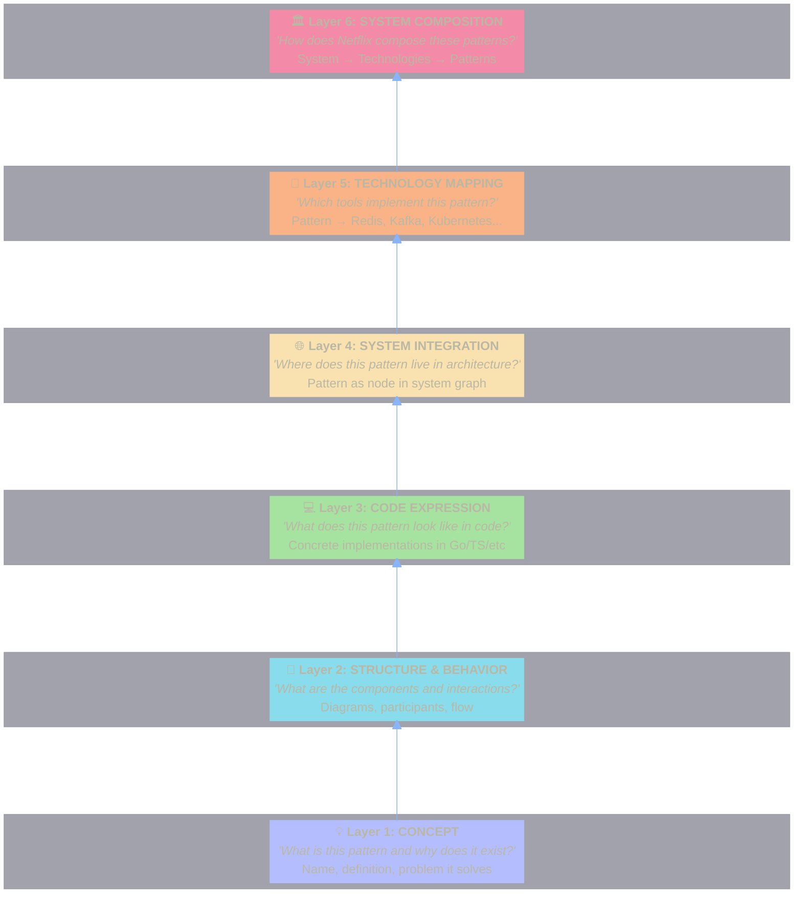

# 1. Vision & Learning Philosophy

[← Back to Index](./index.md)

---

## The Problem with Pattern Learning

Traditional pattern learning fails because:

1. **Flat exposure** — All patterns taught at same depth
2. **No retention reinforcement** — Learn once, forget quickly
3. **Missing connections** — Patterns exist in isolation
4. **Theory-practice gap** — Concepts without code
5. **No system context** — Patterns without architectural grounding

---

## The Solution: Progressive Layered Mastery



---

## The Four Meta-Domains (SBVP)

Every pattern must be understood through four orthogonal lenses. These are **cross-cutting concerns** that manifest at each layer:

```mermaid
%%{init: {'theme': 'base', 'themeVariables': { 'primaryColor': '#1e1e2e', 'primaryTextColor': '#cdd6f4', 'primaryBorderColor': '#89b4fa', 'lineColor': '#6c7086', 'secondaryColor': '#313244', 'tertiaryColor': '#45475a', 'background': '#1e1e2e'}}}%%
flowchart TB
    subgraph SBVP["🎯 Four Meta-Domains: SBVP"]
        direction LR

        subgraph S["📐 STRUCTURE"]
            S_DESC["<strong>What are the components?</strong><br/><em>The static anatomy</em>"]
            S_Q1["• What participants exist?"]
            S_Q2["• What are their roles?"]
            S_Q3["• What invariants hold?"]
        end

        subgraph B["⚡ BEHAVIOR"]
            B_DESC["<strong>How do they interact?</strong><br/><em>The dynamic choreography</em>"]
            B_Q1["• What triggers actions?"]
            B_Q2["• What is the flow sequence?"]
            B_Q3["• What state transitions occur?"]
        end

        subgraph V["👁️ VISUALIZATION"]
            V_DESC["<strong>How can we see it?</strong><br/><em>Mental model anchors</em>"]
            V_Q1["• Diagrams (Mermaid, SVG)"]
            V_Q2["• Animations for dynamics"]
            V_Q3["• Real-world use cases (3-5 sentences)"]
        end

        subgraph P["🧠 PHILOSOPHY"]
            P_DESC["<strong>Why does it work?</strong><br/><em>The foundational reasoning</em>"]
            P_Q1["• What problem birthed this?"]
            P_Q2["• What principle underlies it?"]
            P_Q3["• Why this shape, not another?"]
        end
    end

    S --> B
    B --> V
    V --> P
    P -.->|"informs"| S

    style S fill:#89b4fa,stroke:#89b4fa,color:#1e1e2e
    style B fill:#a6e3a1,stroke:#a6e3a1,color:#1e1e2e
    style V fill:#f9e2af,stroke:#f9e2af,color:#1e1e2e
    style P fill:#cba6f7,stroke:#cba6f7,color:#1e1e2e

    style S_DESC fill:#313244,stroke:#89b4fa,color:#cdd6f4
    style S_Q1 fill:#45475a,stroke:#89b4fa,color:#cdd6f4
    style S_Q2 fill:#45475a,stroke:#89b4fa,color:#cdd6f4
    style S_Q3 fill:#45475a,stroke:#89b4fa,color:#cdd6f4

    style B_DESC fill:#313244,stroke:#a6e3a1,color:#cdd6f4
    style B_Q1 fill:#45475a,stroke:#a6e3a1,color:#cdd6f4
    style B_Q2 fill:#45475a,stroke:#a6e3a1,color:#cdd6f4
    style B_Q3 fill:#45475a,stroke:#a6e3a1,color:#cdd6f4

    style V_DESC fill:#313244,stroke:#f9e2af,color:#cdd6f4
    style V_Q1 fill:#45475a,stroke:#f9e2af,color:#cdd6f4
    style V_Q2 fill:#45475a,stroke:#f9e2af,color:#cdd6f4
    style V_Q3 fill:#45475a,stroke:#f9e2af,color:#cdd6f4

    style P_DESC fill:#313244,stroke:#cba6f7,color:#cdd6f4
    style P_Q1 fill:#45475a,stroke:#cba6f7,color:#cdd6f4
    style P_Q2 fill:#45475a,stroke:#cba6f7,color:#cdd6f4
    style P_Q3 fill:#45475a,stroke:#cba6f7,color:#cdd6f4

    style SBVP fill:#1e1e2e,stroke:#f38ba8,color:#cdd6f4
```



### SBVP × Layers Matrix

Each layer emphasizes different SBVP aspects:

| Layer           | Structure          | Behavior           | Visualization        | Philosophy           |
| --------------- | ------------------ | ------------------ | -------------------- | -------------------- |
| L1: Concept     | Component names    | Problem→Solution   | Icon/emoji           | Core "why"           |
| L2: Structure   | Participant roles  | Interaction flow   | Mermaid diagram      | Design rationale     |
| L3: Code        | Types, interfaces  | Function calls     | Annotated code       | Implementation "why" |
| L4: System      | Service boundaries | API contracts      | Architecture diagram | System "why"         |
| L5: Technology  | Tool capabilities  | Config/usage       | Logo + snippet       | Tool choice "why"    |
| L6: Composition | Multi-pattern mesh | Cross-pattern flow | System map           | Architectural "why"  |

---

## Spaced Repetition Integration (SM-2 Algorithm)

Each layer for each pattern is tracked independently:

```typescript
interface CardProgress {
  patternId: string;
  layer: 1 | 2 | 3 | 4 | 5 | 6;

  // SM-2 Algorithm fields
  easeFactor: number; // Starting 2.5, min 1.3
  interval: number; // Days until next review
  repetitions: number; // Consecutive correct answers
  nextReviewDate: Date;

  // Learning state
  state: "new" | "learning" | "review" | "relearning";
  lapses: number; // Times forgotten after learning
}
```

---

[Next: Data Model →](./02-data-model.md)
