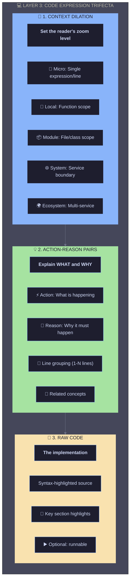

# 2. Data Model

[← Back to Index](./index.md) | [← Previous: Vision](./01-vision-philosophy.md)

---

## 2.1 Pattern Entity (Core)

```typescript
interface Pattern {
  id: string; // e.g., "circuit-breaker"
  slug: string; // URL-friendly identifier

  // Hierarchy position (from corpus)
  hierarchy: {
    quality: SystemQuality; // Level 1: Performance, Reliability, etc.
    strategy: string; // Level 2: Work Reduction, Fault Tolerance, etc.
    family: string; // Level 3: Caching, Circuit Breakers, etc.
    level: 4 | 5; // Level 4 = Pattern, Level 5 = Implementation
    parentId?: string; // For Level 5 implementations
  };

  // Layer 1: Concept
  concept: {
    name: string;
    emoji: string;
    tagline: string; // One-liner description
    definition: string; // Full definition
    problemSolved: string; // What pain point it addresses
    tradeoffs: {
      pros: string[];
      cons: string[];
    };
    relatedPatterns: string[]; // IDs of related patterns
  };

  // Layer 2: Structure & Behavior
  structure: {
    participants: Participant[]; // Components involved
    diagram: string; // Mermaid diagram code
    flow: FlowStep[]; // Sequence of operations
    invariants: string[]; // Rules that must hold
  };

  // Layer 3: Code Expression
  codeExamples: CodeExample[];

  // Layer 4: System Integration
  systemContext: {
    typicalPlacement: string[]; // "API Gateway", "Service Layer", etc.
    interactsWith: string[]; // Pattern IDs it commonly pairs with
    architecturalBoundaries: string[]; // Where it creates boundaries
  };

  // Layer 5: Technology Mapping
  implementations: Implementation[];

  // Layer 6: System Composition (reverse lookup)
  usedInSystems: SystemReference[];

  // === SBVP META-DOMAINS (Cross-cutting) ===

  // Philosophy: The foundational "why"
  philosophy: {
    coreProblem: string; // What fundamental issue does this solve?
    designPrinciple: string; // What principle underlies the solution?
    historicalContext?: string; // How did this pattern emerge?
    alternativesRejected: string[]; // Why not solve it differently?
    mentalModel: string; // Analogy or metaphor for intuition
  };

  // Visualization: Mental anchors
  visualization: {
    staticDiagram: string; // Mermaid for structure
    animatedDiagram?: string; // SVG/Lottie for behavior
    realWorldAnalogy: string; // "Like a bouncer at a club" for Circuit Breaker
    useCases: UseCaseExample[]; // 3-5 sentence real-world scenarios
  };

  // Metadata
  tags: string[];
  difficulty: "beginner" | "intermediate" | "advanced";
  createdAt: Date;
  updatedAt: Date;
}

interface UseCaseExample {
  domain: string; // "E-commerce", "Streaming", "Finance"
  scenario: string; // 3-5 sentence description
  patternRole: string; // How the pattern helps in this scenario
  companies?: string[]; // Real companies using this
}

type SystemQuality =
  | "performance"
  | "reliability"
  | "scalability"
  | "security"
  | "observability"
  | "maintainability";

interface Participant {
  name: string;
  role: string;
  responsibilities: string[];
}

interface FlowStep {
  step: number;
  actor: string;
  action: string;
  description: string;
}
```

---

## 2.2 Code Example with Layer 3 Trifecta

```typescript
interface CodeExample {
  id: string;
  language: "typescript" | "go" | "python" | "java" | "rust";
  title: string;
  description: string;
  code: string;
  runnable: boolean; // Can be executed in browser

  // === LAYER 3 TRIFECTA ===

  // 1. Context Dilation: Set the reader's zoom level
  contextDilation: {
    level: "micro" | "local" | "module" | "system" | "ecosystem";
    scope: string; // e.g., "This function handles a single retry attempt"
    prerequisites: string[]; // What context must the reader already have?
    systemPosition: string; // Where does this code sit in a larger system?
  };

  // 2. Action-Reason Annotations: Line-by-line (or grouped) explanations
  annotations: ActionReasonAnnotation[];

  // 3. The code itself (above) + highlights for quick scanning
  highlights: CodeHighlight[];
}

// The core pedagogical unit for code understanding
interface ActionReasonAnnotation {
  id: string;
  lines: [number, number]; // Start, end line (can span multiple)
  action: string; // WHAT: "Initialize circuit breaker state"
  reason: string; // WHY: "Track failure count to know when to trip"
  contextLevel: "micro" | "local" | "module" | "system"; // Zoom level for this annotation
  relatedConcepts?: string[]; // Link to other patterns/concepts
}

interface CodeHighlight {
  lines: [number, number]; // Start, end line
  label: string; // What this section demonstrates
  sbvpDomain: "structure" | "behavior" | "visualization" | "philosophy";
}

interface Implementation {
  id: string;
  name: string; // "Redis", "Resilience4j", etc.
  type: "library" | "framework" | "service" | "platform";
  languages: string[];
  description: string;
  links: {
    docs?: string;
    github?: string;
    npm?: string;
  };
  codeSnippet?: string; // Quick usage example
}

interface SystemReference {
  systemId: string;
  systemName: string; // "Netflix", "Uber", "Stripe"
  howUsed: string; // Description of usage
  source?: string; // Blog post, talk, etc.
}
```

---

## 2.3 System Entity (For Layer 6)

```typescript
interface RealWorldSystem {
  id: string;
  name: string; // "Netflix", "Uber", etc.
  domain: string; // "Streaming", "Ride-sharing"
  logo?: string;

  // Architecture overview
  architecture: {
    description: string;
    diagram?: string; // Mermaid
    scale: {
      users?: string; // "200M+ subscribers"
      requests?: string; // "1M+ RPS"
      data?: string; // "Petabytes"
    };
  };

  // Pattern usage with edges to pattern IDs
  patternUsage: PatternUsage[];

  // Technologies used
  techStack: TechStackEntry[];

  // Sources
  sources: Source[];
}

interface PatternUsage {
  patternId: string;
  component: string; // "API Gateway", "Recommendation Engine"
  description: string;
  importance: "critical" | "important" | "supporting";
}

interface TechStackEntry {
  technology: string;
  category: string; // "Database", "Message Queue", etc.
  implementsPatterns: string[]; // Pattern IDs this tech enables
}

interface Source {
  type: "blog" | "talk" | "paper" | "documentation";
  title: string;
  url: string;
  date?: string;
}
```

---

## 2.4 Layer 3 Deep Dive: The Code Expression Trifecta

Layer 3 is uniquely complex because code comprehension requires **variable context awareness**. Some code is locally significant; some only makes sense at a system level. We solve this with a three-part structure:



### Example: Circuit Breaker Layer 3 Content

```typescript
// Context Dilation
contextDilation: {
  level: 'module',
  scope: "Circuit breaker state machine managing failure detection",
  prerequisites: ["State machines", "Error handling", "Timeouts"],
  systemPosition: "Wraps outbound service calls in API Gateway or Service Layer"
}

// Action-Reason Annotations (excerpt)
annotations: [
  {
    id: "cb-state-init",
    lines: [2, 4],
    action: "Initialize state tracking variables",
    reason: "Circuit breaker must remember: current state, failure count, and last failure time to make trip decisions",
    contextLevel: "local",
    relatedConcepts: ["state-machine", "failure-detection"]
  },
  {
    id: "cb-open-check",
    lines: [12, 18],
    action: "Check if circuit should transition from OPEN to HALF-OPEN",
    reason: "After timeout, we probe with one request to test if downstream recovered—this prevents permanent lockout",
    contextLevel: "module",
    relatedConcepts: ["timeout-pattern", "graceful-degradation"]
  }
]
```

**UI Manifestation**: On the flashcard answer side, these three appear as **sub-tabs**:

- **Context Tab**: Shows dilation level + system position diagram
- **Action-Reason Tab**: Side-by-side code + annotations (like a code review)
- **Code Tab**: Pure syntax-highlighted implementation

---

## 2.5 DSL Grammar for Combinatorial Card Generation

To generate meaningful card variations automatically, we define a **grammar** that describes all learnable facets of a pattern:

```mermaid
%%{init: {'theme': 'base', 'themeVariables': { 'primaryColor': '#1e1e2e', 'primaryTextColor': '#cdd6f4', 'primaryBorderColor': '#89b4fa', 'lineColor': '#6c7086', 'secondaryColor': '#313244', 'tertiaryColor': '#45475a', 'background': '#1e1e2e'}}}%%
flowchart TD
    subgraph GRAMMAR["🔤 PATTERN LEARNING GRAMMAR"]
        direction TB

        PATTERN["Pattern<br/><code>circuit-breaker</code>"]

        subgraph LAYERS["📚 Layers (L)"]
            L1["L1: Concept"]
            L2["L2: Structure"]
            L3["L3: Code"]
            L4["L4: System"]
            L5["L5: Tech"]
            L6["L6: Composition"]
        end

        subgraph SBVP_G["🎯 Domains (D)"]
            D_S["Structure"]
            D_B["Behavior"]
            D_V["Visualization"]
            D_P["Philosophy"]
        end

        subgraph FACETS["🔍 Facets (F)"]
            F_DEF["Definition"]
            F_PROB["Problem"]
            F_PART["Participants"]
            F_FLOW["Flow"]
            F_CODE["Code"]
            F_WHY["Why"]
        end

        subgraph QTYPES["❓ Question Types (Q)"]
            Q_WHAT["What is...?"]
            Q_WHY["Why does...?"]
            Q_HOW["How does...?"]
            Q_WHICH["Which pattern...?"]
            Q_WHERE["Where would...?"]
            Q_COMPLETE["Complete the..."]
        end
    end

    PATTERN --> LAYERS
    LAYERS --> SBVP_G
    SBVP_G --> FACETS
    FACETS --> QTYPES

    style PATTERN fill:#f38ba8,stroke:#f38ba8,color:#1e1e2e
    style LAYERS fill:#313244,stroke:#89b4fa,color:#cdd6f4
    style SBVP_G fill:#313244,stroke:#a6e3a1,color:#cdd6f4
    style FACETS fill:#313244,stroke:#f9e2af,color:#cdd6f4
    style QTYPES fill:#313244,stroke:#cba6f7,color:#cdd6f4
    style GRAMMAR fill:#1e1e2e,stroke:#89b4fa,color:#cdd6f4
```



### Grammar Definition (BNF-style)

```bnf
<card>           ::= <pattern> × <layer> × <domain> × <facet> × <question_type>

<pattern>        ::= "circuit-breaker" | "retry" | "cache-aside" | ...
<layer>          ::= L1 | L2 | L3 | L4 | L5 | L6
<domain>         ::= Structure | Behavior | Visualization | Philosophy
<facet>          ::= Definition | Problem | Participants | Flow | Code | Why | ...
<question_type>  ::= WhatIs | WhyDoes | HowDoes | WhichPattern | WhereWould | Complete

# Layer 3 specific extensions
<L3_card>        ::= <pattern> × L3 × <L3_facet> × <L3_question>
<L3_facet>       ::= ContextDilation | ActionReason | RawCode
<L3_question>    ::= IdentifyPattern | IdentifyContext | ExplainAction | CompleteCode
```

### Combinatorial Generation Example

For pattern `circuit-breaker` at Layer 3:

| L3 Facet        | Question Type   | Generated Card                                                                |
| --------------- | --------------- | ----------------------------------------------------------------------------- |
| ContextDilation | IdentifyContext | "At what zoom level should you think about this code?"                        |
| ActionReason    | IdentifyPattern | "Given this action-reason: 'Check timeout to probe recovery', which pattern?" |
| ActionReason    | ExplainAction   | "What is the reason for lines 12-18?"                                         |
| RawCode         | IdentifyPattern | "Which pattern does this code implement?"                                     |
| RawCode         | CompleteCode    | "Fill in the missing state transition logic"                                  |

**Cardinality**: For a single pattern with 6 layers × 4 domains × ~5 facets × ~5 question types = **600+ potential unique cards**. The spaced repetition system surfaces the right ones based on mastery.

See [Distribution Strategy](./13-distribution-strategy.md) for how we manage this complexity.

---

## 2.6 Flashcard Entity

```typescript
interface Flashcard {
  id: string;
  patternId: string;
  layer: 1 | 2 | 3 | 4 | 5 | 6;

  // Question types vary by layer
  questionType: QuestionType;

  // SBVP domain this card targets
  sbvpDomain: "structure" | "behavior" | "visualization" | "philosophy";

  front: CardContent;
  back: CardContent;

  // For code-based questions (Layer 3)
  codeContext?: {
    language: string;
    code: string;
    highlightLines?: number[];
  };

  // === LAYER 3 TRIFECTA (when layer === 3) ===
  layer3Trifecta?: {
    // Which facet is the QUESTION about?
    questionFacet: "contextDilation" | "actionReason" | "rawCode";

    // All three are available as answer sub-tabs
    contextDilation: {
      level: "micro" | "local" | "module" | "system" | "ecosystem";
      scope: string;
      prerequisites: string[];
      systemPosition: string;
      diagram?: string; // Mini architecture showing where this code lives
    };

    actionReasonPairs: {
      lineRange: [number, number];
      action: string;
      reason: string;
      contextLevel: string;
    }[];

    rawCode: {
      code: string;
      language: string;
      highlights: { lines: [number, number]; label: string }[];
    };
  };

  // For system-based questions (Layer 4-6)
  systemContext?: {
    systemId: string;
    diagram?: string;
  };

  hints: string[];
  difficulty: number; // 1-5 scale

  // Grammar coordinates (for combinatorial tracking)
  grammarCoordinates: {
    pattern: string;
    layer: number;
    domain: string;
    facet: string;
    questionType: string;
  };
}

type QuestionType =
  // Layer 1: Concept
  | "definition" // "What is X?"
  | "problem-identification" // "What problem does X solve?"
  | "tradeoff-analysis" // "What are the tradeoffs of X?"
  | "pattern-recognition" // "Which pattern is this describing?"

  // Layer 2: Structure
  | "participant-identification" // "What are the participants in X?"
  | "flow-ordering" // "Order these steps correctly"
  | "diagram-completion" // "Fill in the missing component"

  // Layer 3: Code Expression Trifecta
  // 3a. Context Dilation questions
  | "context-level-identification" // "At what zoom level should you think about this code?"
  | "system-position-identification" // "Where does this code sit in a larger system?"
  | "prerequisite-identification" // "What concepts must you understand before this code?"

  // 3b. Action-Reason questions
  | "action-identification" // "What is lines 12-18 doing?"
  | "reason-identification" // "WHY do lines 12-18 exist?"
  | "action-to-pattern" // "Given this action-reason, which pattern?"
  | "pattern-to-action" // "What action-reasons would you expect in X?"

  // 3c. Raw Code questions
  | "code-identification" // "Which pattern is this code implementing?"
  | "code-completion" // "Complete this implementation"
  | "bug-finding" // "What's wrong with this implementation?"

  // Layer 4: System Integration
  | "placement-question" // "Where would you use X in this architecture?"
  | "combination-question" // "Which patterns would you combine with X?"

  // Layer 5: Technology
  | "tech-to-pattern" // "What pattern does Redis implement?"
  | "pattern-to-tech" // "Which technologies implement X?"

  // Layer 6: System Composition
  | "system-decomposition" // "What patterns does Netflix use for Y?"
  | "reverse-engineering" // "Given this architecture, identify patterns"

  // SBVP Cross-cutting (can apply to any layer)
  | "structure-question" // "What are the structural components?"
  | "behavior-question" // "How do components interact?"
  | "visualization-match" // "Match this diagram to a pattern"
  | "philosophy-question" // "Why does this pattern work this way?"
  | "mental-model-match"; // "Which analogy best describes this pattern?"

interface CardContent {
  text: string;
  code?: string;
  diagram?: string;
  image?: string;
  choices?: Choice[]; // For multiple choice
}

interface Choice {
  id: string;
  text: string;
  isCorrect: boolean;
  explanation?: string;
}
```

---

[Next: Redux Architecture →](./03-redux-architecture.md)
