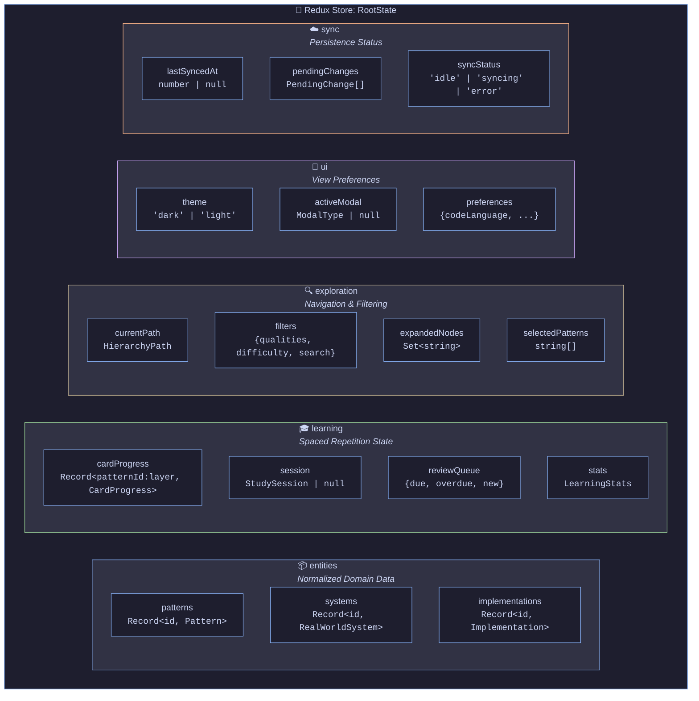

# 3. Redux State Architecture

[← Back to Index](./index.md) | [← Previous: Data Model](./02-data-model.md)

---

## 3.1 State Tree Design Philosophy

> **Principle**: State should be normalized, UI-agnostic, and support arbitrary view compositions.



---

## 3.2 Full State Interface

```typescript
interface RootState {
  // === DOMAIN DATA (Normalized) ===
  entities: {
    patterns: Record<string, Pattern>;
    systems: Record<string, RealWorldSystem>;
    implementations: Record<string, Implementation>;
  };

  // === LEARNING STATE ===
  learning: {
    // Card progress keyed by `${patternId}:${layer}`
    cardProgress: Record<string, CardProgress>;

    // Current study session
    session: StudySession | null;

    // Review queue (computed but cached)
    reviewQueue: {
      due: string[]; // Card IDs due today
      overdue: string[]; // Past due
      new: string[]; // Never seen
      lastComputed: number; // Timestamp
    };

    // Statistics
    stats: LearningStats;
  };

  // === EXPLORATION STATE ===
  exploration: {
    // Current navigation position in pattern hierarchy
    currentPath: HierarchyPath;

    // Filters and search
    filters: {
      qualities: SystemQuality[];
      difficulty: ("beginner" | "intermediate" | "advanced")[];
      searchQuery: string;
      tags: string[];
    };

    // Expansion state for tree views
    expandedNodes: Set<string>;

    // Selected items for comparison/linking
    selectedPatterns: string[];
    selectedSystems: string[];
  };

  // === UI STATE (Minimal) ===
  ui: {
    theme: "dark" | "light";
    sidebarCollapsed: boolean;
    activeModal: ModalType | null;
    toasts: Toast[];

    // View preferences
    preferences: {
      codeLanguage: string;
      diagramStyle: "mermaid" | "excalidraw";
      cardAnimations: boolean;
    };
  };

  // === SYNC STATE ===
  sync: {
    lastSyncedAt: number | null;
    pendingChanges: PendingChange[];
    syncStatus: "idle" | "syncing" | "error";
  };
}
```

---

## 3.3 Normalized Entity Pattern

```typescript
// Patterns are normalized - relationships are IDs, not nested objects
// This enables:
// 1. Single source of truth
// 2. Efficient updates
// 3. Flexible querying
// 4. Memory efficiency

// Example: Fetching a pattern with its implementations
const selectPatternWithImplementations = createSelector(
  [
    (state: RootState) => state.entities.patterns,
    (state: RootState) => state.entities.implementations,
    (_: RootState, patternId: string) => patternId,
  ],
  (patterns, implementations, patternId) => {
    const pattern = patterns[patternId];
    if (!pattern) return null;

    return {
      ...pattern,
      implementations: pattern.implementations
        .map((implId) => implementations[implId])
        .filter(Boolean),
    };
  },
);
```

---

## 3.4 Slice Structure

```typescript
// src/store/slices/

// 1. entitiesSlice.ts - Normalized domain data
// 2. learningSlice.ts - Spaced repetition state
// 3. explorationSlice.ts - Navigation and filtering
// 4. uiSlice.ts - UI preferences and ephemeral state
// 5. syncSlice.ts - Persistence and sync status
```

---

## 3.5 Key Selectors (Derived State)

```typescript
// === LEARNING SELECTORS ===

// Get all cards due for review today
export const selectDueCards = createSelector(
  [selectAllCardProgress],
  (progress) => {
    const now = new Date();
    return Object.values(progress)
      .filter((card) => new Date(card.nextReviewDate) <= now)
      .sort(
        (a, b) =>
          new Date(a.nextReviewDate).getTime() -
          new Date(b.nextReviewDate).getTime(),
      );
  },
);

// Get mastery level for a pattern (aggregate of all layers)
export const selectPatternMastery = createSelector(
  [
    (state: RootState) => state.learning.cardProgress,
    (_: RootState, patternId: string) => patternId,
  ],
  (progress, patternId) => {
    const layers = [1, 2, 3, 4, 5, 6] as const;
    const layerProgress = layers.map((layer) => {
      const key = `${patternId}:${layer}`;
      return progress[key];
    });

    return {
      overall: calculateOverallMastery(layerProgress),
      byLayer: layerProgress.reduce(
        (acc, p, i) => {
          acc[layers[i]] = p ? calculateLayerMastery(p) : 0;
          return acc;
        },
        {} as Record<number, number>,
      ),
    };
  },
);

// === EXPLORATION SELECTORS ===

// Get patterns filtered by current exploration state
export const selectFilteredPatterns = createSelector(
  [selectAllPatterns, selectExplorationFilters],
  (patterns, filters) => {
    return patterns.filter((pattern) => {
      if (
        filters.qualities.length > 0 &&
        !filters.qualities.includes(pattern.hierarchy.quality)
      ) {
        return false;
      }
      if (
        filters.difficulty.length > 0 &&
        !filters.difficulty.includes(pattern.difficulty)
      ) {
        return false;
      }
      if (filters.searchQuery) {
        const query = filters.searchQuery.toLowerCase();
        return (
          pattern.concept.name.toLowerCase().includes(query) ||
          pattern.concept.tagline.toLowerCase().includes(query) ||
          pattern.tags.some((tag) => tag.toLowerCase().includes(query))
        );
      }
      return true;
    });
  },
);

// Build hierarchy tree for navigation
export const selectPatternHierarchy = createSelector(
  [selectAllPatterns],
  (patterns) => {
    // Build tree: Quality -> Strategy -> Family -> Pattern
    return buildHierarchyTree(patterns);
  },
);

// === GRAPH SELECTORS (for visualization) ===

// Get pattern relationship graph
export const selectPatternGraph = createSelector(
  [selectAllPatterns, selectAllSystems],
  (patterns, systems) => {
    const nodes: GraphNode[] = [];
    const edges: GraphEdge[] = [];

    // Add pattern nodes
    patterns.forEach((p) => {
      nodes.push({
        id: p.id,
        type: "pattern",
        label: p.concept.name,
        data: p,
      });

      // Add edges to related patterns
      p.concept.relatedPatterns.forEach((relatedId) => {
        edges.push({
          source: p.id,
          target: relatedId,
          type: "related",
        });
      });
    });

    // Add system nodes and usage edges
    systems.forEach((s) => {
      nodes.push({
        id: s.id,
        type: "system",
        label: s.name,
        data: s,
      });

      s.patternUsage.forEach((usage) => {
        edges.push({
          source: s.id,
          target: usage.patternId,
          type: "uses",
          label: usage.component,
        });
      });
    });

    return { nodes, edges };
  },
);
```

---

[Next: Spaced Repetition →](./04-spaced-repetition.md)
