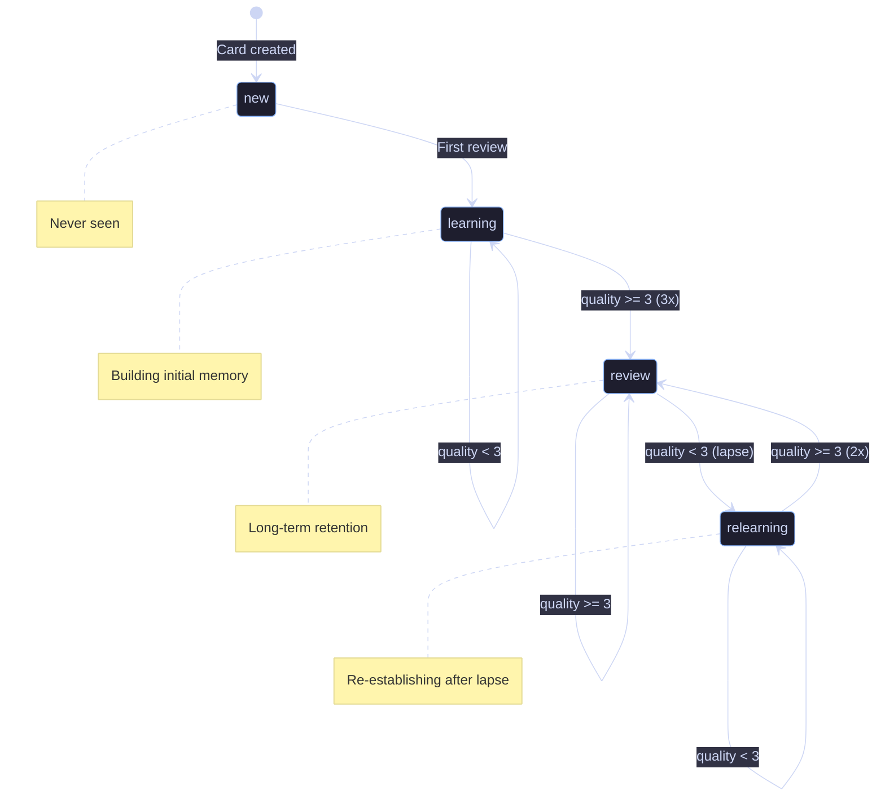

# 4. Spaced Repetition Engine

[← Back to Index](./index.md) | [← Previous: Redux Architecture](./03-redux-architecture.md)

---

## 4.1 SM-2 Algorithm Implementation

```typescript
// src/lib/spacedRepetition.ts

interface ReviewResult {
  quality: 0 | 1 | 2 | 3 | 4 | 5; // 0 = total blackout, 5 = perfect
}

interface SM2Result {
  easeFactor: number;
  interval: number;
  repetitions: number;
  nextReviewDate: Date;
}

export function calculateSM2(
  current: CardProgress,
  result: ReviewResult,
): SM2Result {
  const { quality } = result;
  let { easeFactor, interval, repetitions } = current;

  if (quality >= 3) {
    // Correct response
    if (repetitions === 0) {
      interval = 1;
    } else if (repetitions === 1) {
      interval = 6;
    } else {
      interval = Math.round(interval * easeFactor);
    }
    repetitions += 1;
  } else {
    // Incorrect response - reset
    repetitions = 0;
    interval = 1;
  }

  // Update ease factor
  easeFactor = Math.max(
    1.3,
    easeFactor + (0.1 - (5 - quality) * (0.08 + (5 - quality) * 0.02)),
  );

  const nextReviewDate = new Date();
  nextReviewDate.setDate(nextReviewDate.getDate() + interval);

  return {
    easeFactor,
    interval,
    repetitions,
    nextReviewDate,
  };
}
```

---

## 4.2 Quality Rating Guide

| Rating | Meaning                                   | Example Response                 |
| ------ | ----------------------------------------- | -------------------------------- |
| 0      | Total blackout                            | "I have no idea what this is"    |
| 1      | Wrong, but recognized after seeing answer | "Oh right, I knew that"          |
| 2      | Wrong, but answer seemed familiar         | "That rings a bell"              |
| 3      | Correct with difficulty                   | "I got it but had to think hard" |
| 4      | Correct with hesitation                   | "I knew it, just took a moment"  |
| 5      | Perfect, instant recall                   | "Easy, knew it immediately"      |

---

## 4.3 Layer Progression Logic

```typescript
// Users should master Layer N before advancing to Layer N+1

interface LayerProgression {
  patternId: string;
  currentLayer: 1 | 2 | 3 | 4 | 5 | 6;
  unlockedLayers: (1 | 2 | 3 | 4 | 5 | 6)[];
}

export function canUnlockNextLayer(
  progress: Record<string, CardProgress>,
  patternId: string,
  currentLayer: number,
): boolean {
  const key = `${patternId}:${currentLayer}`;
  const cardProgress = progress[key];

  if (!cardProgress) return false;

  // Require at least 3 successful reviews with interval >= 7 days
  return (
    cardProgress.repetitions >= 3 &&
    cardProgress.interval >= 7 &&
    cardProgress.state === "review"
  );
}

export function getRecommendedCards(
  progress: Record<string, CardProgress>,
  patterns: Pattern[],
  limit: number = 20,
): string[] {
  const now = new Date();
  const cards: Array<{ key: string; priority: number }> = [];

  patterns.forEach((pattern) => {
    [1, 2, 3, 4, 5, 6].forEach((layer) => {
      const key = `${pattern.id}:${layer}`;
      const p = progress[key];

      // Skip if layer not unlocked
      if (layer > 1 && !canUnlockNextLayer(progress, pattern.id, layer - 1)) {
        return;
      }

      let priority = 0;

      if (!p) {
        // New card - lower priority than due reviews
        priority = 100 + layer * 10;
      } else if (new Date(p.nextReviewDate) <= now) {
        // Due card - highest priority, earlier due = higher priority
        const daysOverdue = Math.floor(
          (now.getTime() - new Date(p.nextReviewDate).getTime()) / 86400000,
        );
        priority = Math.max(0, 50 - daysOverdue);
      } else {
        // Future card - skip
        return;
      }

      cards.push({ key, priority });
    });
  });

  return cards
    .sort((a, b) => a.priority - b.priority)
    .slice(0, limit)
    .map((c) => c.key);
}
```

---

## 4.4 Card Progress State Machine



---

## 4.5 Session Queue Builder

```typescript
interface SessionQueue {
  due: CardKey[]; // Cards due today (highest priority)
  overdue: CardKey[]; // Past due (review first!)
  new: CardKey[]; // New cards (limited per session)
  review: CardKey[]; // Already reviewed, coming back
}

export function buildSessionQueue(
  progress: Record<string, CardProgress>,
  patterns: Pattern[],
  config: {
    maxNewCards: number; // e.g., 10 new cards per session
    maxReviews: number; // e.g., 50 reviews per session
    sessionDuration?: number; // optional time limit
  },
): SessionQueue {
  const now = new Date();
  const queue: SessionQueue = {
    due: [],
    overdue: [],
    new: [],
    review: [],
  };

  // Collect all eligible cards
  patterns.forEach((pattern) => {
    [1, 2, 3, 4, 5, 6].forEach((layer) => {
      const key = `${pattern.id}:${layer}`;
      const p = progress[key];

      // Check layer unlock
      if (layer > 1 && !canUnlockNextLayer(progress, pattern.id, layer - 1)) {
        return;
      }

      if (!p) {
        queue.new.push(key);
      } else if (new Date(p.nextReviewDate) < now) {
        const daysOverdue = Math.floor(
          (now.getTime() - new Date(p.nextReviewDate).getTime()) / 86400000,
        );
        if (daysOverdue > 0) {
          queue.overdue.push(key);
        } else {
          queue.due.push(key);
        }
      }
    });
  });

  // Apply limits
  queue.new = queue.new.slice(0, config.maxNewCards);
  const totalReviews = queue.overdue.length + queue.due.length;
  if (totalReviews > config.maxReviews) {
    // Prioritize overdue
    const reviewBudget = config.maxReviews;
    const overdueCount = Math.min(queue.overdue.length, reviewBudget);
    queue.overdue = queue.overdue.slice(0, overdueCount);
    queue.due = queue.due.slice(0, reviewBudget - overdueCount);
  }

  return queue;
}
```

---

[Next: Tech Stack →](./05-tech-stack.md)
