# 6. Application Architecture

[← Back to Index](./index.md) | [← Previous: Tech Stack](./05-tech-stack.md)

---

## 6.1 Directory Structure

```mermaid
%%{init: {'theme': 'base', 'themeVariables': { 'primaryColor': '#1e1e2e', 'primaryTextColor': '#cdd6f4', 'primaryBorderColor': '#89b4fa', 'lineColor': '#6c7086', 'secondaryColor': '#313244', 'tertiaryColor': '#45475a', 'background': '#1e1e2e'}}}%%
flowchart LR
    subgraph SRC["📁 src/"]
        direction TB

        subgraph APP["⚙️ app/"]
            A1["store.ts"]
            A2["hooks.ts"]
            A3["router.tsx"]
        end

        subgraph FEATURES["🧩 features/"]
            direction TB

            subgraph PATTERNS["patterns/"]
                P_SLICE["patternsSlice.ts"]
                P_SEL["selectors.ts"]
                P_COMP["components/<br/>PatternCard, PatternTree,<br/>PatternGraph, PatternDetail/*"]
            end

            subgraph LEARNING["learning/"]
                L_SLICE["learningSlice.ts"]
                L_SM2["spacedRepetition.ts"]
                L_COMP["components/<br/>StudySession, Flashcard/*,<br/>ProgressDashboard"]
            end

            subgraph SYSTEMS["systems/"]
                S_SLICE["systemsSlice.ts"]
                S_COMP["components/<br/>SystemCard,<br/>SystemArchitecture"]
            end

            subgraph EXPLORE["exploration/"]
                E_SLICE["explorationSlice.ts"]
                E_COMP["components/<br/>SearchBar, FilterPanel,<br/>HierarchyBrowser"]
            end
        end

        subgraph COMPONENTS["🎨 components/"]
            C_UI["ui/ (shadcn)"]
            C_LAYOUT["layout/<br/>AppShell, Sidebar, Header"]
            C_DIAG["diagrams/<br/>MermaidRenderer,<br/>GraphVisualization"]
            C_CODE["code/<br/>CodeEditor, CodeHighlighter"]
        end

        subgraph LIB["📚 lib/"]
            LIB_SM2["sm2.ts"]
            LIB_CARD["cardGenerator.ts"]
            LIB_HIER["hierarchy.ts"]
            LIB_PERSIST["persistence.ts"]
        end

        subgraph DATA["💾 data/"]
            D_PAT["patterns/*.json"]
            D_SYS["systems/*.json"]
            D_SCHEMA["schema.ts (Zod)"]
        end

        subgraph PAGES["📄 pages/"]
            PG_DASH["Dashboard"]
            PG_STUDY["Study"]
            PG_EXPLORE["Explore"]
            PG_PATTERN["PatternPage"]
            PG_STATS["Stats"]
        end
    end

    style APP fill:#89b4fa,stroke:#89b4fa,color:#1e1e2e
    style FEATURES fill:#313244,stroke:#cba6f7,color:#cdd6f4
    style PATTERNS fill:#45475a,stroke:#f38ba8,color:#cdd6f4
    style LEARNING fill:#45475a,stroke:#a6e3a1,color:#cdd6f4
    style SYSTEMS fill:#45475a,stroke:#fab387,color:#cdd6f4
    style EXPLORE fill:#45475a,stroke:#89dceb,color:#cdd6f4
    style COMPONENTS fill:#313244,stroke:#f9e2af,color:#cdd6f4
    style LIB fill:#313244,stroke:#a6e3a1,color:#cdd6f4
    style DATA fill:#313244,stroke:#89b4fa,color:#cdd6f4
    style PAGES fill:#313244,stroke:#f38ba8,color:#cdd6f4
    style SRC fill:#1e1e2e,stroke:#89b4fa,color:#cdd6f4
```



---

## 6.2 File Tree

```
src/
├── app/
│   ├── store.ts              # Redux store configuration
│   ├── hooks.ts              # useAppDispatch, useAppSelector
│   └── router.tsx            # React Router configuration
│
├── features/
│   ├── patterns/
│   │   ├── patternsSlice.ts
│   │   ├── selectors.ts
│   │   └── components/
│   │       ├── PatternCard.tsx
│   │       ├── PatternTree.tsx
│   │       ├── PatternGraph.tsx
│   │       └── PatternDetail/
│   │           ├── ConceptTab.tsx
│   │           ├── StructureTab.tsx
│   │           ├── CodeTab.tsx
│   │           ├── SystemTab.tsx
│   │           ├── TechTab.tsx
│   │           └── CompositionTab.tsx
│   │
│   ├── learning/
│   │   ├── learningSlice.ts
│   │   ├── spacedRepetition.ts
│   │   └── components/
│   │       ├── StudySession.tsx
│   │       ├── Flashcard/
│   │       │   ├── CardFront.tsx
│   │       │   ├── CardBack.tsx
│   │       │   ├── CardFlip.tsx
│   │       │   └── RatingButtons.tsx
│   │       └── ProgressDashboard.tsx
│   │
│   ├── systems/
│   │   ├── systemsSlice.ts
│   │   └── components/
│   │       ├── SystemCard.tsx
│   │       └── SystemArchitecture.tsx
│   │
│   └── exploration/
│       ├── explorationSlice.ts
│       └── components/
│           ├── SearchBar.tsx
│           ├── FilterPanel.tsx
│           └── HierarchyBrowser.tsx
│
├── components/
│   ├── ui/                   # shadcn/ui components
│   ├── layout/
│   │   ├── AppShell.tsx
│   │   ├── Sidebar.tsx
│   │   └── Header.tsx
│   ├── diagrams/
│   │   ├── MermaidRenderer.tsx
│   │   └── GraphVisualization.tsx
│   └── code/
│       ├── CodeEditor.tsx
│       └── CodeHighlighter.tsx
│
├── lib/
│   ├── sm2.ts                # SM-2 algorithm
│   ├── cardGenerator.ts      # Flashcard generation from patterns
│   ├── hierarchy.ts          # Tree building utilities
│   └── persistence.ts        # IndexedDB operations
│
├── data/
│   ├── patterns/
│   │   ├── circuit-breaker.json
│   │   ├── retry.json
│   │   └── ...
│   ├── systems/
│   │   ├── netflix.json
│   │   ├── uber.json
│   │   └── ...
│   └── schema.ts             # Zod schemas for validation
│
└── pages/
    ├── Dashboard.tsx
    ├── Study.tsx
    ├── Explore.tsx
    ├── PatternPage.tsx
    └── Stats.tsx
```

---

## 6.3 Key Component Patterns

### Flashcard Container

```tsx
// Handles card generation, flipping, and rating submission

function FlashcardContainer() {
  const dispatch = useAppDispatch();
  const currentCardKey = useAppSelector(selectCurrentStudyCard);
  const [isFlipped, setIsFlipped] = useState(false);

  const { pattern, layer, card } = useGeneratedCard(currentCardKey);

  const handleRate = (quality: 0 | 1 | 2 | 3 | 4 | 5) => {
    dispatch(submitReview({ cardKey: currentCardKey, quality }));
    setIsFlipped(false);
    dispatch(advanceToNextCard());
  };

  return (
    <CardFlip isFlipped={isFlipped}>
      <CardFront card={card} onFlip={() => setIsFlipped(true)} />
      <CardBack
        card={card}
        pattern={pattern}
        layer={layer}
        onRate={handleRate}
      />
    </CardFlip>
  );
}
```

### Pattern Graph Visualization

```tsx
// Interactive graph showing pattern relationships

function PatternGraph() {
  const { nodes, edges } = useAppSelector(selectPatternGraph);
  const dispatch = useAppDispatch();

  const onNodeClick = useCallback(
    (event: any, node: Node) => {
      if (node.type === "pattern") {
        dispatch(explorationActions.selectPattern(node.id));
      } else if (node.type === "system") {
        dispatch(explorationActions.selectSystem(node.id));
      }
    },
    [dispatch],
  );

  return (
    <ReactFlow
      nodes={nodes}
      edges={edges}
      onNodeClick={onNodeClick}
      nodeTypes={nodeTypes}
      edgeTypes={edgeTypes}
    >
      <Background />
      <Controls />
      <MiniMap />
    </ReactFlow>
  );
}
```

---

[Next: User Flows →](./07-user-flows.md)
