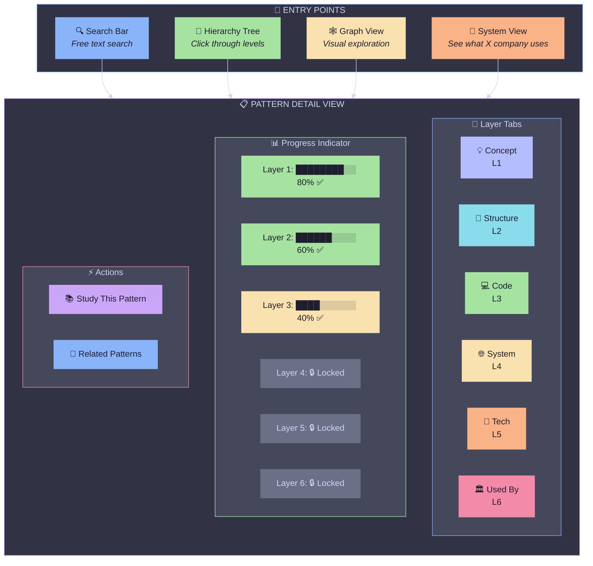
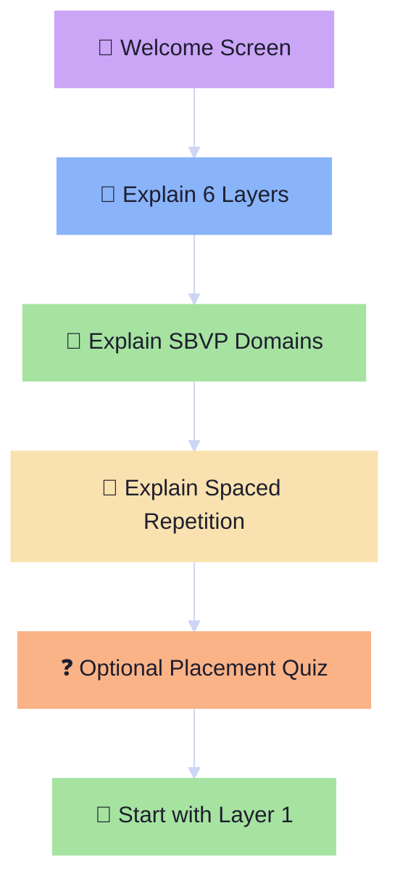

# 7. User Flows

[← Back to Index](./index.md) | [← Previous: App Architecture](./06-app-architecture.md)

---

## 7.1 Study Session Flow

```mermaid
%%{init: {'theme': 'base', 'themeVariables': { 'primaryColor': '#1e1e2e', 'primaryTextColor': '#cdd6f4', 'primaryBorderColor': '#89b4fa', 'lineColor': '#cdd6f4', 'secondaryColor': '#313244', 'tertiaryColor': '#45475a', 'background': '#1e1e2e'}}}%%
flowchart TD
    subgraph STUDY["📚 STUDY SESSION FLOW"]
        START([🎯 Start Study])
        QUEUE["📋 Compute Queue<br/><em>Priority: Overdue > Due > New</em><br/><em>Max 20 cards, respect layer progression</em>"]
        FRONT["🃏 Show Card Front<br/><em>Question based on card type</em>"]
        BACK["🔄 Show Card Back<br/><em>Answer + explanation</em><br/><em>+ Rating Buttons</em>"]
        UPDATE["💾 Update Progress<br/><em>SM-2 algorithm</em><br/><em>Persist to Redux + IDB</em>"]
        CHECK{More cards?}
        SUMMARY["📊 Session Summary<br/><em>+ Stats Update</em>"]

        START --> QUEUE
        QUEUE --> FRONT
        FRONT -->|"👆 User taps to reveal"| BACK
        BACK -->|"⭐ User rates 0-5"| UPDATE
        UPDATE --> CHECK
        CHECK -->|"✅ Yes"| FRONT
        CHECK -->|"🏁 No"| SUMMARY
    end

    style START fill:#a6e3a1,stroke:#a6e3a1,color:#1e1e2e
    style QUEUE fill:#89b4fa,stroke:#89b4fa,color:#1e1e2e
    style FRONT fill:#f9e2af,stroke:#f9e2af,color:#1e1e2e
    style BACK fill:#fab387,stroke:#fab387,color:#1e1e2e
    style UPDATE fill:#cba6f7,stroke:#cba6f7,color:#1e1e2e
    style CHECK fill:#f38ba8,stroke:#f38ba8,color:#1e1e2e
    style SUMMARY fill:#a6e3a1,stroke:#a6e3a1,color:#1e1e2e
    style STUDY fill:#313244,stroke:#89b4fa,color:#cdd6f4
```

---

## 7.2 Exploration Flow

---

## 7.3 Onboarding Flow

---

[Next: Data Pipeline →](./08-data-pipeline.md)
