# 8. Data Pipeline: Corpus → Flashcards

[← Back to Index](./index.md) | [← Previous: User Flows](./07-user-flows.md)

---

## 8.1 Transformation Process

```mermaid
%%{init: {'theme': 'base', 'themeVariables': { 'primaryColor': '#1e1e2e', 'primaryTextColor': '#cdd6f4', 'primaryBorderColor': '#89b4fa', 'lineColor': '#cdd6f4', 'secondaryColor': '#313244', 'tertiaryColor': '#45475a', 'background': '#1e1e2e'}}}%%
flowchart TD
    subgraph PIPELINE["⚙️ DATA TRANSFORMATION PIPELINE"]
        direction TB

        INPUT[("📄 INPUT<br/><strong>patterns-corpus.md</strong><br/><em>Hierarchical pattern enumeration</em>")]

        subgraph STEP1["🔍 Step 1: Parse Hierarchy"]
            S1_1["Extract Level 1-5 structure"]
            S1_2["Build parent-child relationships"]
            S1_3["Assign IDs based on path"]
        end

        subgraph STEP2["✨ Step 2: Enrich with Layer Content"]
            S2_DESC["For each Level 4 pattern:"]
            S2_L1["L1: Extract name, tagline, infer problem"]
            S2_L2["L2: Generate structure template"]
            S2_L3["L3: Add code example placeholders"]
            S2_L4["L4: Infer system placement from family"]
            S2_L5["L5: Link to Level 5 implementations"]
            S2_L6["L6: Cross-reference with systems data"]
        end

        subgraph STEP3["🃏 Step 3: Generate Flashcards"]
            S3_1["Generate question variants by type"]
            S3_2["Create front/back content"]
            S3_3["Add code context where applicable"]
            S3_4["Assign difficulty rating"]
        end

        OUTPUT[("📦 OUTPUT<br/><strong>Structured JSON files</strong><br/><em>in src/data/</em>")]

        INPUT --> STEP1
        STEP1 --> STEP2
        STEP2 --> STEP3
        STEP3 --> OUTPUT
    end

    style INPUT fill:#89b4fa,stroke:#89b4fa,color:#1e1e2e
    style OUTPUT fill:#a6e3a1,stroke:#a6e3a1,color:#1e1e2e

    style S1_1 fill:#45475a,stroke:#89dceb,color:#cdd6f4
    style S1_2 fill:#45475a,stroke:#89dceb,color:#cdd6f4
    style S1_3 fill:#45475a,stroke:#89dceb,color:#cdd6f4

    style S2_DESC fill:#313244,stroke:#fab387,color:#fab387
    style S2_L1 fill:#45475a,stroke:#b4befe,color:#cdd6f4
    style S2_L2 fill:#45475a,stroke:#89dceb,color:#cdd6f4
    style S2_L3 fill:#45475a,stroke:#a6e3a1,color:#cdd6f4
    style S2_L4 fill:#45475a,stroke:#f9e2af,color:#cdd6f4
    style S2_L5 fill:#45475a,stroke:#fab387,color:#cdd6f4
    style S2_L6 fill:#45475a,stroke:#f38ba8,color:#cdd6f4

    style S3_1 fill:#45475a,stroke:#cba6f7,color:#cdd6f4
    style S3_2 fill:#45475a,stroke:#cba6f7,color:#cdd6f4
    style S3_3 fill:#45475a,stroke:#cba6f7,color:#cdd6f4
    style S3_4 fill:#45475a,stroke:#cba6f7,color:#cdd6f4

    style STEP1 fill:#313244,stroke:#89dceb,color:#cdd6f4
    style STEP2 fill:#313244,stroke:#fab387,color:#cdd6f4
    style STEP3 fill:#313244,stroke:#cba6f7,color:#cdd6f4
    style PIPELINE fill:#1e1e2e,stroke:#89b4fa,color:#cdd6f4
```



---

## 8.2 Example Transformation

### Input (from corpus)

```markdown
## 🛡️ RELIABILITY → 💔 Fault Tolerance → 🔌 Circuit Breaker Patterns

- **🚫 Closed State** — _Normal operation_
- **🔓 Open State** — _Fail fast_
- **🔄 Half-Open State** — _Test recovery_
```

### Output (Pattern JSON)

```json
{
  "id": "circuit-breaker",
  "slug": "circuit-breaker",
  "hierarchy": {
    "quality": "reliability",
    "strategy": "fault-tolerance",
    "family": "circuit-breakers",
    "level": 4
  },
  "concept": {
    "name": "Circuit Breaker",
    "emoji": "🔌",
    "tagline": "Stop cascading failures by failing fast",
    "definition": "A pattern that prevents an application from repeatedly trying to execute an operation that's likely to fail, allowing it to continue without waiting for the fault to be fixed or wasting CPU cycles.",
    "problemSolved": "When a remote service is unavailable, continuous retry attempts waste resources and can cause cascading failures. Circuit Breaker detects failures and short-circuits requests during outages.",
    "tradeoffs": {
      "pros": [
        "Prevents cascade failures",
        "Allows system to recover gracefully",
        "Provides fast failure feedback"
      ],
      "cons": [
        "Adds complexity to error handling",
        "Requires tuning of thresholds",
        "May mask underlying issues if not monitored"
      ]
    },
    "relatedPatterns": ["retry", "timeout", "bulkhead", "fallback"]
  },
  "structure": {
    "participants": [
      {
        "name": "Circuit Breaker",
        "role": "State Machine",
        "responsibilities": [
          "Track failure count",
          "Manage state transitions",
          "Allow/block requests"
        ]
      },
      {
        "name": "Protected Resource",
        "role": "Downstream Service",
        "responsibilities": ["Handle requests", "Return success/failure"]
      }
    ],
    "diagram": "stateDiagram-v2\n    [*] --> Closed\n    Closed --> Open : Failure threshold exceeded\n    Open --> HalfOpen : Timeout elapsed\n    HalfOpen --> Closed : Probe succeeds\n    HalfOpen --> Open : Probe fails",
    "flow": [
      {
        "step": 1,
        "actor": "Client",
        "action": "request()",
        "description": "Initiates request to protected resource"
      },
      {
        "step": 2,
        "actor": "CircuitBreaker",
        "action": "checkState()",
        "description": "Evaluates current state"
      },
      {
        "step": 3,
        "actor": "CircuitBreaker",
        "action": "forward() or reject()",
        "description": "Allows or blocks based on state"
      }
    ],
    "invariants": [
      "Failure count resets to 0 when state transitions to Closed",
      "Half-Open state allows exactly one probe request",
      "Open state duration is configurable timeout"
    ]
  },
  "implementations": ["resilience4j", "polly", "opossum", "pybreaker"],
  "systemContext": {
    "typicalPlacement": ["Service Layer", "API Client", "Gateway"],
    "interactsWith": ["retry", "timeout", "fallback"],
    "architecturalBoundaries": [
      "Service-to-service calls",
      "External API integrations"
    ]
  },
  "usedInSystems": [
    {
      "systemId": "netflix",
      "systemName": "Netflix",
      "howUsed": "Hystrix (now deprecated) wrapped all service calls with circuit breakers",
      "source": "https://netflixtechblog.com/fault-tolerance-in-a-high-volume-distributed-system-91ab4faae74a"
    }
  ],
  "tags": ["fault-tolerance", "resilience", "microservices"],
  "difficulty": "intermediate"
}
```

---

## 8.3 Scripts

```typescript
// scripts/transform-corpus.ts

import { parseMarkdown } from "./parsers/markdown";
import { enrichPattern } from "./enrichers/pattern";
import { generateCards } from "./generators/flashcard";
import { writeJSON } from "./utils/fs";

async function main() {
  // 1. Parse corpus
  const corpus = await parseMarkdown("patterns-corpus.md");

  // 2. Enrich each pattern
  const patterns = await Promise.all(corpus.patterns.map(enrichPattern));

  // 3. Generate flashcards
  const flashcards = patterns.flatMap(generateCards);

  // 4. Write outputs
  await writeJSON("src/data/patterns.json", patterns);
  await writeJSON("src/data/flashcards.json", flashcards);

  console.log(
    `Generated ${patterns.length} patterns, ${flashcards.length} flashcards`,
  );
}

main();
```

---

[Next: MVP Scope →](./09-mvp-scope.md)
