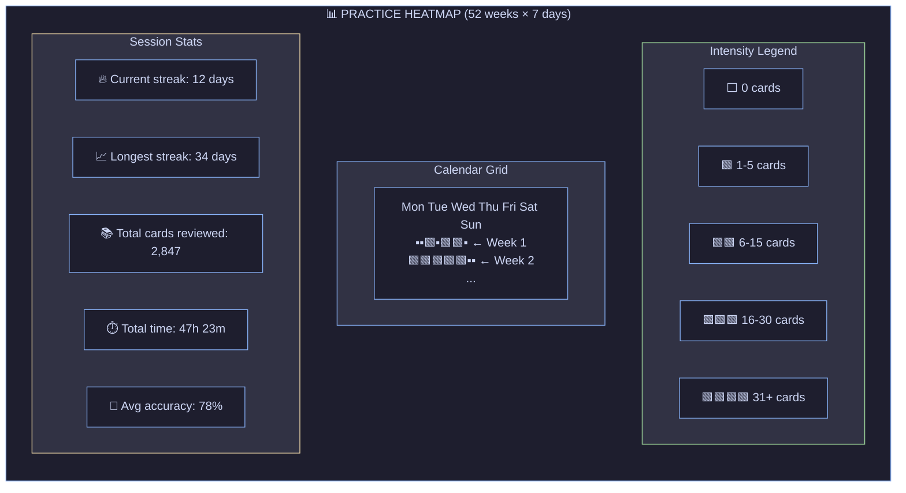

# 10. Session Visualization & Contribution Heatmap

[← Back to Index](./index.md) | [← Previous: MVP Scope](./09-mvp-scope.md)

---

## 10.1 GitHub-Style Activity Tracker

Track practice intensity over time with a contribution-style heatmap:



---

## 10.2 Data Model for Session Tracking

```typescript
interface StudySession {
  id: string;
  date: string; // ISO date: "2024-01-15"
  startTime: number; // Unix timestamp
  endTime: number;

  // Card metrics
  cardsReviewed: number;
  cardsCorrect: number; // Rating >= 3
  cardsByLayer: Record<1 | 2 | 3 | 4 | 5 | 6, number>;
  cardsByPattern: Record<string, number>;

  // Time metrics
  totalTimeMs: number;
  avgTimePerCardMs: number;

  // Streak tracking
  isStreakDay: boolean; // Did user meet daily goal?
}

interface DailyAggregate {
  date: string;
  totalCards: number;
  totalTimeMs: number;
  accuracy: number; // 0-1
  patternsStudied: string[];
  layerDistribution: Record<number, number>;
}

// For heatmap rendering
interface HeatmapCell {
  date: string;
  intensity: 0 | 1 | 2 | 3 | 4; // Maps to color
  cards: number;
  tooltip: string; // "Jan 15: 23 cards, 78% accuracy"
}
```

---

## 10.3 Streak Calculation

```typescript
interface StreakStats {
  currentStreak: number;
  longestStreak: number;
  lastActiveDate: string;
  streakStartDate: string;
}

function calculateStreak(aggregates: DailyAggregate[]): StreakStats {
  const sorted = aggregates.sort(
    (a, b) => new Date(b.date).getTime() - new Date(a.date).getTime(),
  );

  let currentStreak = 0;
  let longestStreak = 0;
  let tempStreak = 0;
  let lastDate: Date | null = null;

  for (const agg of sorted) {
    const date = new Date(agg.date);

    if (!lastDate) {
      tempStreak = 1;
    } else {
      const diffDays = Math.floor(
        (lastDate.getTime() - date.getTime()) / 86400000,
      );

      if (diffDays === 1) {
        tempStreak++;
      } else {
        if (tempStreak > longestStreak) {
          longestStreak = tempStreak;
        }
        tempStreak = 1;
      }
    }

    lastDate = date;
  }

  // Check if streak is current (includes today or yesterday)
  const today = new Date();
  const mostRecent = new Date(sorted[0]?.date || 0);
  const daysSinceActive = Math.floor(
    (today.getTime() - mostRecent.getTime()) / 86400000,
  );

  currentStreak = daysSinceActive <= 1 ? tempStreak : 0;

  return {
    currentStreak,
    longestStreak: Math.max(longestStreak, tempStreak),
    lastActiveDate: sorted[0]?.date || "",
    streakStartDate: sorted[currentStreak - 1]?.date || "",
  };
}
```

---

## 10.4 Intensity Calculation

```typescript
function calculateIntensity(cards: number): 0 | 1 | 2 | 3 | 4 {
  if (cards === 0) return 0;
  if (cards <= 5) return 1;
  if (cards <= 15) return 2;
  if (cards <= 30) return 3;
  return 4;
}

function getHeatmapColor(intensity: 0 | 1 | 2 | 3 | 4): string {
  const colors = {
    0: "#313244", // Empty - dark gray
    1: "#94e2d5", // Teal - low
    2: "#89dceb", // Sky - medium
    3: "#74c7ec", // Sapphire - high
    4: "#89b4fa", // Blue - max
  };
  return colors[intensity];
}
```

---

[Next: 3D Visualizations →](./11-3d-visualizations.md)
