# 11. 3D Animated Lifecycle Visualizations

[← Back to Index](./index.md) | [← Previous: Session Visualization](./10-session-visualization.md)

---

## 11.1 The Mental Model Problem

Reading code creates **fragmented understanding**. We see syntax but miss the **living, breathing lifecycle**. The solution: **3D animated state machines** that transform abstract patterns into visceral, memorable experiences.

---

## 11.2 The Tumbler Paradigm

Patterns with state machines (Circuit Breaker, Saga, State Pattern) are visualized as a **rotating 3D tumbler/carousel** with state cards:

```mermaid
%%{init: {'theme': 'base', 'themeVariables': { 'primaryColor': '#1e1e2e', 'primaryTextColor': '#cdd6f4', 'primaryBorderColor': '#89b4fa', 'lineColor': '#6c7086', 'secondaryColor': '#313244', 'tertiaryColor': '#45475a', 'background': '#1e1e2e'}}}%%
flowchart TB
    subgraph TUMBLER["🎰 3D STATE TUMBLER: Circuit Breaker"]
        direction LR

        subgraph CLOSED["🟢 CLOSED STATE CARD"]
            C_TITLE["<strong>CLOSED</strong><br/><em>Happy Path</em>"]
            C_VISUAL["⚡──────⚡<br/><em>Circuit connected</em>"]
            C_COUNTER["❌ Failure Counter<br/><code>failures: 2/3</code>"]
            C_GRAPH["📈 Failure Graph<br/>━━━━━━━ threshold<br/>▁▂▃ current"]
            C_TRIGGER["→ failures >= 3<br/>ROTATE CLOCKWISE →"]
        end

        subgraph OPEN["🔴 OPEN STATE CARD"]
            O_TITLE["<strong>OPEN</strong><br/><em>Fail Fast</em>"]
            O_VISUAL["⚡    ✂️    ⚡<br/><em>Circuit broken</em>"]
            O_CLOCK["⏰ Timeout Timer<br/><code>remaining: 28s</code>"]
            O_COUNTER["🚫 Requests blocked"]
            O_TRIGGER["→ timeout elapsed<br/>← ROTATE COUNTER-CW"]
        end

        subgraph HALFOPEN["🟠 HALF-OPEN STATE CARD"]
            H_TITLE["<strong>HALF-OPEN</strong><br/><em>Probing</em>"]
            H_VISUAL["⚡──•••──⚡<br/><em>Testing connection</em>"]
            H_COUNTER["✅ Success Counter<br/><code>successes: 3/5</code>"]
            H_GRAPH["📈 Success Graph<br/>━━━━━━━ threshold<br/>▁▂▃▄ current"]
            H_TRIGGER["→ successes >= 5<br/>← ROTATE COUNTER-CW"]
        end
    end

    CLOSED -->|"failures hit threshold"| OPEN
    OPEN -->|"timeout expires"| HALFOPEN
    HALFOPEN -->|"probe succeeds"| CLOSED
    HALFOPEN -->|"probe fails"| OPEN

    style CLOSED fill:#a6e3a1,stroke:#a6e3a1,color:#1e1e2e
    style OPEN fill:#f38ba8,stroke:#f38ba8,color:#1e1e2e
    style HALFOPEN fill:#fab387,stroke:#fab387,color:#1e1e2e
```



---

## 11.3 Visualization Data Model

```typescript
interface PatternVisualization {
  patternId: string;
  type: "tumbler" | "flow" | "graph" | "timeline" | "layered";

  // 3D scene configuration
  scene: {
    cameraPosition: [number, number, number];
    ambientLight: number;
    backgroundColor: string;
  };

  // State cards (for tumbler type)
  states?: StateCard[];

  // Transitions between states
  transitions?: StateTransition[];

  // Animation timeline
  timeline?: AnimationStep[];
}

interface StateCard {
  id: string;
  name: string; // "CLOSED", "OPEN", "HALF-OPEN"
  color: string; // "#a6e3a1" (green)
  opacity: number; // 0.5 for translucent
  position: number; // Angle on tumbler (0, 120, 240 degrees)

  // Visual elements on the card
  elements: CardElement[];
}

interface CardElement {
  type: "title" | "icon" | "counter" | "graph" | "timer" | "circuit";
  position: { x: number; y: number }; // Relative to card

  // Type-specific config
  config:
    | TitleConfig
    | IconConfig
    | CounterConfig
    | GraphConfig
    | TimerConfig
    | CircuitConfig;
}

interface CounterConfig {
  label: string; // "Failure Counter"
  variable: string; // "failures"
  threshold?: number; // 3
  color: string; // "#f38ba8" for failures
  format: "current" | "current/max" | "percentage";
}

interface GraphConfig {
  type: "line" | "bar";
  xAxis: "time" | "count";
  yAxis: string; // Variable name
  thresholdLine?: {
    value: number;
    color: string;
    label: string;
  };
  lineColor: string;
  animated: boolean;
}

interface StateTransition {
  from: string; // State ID
  to: string;
  trigger: string; // "failures >= 3"
  animation: {
    type: "rotate-cw" | "rotate-ccw" | "fade" | "slide";
    duration: number; // milliseconds
    easing: "linear" | "ease-in" | "ease-out" | "spring";
  };
}

interface AnimationStep {
  time: number; // milliseconds from start
  action:
    | { type: "increment"; variable: string; amount: number }
    | { type: "transition"; to: string }
    | { type: "highlight"; element: string }
    | { type: "pause"; duration: number }
    | { type: "reset" };
  narration?: string; // Optional voice-over text
}
```

---

## 11.4 Example: Circuit Breaker Full Animation Script

```typescript
const circuitBreakerAnimation: PatternVisualization = {
  patternId: "circuit-breaker",
  type: "tumbler",

  scene: {
    cameraPosition: [0, 0, 5],
    ambientLight: 0.6,
    backgroundColor: "#1e1e2e",
  },

  states: [
    {
      id: "closed",
      name: "CLOSED",
      color: "#a6e3a1",
      opacity: 0.7,
      position: 0,
      elements: [
        {
          type: "title",
          position: { x: 0.5, y: 0.1 },
          config: { text: "CLOSED", subtitle: "Happy Path" },
        },
        {
          type: "circuit",
          position: { x: 0.5, y: 0.3 },
          config: { connected: true, color: "#a6e3a1" },
        },
        {
          type: "counter",
          position: { x: 0.5, y: 0.5 },
          config: {
            label: "Failures",
            variable: "failures",
            threshold: 3,
            color: "#f38ba8",
            format: "current/max",
          },
        },
        {
          type: "graph",
          position: { x: 0.5, y: 0.75 },
          config: {
            type: "line",
            xAxis: "time",
            yAxis: "failures",
            thresholdLine: {
              value: 3,
              color: "#f38ba8",
              label: "Trip threshold",
            },
            lineColor: "#f38ba8",
            animated: true,
          },
        },
      ],
    },
    {
      id: "open",
      name: "OPEN",
      color: "#f38ba8",
      opacity: 0.7,
      position: 120,
      elements: [
        {
          type: "title",
          position: { x: 0.5, y: 0.1 },
          config: { text: "OPEN", subtitle: "Fail Fast" },
        },
        {
          type: "circuit",
          position: { x: 0.5, y: 0.3 },
          config: { connected: false, color: "#f38ba8" },
        },
        {
          type: "timer",
          position: { x: 0.5, y: 0.5 },
          config: {
            label: "Timeout",
            variable: "timeout",
            startValue: 30,
            color: "#f9e2af",
          },
        },
        {
          type: "icon",
          position: { x: 0.5, y: 0.75 },
          config: { icon: "🚫", label: "Requests Blocked" },
        },
      ],
    },
    {
      id: "half-open",
      name: "HALF-OPEN",
      color: "#fab387",
      opacity: 0.7,
      position: 240,
      elements: [
        {
          type: "title",
          position: { x: 0.5, y: 0.1 },
          config: { text: "HALF-OPEN", subtitle: "Probing" },
        },
        {
          type: "circuit",
          position: { x: 0.5, y: 0.3 },
          config: { connected: "partial", color: "#fab387" },
        },
        {
          type: "counter",
          position: { x: 0.5, y: 0.5 },
          config: {
            label: "Successes",
            variable: "successes",
            threshold: 5,
            color: "#a6e3a1",
            format: "current/max",
          },
        },
        {
          type: "graph",
          position: { x: 0.5, y: 0.75 },
          config: {
            type: "line",
            xAxis: "time",
            yAxis: "successes",
            thresholdLine: {
              value: 5,
              color: "#a6e3a1",
              label: "Recovery threshold",
            },
            lineColor: "#a6e3a1",
            animated: true,
          },
        },
      ],
    },
  ],

  transitions: [
    {
      from: "closed",
      to: "open",
      trigger: "failures >= 3",
      animation: { type: "rotate-cw", duration: 800, easing: "spring" },
    },
    {
      from: "open",
      to: "half-open",
      trigger: "timeout elapsed",
      animation: { type: "rotate-ccw", duration: 800, easing: "ease-out" },
    },
    {
      from: "half-open",
      to: "closed",
      trigger: "successes >= 5",
      animation: { type: "rotate-ccw", duration: 800, easing: "spring" },
    },
    {
      from: "half-open",
      to: "open",
      trigger: "probe fails",
      animation: { type: "rotate-cw", duration: 600, easing: "ease-in" },
    },
  ],

  timeline: [
    {
      time: 0,
      action: { type: "highlight", element: "closed" },
      narration: "Circuit starts CLOSED. All requests flow through.",
    },
    {
      time: 2000,
      action: { type: "increment", variable: "failures", amount: 1 },
      narration: "First failure detected...",
    },
    {
      time: 3000,
      action: { type: "increment", variable: "failures", amount: 1 },
    },
    {
      time: 4000,
      action: { type: "increment", variable: "failures", amount: 1 },
      narration: "Third failure! Threshold reached.",
    },
    {
      time: 4500,
      action: { type: "transition", to: "open" },
      narration: "Circuit OPENS. Requests blocked immediately.",
    },
    {
      time: 7000,
      action: { type: "highlight", element: "timer" },
      narration: "Timeout counting down...",
    },
    {
      time: 12000,
      action: { type: "transition", to: "half-open" },
      narration: "Timeout elapsed. Entering HALF-OPEN to probe.",
    },
    {
      time: 14000,
      action: { type: "increment", variable: "successes", amount: 1 },
      narration: "Probe succeeds! Counting...",
    },
    {
      time: 15000,
      action: { type: "increment", variable: "successes", amount: 2 },
    },
    {
      time: 16000,
      action: { type: "increment", variable: "successes", amount: 2 },
      narration: "Five successes! Service recovered.",
    },
    {
      time: 16500,
      action: { type: "transition", to: "closed" },
      narration: "Circuit CLOSES. Back to normal operation.",
    },
    { time: 20000, action: { type: "reset" } },
  ],
};
```

---

## 11.5 Technology Stack for 3D Visualizations

| Library                         | Purpose                                    |
| ------------------------------- | ------------------------------------------ |
| **React Three Fiber**           | React renderer for Three.js                |
| **@react-three/drei**           | Useful helpers (OrbitControls, Text, etc.) |
| **@react-three/postprocessing** | Bloom, glow effects                        |
| **Lottie / Rive**               | 2D animated icons within 3D scene          |
| **Framer Motion 3D**            | Declarative animations                     |
| **Zustand**                     | Lightweight state for animation variables  |

---

## 11.6 Visualization Types by Pattern Category

| Pattern Type       | Visualization Style   | Example                              |
| ------------------ | --------------------- | ------------------------------------ |
| **State Machines** | 3D Tumbler            | Circuit Breaker, Saga, State Pattern |
| **Flow/Pipeline**  | Animated Pipeline     | Chain of Responsibility, Pipeline    |
| **Structural**     | Exploded View         | Composite, Decorator, Proxy          |
| **Creational**     | Factory Assembly Line | Factory, Builder, Prototype          |
| **Behavioral**     | Message Passing       | Observer, Mediator, Command          |
| **Distributed**    | Network Graph         | Gossip Protocol, Raft, Paxos         |

---

[Next: Persistence →](./12-persistence.md)
