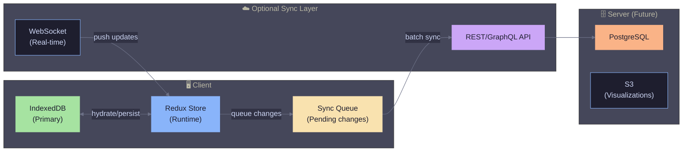

# 12. Persistence Strategy

[← Back to Index](./index.md) | [← Previous: 3D Visualizations](./11-3d-visualizations.md)

---

## 12.1 Storage Options Analysis

| Option                        | Pros                                         | Cons                                                      | Verdict            |
| ----------------------------- | -------------------------------------------- | --------------------------------------------------------- | ------------------ |
| **localStorage**              | Simple, synchronous                          | 5MB limit, no structure, cleared on "clear browsing data" | ❌ Not suitable    |
| **sessionStorage**            | Same as localStorage                         | Cleared on tab close                                      | ❌ Too ephemeral   |
| **IndexedDB**                 | Large storage, structured, persistent, async | More complex API                                          | ✅ **Recommended** |
| **OPFS + SQLite (wa-sqlite)** | Full SQL, excellent for complex queries      | Newer API, more setup                                     | ✅ Future option   |
| **Cache API**                 | Good for assets                              | Not designed for structured data                          | ❌ Wrong use case  |

---

## 12.2 Recommended: IndexedDB via Dexie.js

```typescript
// src/lib/db.ts
import Dexie, { Table } from "dexie";

interface PatternDB extends Dexie {
  sessions: Table<StudySession>;
  dailyAggregates: Table<DailyAggregate>;
  cardProgress: Table<CardProgress>;
  patterns: Table<Pattern>;
  settings: Table<UserSettings>;
}

const db = new Dexie("ZeplarDB") as PatternDB;

db.version(1).stores({
  sessions: "++id, date, startTime",
  dailyAggregates: "date",
  cardProgress: "[patternId+layer], nextReviewDate, state",
  patterns: "id, hierarchy.quality, hierarchy.family",
  settings: "key",
});

export { db };
```

---

## 12.3 Usage Examples

```typescript
// Record a study session
async function recordSession(session: StudySession) {
  await db.sessions.add(session);
  await updateDailyAggregate(session);
}

// Get heatmap data
async function getHeatmapData(
  startDate: Date,
  endDate: Date,
): Promise<HeatmapCell[]> {
  const aggregates = await db.dailyAggregates
    .where("date")
    .between(startDate.toISOString(), endDate.toISOString())
    .toArray();

  return aggregates.map((agg) => ({
    date: agg.date,
    intensity: calculateIntensity(agg.totalCards),
    cards: agg.totalCards,
    tooltip: `${agg.date}: ${agg.totalCards} cards, ${Math.round(agg.accuracy * 100)}% accuracy`,
  }));
}

// Get cards due for review
async function getDueCards(): Promise<CardProgress[]> {
  const now = new Date();
  return db.cardProgress
    .where("nextReviewDate")
    .belowOrEqual(now)
    .and((card) => card.state !== "suspended")
    .toArray();
}
```

---

## 12.4 Sync Strategy (Future)

For eventual cloud sync:



---

## 12.5 Offline-First Principles

1. **IndexedDB is source of truth** — Redux hydrates from IDB on app load
2. **Changes persist immediately** — Write to IDB before/alongside Redux
3. **Sync is optional** — App works 100% offline
4. **Conflict resolution** — Last-write-wins for card progress, merge for sessions

---

[Next: Distribution Strategy →](./13-distribution-strategy.md)
