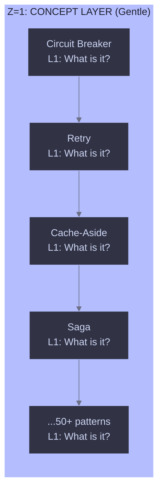
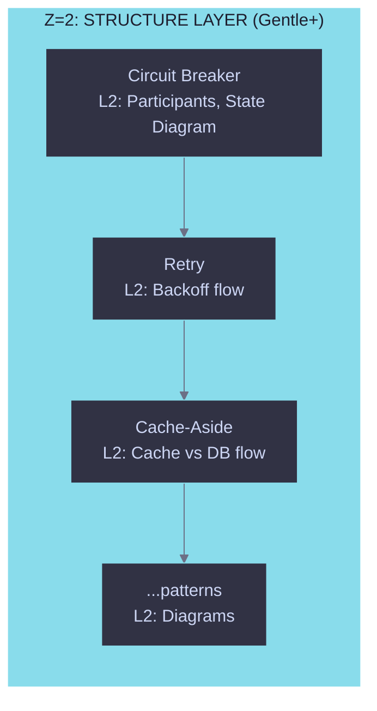
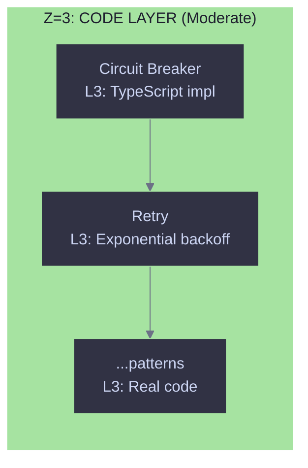
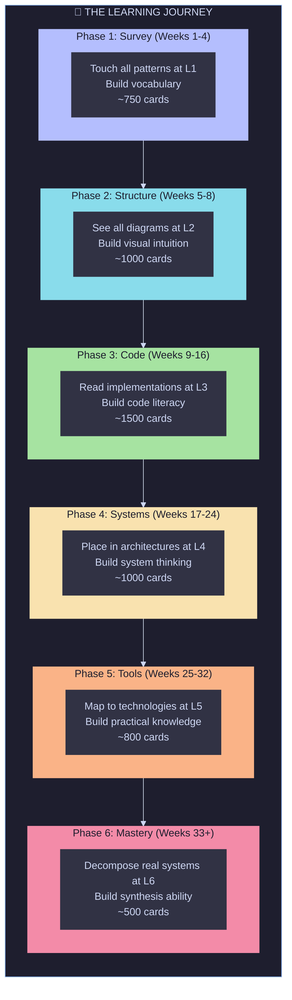

# 13. 3D Distribution Strategy: Layers as Z-Index

[← Back to Index](./index.md)

---

## The Problem: 600 Cards Per Pattern is Terrifying

With combinatorial card generation (6 layers × 4 domains × ~5 facets × ~5 question types), we could generate **600+ cards per pattern**. With 50+ patterns, that's potentially 30,000+ cards.

**The risk**: Getting stuck too deep in one pattern before seeing others. Spending 2 hours on Circuit Breaker Layer 3 while never touching Retry Layer 1.

---

## The Solution: Layers ARE the Z-Index

The insight: **The existing 6-layer hierarchy naturally provides the Z-axis for progressive depth.**

```
┌─────────────────────────────────────────────────────────────────┐
│                    3D LEARNING CUBE                              │
├─────────────────────────────────────────────────────────────────┤
│                                                                  │
│                         Z = Layer 6 (Intense)                    │
│                        ╱                                         │
│                       ╱   System Composition                     │
│                      ╱    Reverse-engineer Netflix               │
│                     ╱                                            │
│                    ╱                                             │
│                   ╱  Z = Layer 4-5 (Moderate+)                   │
│                  ╱   System Integration, Tech Mapping            │
│                 ╱                                                │
│                ╱                                                 │
│               ╱  Z = Layer 3 (Moderate)                          │
│              ╱   Code Expression, Action-Reason                  │
│             ╱                                                    │
│            ╱                                                     │
│           ╱  Z = Layer 1-2 (Gentle)                              │
│          ╱   Concepts, Structure, Diagrams                       │
│         ╱                                                        │
│        ╱_________________________________________________        │
│       ╱                                                 ╱        │
│      ╱  X = Patterns (horizontal)                      ╱         │
│     ╱   Circuit Breaker │ Retry │ Cache │ Saga │ ... ╱          │
│    ╱_________________________________________________╱           │
│   │                                                   │          │
│   │  Y = SBVP Domains (vertical)                      │          │
│   │  Structure │ Behavior │ Visualization │ Philosophy│          │
│   │___________________________________________________|          │
│                                                                  │
└─────────────────────────────────────────────────────────────────┘
```

---

## The Journey: Gentle to Intense

### Phase 1: Survey the Landscape (Z=1)

**Goal**: Touch every pattern at its gentlest layer before going deep on any.



**Cards at Z=1**:

- "What is Circuit Breaker?"
- "What problem does Retry solve?"
- "Name the pattern: prevents cascading failures"

**Time estimate**: ~15-20 cards per pattern × 50 patterns = ~750-1000 cards
**Intensity**: Low cognitive load, name recognition, problem identification

---

### Phase 2: See the Shapes (Z=2)

**Goal**: Understand structure and behavior diagrams for all patterns.



**Cards at Z=2**:

- "What are the 3 states of Circuit Breaker?"
- "Order these Retry steps correctly"
- "Match diagram to pattern"

**Prerequisite**: 80%+ mastery at Z=1 for this pattern
**Intensity**: Visual recognition, sequence understanding

---

### Phase 3: Read the Code (Z=3)

**Goal**: Understand implementations with Context Dilation and Action-Reason.



**Cards at Z=3** (using the Trifecta):

- Context Dilation: "At what zoom level is this code?"
- Action-Reason: "WHY do lines 12-18 exist?"
- Raw Code: "Complete this implementation"

**Prerequisite**: 80%+ mastery at Z=2 for this pattern
**Intensity**: Code reading, reasoning about implementation choices

---

### Phase 4: Place in Systems (Z=4)

**Goal**: Understand where patterns live in real architectures.

**Cards at Z=4**:

- "Where would you use Circuit Breaker in a microservices arch?"
- "Which patterns would you combine with Retry?"

**Prerequisite**: 80%+ mastery at Z=3 for this pattern
**Intensity**: Architectural thinking

---

### Phase 5: Map to Tools (Z=5)

**Goal**: Connect patterns to real technologies.

**Cards at Z=5**:

- "What pattern does Resilience4j implement?"
- "Which Redis feature implements Cache-Aside?"

**Prerequisite**: 80%+ mastery at Z=4 for this pattern
**Intensity**: Technology ecosystem knowledge

---

### Phase 6: Reverse Engineer Systems (Z=6)

**Goal**: Decompose real systems into their pattern compositions.

**Cards at Z=6**:

- "What patterns does Netflix use for fault tolerance?"
- "Identify 5 patterns in this Uber architecture diagram"

**Prerequisite**: 80%+ mastery at Z=5 for multiple patterns
**Intensity**: Full system decomposition, synthesis

---

## Distribution Algorithm

```typescript
interface CardDistribution {
  // Ensure breadth before depth
  minPatternsBefore NextLayer: number;  // e.g., 10 patterns at L1 before any L2

  // Layer unlock gates
  layerUnlockThreshold: number;          // 0.8 = 80% mastery required

  // SBVP rotation within layer
  rotateDomains: boolean;                // Cycle S→B→V→P within each layer
}

function getNextCard(
  progress: CardProgress[],
  config: CardDistribution
): CardKey {
  // 1. Find all eligible cards (layer unlocked, not yet due)
  const eligible = getEligibleCards(progress);

  // 2. Prioritize by Z-level (lower Z = higher priority for new users)
  const byLayer = groupByLayer(eligible);

  // 3. Within each layer, ensure SBVP rotation
  const withDomainBalance = balanceDomains(byLayer);

  // 4. Within each domain, ensure pattern breadth
  const withPatternBreadth = balancePatterns(withDomainBalance);

  // 5. Apply SM-2 priority (due > overdue > new)
  return applySpacedRepetition(withPatternBreadth);
}
```

---

## Visualization: The Journey Through the Cube



---

## Key Principles

### 1. Breadth Before Depth

Never let a user go to L2 on Pattern A until they've seen L1 on at least N patterns.

```typescript
const MIN_PATTERNS_BEFORE_DEPTH = 10;

function canAdvanceToNextLayer(
  patternId: string,
  currentLayer: number,
  allProgress: CardProgress[],
): boolean {
  // Rule 1: Must have 80%+ mastery at current layer
  const currentMastery = getMastery(patternId, currentLayer, allProgress);
  if (currentMastery < 0.8) return false;

  // Rule 2: Must have seen N patterns at current layer
  const patternsAtCurrentLayer = countPatternsWithProgress(
    currentLayer,
    allProgress,
  );
  if (patternsAtCurrentLayer < MIN_PATTERNS_BEFORE_DEPTH) return false;

  return true;
}
```

### 2. SBVP Rotation

Within each layer, cycle through domains to avoid fatigue:

```
Session cards: CB-L1-Structure → Retry-L1-Behavior → Cache-L1-Viz → Saga-L1-Philosophy → ...
```

### 3. Interleaving

Mix patterns within a session rather than blocking:

```
❌ Bad:  CB, CB, CB, CB, CB, Retry, Retry, Retry, Retry, Retry
✅ Good: CB, Retry, Cache, Saga, Bulkhead, CB, Retry, Cache, ...
```

### 4. Just-In-Time Depth

Only generate deeper cards when the user is ready:

```typescript
// Cards are generated lazily
function generateCardsForPattern(patternId: string, layer: number) {
  // Only called when user unlocks this layer for this pattern
  return generateLayerCards(patternId, layer);
}
```

---

## Metrics to Track

| Metric                 | Purpose                                       |
| ---------------------- | --------------------------------------------- |
| **Layer Distribution** | % of time spent at each Z-level               |
| **Pattern Breadth**    | # of unique patterns touched per session      |
| **SBVP Balance**       | Time in each domain                           |
| **Depth Velocity**     | How fast users progress through layers        |
| **Stuck Detection**    | Flag if >5 sessions without layer advancement |

---

## Summary

The 3D cube model with **Layers as Z-Index** provides:

1. **Natural intensity gradient**: L1 is always gentle, L6 is always intense
2. **Breadth-first exposure**: See all patterns at surface level before diving
3. **Progressive unlocking**: Gates prevent premature depth
4. **Interleaved learning**: Mix patterns and domains for better retention
5. **Manageable chunks**: ~750-1500 cards per phase, not 30,000 at once

The journey goes from "I've heard of all these patterns" (L1) to "I can decompose any system into its patterns" (L6) over ~6-9 months of consistent practice.

---

[← Back to Index](./index.md) | [Next: Open Questions →](./99-open-questions.md)
