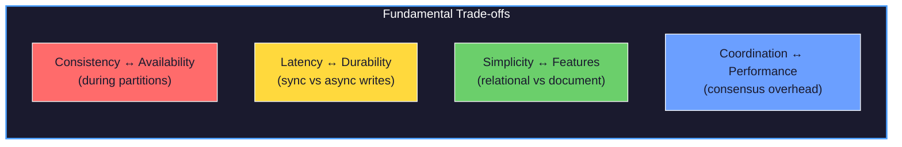

# Designing Data-Intensive Applications: Practical Exploration

A hands-on companion to Martin Kleppmann's *Designing Data-Intensive Applications* (O'Reilly, 2017). This project translates the book's concepts into runnable code, experiments, and architectural patterns you can deploy.

## Book Structure → Project Structure

The book is organized into three parts. This project mirrors that structure:

```
data-intensive-apps/
├── part1-foundations/           # Chapters 1-4: Data Models & Storage
│   ├── 01-reliability-scalability-maintainability/
│   ├── 02-data-models-query-languages/
│   ├── 03-storage-retrieval/
│   └── 04-encoding-evolution/
│
├── part2-distributed-data/      # Chapters 5-9: Distribution Challenges
│   ├── 05-replication/
│   ├── 06-partitioning/
│   ├── 07-transactions/
│   ├── 08-distributed-systems-trouble/
│   └── 09-consistency-consensus/
│
├── part3-derived-data/          # Chapters 10-12: Batch & Stream Processing
│   ├── 10-batch-processing/
│   ├── 11-stream-processing/
│   └── 12-future-of-data-systems/
│
└── labs/                        # Cross-cutting practical exercises
    ├── storage-engines/
    ├── replication-demo/
    ├── consensus-protocols/
    └── stream-processing-pipeline/
```

## Core Themes

| Theme | Book Chapters | Key Questions |
|-------|---------------|---------------|
| **Reliability** | 1, 5, 7, 8 | How do systems fail? How do we tolerate faults? |
| **Scalability** | 1, 5, 6 | How do we handle growing load? Vertical vs horizontal? |
| **Maintainability** | 1, 4, 12 | How do we evolve systems without breaking them? |
| **Consistency** | 5, 7, 9 | What guarantees can we provide? At what cost? |
| **Data Models** | 2, 3, 10, 11 | Relational vs document vs graph? Batch vs stream? |

## The Fundamental Trade-offs

Kleppmann's book is ultimately about trade-offs. Every chapter reveals tensions:



## Part 1: Foundations of Data Systems (Chapters 1-4)

### Chapter 1: Reliable, Scalable, and Maintainable Applications

**Core Concepts:**
- Reliability: Continuing to work correctly even when things go wrong
- Scalability: Coping with increased load
- Maintainability: Making life easier for future engineers

**Practical Exercises:**
- [ ] Chaos engineering: Kill processes, observe recovery
- [ ] Load testing: Find breaking points with increasing traffic
- [ ] Measure: Latency percentiles (p50, p99, p999)

### Chapter 2: Data Models and Query Languages

**Core Concepts:**
- Relational model: Tables, joins, normalization
- Document model: JSON/BSON, denormalization, schema flexibility
- Graph model: Vertices, edges, traversal queries

**Practical Exercises:**
- [ ] Model the same domain in PostgreSQL, MongoDB, and Neo4j
- [ ] Compare query complexity for different access patterns
- [ ] Measure performance for read-heavy vs write-heavy workloads

### Chapter 3: Storage and Retrieval

**Core Concepts:**
- Log-structured storage: Append-only, compaction (LSM trees)
- Page-oriented storage: B-trees, in-place updates
- Column-oriented storage: Analytics optimization

**Practical Exercises:**
- [ ] Implement a simple key-value store with SSTable/memtable
- [ ] Compare B-tree vs LSM-tree write amplification
- [ ] Experiment with column stores for OLAP queries

### Chapter 4: Encoding and Evolution

**Core Concepts:**
- Binary encodings: Protocol Buffers, Avro, Thrift
- Schema evolution: Forward/backward compatibility
- Dataflow modes: Databases, services, message passing

**Practical Exercises:**
- [ ] Evolve a schema through multiple versions
- [ ] Test forward and backward compatibility
- [ ] Measure encoding size and speed differences

---

## Part 2: Distributed Data (Chapters 5-9)

### Chapter 5: Replication

**Core Concepts:**
- Leader-based replication: Single leader, multi-leader, leaderless
- Replication lag: Eventual consistency problems
- Consistency models: Read-after-write, monotonic reads, consistent prefix

**Practical Exercises:**
- [ ] Set up PostgreSQL streaming replication
- [ ] Observe replication lag under load
- [ ] Implement read-your-writes at application level

### Chapter 6: Partitioning

**Core Concepts:**
- Partitioning strategies: By key range, by hash
- Rebalancing: Fixed partitions, dynamic partitioning
- Request routing: Client-side, coordinator, gossip

**Practical Exercises:**
- [ ] Partition data in Cassandra or CockroachDB
- [ ] Observe hotspots with skewed keys
- [ ] Implement consistent hashing

### Chapter 7: Transactions

**Core Concepts:**
- ACID guarantees: Atomicity, Consistency, Isolation, Durability
- Isolation levels: Read committed, snapshot isolation, serializable
- Distributed transactions: 2PC, sagas

**Practical Exercises:**
- [ ] Demonstrate dirty reads, lost updates, write skew
- [ ] Compare isolation levels in PostgreSQL
- [ ] Implement a saga pattern for distributed workflow

### Chapter 8: The Trouble with Distributed Systems

**Core Concepts:**
- Unreliable networks: Unbounded delays, partitions
- Unreliable clocks: Clock skew, monotonic clocks
- Process pauses: GC, context switches, virtualization

**Practical Exercises:**
- [ ] Inject network partitions with `tc` or Toxiproxy
- [ ] Observe clock skew across nodes
- [ ] Trigger and observe GC pauses under load

### Chapter 9: Consistency and Consensus

**Core Concepts:**
- Linearizability: Strongest consistency model
- Ordering guarantees: Sequence numbers, lamport timestamps
- Consensus algorithms: Paxos, Raft, Zab

**Practical Exercises:**
- [ ] Deploy an etcd cluster and observe Raft
- [ ] Implement a distributed lock with fencing tokens
- [ ] Compare ZooKeeper, etcd, Consul behavior

---

## Part 3: Derived Data (Chapters 10-12)

### Chapter 10: Batch Processing

**Core Concepts:**
- Unix philosophy: Composable tools, stdin/stdout
- MapReduce: Map, shuffle, reduce phases
- Beyond MapReduce: Spark, Flink, dataflow graphs

**Practical Exercises:**
- [ ] Process a large dataset with Unix tools
- [ ] Implement word count in MapReduce style
- [ ] Compare Spark batch job performance

### Chapter 11: Stream Processing

**Core Concepts:**
- Event streams: Immutable log of events
- Stream-table duality: Changelog as stream
- Time: Event time vs processing time, windowing

**Practical Exercises:**
- [ ] Build a Kafka-based event pipeline
- [ ] Implement stream-table join
- [ ] Handle late-arriving events with watermarks

### Chapter 12: The Future of Data Systems

**Core Concepts:**
- Unbundling databases: Separation of concerns
- Dataflow: Derived data through materialized views
- Ethics: Privacy, bias, accountability

**Practical Exercises:**
- [ ] Design a system with event sourcing + CQRS
- [ ] Build materialized views from event log
- [ ] Implement "right to be forgotten" in event-sourced system

---

## Labs

### Lab 1: Build a Storage Engine

Implement a simple LSM-tree based key-value store:
1. In-memory memtable (red-black tree or skip list)
2. SSTable files with index
3. Compaction strategy
4. Bloom filters for read optimization

### Lab 2: Replication Demo

Create a multi-node replication setup:
1. Single-leader replication with PostgreSQL
2. Demonstrate replication lag
3. Implement read-your-writes consistency
4. Simulate failover

### Lab 3: Consensus Protocols

Explore consensus through implementation:
1. Deploy 3-node etcd cluster
2. Observe leader election during failures
3. Implement distributed counter with CAS
4. Compare with leaderless approach (Cassandra)

### Lab 4: Stream Processing Pipeline

End-to-end streaming data platform:
1. Kafka for event transport
2. ksqlDB or Flink for stream processing
3. Materialized views in PostgreSQL
4. Exactly-once semantics demonstration

---

## Reading Order Recommendations

**For practitioners building systems now:**
1. Chapter 1 (understand the vocabulary)
2. Chapter 5-6 (replication and partitioning are everywhere)
3. Chapter 7 (transactions are subtle)
4. Chapter 11 (streaming is the future)

**For deep understanding:**
1. Read linearly—Kleppmann builds concepts carefully
2. Do the exercises after each chapter
3. Revisit Part 2 after building something real

**For interview preparation:**
1. Chapter 1 (system design fundamentals)
2. Chapter 5-6 (most common interview topics)
3. Chapter 9 (consensus comes up in senior roles)

---

## Key Takeaways to Internalize

1. **There are no silver bullets.** Every technology is a set of trade-offs.

2. **Distributed systems are fundamentally different.** Network partitions, clock skew, and partial failures change everything.

3. **Consistency models matter.** Know what your database actually guarantees (read the fine print).

4. **Log-based architectures are powerful.** Append-only logs enable replication, recovery, and derivation.

5. **Batch and stream are converging.** The future is unified data processing.

6. **Coordination is expensive.** Avoid consensus when possible; embrace eventual consistency when appropriate.

---

## References

- Kleppmann, M. (2017). *Designing Data-Intensive Applications*. O'Reilly Media.
- [Author's website](https://dataintensive.net/)
- [Book's GitHub repository](https://github.com/ept/ddia-references)
