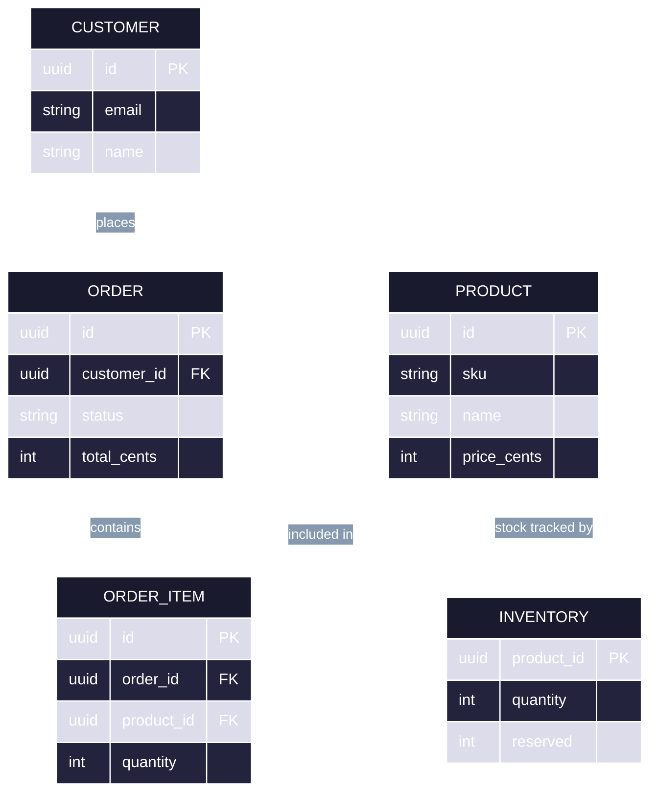
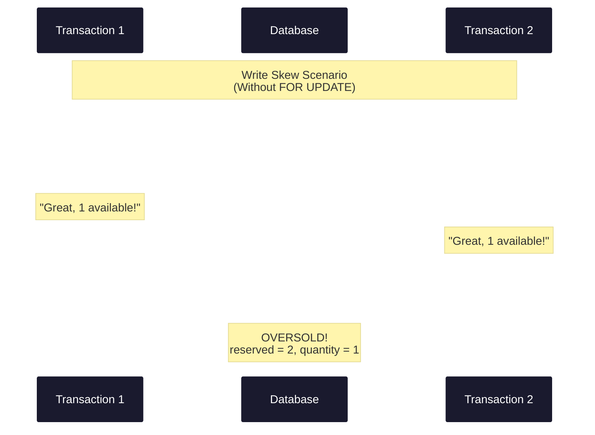

# Lab 1: Event-Driven Order Processing System

A temporal narrative through designing and building a production-grade order processing system, demonstrating practical application of Designing Data-Intensive Applications concepts.

---

## The Problem

You've been hired to build the order processing backbone for **NovaMart**, a rapidly growing e-commerce platform. Current state:
- 50,000 orders/day, projected to 500,000 within 18 months
- Legacy monolith with a single PostgreSQL database
- Frequent inventory oversells during flash sales
- No real-time analytics; reports run overnight
- Search is slow and often returns stale results

**Business Requirements:**
1. Never oversell inventory (strong consistency for inventory)
2. Order placement must complete in <500ms p99
3. Real-time dashboards for operations team
4. Full audit trail for every order state change
5. Search must reflect catalog changes within 5 seconds

---

## System Architecture Overview

```mermaid
%%{init: {'theme': 'base', 'themeVariables': { 'primaryColor': '#1a1a2e', 'primaryTextColor': '#fff', 'primaryBorderColor': '#fff', 'lineColor': '#fff', 'secondaryColor': '#16213e', 'tertiaryColor': '#0f3460'}}}%%
flowchart TB
    subgraph CLIENTS["Client Layer"]
        WEB["Web App"]
        MOBILE["Mobile App"]
    end

    subgraph API["API Layer"]
        GRPC["gRPC Gateway"]
    end

    subgraph WRITE["Write Path (Strong Consistency)"]
        ORDER["Order Service<br>Go + gRPC"]
        PG["PostgreSQL + Citus<br>Serializable Transactions"]
    end

    subgraph CDC["Change Data Capture"]
        DEB["Debezium<br>WAL → Events"]
        KAFKA["Apache Kafka<br>Event Log"]
    end

    subgraph STREAM["Stream Processing"]
        FLINK["Apache Flink<br>Enrichment + Analytics"]
    end

    subgraph READ["Read Path (Eventual Consistency)"]
        ES["Elasticsearch<br>Full-Text Search"]
        REDIS["Redis Cluster<br>Hot Data Cache"]
        DASH["Real-Time<br>Dashboard"]
    end

    subgraph OBS["Observability"]
        OTEL["OpenTelemetry"]
        GRAF["Grafana Stack"]
    end

    WEB & MOBILE --> GRPC
    GRPC --> ORDER
    ORDER --> PG
    PG --> DEB
    DEB --> KAFKA
    KAFKA --> FLINK
    FLINK --> ES & REDIS & DASH
    ORDER --> REDIS
    ORDER -.-> OTEL
    OTEL --> GRAF

    style WRITE fill:#0f3460,stroke:#e94560,stroke-width:2px
    style CDC fill:#16213e,stroke:#e94560,stroke-width:2px
    style STREAM fill:#1a1a2e,stroke:#e94560,stroke-width:2px
    style READ fill:#16213e,stroke:#fff,stroke-width:1px
```



---

## Technology Stack (State of the Art, 2024-2025)

| Layer | Technology | Why This Choice |
|-------|------------|-----------------|
| Primary Database | PostgreSQL 16 + Citus 12 | ACID transactions + horizontal sharding |
| Event Streaming | Apache Kafka 3.7 + Kafka Connect | Durable log, exactly-once semantics |
| CDC | Debezium 2.5 | Captures database changes as events |
| Stream Processing | Apache Flink 1.18 | Stateful stream processing, exactly-once |
| Cache | Redis 7 Cluster | Sub-millisecond reads, distributed |
| Search | Elasticsearch 8.12 | Full-text search, near-real-time indexing |
| API Layer | Go 1.22 + gRPC | Performance, strong typing, streaming |
| Schema Registry | Confluent Schema Registry | Avro schema evolution |
| Orchestration | Kubernetes 1.29 | Container orchestration |
| Observability | OpenTelemetry + Grafana Stack | Distributed tracing, metrics, logs |

---

## Philosophy

> **Supporting Material**: This lab integrates concepts from [Part 1: Foundations](../../part1-foundations/01-reliability-scalability-maintainability/README.md), [Part 2: Distributed Data](../../part2-distributed-data/05-replication/README.md), and [Part 3: Derived Data](../../part3-derived-data/11-stream-processing/README.md)

1. **Start with Requirements, Not Technology** — The first instinct is to reach for tools. Resist it. Understand your consistency requirements, latency budgets, and access patterns before choosing a single database. Technology follows requirements, not the reverse.

2. **Dual Writes are a Trap** — Writing to multiple systems (database AND cache AND search index) creates an impossible coordination problem. One write will fail, and now your systems disagree. CDC solves this by making the database the single source of truth.

3. **Derived Data is Expendable** — Elasticsearch indexes, Redis caches, and Kafka topics are all derived from the primary database. They can be rebuilt. Design your system knowing that any derived view can be reconstructed from the log.

4. **Transactions are Not Free** — Strong consistency (serializable isolation) has a cost: reduced throughput, increased latency, potential deadlocks. Apply it surgically to operations that truly require it—like inventory reservation—not universally.

5. **Events are Facts** — An event ("OrderPlaced at 2:30 PM") is an immutable record of something that happened. Current state ("Order is Shipped") is a derived projection. When you store events, you keep the full history and can derive any view.

6. **Observability is Not Optional** — In a distributed system, you cannot debug by reading logs on one machine. Tracing, metrics, and structured logging across service boundaries are essential—build them in from day one, not as an afterthought.

### Structures & Behaviors

**Prerequisite Structures** (concepts you must understand):

| Structure | What It Is | If Unfamiliar |
|-----------|------------|---------------|
| **ACID transactions** | Atomicity, Consistency, Isolation, Durability guarantees | Study DDIA Ch 7 on transactions |
| **Write-ahead log (WAL)** | Append-only record of all database changes for durability | Understand how databases recover from crashes |
| **Event sourcing** | Storing state changes as immutable events rather than current state | Learn difference between events and snapshots |
| **Publish-subscribe messaging** | Producers emit events, consumers subscribe to topics | Understand Kafka's log-based model |
| **Serialization formats** | Binary (Protobuf, Avro) vs text (JSON) encoding of data | Learn schema evolution and compatibility |
| **Isolation levels** | Read committed, repeatable read, serializable | Study DDIA Ch 7 on concurrency control |
| **Sharding/partitioning** | Distributing data across nodes by a partition key | Understand how shard keys affect query routing |
| **Eventual consistency** | Systems converge to same state given time without new writes | Learn the CAP theorem trade-offs |

**Behaviors Given These Structures**:

| Behavior | Emerges From | Manifestation |
|----------|--------------|---------------|
| No overselling | ACID + serializable isolation | Inventory reservation uses `SELECT FOR UPDATE` in serializable transaction |
| Audit trail | Event sourcing + WAL | Every order state change captured as immutable event in `order_events` table |
| Real-time search | Publish-subscribe + CDC | Debezium reads PostgreSQL WAL, publishes to Kafka, Elasticsearch subscribes |
| Cache coherence | CDC + pub-sub | Product changes trigger Kafka events that invalidate Redis cache entries |
| Horizontal scaling | Sharding + colocation | Orders sharded by `customer_id`; order_items colocated for efficient joins |
| Exactly-once processing | WAL + checkpointing | Flink checkpoints Kafka offsets + operator state atomically |
| Fault tolerance | Replication + retries | Kafka replication factor 3; idempotency keys enable safe retries |
| Query optimization | Isolation levels + read replicas | Analytics queries hit read replicas with relaxed isolation |

---

## Phase 0: Domain Modeling & Requirements Analysis

### Philosophy

> **DDIA Reference**: [Reliability, Scalability, and Maintainability](../../part1-foundations/01-reliability-scalability-maintainability/README.md)

1. **Know Your Consistency Boundaries** — Not all operations need the same guarantees. Inventory can't be eventually consistent (you'll oversell), but product descriptions can lag by seconds. Map each operation to its true requirement.

2. **Access Patterns Drive Design** — "How will this data be queried?" shapes everything. Write-heavy inventory needs different storage from read-heavy catalogs. Separate them early.

3. **Events Capture Intent** — Storing "OrderPlaced" instead of just updating status gives you an audit trail, replayability, and the foundation for event-driven architecture.

### t=0: The Mental Model

**Developer Intent:** "Before writing any code, I need to understand the domain deeply. What are the core entities? How do they relate?"

You start by interviewing stakeholders and mapping the domain. The core entities emerge:



**What you're thinking:** "The separation between Product and Inventory is intentional—products are read-heavy (catalog), inventory is write-heavy (reservations). Different access patterns, potentially different scaling strategies."

### t=1: Identifying Consistency Boundaries

**Developer Intent:** "Not everything needs the same consistency guarantees. I need to map each operation to its true requirement."

**Critical insight from DDIA Ch 7:** Not everything needs the same consistency guarantees.

| Operation | Consistency Requirement | Rationale |
|-----------|------------------------|-----------|
| Inventory reservation | Strong (serializable) | Cannot oversell |
| Order creation | Strong (read-your-writes) | Customer must see their order |
| Product catalog | Eventual (seconds) | Stale OK temporarily |
| Analytics | Eventual (minutes) | Historical aggregates |
| Search index | Eventual (5 seconds) | Near-real-time sufficient |

### t=2: Defining the Event Taxonomy

**Developer Action:** Map out all domain events that drive the system.

**Applying DDIA Ch 11 (Event Sourcing):** We decide to capture domain events, not just state changes.

```mermaid
%%{init: {'theme': 'base', 'themeVariables': { 'primaryColor': '#1a1a2e', 'primaryTextColor': '#fff', 'primaryBorderColor': '#fff', 'lineColor': '#fff', 'secondaryColor': '#16213e', 'tertiaryColor': '#0f3460'}}}%%
flowchart TB
    subgraph EVENTS["Domain Events"]
        direction TB
        subgraph ORDER["Order Domain"]
            O1["OrderPlaced"]
            O2["OrderConfirmed"]
            O3["OrderShipped"]
            O4["OrderDelivered"]
            O5["OrderCancelled"]
        end
        subgraph INVENTORY["Inventory Domain"]
            I1["InventoryReserved"]
            I2["InventoryReleased"]
            I3["InventoryReplenished"]
        end
        subgraph CATALOG["Catalog Domain"]
            C1["ProductCreated"]
            C2["ProductUpdated"]
            C3["ProductPriceChanged"]
        end
    end

    style ORDER fill:#16213e,stroke:#e94560,stroke-width:2px
    style INVENTORY fill:#0f3460,stroke:#e94560,stroke-width:2px
    style CATALOG fill:#1a1a2e,stroke:#e94560,stroke-width:2px
```



**What you're thinking:** "Events are facts that happened. By storing events rather than just current state, I get a complete audit trail AND the ability to rebuild derived data. This is the foundation for CDC and stream processing later."

---

## Phase 1: Core Data Model & Storage Engine Selection

### Philosophy

> **DDIA Reference**: [Data Models and Query Languages](../../part1-foundations/02-data-models-query-languages/README.md) and [Storage and Retrieval](../../part1-foundations/03-storage-retrieval/README.md)

1. **Choose the Database for Your Access Patterns** — PostgreSQL isn't "better" than MongoDB—it's better for relational data with complex joins. Orders reference products reference categories. That's relational.

2. **Indexes are Trade-offs** — Every index speeds up reads but slows down writes. B-trees excel at range queries; GIN indexes handle full-text search. Know which query patterns dominate.

3. **Separate Hot Tables** — Inventory (write-heavy, contended) and Products (read-heavy, rarely updated) have different access patterns. Design the schema to minimize lock contention.

### t=3: Choosing PostgreSQL (DDIA Ch 2-3)

**Developer Intent:** "I need to select the right database. Let me compare options against my requirements."

**Why PostgreSQL over alternatives:**

| Consideration | PostgreSQL | MongoDB | CockroachDB |
|---------------|------------|---------|-------------|
| Transactions | Full ACID | Limited multi-doc | Full ACID |
| Joins | Native, optimized | Application-side | Native |
| Schema evolution | ALTER TABLE | Schemaless | ALTER TABLE |
| Operational maturity | 30+ years | Mature | Newer |
| Horizontal scaling | Via Citus | Native sharding | Native |

**Decision:** PostgreSQL gives us transactional guarantees for inventory while Citus enables horizontal scaling when needed.

**What you're thinking:** "I'm choosing PostgreSQL not because it's trendy, but because my problem is fundamentally relational—orders have items, items reference products. Joins are essential, not optional."

### t=4: Schema Design (Relational Model, DDIA Ch 2)

**Developer Action:** Design the database schema with access patterns in mind.

```sql
-- Core tables with careful thought about access patterns

CREATE TABLE customers (
    id              UUID PRIMARY KEY DEFAULT gen_random_uuid(),
    email           TEXT UNIQUE NOT NULL,
    name            TEXT NOT NULL,
    created_at      TIMESTAMPTZ DEFAULT now(),
    updated_at      TIMESTAMPTZ DEFAULT now()
);

CREATE TABLE products (
    id              UUID PRIMARY KEY DEFAULT gen_random_uuid(),
    sku             TEXT UNIQUE NOT NULL,
    name            TEXT NOT NULL,
    description     TEXT,
    price_cents     INTEGER NOT NULL,
    category_id     UUID REFERENCES categories(id),
    created_at      TIMESTAMPTZ DEFAULT now(),
    updated_at      TIMESTAMPTZ DEFAULT now()
);

-- Inventory separated from products for independent scaling
-- This is the HOT table - high write volume
CREATE TABLE inventory (
    product_id      UUID PRIMARY KEY REFERENCES products(id),
    quantity        INTEGER NOT NULL DEFAULT 0,
    reserved        INTEGER NOT NULL DEFAULT 0,
    version         INTEGER NOT NULL DEFAULT 1,  -- Optimistic locking
    updated_at      TIMESTAMPTZ DEFAULT now(),

    CONSTRAINT positive_available CHECK (quantity - reserved >= 0)
);

CREATE TABLE orders (
    id              UUID PRIMARY KEY DEFAULT gen_random_uuid(),
    customer_id     UUID NOT NULL REFERENCES customers(id),
    status          TEXT NOT NULL DEFAULT 'pending',
    total_cents     INTEGER NOT NULL,
    created_at      TIMESTAMPTZ DEFAULT now(),
    updated_at      TIMESTAMPTZ DEFAULT now()
);

CREATE TABLE order_items (
    id              UUID PRIMARY KEY DEFAULT gen_random_uuid(),
    order_id        UUID NOT NULL REFERENCES orders(id),
    product_id      UUID NOT NULL REFERENCES products(id),
    quantity        INTEGER NOT NULL,
    unit_price_cents INTEGER NOT NULL,

    CONSTRAINT positive_quantity CHECK (quantity > 0)
);

-- Event store for audit trail (DDIA Ch 11 - Event Sourcing)
CREATE TABLE order_events (
    id              UUID PRIMARY KEY DEFAULT gen_random_uuid(),
    order_id        UUID NOT NULL,
    event_type      TEXT NOT NULL,
    event_data      JSONB NOT NULL,
    created_at      TIMESTAMPTZ DEFAULT now(),

    -- Optimized for time-range queries per order
    INDEX idx_order_events_order_time (order_id, created_at)
);
```

### Index Strategy (DDIA Ch 3 - B-Trees)

```sql
-- Secondary indexes based on query patterns

-- Orders by customer (frequent lookup)
CREATE INDEX idx_orders_customer ON orders(customer_id);

-- Orders by status for operations dashboard
CREATE INDEX idx_orders_status ON orders(status) WHERE status != 'delivered';

-- Products by category for catalog browsing
CREATE INDEX idx_products_category ON products(category_id);

-- Full-text search on products (will be superseded by Elasticsearch)
CREATE INDEX idx_products_search ON products
    USING GIN (to_tsvector('english', name || ' ' || COALESCE(description, '')));
```

---

## Phase 2: API Design & Schema Evolution

### Philosophy

> **DDIA Reference**: [Encoding and Evolution](../../part1-foundations/04-encoding-evolution/README.md)

1. **Schema is a Contract** — Protocol Buffers force you to define your data structures explicitly. This upfront cost pays dividends: type safety, documentation, and automatic compatibility checking.

2. **Forward and Backward Compatibility** — Old clients must read new data (backward compatibility), and new clients must read old data (forward compatibility). Field tags (not names) provide this guarantee.

3. **Idempotency Keys from Day One** — Network failures will cause retries. Design your API to handle duplicate requests gracefully by requiring client-generated idempotency keys.

### t=5: Choosing gRPC + Protocol Buffers (DDIA Ch 4)

**Developer Intent:** "I need a wire format that's efficient, type-safe, and supports schema evolution."

**Why Protocol Buffers over JSON:**
- 3-10x smaller wire size
- Faster serialization/deserialization
- Schema as documentation
- Forward/backward compatibility via field tags

### t=6: Defining the Service Contract

**Developer Action:** Define the gRPC service with idempotency keys built in from the start.

```protobuf
// order_service.proto
syntax = "proto3";
package novamart.orders.v1;

import "google/protobuf/timestamp.proto";

service OrderService {
    // Synchronous order placement with inventory reservation
    rpc PlaceOrder(PlaceOrderRequest) returns (PlaceOrderResponse);

    // Get order with all items
    rpc GetOrder(GetOrderRequest) returns (Order);

    // Stream order status updates (server-side streaming)
    rpc WatchOrder(WatchOrderRequest) returns (stream OrderStatusUpdate);

    // List orders with pagination
    rpc ListOrders(ListOrdersRequest) returns (ListOrdersResponse);
}

message PlaceOrderRequest {
    string customer_id = 1;
    repeated OrderItemRequest items = 2;
    string idempotency_key = 3;  // Client-generated, prevents double-submit
}

message OrderItemRequest {
    string product_id = 1;
    int32 quantity = 2;
}

message PlaceOrderResponse {
    string order_id = 1;
    OrderStatus status = 2;
    int64 total_cents = 3;
}

message Order {
    string id = 1;
    string customer_id = 2;
    OrderStatus status = 3;
    int64 total_cents = 4;
    repeated OrderItem items = 5;
    google.protobuf.Timestamp created_at = 6;
    google.protobuf.Timestamp updated_at = 7;
}

enum OrderStatus {
    ORDER_STATUS_UNSPECIFIED = 0;
    ORDER_STATUS_PENDING = 1;
    ORDER_STATUS_CONFIRMED = 2;
    ORDER_STATUS_SHIPPED = 3;
    ORDER_STATUS_DELIVERED = 4;
    ORDER_STATUS_CANCELLED = 5;
}

message OrderItem {
    string id = 1;
    string product_id = 2;
    string product_name = 3;
    int32 quantity = 4;
    int64 unit_price_cents = 5;
}
```

### Schema Evolution Strategy (DDIA Ch 4)

**Rules we establish for our team:**
1. Never remove or renumber existing fields
2. New fields must be optional or have defaults
3. Use `reserved` for deprecated field numbers
4. Version the package path for breaking changes

```protobuf
// Future evolution example
message Order {
    string id = 1;
    // ... existing fields ...

    // Added in v1.1 - optional, backward compatible
    optional string shipping_address_id = 10;

    // Deprecated in v1.2 - kept for backward compatibility
    reserved 8;
    reserved "legacy_field";
}
```

---

## Phase 3: Transaction Design for Inventory Consistency

### Philosophy

> **DDIA Reference**: [Transactions](../../part2-distributed-data/07-transactions/README.md)

1. **Write Skew is the Subtle Enemy** — Two transactions read "1 item available," both reserve it, both commit. You've sold 2 items when you had 1. This is write skew, and only serializable isolation prevents it.

2. **SELECT FOR UPDATE is Your Friend** — When you need to read-then-write atomically, lock the row on read. This serializes concurrent access to the same resource.

3. **Lock Order Prevents Deadlocks** — If transaction A locks row 1 then row 2, and transaction B locks row 2 then row 1, deadlock. Always acquire locks in a consistent order (e.g., sorted by product ID).

4. **Serialization Failures are Expected** — SSI may abort transactions that would violate serializability. Retry with exponential backoff—this is normal operation, not an error.

### t=7: The Core Problem - Preventing Oversells

**Developer Intent:** "Overselling is the cardinal sin of e-commerce. I need to understand exactly why it happens and how to prevent it."

**DDIA Ch 7 context:** This is a classic write skew scenario. Two concurrent orders could both read available inventory as sufficient, then both reserve, causing oversell.



**What you're thinking:** "Both transactions read the same snapshot and both saw availability. Neither knew about the other. I need SELECT FOR UPDATE to serialize these operations."

### t=8: Implementing Serializable Inventory Reservation

**Developer Action:** Write the core inventory reservation with proper locking.

```go
// internal/inventory/reserve.go
package inventory

import (
    "context"
    "errors"
    "fmt"

    "github.com/jackc/pgx/v5"
    "github.com/jackc/pgx/v5/pgxpool"
)

var (
    ErrInsufficientInventory = errors.New("insufficient inventory")
    ErrConcurrentModification = errors.New("concurrent modification detected")
)

type Reservation struct {
    ProductID string
    Quantity  int
}

// ReserveInventory atomically reserves inventory for multiple items.
// Uses SELECT ... FOR UPDATE to prevent write skew (DDIA Ch 7).
func ReserveInventory(ctx context.Context, pool *pgxpool.Pool, items []Reservation) error {
    return pgx.BeginTxFunc(ctx, pool, pgx.TxOptions{
        IsoLevel: pgx.Serializable,  // Strongest isolation
    }, func(tx pgx.Tx) error {
        // Lock rows in a consistent order to prevent deadlocks
        // Sort by product_id before locking
        sortedItems := sortByProductID(items)

        for _, item := range sortedItems {
            // SELECT FOR UPDATE acquires row-level exclusive lock
            var available int
            err := tx.QueryRow(ctx, `
                SELECT quantity - reserved as available
                FROM inventory
                WHERE product_id = $1
                FOR UPDATE
            `, item.ProductID).Scan(&available)

            if err != nil {
                return fmt.Errorf("checking inventory for %s: %w", item.ProductID, err)
            }

            if available < item.Quantity {
                return fmt.Errorf("%w: product %s has %d available, requested %d",
                    ErrInsufficientInventory, item.ProductID, available, item.Quantity)
            }

            // Reserve the inventory
            _, err = tx.Exec(ctx, `
                UPDATE inventory
                SET reserved = reserved + $1,
                    updated_at = now()
                WHERE product_id = $2
            `, item.Quantity, item.ProductID)

            if err != nil {
                return fmt.Errorf("reserving inventory for %s: %w", item.ProductID, err)
            }
        }

        return nil
    })
}
```

### t=9: Implementing Idempotency (DDIA Ch 11, 12)

**Developer Intent:** "Network failures are inevitable. A client retry shouldn't create duplicate orders."

**Problem:** Network failures can cause duplicate order submissions. The client retries, and we create two orders.

**Solution:** Client-generated idempotency key.

**What you're thinking:** "The idempotency key must be generated by the client, not the server. If the server generates it, the client can't safely retry because each request would get a new key."

```go
// internal/orders/place.go
package orders

import (
    "context"
    "crypto/sha256"
    "encoding/hex"
    "errors"
    "time"

    "github.com/jackc/pgx/v5"
    "github.com/jackc/pgx/v5/pgxpool"
)

var ErrDuplicateRequest = errors.New("duplicate request")

type PlaceOrderRequest struct {
    CustomerID     string
    Items          []OrderItem
    IdempotencyKey string
}

type PlaceOrderResult struct {
    OrderID    string
    TotalCents int64
    IsRetry    bool  // True if this was a duplicate request
}

func PlaceOrder(ctx context.Context, pool *pgxpool.Pool, req PlaceOrderRequest) (*PlaceOrderResult, error) {
    // Check for existing order with same idempotency key
    var existingOrderID string
    err := pool.QueryRow(ctx, `
        SELECT order_id FROM idempotency_keys
        WHERE key = $1 AND customer_id = $2
    `, req.IdempotencyKey, req.CustomerID).Scan(&existingOrderID)

    if err == nil {
        // Already processed - return existing result
        return getOrderResult(ctx, pool, existingOrderID, true)
    }
    if !errors.Is(err, pgx.ErrNoRows) {
        return nil, err
    }

    // New request - process in transaction
    var orderID string
    err = pgx.BeginTxFunc(ctx, pool, pgx.TxOptions{
        IsoLevel: pgx.Serializable,
    }, func(tx pgx.Tx) error {
        // 1. Reserve inventory (may fail if insufficient)
        reservations := toReservations(req.Items)
        if err := reserveInventoryTx(ctx, tx, reservations); err != nil {
            return err
        }

        // 2. Create order
        orderID, err = createOrderTx(ctx, tx, req)
        if err != nil {
            return err
        }

        // 3. Record idempotency key (prevents duplicates on retry)
        _, err = tx.Exec(ctx, `
            INSERT INTO idempotency_keys (key, customer_id, order_id, created_at)
            VALUES ($1, $2, $3, now())
        `, req.IdempotencyKey, req.CustomerID, orderID)

        return err
    })

    if err != nil {
        return nil, err
    }

    return getOrderResult(ctx, pool, orderID, false)
}
```

### Handling Transaction Failures

```go
// Retry logic with exponential backoff for serialization failures
func PlaceOrderWithRetry(ctx context.Context, pool *pgxpool.Pool, req PlaceOrderRequest) (*PlaceOrderResult, error) {
    var result *PlaceOrderResult
    var err error

    backoff := 10 * time.Millisecond
    maxRetries := 3

    for attempt := 0; attempt <= maxRetries; attempt++ {
        result, err = PlaceOrder(ctx, pool, req)

        if err == nil {
            return result, nil
        }

        // Only retry on serialization failures (DDIA Ch 7 - SSI aborts)
        if isSerializationFailure(err) && attempt < maxRetries {
            time.Sleep(backoff)
            backoff *= 2  // Exponential backoff
            continue
        }

        return nil, err
    }

    return nil, err
}

func isSerializationFailure(err error) bool {
    // PostgreSQL error code 40001 = serialization_failure
    var pgErr *pgconn.PgError
    if errors.As(err, &pgErr) {
        return pgErr.Code == "40001"
    }
    return false
}
```

---

## Phase 4: Setting Up Change Data Capture

### Philosophy

> **DDIA Reference**: [Stream Processing](../../part3-derived-data/11-stream-processing/README.md)

1. **The Database is the Source of Truth** — Don't try to coordinate writes to multiple systems. Write to PostgreSQL; let CDC propagate changes to Kafka, Elasticsearch, and Redis. One writer, many readers.

2. **The WAL is Your Replication Log** — PostgreSQL already writes every change to its write-ahead log for durability. Debezium just reads this log. No application changes needed—changes flow automatically.

3. **Kafka is Your Durable Buffer** — Between the database and downstream consumers, Kafka provides durability, replay capability, and decoupling. If Elasticsearch is down, events wait in Kafka until it recovers.

4. **Compacted Topics for Reference Data** — Products change rarely but need the latest state. Compacted topics keep only the most recent value per key, giving you a changelog that serves as a distributed table.

### t=10: Why CDC? (DDIA Ch 11)

**Developer Intent:** "I need to sync changes from PostgreSQL to Elasticsearch, Redis, and Kafka. But dual writes are dangerous..."

**Problem:** We need to:
1. Update Elasticsearch when products change
2. Publish events to Kafka for downstream consumers
3. Update Redis cache when prices change
4. Feed real-time analytics

**Dual writes are dangerous** (DDIA Ch 11): If we write to Postgres AND publish to Kafka, failures can cause inconsistency.

```mermaid
%%{init: {'theme': 'base', 'themeVariables': { 'primaryColor': '#1a1a2e', 'primaryTextColor': '#fff', 'primaryBorderColor': '#fff', 'lineColor': '#fff', 'secondaryColor': '#16213e', 'tertiaryColor': '#0f3460'}}}%%
flowchart TB
    subgraph DUAL["Dual Write Problem"]
        direction LR
        APP["Application"]
        PG["PostgreSQL"]
        KF["Kafka"]

        APP -->|"1. Write"| PG
        APP -->|"2. Publish"| KF

        FAIL["Network fails<br>after step 1!"]
    end

    subgraph CDC["CDC Solution"]
        direction LR
        APP2["Application"]
        PG2["PostgreSQL"]
        DEB["Debezium"]
        KF2["Kafka"]

        APP2 -->|"Write"| PG2
        PG2 -->|"WAL"| DEB
        DEB -->|"Publish"| KF2
    end

    DUAL -->|"Replace with"| CDC

    style DUAL fill:#8b0000,stroke:#e94560,stroke-width:2px
    style CDC fill:#0f3460,stroke:#e94560,stroke-width:2px
```



**What you're thinking:** "With CDC, the database transaction log becomes the source of truth. Debezium reads the WAL and publishes to Kafka. If Debezium fails, it resumes from where it left off—no data loss."

**Solution:** Make Postgres the single source of truth, capture changes via CDC.

### t=11: Deploying Debezium

**Developer Action:** Configure Debezium to capture changes from PostgreSQL.

```yaml
# kubernetes/debezium/connector-config.yaml
apiVersion: v1
kind: ConfigMap
metadata:
  name: debezium-postgres-connector
data:
  connector.json: |
    {
      "name": "novamart-postgres-connector",
      "config": {
        "connector.class": "io.debezium.connector.postgresql.PostgresConnector",
        "database.hostname": "postgres-primary.database.svc.cluster.local",
        "database.port": "5432",
        "database.user": "debezium",
        "database.password": "${POSTGRES_PASSWORD}",
        "database.dbname": "novamart",
        "database.server.name": "novamart",
        "plugin.name": "pgoutput",
        "publication.name": "novamart_publication",
        "slot.name": "novamart_debezium",

        "table.include.list": "public.orders,public.order_items,public.products,public.inventory,public.order_events",

        "transforms": "unwrap,route",
        "transforms.unwrap.type": "io.debezium.transforms.ExtractNewRecordState",
        "transforms.unwrap.drop.tombstones": "false",
        "transforms.unwrap.delete.handling.mode": "rewrite",

        "transforms.route.type": "org.apache.kafka.connect.transforms.RegexRouter",
        "transforms.route.regex": "novamart\\.public\\.(.*)",
        "transforms.route.replacement": "novamart.$1.events",

        "key.converter": "io.confluent.connect.avro.AvroConverter",
        "key.converter.schema.registry.url": "http://schema-registry:8081",
        "value.converter": "io.confluent.connect.avro.AvroConverter",
        "value.converter.schema.registry.url": "http://schema-registry:8081",

        "snapshot.mode": "initial",
        "heartbeat.interval.ms": "10000"
      }
    }
```

### PostgreSQL Configuration for Logical Replication

```sql
-- Enable logical replication (required for Debezium)
ALTER SYSTEM SET wal_level = 'logical';
ALTER SYSTEM SET max_replication_slots = 10;
ALTER SYSTEM SET max_wal_senders = 10;

-- Create publication for CDC
CREATE PUBLICATION novamart_publication FOR TABLE
    orders, order_items, products, inventory, order_events;

-- Create replication user with minimal privileges
CREATE ROLE debezium WITH REPLICATION LOGIN PASSWORD 'secure_password';
GRANT SELECT ON orders, order_items, products, inventory, order_events TO debezium;
```

### Kafka Topic Design

```
Kafka Topics:
├── novamart.orders.events          # Order table changes
├── novamart.order_items.events     # Order items changes
├── novamart.products.events        # Product catalog changes
├── novamart.inventory.events       # Inventory level changes
├── novamart.order_events.events    # Domain events (event sourced)
│
├── novamart.orders.enriched        # Joined order + items + customer
├── novamart.search.products        # Transformed for Elasticsearch
└── novamart.analytics.events       # Aggregated for analytics
```

### Topic Configuration

```bash
# Create topics with appropriate retention and partitioning
kafka-topics --bootstrap-server kafka:9092 --create \
  --topic novamart.orders.events \
  --partitions 12 \
  --replication-factor 3 \
  --config retention.ms=604800000 \     # 7 days
  --config cleanup.policy=delete

# Products topic with compaction (keep latest per key)
kafka-topics --bootstrap-server kafka:9092 --create \
  --topic novamart.products.events \
  --partitions 6 \
  --replication-factor 3 \
  --config cleanup.policy=compact \
  --config min.compaction.lag.ms=3600000  # 1 hour before compaction
```

---

## Phase 5: Stream Processing with Apache Flink

### Philosophy

> **DDIA Reference**: [Stream Processing](../../part3-derived-data/11-stream-processing/README.md)

1. **Streams are Unbounded Tables** — A Kafka topic is a table that grows forever. You query it continuously rather than once. This mental model unifies batch and stream processing.

2. **Stream-Table Joins Enrich Events** — An order event alone is sparse. Join it with the customer table (a changelog stream) to produce enriched events with customer name and email—all in real-time.

3. **Windowing Bounds the Unbounded** — You can't aggregate infinite data. Windows (tumbling, sliding, session) group events by time, letting you compute "orders in the last minute" without remembering all history.

4. **Checkpoints Enable Exactly-Once** — Flink periodically snapshots all operator state to durable storage. On failure, restore from the checkpoint and replay from Kafka offsets. Exactly-once semantics without magic.

### t=12: Stream Processing Goals

**Developer Intent:** "Now that events are flowing through Kafka, I need to transform and enrich them in real-time."

1. **Enrich orders** with customer and product details
2. **Maintain real-time inventory counts** (materialized view)
3. **Detect fraud patterns** (CEP - Complex Event Processing)
4. **Compute real-time analytics** (revenue, order volume)

**What you're thinking:** "Stream processing is about continuous computation over unbounded data. Unlike batch, I can't wait for 'all the data'—I process events as they arrive."

### t=13: Flink Job - Order Enrichment (Stream-Table Join, DDIA Ch 11)

**Developer Action:** Implement a stream-table join to enrich orders with customer information.

```java
// src/main/java/com/novamart/flink/OrderEnrichmentJob.java
package com.novamart.flink;

import org.apache.flink.api.common.eventtime.WatermarkStrategy;
import org.apache.flink.connector.kafka.source.KafkaSource;
import org.apache.flink.connector.kafka.sink.KafkaSink;
import org.apache.flink.streaming.api.datastream.DataStream;
import org.apache.flink.streaming.api.environment.StreamExecutionEnvironment;
import org.apache.flink.table.api.bridge.java.StreamTableEnvironment;

public class OrderEnrichmentJob {

    public static void main(String[] args) throws Exception {
        StreamExecutionEnvironment env = StreamExecutionEnvironment.getExecutionEnvironment();
        StreamTableEnvironment tableEnv = StreamTableEnvironment.create(env);

        // Enable checkpointing for exactly-once semantics (DDIA Ch 11)
        env.enableCheckpointing(60000);  // Checkpoint every 60 seconds
        env.getCheckpointConfig().setMinPauseBetweenCheckpoints(30000);

        // Define Kafka sources as tables
        tableEnv.executeSql("""
            CREATE TABLE orders_cdc (
                id STRING,
                customer_id STRING,
                status STRING,
                total_cents BIGINT,
                created_at TIMESTAMP(3),
                updated_at TIMESTAMP(3),
                WATERMARK FOR created_at AS created_at - INTERVAL '5' SECOND,
                PRIMARY KEY (id) NOT ENFORCED
            ) WITH (
                'connector' = 'kafka',
                'topic' = 'novamart.orders.events',
                'properties.bootstrap.servers' = 'kafka:9092',
                'properties.group.id' = 'flink-order-enrichment',
                'format' = 'avro-confluent',
                'avro-confluent.url' = 'http://schema-registry:8081',
                'scan.startup.mode' = 'earliest-offset'
            )
        """);

        // Customer table for enrichment (changelog stream from CDC)
        tableEnv.executeSql("""
            CREATE TABLE customers_cdc (
                id STRING,
                email STRING,
                name STRING,
                created_at TIMESTAMP(3),
                PRIMARY KEY (id) NOT ENFORCED
            ) WITH (
                'connector' = 'kafka',
                'topic' = 'novamart.customers.events',
                'properties.bootstrap.servers' = 'kafka:9092',
                'format' = 'avro-confluent',
                'avro-confluent.url' = 'http://schema-registry:8081',
                'scan.startup.mode' = 'earliest-offset'
            )
        """);

        // Enriched orders sink
        tableEnv.executeSql("""
            CREATE TABLE enriched_orders (
                order_id STRING,
                customer_id STRING,
                customer_name STRING,
                customer_email STRING,
                status STRING,
                total_cents BIGINT,
                created_at TIMESTAMP(3),
                PRIMARY KEY (order_id) NOT ENFORCED
            ) WITH (
                'connector' = 'upsert-kafka',
                'topic' = 'novamart.orders.enriched',
                'properties.bootstrap.servers' = 'kafka:9092',
                'key.format' = 'avro-confluent',
                'key.avro-confluent.url' = 'http://schema-registry:8081',
                'value.format' = 'avro-confluent',
                'value.avro-confluent.url' = 'http://schema-registry:8081'
            )
        """);

        // Stream-table join: Enrich orders with customer info
        tableEnv.executeSql("""
            INSERT INTO enriched_orders
            SELECT
                o.id as order_id,
                o.customer_id,
                c.name as customer_name,
                c.email as customer_email,
                o.status,
                o.total_cents,
                o.created_at
            FROM orders_cdc o
            LEFT JOIN customers_cdc FOR SYSTEM_TIME AS OF o.created_at c
                ON o.customer_id = c.id
        """);

        env.execute("Order Enrichment Job");
    }
}
```

### t=14: Flink Job - Real-Time Analytics (Windowed Aggregation)

**Developer Action:** Implement windowed aggregations for the operations dashboard.

```java
// src/main/java/com/novamart/flink/RealTimeAnalyticsJob.java
package com.novamart.flink;

public class RealTimeAnalyticsJob {

    public static void main(String[] args) throws Exception {
        StreamExecutionEnvironment env = StreamExecutionEnvironment.getExecutionEnvironment();
        StreamTableEnvironment tableEnv = StreamTableEnvironment.create(env);

        env.enableCheckpointing(30000);

        // Source: Order events
        tableEnv.executeSql("""
            CREATE TABLE order_events (
                order_id STRING,
                event_type STRING,
                event_data STRING,
                created_at TIMESTAMP(3),
                WATERMARK FOR created_at AS created_at - INTERVAL '10' SECOND
            ) WITH (
                'connector' = 'kafka',
                'topic' = 'novamart.order_events.events',
                'properties.bootstrap.servers' = 'kafka:9092',
                'format' = 'avro-confluent',
                'avro-confluent.url' = 'http://schema-registry:8081'
            )
        """);

        // Real-time dashboard metrics sink
        tableEnv.executeSql("""
            CREATE TABLE dashboard_metrics (
                window_start TIMESTAMP(3),
                window_end TIMESTAMP(3),
                orders_placed BIGINT,
                orders_confirmed BIGINT,
                orders_shipped BIGINT,
                total_revenue_cents BIGINT,
                PRIMARY KEY (window_start) NOT ENFORCED
            ) WITH (
                'connector' = 'upsert-kafka',
                'topic' = 'novamart.analytics.dashboard',
                'properties.bootstrap.servers' = 'kafka:9092',
                'key.format' = 'json',
                'value.format' = 'json'
            )
        """);

        // Tumbling window aggregation (DDIA Ch 11 - Windowing)
        tableEnv.executeSql("""
            INSERT INTO dashboard_metrics
            SELECT
                TUMBLE_START(created_at, INTERVAL '1' MINUTE) as window_start,
                TUMBLE_END(created_at, INTERVAL '1' MINUTE) as window_end,
                COUNT(*) FILTER (WHERE event_type = 'OrderPlaced') as orders_placed,
                COUNT(*) FILTER (WHERE event_type = 'OrderConfirmed') as orders_confirmed,
                COUNT(*) FILTER (WHERE event_type = 'OrderShipped') as orders_shipped,
                SUM(CAST(JSON_VALUE(event_data, '$.total_cents') AS BIGINT))
                    FILTER (WHERE event_type = 'OrderPlaced') as total_revenue_cents
            FROM order_events
            GROUP BY TUMBLE(created_at, INTERVAL '1' MINUTE)
        """);

        env.execute("Real-Time Analytics Job");
    }
}
```

---

## Phase 6: Search Index & Caching Layer

### Philosophy

> **DDIA Reference**: [Storage and Retrieval](../../part1-foundations/03-storage-retrieval/README.md) and [Stream Processing](../../part3-derived-data/11-stream-processing/README.md)

1. **Elasticsearch is Derived, Not Primary** — The search index is a projection optimized for full-text queries. PostgreSQL remains the source of truth. If Elasticsearch corrupts, rebuild it from Kafka.

2. **Cache Invalidation via CDC** — The hardest problem in computer science becomes tractable when you have a reliable change stream. Every database write triggers a Kafka event; every Kafka event invalidates the cache.

3. **Cache-Aside is Explicit** — Read from cache, miss, load from database, populate cache. The application controls the logic. This is simpler and more predictable than write-through or refresh-ahead patterns.

4. **Different Stores for Different Access Patterns** — PostgreSQL for transactions, Elasticsearch for full-text search, Redis for sub-millisecond lookups. Each store optimizes for its use case.

### t=15: Elasticsearch as Derived Data

**Developer Intent:** "Search needs to be fast and feature-rich. PostgreSQL's full-text search won't cut it at scale."

**Applying DDIA Ch 3 (Indexes) and Ch 11 (Derived Data):**

Elasticsearch is a *derived data system*. The source of truth is PostgreSQL; Elasticsearch provides fast full-text search.

**What you're thinking:** "Elasticsearch indexes are derived from PostgreSQL via CDC. If the index gets corrupted, I can rebuild it by replaying the Kafka topic from the beginning."

### t=16: Elasticsearch Index Design

**Developer Action:** Design the product index with proper analysis and mappings.

```json
// elasticsearch/product-index-mapping.json
{
  "settings": {
    "number_of_shards": 3,
    "number_of_replicas": 2,
    "analysis": {
      "analyzer": {
        "product_analyzer": {
          "type": "custom",
          "tokenizer": "standard",
          "filter": ["lowercase", "asciifolding", "product_synonyms", "snowball"]
        }
      },
      "filter": {
        "product_synonyms": {
          "type": "synonym",
          "synonyms_path": "synonyms/products.txt"
        }
      }
    }
  },
  "mappings": {
    "properties": {
      "id": { "type": "keyword" },
      "sku": { "type": "keyword" },
      "name": {
        "type": "text",
        "analyzer": "product_analyzer",
        "fields": {
          "keyword": { "type": "keyword" },
          "suggest": { "type": "completion" }
        }
      },
      "description": {
        "type": "text",
        "analyzer": "product_analyzer"
      },
      "category": {
        "type": "object",
        "properties": {
          "id": { "type": "keyword" },
          "name": { "type": "keyword" },
          "path": { "type": "keyword" }
        }
      },
      "price_cents": { "type": "integer" },
      "in_stock": { "type": "boolean" },
      "available_quantity": { "type": "integer" },
      "created_at": { "type": "date" },
      "updated_at": { "type": "date" }
    }
  }
}
```

### t=17: Kafka Connect Elasticsearch Sink

**Developer Action:** Configure the sink connector to stream products to Elasticsearch.

```json
// kafka-connect/elasticsearch-sink.json
{
  "name": "elasticsearch-product-sink",
  "config": {
    "connector.class": "io.confluent.connect.elasticsearch.ElasticsearchSinkConnector",
    "connection.url": "http://elasticsearch:9200",
    "topics": "novamart.search.products",
    "key.ignore": "false",
    "schema.ignore": "false",
    "behavior.on.null.values": "delete",
    "write.method": "upsert",
    "type.name": "_doc",
    "key.converter": "org.apache.kafka.connect.storage.StringConverter",
    "value.converter": "io.confluent.connect.avro.AvroConverter",
    "value.converter.schema.registry.url": "http://schema-registry:8081",
    "transforms": "extractId",
    "transforms.extractId.type": "org.apache.kafka.connect.transforms.ExtractField$Key",
    "transforms.extractId.field": "id"
  }
}
```

### t=18: Redis Caching Strategy

**Developer Intent:** "Hot product lookups need sub-millisecond latency. Redis provides the cache layer."

**Cache-Aside Pattern (DDIA Ch 11 - Derived Data):**

```go
// internal/cache/product_cache.go
package cache

import (
    "context"
    "encoding/json"
    "time"

    "github.com/redis/go-redis/v9"
)

type ProductCache struct {
    redis  *redis.ClusterClient
    ttl    time.Duration
}

func NewProductCache(redis *redis.ClusterClient) *ProductCache {
    return &ProductCache{
        redis: redis,
        ttl:   15 * time.Minute,
    }
}

// GetProduct tries cache first, falls back to loader, then caches result
func (c *ProductCache) GetProduct(ctx context.Context, id string, loader func() (*Product, error)) (*Product, error) {
    key := "product:" + id

    // Try cache first
    data, err := c.redis.Get(ctx, key).Bytes()
    if err == nil {
        var product Product
        if err := json.Unmarshal(data, &product); err == nil {
            return &product, nil
        }
    }

    // Cache miss - load from source
    product, err := loader()
    if err != nil {
        return nil, err
    }

    // Cache the result (async to not block response)
    go func() {
        if data, err := json.Marshal(product); err == nil {
            c.redis.Set(context.Background(), key, data, c.ttl)
        }
    }()

    return product, nil
}

// InvalidateProduct removes from cache (called by CDC consumer)
func (c *ProductCache) InvalidateProduct(ctx context.Context, id string) error {
    return c.redis.Del(ctx, "product:"+id).Err()
}
```

### t=19: Cache Invalidation via CDC

**Developer Action:** Invalidate cache entries when products change in the database.

**What you're thinking:** "Cache invalidation is 'one of the two hard problems in computer science.' CDC makes it reliable—when the database changes, we WILL see that change event."

```go
// internal/consumers/cache_invalidation.go
package consumers

import (
    "context"
    "encoding/json"

    "github.com/confluentinc/confluent-kafka-go/v2/kafka"
)

type CacheInvalidationConsumer struct {
    consumer *kafka.Consumer
    cache    *cache.ProductCache
}

func (c *CacheInvalidationConsumer) Run(ctx context.Context) error {
    c.consumer.SubscribeTopics([]string{"novamart.products.events"}, nil)

    for {
        select {
        case <-ctx.Done():
            return ctx.Err()
        default:
            msg, err := c.consumer.ReadMessage(100 * time.Millisecond)
            if err != nil {
                continue
            }

            var event ProductCDCEvent
            if err := json.Unmarshal(msg.Value, &event); err != nil {
                continue
            }

            // Invalidate cache on any product change
            c.cache.InvalidateProduct(ctx, event.ID)
        }
    }
}
```

---

## Phase 7: Horizontal Scaling with Citus

### Philosophy

> **DDIA Reference**: [Partitioning](../../part2-distributed-data/06-partitioning/README.md)

1. **Sharding is a Last Resort** — A well-tuned single PostgreSQL instance handles more than you think. Shard when you've exhausted vertical scaling and read replicas, not before.

2. **The Shard Key Determines Everything** — Choose customer_id as the shard key, and all queries with customer_id hit one shard. Choose order_id, and customer history queries scatter across all shards. There's no changing this later.

3. **Colocation Preserves Joins** — Distributed joins are expensive. If orders and order_items are colocated (same shard key), they can join locally. Design your shard topology around your join patterns.

4. **Reference Tables for Small Lookups** — Products and categories are small and join everywhere. Replicate them to every shard (reference tables) rather than routing every join.

### t=20: When to Shard (DDIA Ch 6)

**Developer Intent:** "Traffic is growing. A single PostgreSQL instance is approaching its limits. When do I shard, and how?"

**Signals that we need sharding:**
- Single node CPU at 70%+ sustained
- Write latency increasing
- Approaching disk IOPS limits
- Replication lag growing

**What you're thinking:** "Sharding is a big step—it adds complexity. But Citus makes it manageable by keeping PostgreSQL's familiar interface while distributing data across nodes."

### t=21: Citus Distributed Tables

**Developer Action:** Configure table distribution with the right shard keys.

```sql
-- Connect to Citus coordinator
\c novamart

-- Distribute orders by customer_id (queries are customer-scoped)
SELECT create_distributed_table('orders', 'customer_id');
SELECT create_distributed_table('order_items', 'order_id',
    colocate_with => 'orders');

-- Inventory sharded by product_id
SELECT create_distributed_table('inventory', 'product_id');

-- Products as reference table (replicated to all nodes)
-- Good for small, read-heavy tables used in joins
SELECT create_reference_table('products');
SELECT create_reference_table('categories');

-- Order events partitioned by order_id, colocated with orders
SELECT create_distributed_table('order_events', 'order_id',
    colocate_with => 'orders');
```

### t=22: Shard-Aware Query Patterns

**Developer Action:** Write queries that include the shard key to hit a single partition.

**What you're thinking:** "The key insight: queries with the distribution column (customer_id for orders) hit a single shard. Queries without it scatter to all shards—still works, but slower."

```go
// internal/repository/orders.go

// GOOD: Query includes distribution column
func (r *OrderRepository) GetByCustomer(ctx context.Context, customerID string) ([]Order, error) {
    rows, err := r.pool.Query(ctx, `
        SELECT id, customer_id, status, total_cents, created_at
        FROM orders
        WHERE customer_id = $1  -- Shard key included, hits single shard
        ORDER BY created_at DESC
    `, customerID)
    // ...
}

// CAUTION: Cross-shard query (still works, but slower)
func (r *OrderRepository) GetByStatus(ctx context.Context, status string) ([]Order, error) {
    // This query must scatter to all shards and gather results
    // Use sparingly, consider materialized views for frequent access patterns
    rows, err := r.pool.Query(ctx, `
        SELECT id, customer_id, status, total_cents, created_at
        FROM orders
        WHERE status = $1
        ORDER BY created_at DESC
        LIMIT 100
    `, status)
    // ...
}
```

### Handling Distributed Transactions

```go
// For multi-shard transactions, Citus uses 2PC internally.
// Keep transactions short and avoid cross-shard when possible.

func (r *OrderRepository) PlaceOrder(ctx context.Context, req PlaceOrderRequest) error {
    // This works because order_items is colocated with orders
    return pgx.BeginTxFunc(ctx, r.pool, pgx.TxOptions{
        IsoLevel: pgx.Serializable,
    }, func(tx pgx.Tx) error {
        // 1. Create order (goes to customer's shard)
        orderID, err := r.createOrderTx(ctx, tx, req)
        if err != nil {
            return err
        }

        // 2. Create order items (same shard due to colocation)
        for _, item := range req.Items {
            if err := r.createOrderItemTx(ctx, tx, orderID, item); err != nil {
                return err
            }
        }

        // 3. Reserve inventory (may hit different shards - Citus handles 2PC)
        for _, item := range req.Items {
            if err := r.reserveInventoryTx(ctx, tx, item.ProductID, item.Quantity); err != nil {
                return err
            }
        }

        return nil
    })
}
```

---

## Phase 8: Observability & Operations

### Philosophy

> **DDIA Reference**: [The Trouble with Distributed Systems](../../part2-distributed-data/08-distributed-systems-trouble/README.md)

1. **Traces Connect the Dots** — A single order placement touches API, database, Kafka, Flink, Elasticsearch. Without distributed tracing, you can't see the full picture when latency spikes.

2. **Metrics for the Present, Logs for the Past** — Metrics tell you something is wrong now. Logs tell you what happened when you investigate. Both are necessary; neither is sufficient alone.

3. **Alert on Symptoms, Not Causes** — "p99 latency > 500ms" is a symptom users feel. "CPU > 80%" is a cause they don't. Alert on symptoms; investigate causes.

4. **Trace Context Must Propagate** — Inject trace IDs into Kafka headers, HTTP headers, gRPC metadata. If context breaks, you lose visibility across async boundaries.

### t=23: Distributed Tracing with OpenTelemetry

**Developer Intent:** "In a distributed system, a single request touches many services. I need to trace the full journey."

```go
// internal/telemetry/tracing.go
package telemetry

import (
    "context"

    "go.opentelemetry.io/otel"
    "go.opentelemetry.io/otel/exporters/otlp/otlptrace/otlptracegrpc"
    "go.opentelemetry.io/otel/propagation"
    "go.opentelemetry.io/otel/sdk/resource"
    "go.opentelemetry.io/otel/sdk/trace"
    semconv "go.opentelemetry.io/otel/semconv/v1.24.0"
)

func InitTracer(ctx context.Context, serviceName string) (func(), error) {
    exporter, err := otlptracegrpc.New(ctx,
        otlptracegrpc.WithEndpoint("tempo:4317"),
        otlptracegrpc.WithInsecure(),
    )
    if err != nil {
        return nil, err
    }

    tp := trace.NewTracerProvider(
        trace.WithBatcher(exporter),
        trace.WithResource(resource.NewWithAttributes(
            semconv.SchemaURL,
            semconv.ServiceName(serviceName),
            semconv.ServiceVersion("1.0.0"),
        )),
        trace.WithSampler(trace.ParentBased(trace.TraceIDRatioBased(0.1))),
    )

    otel.SetTracerProvider(tp)
    otel.SetTextMapPropagator(propagation.NewCompositeTextMapPropagator(
        propagation.TraceContext{},
        propagation.Baggage{},
    ))

    return func() { tp.Shutdown(context.Background()) }, nil
}
```

**What you're thinking:** "Traces connect the dots. When an order takes 2 seconds instead of 200ms, I can see exactly where the time went—was it the database? Kafka? A downstream service?"

### t=24: Tracing Kafka Messages

**Developer Action:** Propagate trace context through Kafka headers so async processing stays connected.

```go
// Propagate trace context through Kafka headers
func (p *Producer) SendWithTrace(ctx context.Context, topic string, key, value []byte) error {
    headers := make([]kafka.Header, 0)

    // Inject trace context into Kafka headers
    carrier := kafkaHeaderCarrier(headers)
    otel.GetTextMapPropagator().Inject(ctx, carrier)

    return p.producer.Produce(&kafka.Message{
        TopicPartition: kafka.TopicPartition{Topic: &topic},
        Key:            key,
        Value:          value,
        Headers:        carrier.Headers(),
    }, nil)
}

func (c *Consumer) ProcessWithTrace(msg *kafka.Message, handler func(context.Context) error) error {
    // Extract trace context from Kafka headers
    carrier := kafkaHeaderCarrier(msg.Headers)
    ctx := otel.GetTextMapPropagator().Extract(context.Background(), carrier)

    tracer := otel.Tracer("kafka-consumer")
    ctx, span := tracer.Start(ctx, "process-message")
    defer span.End()

    return handler(ctx)
}
```

### t=25: Key Metrics to Monitor

**Developer Intent:** "I need to know when something goes wrong BEFORE users complain."

**Developer Action:** Define alerts for SLOs and system health.

```yaml
# prometheus/alerts/novamart.yaml
groups:
  - name: novamart-slos
    rules:
      # Order placement latency SLO
      - alert: OrderPlacementLatencyHigh
        expr: |
          histogram_quantile(0.99,
            rate(order_placement_duration_seconds_bucket[5m])
          ) > 0.5
        for: 5m
        labels:
          severity: warning
        annotations:
          summary: "p99 order placement latency exceeds 500ms SLO"

      # Kafka consumer lag
      - alert: KafkaConsumerLagHigh
        expr: |
          kafka_consumer_group_lag{group=~".*novamart.*"} > 10000
        for: 10m
        labels:
          severity: warning
        annotations:
          summary: "Kafka consumer lag exceeds 10k messages"

      # Inventory reservation failures
      - alert: InventoryReservationFailureRate
        expr: |
          rate(inventory_reservation_failures_total[5m]) /
          rate(inventory_reservation_attempts_total[5m]) > 0.01
        for: 5m
        labels:
          severity: critical
        annotations:
          summary: "Inventory reservation failure rate exceeds 1%"

      # Replication lag (DDIA Ch 5)
      - alert: PostgresReplicationLagHigh
        expr: |
          pg_replication_lag_seconds > 30
        for: 5m
        labels:
          severity: warning
        annotations:
          summary: "PostgreSQL replication lag exceeds 30 seconds"
```

### t=26: Grafana Dashboard Panels

**Developer Action:** Create a dashboard that gives operations visibility into system health.

```json
{
  "title": "NovaMart Order Processing",
  "panels": [
    {
      "title": "Order Placement Rate",
      "type": "graph",
      "targets": [{
        "expr": "rate(orders_placed_total[1m])",
        "legendFormat": "orders/sec"
      }]
    },
    {
      "title": "Order Placement Latency",
      "type": "heatmap",
      "targets": [{
        "expr": "rate(order_placement_duration_seconds_bucket[5m])",
        "format": "heatmap"
      }]
    },
    {
      "title": "Kafka End-to-End Latency",
      "type": "graph",
      "targets": [{
        "expr": "histogram_quantile(0.99, rate(kafka_e2e_latency_seconds_bucket[5m]))",
        "legendFormat": "p99"
      }]
    },
    {
      "title": "Elasticsearch Indexing Lag",
      "type": "graph",
      "targets": [{
        "expr": "time() - elasticsearch_last_index_time_seconds",
        "legendFormat": "lag (seconds)"
      }]
    }
  ]
}
```

---

## Phase 9: Production Hardening

### Philosophy

> **DDIA Reference**: [The Trouble with Distributed Systems](../../part2-distributed-data/08-distributed-systems-trouble/README.md)

1. **Failure is the Norm, Not the Exception** — Networks partition. Processes crash. Disks fill. GC pauses. Design every component assuming the components it depends on will fail.

2. **Chaos Engineering Validates Assumptions** — You think the system handles Kafka unavailability? Prove it. Inject the failure deliberately and observe. "I think it works" is not acceptable.

3. **Circuit Breakers Prevent Cascade Failures** — When Elasticsearch is slow, don't let every request queue up waiting. Open the circuit after N failures; fail fast and let the system recover.

4. **Graceful Degradation Over Complete Failure** — Search down? Fall back to PostgreSQL full-text search (slower but functional). Cache down? Go directly to database (higher load but working). Never let a derived system take down the primary path.

### t=27: Chaos Engineering (DDIA Ch 8)

**Developer Intent:** "I can't wait for production to discover failure modes. I need to proactively test resilience."

**What you're thinking:** "DDIA Chapter 8 made it clear: in distributed systems, faults are the norm, not the exception. Network partitions, process crashes, slow responses—I need to design for all of them."

```yaml
# chaos/experiments/kafka-partition.yaml
apiVersion: chaos-mesh.org/v1alpha1
kind: NetworkChaos
metadata:
  name: kafka-network-partition
spec:
  action: partition
  mode: all
  selector:
    namespaces:
      - kafka
    labelSelectors:
      app: kafka
  direction: both
  target:
    mode: all
    selector:
      namespaces:
        - default
      labelSelectors:
        app: order-service
  duration: "5m"
```

### t=28: Circuit Breaker for External Dependencies

**Developer Action:** Implement circuit breakers to prevent cascade failures.

```go
// internal/circuitbreaker/breaker.go
package circuitbreaker

import (
    "context"
    "errors"
    "sync"
    "time"
)

type State int

const (
    StateClosed State = iota
    StateOpen
    StateHalfOpen
)

type CircuitBreaker struct {
    mu           sync.RWMutex
    state        State
    failures     int
    successes    int
    threshold    int
    timeout      time.Duration
    lastFailure  time.Time
}

func (cb *CircuitBreaker) Execute(ctx context.Context, fn func() error) error {
    if !cb.allowRequest() {
        return errors.New("circuit breaker is open")
    }

    err := fn()
    cb.recordResult(err)
    return err
}

func (cb *CircuitBreaker) allowRequest() bool {
    cb.mu.RLock()
    defer cb.mu.RUnlock()

    switch cb.state {
    case StateClosed:
        return true
    case StateOpen:
        if time.Since(cb.lastFailure) > cb.timeout {
            cb.mu.RUnlock()
            cb.mu.Lock()
            cb.state = StateHalfOpen
            cb.mu.Unlock()
            cb.mu.RLock()
            return true
        }
        return false
    case StateHalfOpen:
        return true
    }
    return false
}
```

### t=29: Graceful Degradation

**Developer Intent:** "When a non-critical component fails, the system should continue with reduced functionality rather than complete failure."

**What you're thinking:** "Elasticsearch being down shouldn't prevent orders. Search can fall back to PostgreSQL—slower, but the business continues."

```go
// When Elasticsearch is unavailable, fall back to PostgreSQL
func (s *SearchService) SearchProducts(ctx context.Context, query string) ([]Product, error) {
    // Try Elasticsearch first
    results, err := s.elasticsearch.Search(ctx, query)
    if err == nil {
        return results, nil
    }

    // Log degradation
    s.logger.Warn("elasticsearch unavailable, falling back to postgres",
        "error", err,
        "query", query,
    )
    s.metrics.Counter("search_fallback_total").Inc()

    // Fallback to PostgreSQL full-text search (slower but functional)
    return s.postgres.FullTextSearch(ctx, query)
}
```

---

## Phase 10: Documentation & Runbooks

### Philosophy

> **DDIA Reference**: [The Future of Data Systems](../../part3-derived-data/12-future-of-data-systems/README.md)

1. **Document the Why, Not Just the What** — Code shows what you built. ADRs (Architecture Decision Records) explain why you made each choice. Future maintainers need both.

2. **Runbooks Save 3 AM Sanity** — When the pager fires, no one thinks clearly. Step-by-step runbooks with copy-paste commands turn a crisis into a procedure.

3. **Operational Knowledge is Part of the System** — A system isn't complete when the code works. It's complete when someone new can deploy, monitor, debug, and maintain it.

4. **Keep Documentation Near the Code** — ADRs in the repo. Runbooks linked from alerts. The farther documentation lives from the system, the faster it rots.

### t=30: Architecture Decision Records

**Developer Intent:** "Future team members need to understand WHY we made these choices, not just WHAT we built."

```markdown
# ADR-001: Use Event Sourcing for Order Events

## Status
Accepted

## Context
We need a complete audit trail of all order state changes. The current approach
of updating order status in place loses history.

## Decision
Store all order state changes as immutable events in `order_events` table.
The current order state is derived by replaying events.

## Consequences
- **Positive:** Complete audit trail, can replay history, enables event-driven architecture
- **Negative:** More storage, need event replay logic, eventual consistency for reads
- **Mitigated by:** Snapshot current state in `orders` table for fast reads

## References
- DDIA Ch 11: Event Sourcing
- DDIA Ch 12: The Future of Data Systems
```

### t=31: Operational Runbooks

**Developer Action:** Create runbooks for common operational scenarios.

**What you're thinking:** "When someone gets paged at 3 AM, they need a clear, step-by-step guide. No one thinks clearly when sleep-deprived."

#### Runbook: Kafka Consumer Lag

```markdown
# Runbook: High Kafka Consumer Lag

## Symptoms
- Alert: `KafkaConsumerLagHigh`
- Dashboard shows growing lag for consumer group

## Diagnosis Steps

1. **Identify affected consumer group:**
   ```bash
   kafka-consumer-groups --bootstrap-server kafka:9092 \
     --describe --group <consumer-group>
   ```

2. **Check consumer pod health:**
   ```bash
   kubectl get pods -l app=<consumer-app>
   kubectl logs -l app=<consumer-app> --tail=100
   ```

3. **Check for rebalancing:**
   Look for "rebalance" in consumer logs. Frequent rebalances cause lag.

4. **Check processing time:**
   Review `message_processing_duration_seconds` metric.

## Resolution Actions

### If consumer pods are unhealthy:
```bash
kubectl rollout restart deployment/<consumer-deployment>
```

### If processing is slow:
- Scale up consumer replicas (max = partition count)
- Check downstream dependencies (database, external services)
- Consider increasing batch size

### If rebalancing frequently:
- Increase `session.timeout.ms`
- Check for GC pauses (increase heap if needed)
- Ensure stable network connectivity

## Prevention
- Set up consumer lag alerting at 50% of SLO threshold
- Autoscale consumers based on lag metric
```

---

## Summary: DDIA Concepts Applied

| Phase | DDIA Chapters | Key Concepts |
|-------|---------------|--------------|
| 0 | Ch 1 | Reliability, scalability, maintainability requirements |
| 1 | Ch 2-3 | Relational model, B-tree indexes, storage engines |
| 2 | Ch 4 | Protocol Buffers, schema evolution, compatibility |
| 3 | Ch 7 | Transactions, isolation levels, preventing write skew |
| 4 | Ch 11 | Change data capture, log-based messaging |
| 5 | Ch 11 | Stream processing, windowing, stream-table joins |
| 6 | Ch 3, 11 | Derived data, search indexes, caching |
| 7 | Ch 6 | Partitioning, shard keys, colocation |
| 8 | Ch 8 | Distributed tracing, failure detection |
| 9 | Ch 8 | Chaos engineering, graceful degradation |
| 10 | Ch 12 | Operational practices, auditability |

---

## Next Steps for the Reader

1. **Clone the starter repository** (to be created in `labs/01-order-processing-system/code/`)
2. **Set up local environment** with Docker Compose
3. **Follow each phase** implementing the components
4. **Run chaos experiments** to validate fault tolerance
5. **Measure against SLOs** defined in Phase 0

---

## References

- Kleppmann, M. (2017). *Designing Data-Intensive Applications*. O'Reilly.
- [Debezium Documentation](https://debezium.io/documentation/)
- [Apache Flink Documentation](https://nightlies.apache.org/flink/flink-docs-stable/)
- [Citus Documentation](https://docs.citusdata.com/)
- [Kafka Streams Documentation](https://kafka.apache.org/documentation/streams/)
