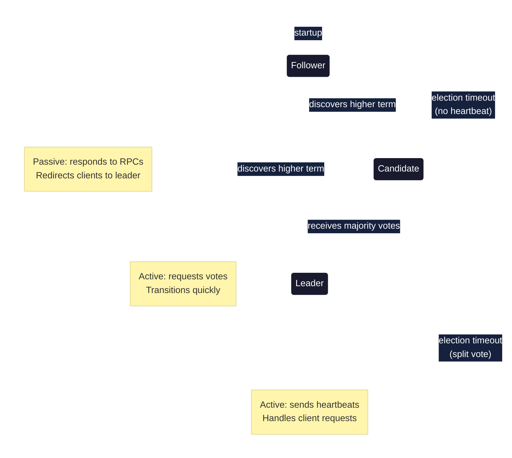
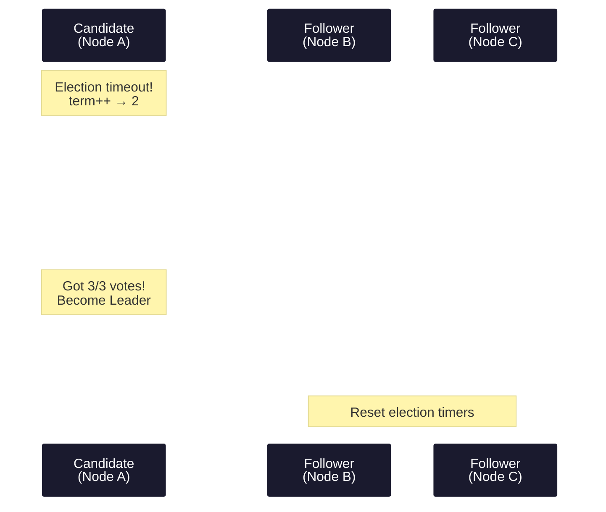

```mermaid
%%{init: {'theme': 'base', 'themeVariables': { 'primaryColor': '#1a1a2e', 'primaryTextColor': '#fff', 'primaryBorderColor': '#fff', 'lineColor': '#fff', 'secondaryColor': '#16213e', 'tertiaryColor': '#0f3460'}}}%%
flowchart TB
    subgraph TEST["Chaos Test Execution"]
        direction TB
        T1["1. Start 3-node cluster"]
        T2["2. Run concurrent operations"]
        T3["3. Inject failures"]
        T4["4. Record operation history"]
        T5["5. Check linearizability"]
    end

    subgraph FAILURES["Failure Injection"]
        F1["Network Partitions"]
        F2["Node Crashes"]
        F3["Slow Networks"]
    end

    subgraph CHECKS["Safety Checks"]
        C1["Linearizable reads?"]
        C2["Durable writes?"]
        C3["No data loss?"]
        C4["Single leader per term?"]
    end

    TEST --> FAILURES
    FAILURES --> CHECKS

    style TEST fill:#1a1a2e,stroke:#e94560,stroke-width:2px
    style CHECKS fill:#0f3460,stroke:#e94560,stroke-width:2px
```

# Lab: Consensus Protocols - Implementing Raft from Scratch

> **Prerequisite:** [Chapter 9: Consistency & Consensus](../../part2-distributed-data/09-consistency-consensus/README.md)

## Overview

This lab implements the **Raft consensus algorithm** from scratch in Go. You'll build a distributed key-value store that remains consistent even when nodes fail—experiencing firsthand why consensus is called "the hardest problem in distributed systems."

**What you'll build:**
- Complete Raft implementation (leader election, log replication, safety)
- Distributed key-value store using your Raft library
- Chaos testing framework to verify correctness under failures
- Observability dashboard for visualizing consensus state

**Technologies:**
- Go 1.22 with generics
- gRPC for node communication
- etcd's Raft (for comparison/reference)
- Jepsen-lite for correctness testing
- Prometheus + Grafana for observability

---

## The Philosophy: Why Consensus Matters

```mermaid
%%{init: {'theme': 'base', 'themeVariables': { 'primaryColor': '#1a1a2e', 'primaryTextColor': '#fff', 'primaryBorderColor': '#fff', 'lineColor': '#fff', 'secondaryColor': '#16213e', 'tertiaryColor': '#0f3460'}}}%%
flowchart TB
    subgraph PROBLEM["The Fundamental Problem"]
        direction TB
        Q1["How do N nodes agree<br>on a single value?"]
        Q2["Even when some nodes<br>crash or are slow?"]
        Q3["Without a single point<br>of failure?"]
    end

    subgraph SOLUTIONS["Historical Solutions"]
        direction LR
        P["Paxos<br>(1989)"]
        R["Raft<br>(2014)"]
        Z["ZAB<br>(2011)"]
    end

    subgraph WHY["Why It Matters"]
        direction TB
        W1["Leader Election"]
        W2["Atomic Broadcast"]
        W3["Distributed Locks"]
        W4["Configuration Management"]
    end

    PROBLEM --> SOLUTIONS
    SOLUTIONS --> WHY

    style PROBLEM fill:#1a1a2e,stroke:#e94560,stroke-width:2px
    style SOLUTIONS fill:#16213e,stroke:#0f3460,stroke-width:2px
    style WHY fill:#0f3460,stroke:#e94560,stroke-width:2px
```



**The CAP reality:** In the presence of network partitions, you must choose between consistency and availability. Consensus algorithms like Raft choose **consistency**—they'd rather refuse requests than return incorrect data.

---

## Philosophy

> **Supporting Material**: [Chapter 9: Consistency and Consensus](../../part2-distributed-data/09-consistency-consensus/README.md)

1. **Consensus is Total Order Broadcast** — Getting N nodes to agree on a sequence of values is equivalent to delivering messages in the same order to all nodes. This equivalence is profound—it means consensus underlies any strongly consistent replicated system.

2. **Majorities are the Key Insight** — In a cluster of N nodes, any two majorities must overlap by at least one node. This node has seen both operations. This is why Raft (and Paxos) require majority votes for everything—it guarantees information overlap.

3. **Terms Prevent Stale Leaders** — A network partition can isolate the leader. When it comes back, its term is outdated. The term acts as a logical clock and fencing token—stale leaders are rejected by their higher-term peers.

4. **Safety First, Liveness Second** — Raft's design prioritizes never losing committed data (safety) over always making progress (liveness). An unavailable system is better than an incorrect one.

5. **The Log is the Truth** — All operations go through the replicated log. If it's in the log and committed, it happened. If it's not committed, it might not have happened. This is the single source of truth.

6. **Randomized Timeouts Prevent Lockstep** — If all nodes timeout simultaneously, they all become candidates, split the vote, and try again. Random timeouts break symmetry and ensure someone eventually wins.

---

## Structures & Behaviors

**Prerequisite Structures:**

| Structure | What It Is | If Unfamiliar |
|-----------|------------|---------------|
| **Replicated state machine** | Same operations in same order = same state | Ch 9 fundamentals |
| **Total order broadcast** | All nodes see messages in same order | Equivalent to consensus |
| **Term/epoch** | Logical clock for leadership | Fencing tokens |
| **Quorum** | Majority agreement (⌊n/2⌋ + 1) | Ch 5 replication |

**Behaviors Given These Structures:**

| Behavior | Emerges From | Manifestation |
|----------|--------------|---------------|
| Leader election | Terms + vote requests | Single leader per term |
| Log consistency | AppendEntries RPC | Followers match leader's log |
| Safety | Election rules + log matching | Committed entries never lost |
| Liveness | Heartbeats + timeouts | Progress despite failures |

---

## Phase 1: Raft Node Skeleton

### Philosophy

> **DDIA Reference**: [Consensus algorithms and total order broadcast](../../part2-distributed-data/09-consistency-consensus/README.md)

1. **State Machine is the Foundation** — Every Raft node is a state machine: Follower, Candidate, or Leader. State transitions are triggered by events (timeouts, RPC responses). Master this model before writing code.

2. **Persistent State Must Survive Restarts** — `currentTerm`, `votedFor`, and `log` must be written to disk before responding to any RPC. Lose this state, and you can vote twice, violating safety.

3. **Two RPCs Do Everything** — RequestVote for elections, AppendEntries for replication and heartbeats. That's it. Raft's simplicity comes from this minimal interface.

### t=0: The Mental Model

**Developer Intent:** "I need to understand Raft's state machine before writing code."



**What you're thinking:** "Every node starts as a follower. If it doesn't hear from a leader, it becomes a candidate and tries to get elected. Once elected, it's leader until it sees a higher term."

### t=1: Core Data Structures

**Developer Action:** Define the Raft node state.

```go
// pkg/raft/node.go
package raft

import (
    "sync"
    "time"
)

type NodeState int

const (
    Follower NodeState = iota
    Candidate
    Leader
)

func (s NodeState) String() string {
    return [...]string{"Follower", "Candidate", "Leader"}[s]
}

// LogEntry represents a single entry in the replicated log
type LogEntry struct {
    Term    uint64      // Term when entry was received by leader
    Index   uint64      // Position in the log (1-indexed)
    Command interface{} // State machine command
}

// Node represents a single Raft node
type Node struct {
    mu sync.RWMutex

    // Node identity
    id    string
    peers []string

    // Persistent state (must survive restarts)
    currentTerm uint64
    votedFor    string // candidateId that received vote in current term
    log         []LogEntry

    // Volatile state on all servers
    commitIndex uint64 // highest log entry known to be committed
    lastApplied uint64 // highest log entry applied to state machine
    state       NodeState

    // Volatile state on leaders (reinitialized after election)
    nextIndex  map[string]uint64 // for each peer: next log entry to send
    matchIndex map[string]uint64 // for each peer: highest log entry known to be replicated

    // Channels and timers
    applyCh         chan ApplyMsg
    electionTimer   *time.Timer
    heartbeatTicker *time.Ticker

    // RPC client for communicating with peers
    transport Transport
}

// ApplyMsg is sent to the state machine when entries are committed
type ApplyMsg struct {
    CommandValid bool
    Command      interface{}
    CommandIndex uint64
    CommandTerm  uint64
}

// NewNode creates a new Raft node
func NewNode(id string, peers []string, transport Transport) *Node {
    n := &Node{
        id:          id,
        peers:       peers,
        currentTerm: 0,
        votedFor:    "",
        log:         make([]LogEntry, 0),
        commitIndex: 0,
        lastApplied: 0,
        state:       Follower,
        nextIndex:   make(map[string]uint64),
        matchIndex:  make(map[string]uint64),
        applyCh:     make(chan ApplyMsg, 100),
        transport:   transport,
    }

    // Log is 1-indexed; add dummy entry at index 0
    n.log = append(n.log, LogEntry{Term: 0, Index: 0})

    return n
}

// ApplyChan returns the channel for committed commands
func (n *Node) ApplyChan() <-chan ApplyMsg {
    return n.applyCh
}
```

**What you're thinking:** "The persistent state (term, votedFor, log) must be written to disk before responding to any RPC. Losing this state can violate safety."

### t=2: RPC Definitions

**Developer Action:** Define the two core Raft RPCs.

```go
// pkg/raft/rpc.go
package raft

// RequestVoteArgs contains arguments for RequestVote RPC
type RequestVoteArgs struct {
    Term         uint64 // candidate's term
    CandidateId  string // candidate requesting vote
    LastLogIndex uint64 // index of candidate's last log entry
    LastLogTerm  uint64 // term of candidate's last log entry
}

// RequestVoteReply contains response for RequestVote RPC
type RequestVoteReply struct {
    Term        uint64 // currentTerm, for candidate to update itself
    VoteGranted bool   // true means candidate received vote
}

// AppendEntriesArgs contains arguments for AppendEntries RPC
type AppendEntriesArgs struct {
    Term         uint64     // leader's term
    LeaderId     string     // so follower can redirect clients
    PrevLogIndex uint64     // index of log entry immediately preceding new ones
    PrevLogTerm  uint64     // term of prevLogIndex entry
    Entries      []LogEntry // log entries to store (empty for heartbeat)
    LeaderCommit uint64     // leader's commitIndex
}

// AppendEntriesReply contains response for AppendEntries RPC
type AppendEntriesReply struct {
    Term    uint64 // currentTerm, for leader to update itself
    Success bool   // true if follower contained entry matching prevLogIndex and prevLogTerm

    // Optimization: help leader find correct nextIndex faster
    ConflictTerm  uint64 // term of conflicting entry
    ConflictIndex uint64 // first index of conflicting term
}

// Transport defines the interface for node communication
type Transport interface {
    RequestVote(target string, args *RequestVoteArgs) (*RequestVoteReply, error)
    AppendEntries(target string, args *AppendEntriesArgs) (*AppendEntriesReply, error)
}
```

**What you're thinking:** "AppendEntries does double duty—it's both the log replication mechanism AND the heartbeat. An empty Entries slice is a heartbeat."

---

## Phase 2: Leader Election

### Philosophy

> **DDIA Reference**: [Leader election](../../part2-distributed-data/09-consistency-consensus/README.md#leader-election)

1. **Timeouts Trigger Elections** — If a follower doesn't hear from the leader, it assumes the leader is dead and starts an election. The timeout is the failure detector.

2. **Votes are Exclusive** — A node votes for at most one candidate per term. This prevents multiple leaders in the same term.

3. **Log Completeness Ensures Safety** — A candidate only wins if its log is "at least as up-to-date" as the voter's log. This ensures the new leader has all committed entries.

4. **Random Timeouts Break Ties** — Without randomization, nodes timeout simultaneously, split the vote, and retry forever. Randomization ensures someone eventually gets a majority.

### t=3: Election Timer Logic

**Developer Intent:** "A follower becomes a candidate if it doesn't receive a heartbeat within the election timeout."

```go
// pkg/raft/election.go
package raft

import (
    "math/rand"
    "time"
)

const (
    ElectionTimeoutMin = 150 * time.Millisecond
    ElectionTimeoutMax = 300 * time.Millisecond
    HeartbeatInterval  = 50 * time.Millisecond
)

// randomElectionTimeout returns a random timeout between min and max
func randomElectionTimeout() time.Duration {
    return ElectionTimeoutMin + time.Duration(rand.Int63n(int64(ElectionTimeoutMax-ElectionTimeoutMin)))
}

// resetElectionTimer resets the election timer with a new random timeout
func (n *Node) resetElectionTimer() {
    if n.electionTimer != nil {
        n.electionTimer.Stop()
    }
    n.electionTimer = time.AfterFunc(randomElectionTimeout(), n.startElection)
}

// startElection transitions to candidate and requests votes
func (n *Node) startElection() {
    n.mu.Lock()

    // Only followers and candidates start elections
    if n.state == Leader {
        n.mu.Unlock()
        return
    }

    // Transition to candidate
    n.state = Candidate
    n.currentTerm++
    n.votedFor = n.id // Vote for self
    currentTerm := n.currentTerm
    lastLogIndex := uint64(len(n.log) - 1)
    lastLogTerm := n.log[lastLogIndex].Term

    n.mu.Unlock()

    // Request votes from all peers in parallel
    votes := 1 // Already voted for self
    voteCh := make(chan bool, len(n.peers))

    for _, peer := range n.peers {
        go func(peer string) {
            args := &RequestVoteArgs{
                Term:         currentTerm,
                CandidateId:  n.id,
                LastLogIndex: lastLogIndex,
                LastLogTerm:  lastLogTerm,
            }

            reply, err := n.transport.RequestVote(peer, args)
            if err != nil {
                voteCh <- false
                return
            }

            n.mu.Lock()
            defer n.mu.Unlock()

            // If we see a higher term, step down
            if reply.Term > n.currentTerm {
                n.stepDown(reply.Term)
                voteCh <- false
                return
            }

            voteCh <- reply.VoteGranted
        }(peer)
    }

    // Count votes
    go func() {
        for i := 0; i < len(n.peers); i++ {
            if <-voteCh {
                votes++
            }

            n.mu.Lock()
            // Check if we won the election
            if votes > (len(n.peers)+1)/2 && n.state == Candidate && n.currentTerm == currentTerm {
                n.becomeLeader()
                n.mu.Unlock()
                return
            }
            n.mu.Unlock()
        }

        // Didn't win - reset timer for next election
        n.mu.Lock()
        if n.state == Candidate {
            n.resetElectionTimer()
        }
        n.mu.Unlock()
    }()

    // Reset timer in case election times out (split vote)
    n.resetElectionTimer()
}
```

**What you're thinking:** "The random timeout is crucial—it prevents split votes where all nodes become candidates simultaneously. Raft is designed to be understandable, not optimal."

### t=4: Vote Granting Logic

**Developer Action:** Implement the RequestVote RPC handler.

```go
// pkg/raft/vote.go
package raft

// HandleRequestVote processes a RequestVote RPC
func (n *Node) HandleRequestVote(args *RequestVoteArgs) *RequestVoteReply {
    n.mu.Lock()
    defer n.mu.Unlock()

    reply := &RequestVoteReply{
        Term:        n.currentTerm,
        VoteGranted: false,
    }

    // Reply false if term < currentTerm (§5.1)
    if args.Term < n.currentTerm {
        return reply
    }

    // If RPC request contains term > currentTerm, update and step down
    if args.Term > n.currentTerm {
        n.stepDown(args.Term)
    }

    reply.Term = n.currentTerm

    // Check if we can grant vote
    // 1. Haven't voted OR already voted for this candidate
    // 2. Candidate's log is at least as up-to-date as ours
    canVote := n.votedFor == "" || n.votedFor == args.CandidateId
    logUpToDate := n.isLogUpToDate(args.LastLogTerm, args.LastLogIndex)

    if canVote && logUpToDate {
        n.votedFor = args.CandidateId
        reply.VoteGranted = true
        n.resetElectionTimer() // Reset timer when granting vote
    }

    return reply
}

// isLogUpToDate checks if candidate's log is at least as up-to-date as ours
// Raft determines which log is more up-to-date by comparing the index and term
// of the last entries in the logs
func (n *Node) isLogUpToDate(candidateTerm, candidateIndex uint64) bool {
    lastIndex := uint64(len(n.log) - 1)
    lastTerm := n.log[lastIndex].Term

    // If terms differ, later term is more up-to-date
    if candidateTerm != lastTerm {
        return candidateTerm > lastTerm
    }

    // Terms are equal, longer log is more up-to-date
    return candidateIndex >= lastIndex
}

// stepDown transitions to follower with new term
func (n *Node) stepDown(newTerm uint64) {
    n.currentTerm = newTerm
    n.state = Follower
    n.votedFor = ""
    n.resetElectionTimer()

    // Stop heartbeat ticker if we were leader
    if n.heartbeatTicker != nil {
        n.heartbeatTicker.Stop()
        n.heartbeatTicker = nil
    }
}
```

**What you're thinking:** "The log up-to-date check is the key safety property! It ensures that only candidates with all committed entries can be elected. Without this, we could lose acknowledged writes."

### t=5: Becoming Leader

**Developer Action:** Initialize leader state after winning election.

```go
// pkg/raft/leader.go
package raft

import "time"

// becomeLeader initializes leader state after winning election
// MUST be called with lock held
func (n *Node) becomeLeader() {
    n.state = Leader

    // Initialize nextIndex and matchIndex for all peers
    lastLogIndex := uint64(len(n.log) - 1)
    for _, peer := range n.peers {
        n.nextIndex[peer] = lastLogIndex + 1 // Start optimistic
        n.matchIndex[peer] = 0                // No entries replicated yet
    }

    // Stop election timer
    if n.electionTimer != nil {
        n.electionTimer.Stop()
    }

    // Start sending heartbeats
    n.heartbeatTicker = time.NewTicker(HeartbeatInterval)
    go n.sendHeartbeats()

    // Send initial empty AppendEntries to assert leadership
    go n.broadcastAppendEntries()
}

// sendHeartbeats periodically sends heartbeats to all peers
func (n *Node) sendHeartbeats() {
    for range n.heartbeatTicker.C {
        n.mu.RLock()
        if n.state != Leader {
            n.mu.RUnlock()
            return
        }
        n.mu.RUnlock()

        n.broadcastAppendEntries()
    }
}
```



---

## Phase 3: Log Replication

### Philosophy

> **DDIA Reference**: [Replicated logs](../../part2-distributed-data/09-consistency-consensus/README.md)

1. **Majority Commit is the Guarantee** — A log entry is committed only when replicated to a majority. This ensures any future leader will have that entry. Majority overlap is the mathematical foundation.

2. **AppendEntries is Idempotent** — Followers may receive the same AppendEntries multiple times (due to retries). The protocol handles this correctly—applying the same entry twice is safe.

3. **Log Matching Property** — If two logs have an entry with the same index and term, all preceding entries are identical. This is maintained by the prevLogIndex/prevLogTerm checks.

4. **Only Commit Your Own Term** — A subtle but critical rule: leaders only commit entries from their own term. This prevents a scenario where an uncommitted entry from a previous term could be lost.

### t=6: Client Request Handling

**Developer Intent:** "When a client sends a command, the leader must replicate it to a majority before responding."

```go
// pkg/raft/client.go
package raft

import (
    "errors"
    "sync"
)

var (
    ErrNotLeader = errors.New("not the leader")
    ErrTimeout   = errors.New("replication timeout")
)

// Propose adds a new command to the log (leader only)
func (n *Node) Propose(command interface{}) (uint64, uint64, error) {
    n.mu.Lock()

    if n.state != Leader {
        n.mu.Unlock()
        return 0, 0, ErrNotLeader
    }

    // Append to our log
    entry := LogEntry{
        Term:    n.currentTerm,
        Index:   uint64(len(n.log)),
        Command: command,
    }
    n.log = append(n.log, entry)

    index := entry.Index
    term := entry.Term

    n.mu.Unlock()

    // Replicate to peers (async)
    n.broadcastAppendEntries()

    return index, term, nil
}

// broadcastAppendEntries sends AppendEntries to all peers
func (n *Node) broadcastAppendEntries() {
    n.mu.RLock()
    if n.state != Leader {
        n.mu.RUnlock()
        return
    }
    currentTerm := n.currentTerm
    commitIndex := n.commitIndex
    n.mu.RUnlock()

    var wg sync.WaitGroup
    for _, peer := range n.peers {
        wg.Add(1)
        go func(peer string) {
            defer wg.Done()
            n.sendAppendEntries(peer, currentTerm, commitIndex)
        }(peer)
    }
}

func (n *Node) sendAppendEntries(peer string, term, leaderCommit uint64) {
    n.mu.RLock()
    if n.state != Leader {
        n.mu.RUnlock()
        return
    }

    nextIdx := n.nextIndex[peer]
    prevLogIndex := nextIdx - 1
    prevLogTerm := n.log[prevLogIndex].Term

    // Get entries to send
    entries := make([]LogEntry, len(n.log)-int(nextIdx))
    copy(entries, n.log[nextIdx:])

    n.mu.RUnlock()

    args := &AppendEntriesArgs{
        Term:         term,
        LeaderId:     n.id,
        PrevLogIndex: prevLogIndex,
        PrevLogTerm:  prevLogTerm,
        Entries:      entries,
        LeaderCommit: leaderCommit,
    }

    reply, err := n.transport.AppendEntries(peer, args)
    if err != nil {
        return
    }

    n.mu.Lock()
    defer n.mu.Unlock()

    // If we see a higher term, step down
    if reply.Term > n.currentTerm {
        n.stepDown(reply.Term)
        return
    }

    // Ignore stale responses
    if n.state != Leader || n.currentTerm != term {
        return
    }

    if reply.Success {
        // Update nextIndex and matchIndex for this peer
        newMatchIndex := prevLogIndex + uint64(len(entries))
        if newMatchIndex > n.matchIndex[peer] {
            n.matchIndex[peer] = newMatchIndex
            n.nextIndex[peer] = newMatchIndex + 1
        }

        // Check if we can advance commitIndex
        n.advanceCommitIndex()
    } else {
        // Decrement nextIndex and retry
        // Use conflict optimization if available
        if reply.ConflictTerm > 0 {
            // Find last entry with ConflictTerm
            found := false
            for i := len(n.log) - 1; i >= 0; i-- {
                if n.log[i].Term == reply.ConflictTerm {
                    n.nextIndex[peer] = uint64(i + 1)
                    found = true
                    break
                }
            }
            if !found {
                n.nextIndex[peer] = reply.ConflictIndex
            }
        } else {
            n.nextIndex[peer]--
        }
    }
}
```

### t=7: AppendEntries Handler

**Developer Action:** Implement the follower's AppendEntries handler.

```go
// pkg/raft/append.go
package raft

// HandleAppendEntries processes an AppendEntries RPC
func (n *Node) HandleAppendEntries(args *AppendEntriesArgs) *AppendEntriesReply {
    n.mu.Lock()
    defer n.mu.Unlock()

    reply := &AppendEntriesReply{
        Term:    n.currentTerm,
        Success: false,
    }

    // Reply false if term < currentTerm (§5.1)
    if args.Term < n.currentTerm {
        return reply
    }

    // Valid leader - reset election timer
    n.resetElectionTimer()

    // If RPC request contains term > currentTerm, update and step down
    if args.Term > n.currentTerm {
        n.stepDown(args.Term)
    } else if n.state == Candidate {
        // Same term but received AppendEntries from leader
        n.state = Follower
    }

    reply.Term = n.currentTerm

    // Check if log contains entry at prevLogIndex with prevLogTerm
    if args.PrevLogIndex > 0 {
        if args.PrevLogIndex >= uint64(len(n.log)) {
            // We don't have this entry
            reply.ConflictIndex = uint64(len(n.log))
            reply.ConflictTerm = 0
            return reply
        }

        if n.log[args.PrevLogIndex].Term != args.PrevLogTerm {
            // Conflict: term doesn't match
            reply.ConflictTerm = n.log[args.PrevLogIndex].Term
            // Find first index with this term
            for i := args.PrevLogIndex; i >= 1; i-- {
                if n.log[i-1].Term != reply.ConflictTerm {
                    reply.ConflictIndex = i
                    break
                }
            }
            return reply
        }
    }

    // Append new entries, handling conflicts
    for i, entry := range args.Entries {
        idx := args.PrevLogIndex + 1 + uint64(i)

        if idx < uint64(len(n.log)) {
            if n.log[idx].Term != entry.Term {
                // Conflict: delete this and all following entries
                n.log = n.log[:idx]
                n.log = append(n.log, entry)
            }
            // Else: entry already exists and matches, skip
        } else {
            // Append new entry
            n.log = append(n.log, entry)
        }
    }

    // Update commitIndex
    if args.LeaderCommit > n.commitIndex {
        lastNewIdx := args.PrevLogIndex + uint64(len(args.Entries))
        if args.LeaderCommit < lastNewIdx {
            n.commitIndex = args.LeaderCommit
        } else {
            n.commitIndex = lastNewIdx
        }
        n.applyCommitted()
    }

    reply.Success = true
    return reply
}

// applyCommitted applies committed entries to the state machine
func (n *Node) applyCommitted() {
    for n.lastApplied < n.commitIndex {
        n.lastApplied++
        entry := n.log[n.lastApplied]

        n.applyCh <- ApplyMsg{
            CommandValid: true,
            Command:      entry.Command,
            CommandIndex: entry.Index,
            CommandTerm:  entry.Term,
        }
    }
}
```

### t=8: Commit Index Advancement

**Developer Action:** Implement the leader's commit logic.

```go
// pkg/raft/commit.go
package raft

import "sort"

// advanceCommitIndex updates commitIndex if a new entry is replicated on majority
// MUST be called with lock held
func (n *Node) advanceCommitIndex() {
    // Get all matchIndex values including our own
    matchIndexes := make([]uint64, 0, len(n.peers)+1)
    matchIndexes = append(matchIndexes, uint64(len(n.log)-1)) // Our own log

    for _, peer := range n.peers {
        matchIndexes = append(matchIndexes, n.matchIndex[peer])
    }

    // Sort to find median (majority threshold)
    sort.Slice(matchIndexes, func(i, j int) bool {
        return matchIndexes[i] < matchIndexes[j]
    })

    // The median is the highest index replicated on a majority
    majority := len(matchIndexes) / 2
    newCommitIndex := matchIndexes[majority]

    // Only commit entries from current term (§5.4.2)
    // This is the "Leader Completeness Property" safety requirement
    if newCommitIndex > n.commitIndex && n.log[newCommitIndex].Term == n.currentTerm {
        n.commitIndex = newCommitIndex
        n.applyCommitted()
    }
}
```

**What you're thinking:** "The check for `Term == currentTerm` is subtle but critical. A leader cannot commit entries from previous terms by counting replicas—it can only commit them indirectly by committing an entry from its own term."

```mermaid
%%{init: {'theme': 'base', 'themeVariables': { 'primaryColor': '#1a1a2e', 'primaryTextColor': '#fff', 'primaryBorderColor': '#fff', 'lineColor': '#fff', 'secondaryColor': '#16213e', 'tertiaryColor': '#0f3460'}}}%%
flowchart TB
    subgraph LEADER["Leader (Term 3)"]
        L1["Log: [1,1,2,3,3]"]
        L2["commitIndex = 4"]
    end

    subgraph F1["Follower 1"]
        F1L["Log: [1,1,2,3,3]"]
        F1M["matchIndex = 5"]
    end

    subgraph F2["Follower 2"]
        F2L["Log: [1,1,2,3]"]
        F2M["matchIndex = 4"]
    end

    subgraph MAJORITY["Majority Calculation"]
        M1["matchIndexes = [5, 5, 4]"]
        M2["sorted = [4, 5, 5]"]
        M3["majority index = 1"]
        M4["newCommitIndex = 5"]
    end

    LEADER --> F1
    LEADER --> F2
    F1 --> MAJORITY
    F2 --> MAJORITY

    style LEADER fill:#0f3460,stroke:#e94560,stroke-width:2px
    style MAJORITY fill:#1a1a2e,stroke:#fff,stroke-width:1px
```



---

## Phase 4: Key-Value Store Integration

### Philosophy

> **DDIA Reference**: [Replicated state machines](../../part2-distributed-data/09-consistency-consensus/README.md)

1. **Raft is the Log, Not the State Machine** — Raft replicates a log of commands. The state machine (your KV store) applies those commands. This separation is clean and powerful—swap state machines without changing Raft.

2. **Apply in Order, Once** — Committed entries must be applied to the state machine in log order, exactly once. This ensures all replicas converge to identical state.

3. **Reads are Harder Than They Look** — Reading from local state can return stale data if leadership has changed. Linearizable reads require either going through the log or confirming leadership.

### t=9: State Machine Implementation

**Developer Intent:** "Now I'll build a distributed KV store on top of my Raft implementation."

```go
// pkg/kvstore/store.go
package kvstore

import (
    "encoding/json"
    "sync"

    "github.com/yourname/raft-kv/pkg/raft"
)

type CommandType int

const (
    CmdPut CommandType = iota
    CmdDelete
)

type Command struct {
    Type  CommandType `json:"type"`
    Key   string      `json:"key"`
    Value string      `json:"value,omitempty"`
}

type KVStore struct {
    mu   sync.RWMutex
    data map[string]string
    raft *raft.Node
}

func NewKVStore(raftNode *raft.Node) *KVStore {
    kv := &KVStore{
        data: make(map[string]string),
        raft: raftNode,
    }

    // Apply committed entries from Raft
    go kv.applyLoop()

    return kv
}

func (kv *KVStore) applyLoop() {
    for msg := range kv.raft.ApplyChan() {
        if !msg.CommandValid {
            continue
        }

        // Deserialize command
        cmdBytes, ok := msg.Command.([]byte)
        if !ok {
            continue
        }

        var cmd Command
        if err := json.Unmarshal(cmdBytes, &cmd); err != nil {
            continue
        }

        // Apply to state machine
        kv.mu.Lock()
        switch cmd.Type {
        case CmdPut:
            kv.data[cmd.Key] = cmd.Value
        case CmdDelete:
            delete(kv.data, cmd.Key)
        }
        kv.mu.Unlock()
    }
}

// Put stores a key-value pair
func (kv *KVStore) Put(key, value string) error {
    cmd := Command{
        Type:  CmdPut,
        Key:   key,
        Value: value,
    }

    cmdBytes, _ := json.Marshal(cmd)
    _, _, err := kv.raft.Propose(cmdBytes)
    return err
}

// Get retrieves a value (reads from local state machine)
func (kv *KVStore) Get(key string) (string, bool) {
    kv.mu.RLock()
    defer kv.mu.RUnlock()
    val, ok := kv.data[key]
    return val, ok
}

// Delete removes a key
func (kv *KVStore) Delete(key string) error {
    cmd := Command{
        Type: CmdDelete,
        Key:  key,
    }

    cmdBytes, _ := json.Marshal(cmd)
    _, _, err := kv.raft.Propose(cmdBytes)
    return err
}
```

**What you're thinking:** "Reads can be served from any node's local state—but that gives stale reads! For linearizable reads, I'd need to either go through the leader or use a read index."

### t=10: Linearizable Reads

**Developer Action:** Implement read index for linearizable reads.

```go
// pkg/raft/read.go
package raft

import (
    "sync"
    "sync/atomic"
)

// ReadIndex ensures linearizable reads without going through the log
// Leader confirms it's still leader before serving the read
func (n *Node) ReadIndex() (uint64, error) {
    n.mu.RLock()
    if n.state != Leader {
        n.mu.RUnlock()
        return 0, ErrNotLeader
    }
    readIndex := n.commitIndex
    term := n.currentTerm
    n.mu.RUnlock()

    // Confirm leadership by sending heartbeats and getting majority ack
    confirmed := n.confirmLeadership(term)
    if !confirmed {
        return 0, ErrNotLeader
    }

    return readIndex, nil
}

func (n *Node) confirmLeadership(term uint64) bool {
    n.mu.RLock()
    if n.state != Leader || n.currentTerm != term {
        n.mu.RUnlock()
        return false
    }
    n.mu.RUnlock()

    // Send heartbeats and count responses
    var acks int32 = 1 // Count self
    var wg sync.WaitGroup

    for _, peer := range n.peers {
        wg.Add(1)
        go func(peer string) {
            defer wg.Done()

            n.mu.RLock()
            if n.state != Leader || n.currentTerm != term {
                n.mu.RUnlock()
                return
            }

            prevLogIndex := n.nextIndex[peer] - 1
            prevLogTerm := n.log[prevLogIndex].Term
            commitIndex := n.commitIndex
            n.mu.RUnlock()

            args := &AppendEntriesArgs{
                Term:         term,
                LeaderId:     n.id,
                PrevLogIndex: prevLogIndex,
                PrevLogTerm:  prevLogTerm,
                Entries:      nil, // Heartbeat
                LeaderCommit: commitIndex,
            }

            reply, err := n.transport.AppendEntries(peer, args)
            if err != nil {
                return
            }

            if reply.Term == term && reply.Success {
                atomic.AddInt32(&acks, 1)
            }
        }(peer)
    }

    wg.Wait()

    return int(atomic.LoadInt32(&acks)) > (len(n.peers)+1)/2
}
```

---

## Phase 5: Testing with Chaos

### Philosophy

> **DDIA Reference**: [Faults and Partial Failures](../../part2-distributed-data/08-distributed-systems-trouble/README.md)

1. **You Cannot Test Correctness Without Failure Injection** — A consensus algorithm that works in happy-path scenarios is worthless. The algorithm's value is entirely in its failure handling. Test the failures.

2. **Linearizability is Checkable** — You can record the history of operations and verify that there exists a valid linearization. This is NP-hard in general but feasible for test traces.

3. **Network Partitions are the Ultimate Test** — A partition isolates the leader. Does a new leader emerge? Does the old leader step down? Is data lost? These questions must have verified answers.

4. **Chaos Engineering is Insurance** — Finding bugs in testing is infinitely cheaper than finding them in production. Invest heavily in chaos testing.

### t=11: Jepsen-Lite Framework

**Developer Intent:** "I need to test that my Raft implementation maintains safety under chaos."

```go
// pkg/chaos/framework.go
package chaos

import (
    "context"
    "math/rand"
    "sync"
    "time"
)

type ChaosType int

const (
    NetworkPartition ChaosType = iota
    NodeCrash
    NetworkDelay
    PacketLoss
)

type ChaosEvent struct {
    Type     ChaosType
    Target   string
    Duration time.Duration
}

type ChaosFramework struct {
    mu       sync.Mutex
    nodes    map[string]*NodeControl
    partitions map[string]map[string]bool // blocked connections
    random   *rand.Rand
}

type NodeControl struct {
    ID        string
    IsRunning bool
    Delay     time.Duration
    LossRate  float64
}

func NewChaosFramework(nodeIDs []string) *ChaosFramework {
    cf := &ChaosFramework{
        nodes:      make(map[string]*NodeControl),
        partitions: make(map[string]map[string]bool),
        random:     rand.New(rand.NewSource(time.Now().UnixNano())),
    }

    for _, id := range nodeIDs {
        cf.nodes[id] = &NodeControl{
            ID:        id,
            IsRunning: true,
        }
        cf.partitions[id] = make(map[string]bool)
    }

    return cf
}

// PartitionNode isolates a node from specific peers
func (cf *ChaosFramework) PartitionNode(node string, from []string) {
    cf.mu.Lock()
    defer cf.mu.Unlock()

    for _, peer := range from {
        cf.partitions[node][peer] = true
        cf.partitions[peer][node] = true
    }
}

// HealPartition restores connectivity
func (cf *ChaosFramework) HealPartition(node string, to []string) {
    cf.mu.Lock()
    defer cf.mu.Unlock()

    for _, peer := range to {
        delete(cf.partitions[node], peer)
        delete(cf.partitions[peer], node)
    }
}

// CrashNode simulates a node crash
func (cf *ChaosFramework) CrashNode(node string) {
    cf.mu.Lock()
    defer cf.mu.Unlock()

    if nc, ok := cf.nodes[node]; ok {
        nc.IsRunning = false
    }
}

// RestartNode brings a crashed node back
func (cf *ChaosFramework) RestartNode(node string) {
    cf.mu.Lock()
    defer cf.mu.Unlock()

    if nc, ok := cf.nodes[node]; ok {
        nc.IsRunning = true
    }
}

// CanCommunicate checks if two nodes can talk
func (cf *ChaosFramework) CanCommunicate(from, to string) bool {
    cf.mu.Lock()
    defer cf.mu.Unlock()

    if !cf.nodes[from].IsRunning || !cf.nodes[to].IsRunning {
        return false
    }

    return !cf.partitions[from][to]
}

// RunChaosScenario runs a predefined chaos test
func (cf *ChaosFramework) RunChaosScenario(ctx context.Context, scenario string) error {
    switch scenario {
    case "leader_partition":
        return cf.scenarioLeaderPartition(ctx)
    case "rolling_restart":
        return cf.scenarioRollingRestart(ctx)
    case "brain_split":
        return cf.scenarioBrainSplit(ctx)
    default:
        return cf.scenarioRandom(ctx)
    }
}

func (cf *ChaosFramework) scenarioLeaderPartition(ctx context.Context) error {
    // Find leader and partition it from majority
    // This should trigger a new election
    // Original leader should step down when it sees higher term
    return nil
}

func (cf *ChaosFramework) scenarioRollingRestart(ctx context.Context) error {
    // Restart nodes one at a time
    // Cluster should remain available throughout
    return nil
}

func (cf *ChaosFramework) scenarioBrainSplit(ctx context.Context) error {
    // Split cluster into two halves
    // Only the majority half should be able to make progress
    return nil
}

func (cf *ChaosFramework) scenarioRandom(ctx context.Context) error {
    // Random failures for stress testing
    return nil
}
```

### t=12: Linearizability Checker

**Developer Action:** Implement a history checker for linearizability.

```go
// pkg/chaos/checker.go
package chaos

import (
    "sort"
    "time"
)

type OpType int

const (
    OpInvoke OpType = iota
    OpReturn
)

type Operation struct {
    Type      OpType
    Key       string
    Value     string    // For writes
    ReadValue string    // For reads (returned value)
    StartTime time.Time
    EndTime   time.Time
    ClientID  int
    OpID      int
}

type History []Operation

// CheckLinearizability verifies that the history is linearizable
// Uses the Wing & Gong algorithm (simplified)
func CheckLinearizability(history History) bool {
    // Group operations by key for single-key linearizability
    byKey := make(map[string]History)
    for _, op := range history {
        byKey[op.Key] = append(byKey[op.Key], op)
    }

    for _, keyHistory := range byKey {
        if !checkSingleKeyLinearizability(keyHistory) {
            return false
        }
    }

    return true
}

func checkSingleKeyLinearizability(history History) bool {
    // Sort by start time
    sort.Slice(history, func(i, j int) bool {
        return history[i].StartTime.Before(history[j].StartTime)
    })

    // Build a graph of "must happen before" relationships
    // An operation A must happen before B if A.EndTime < B.StartTime

    // For each read, find a write that could have produced that value
    // The read must linearize after that write and before any overwriting write

    // This is a simplified check - full linearizability checking is NP-complete
    // In practice, we use sampling and bounded search

    // For demonstration, we'll check a simpler property:
    // All reads must return a value that was written at some point
    writes := make(map[string]bool)
    writes[""] = true // Initial empty value

    for _, op := range history {
        if op.Value != "" {
            // This is a write
            writes[op.Value] = true
        } else if op.ReadValue != "" {
            // This is a read - check if the value was ever written
            if !writes[op.ReadValue] {
                return false
            }
        }
    }

    return true
}
```



---

## Phase 6: Production Observability

### Philosophy

> **DDIA Reference**: [Designing for Operability](../../part1-foundations/01-reliability-scalability-maintainability/README.md)

1. **You Can't Debug What You Can't See** — In a distributed system, print statements won't cut it. You need metrics, traces, and logs from all nodes, correlated by request ID.

2. **Leader Changes are the Critical Metric** — Frequent leader elections indicate instability. Every election is a brief outage. Monitor and minimize.

3. **Replication Lag Predicts Problems** — If followers fall behind, they're not keeping up with the write load. When the leader fails, you'll lose more data.

4. **Term and Commit Index Tell the Story** — Rising term = elections happening. Stalled commit index = no writes being acknowledged. These two metrics reveal cluster health at a glance.

### t=13: Metrics and Tracing

**Developer Intent:** "I need to see what's happening inside my Raft cluster in production."

```go
// pkg/metrics/raft_metrics.go
package metrics

import (
    "github.com/prometheus/client_golang/prometheus"
    "github.com/prometheus/client_golang/prometheus/promauto"
)

var (
    // Leadership metrics
    LeaderElections = promauto.NewCounter(prometheus.CounterOpts{
        Name: "raft_leader_elections_total",
        Help: "Total number of leader elections",
    })

    CurrentTerm = promauto.NewGauge(prometheus.GaugeOpts{
        Name: "raft_current_term",
        Help: "Current Raft term",
    })

    IsLeader = promauto.NewGauge(prometheus.GaugeOpts{
        Name: "raft_is_leader",
        Help: "1 if this node is the leader, 0 otherwise",
    })

    // Log metrics
    LogEntries = promauto.NewGauge(prometheus.GaugeOpts{
        Name: "raft_log_entries",
        Help: "Number of entries in the Raft log",
    })

    CommitIndex = promauto.NewGauge(prometheus.GaugeOpts{
        Name: "raft_commit_index",
        Help: "Current commit index",
    })

    LastApplied = promauto.NewGauge(prometheus.GaugeOpts{
        Name: "raft_last_applied",
        Help: "Index of last applied entry",
    })

    // Replication metrics
    ReplicationLag = promauto.NewGaugeVec(prometheus.GaugeOpts{
        Name: "raft_replication_lag",
        Help: "Number of entries behind leader for each peer",
    }, []string{"peer"})

    // RPC metrics
    RPCDuration = promauto.NewHistogramVec(prometheus.HistogramOpts{
        Name:    "raft_rpc_duration_seconds",
        Help:    "RPC latency distribution",
        Buckets: prometheus.ExponentialBuckets(0.001, 2, 10),
    }, []string{"rpc_type", "peer"})

    RPCErrors = promauto.NewCounterVec(prometheus.CounterOpts{
        Name: "raft_rpc_errors_total",
        Help: "Total RPC errors",
    }, []string{"rpc_type", "peer", "error_type"})

    // Proposal metrics
    ProposalsReceived = promauto.NewCounter(prometheus.CounterOpts{
        Name: "raft_proposals_received_total",
        Help: "Total proposals received",
    })

    ProposalsCommitted = promauto.NewCounter(prometheus.CounterOpts{
        Name: "raft_proposals_committed_total",
        Help: "Total proposals committed",
    })

    ProposalLatency = promauto.NewHistogram(prometheus.HistogramOpts{
        Name:    "raft_proposal_latency_seconds",
        Help:    "Time from proposal to commit",
        Buckets: prometheus.ExponentialBuckets(0.001, 2, 12),
    })
)
```

### t=14: Grafana Dashboard

**Developer Action:** Create a comprehensive Raft monitoring dashboard.

```json
{
  "dashboard": {
    "title": "Raft Cluster Health",
    "panels": [
      {
        "title": "Cluster State",
        "type": "stat",
        "targets": [
          {
            "expr": "sum(raft_is_leader)",
            "legendFormat": "Leaders"
          }
        ]
      },
      {
        "title": "Current Term",
        "type": "graph",
        "targets": [
          {
            "expr": "raft_current_term",
            "legendFormat": "{{instance}}"
          }
        ]
      },
      {
        "title": "Leader Elections",
        "type": "graph",
        "targets": [
          {
            "expr": "rate(raft_leader_elections_total[5m])",
            "legendFormat": "Elections/sec"
          }
        ]
      },
      {
        "title": "Commit Index Progress",
        "type": "graph",
        "targets": [
          {
            "expr": "raft_commit_index",
            "legendFormat": "{{instance}}"
          }
        ]
      },
      {
        "title": "Replication Lag",
        "type": "graph",
        "targets": [
          {
            "expr": "raft_replication_lag",
            "legendFormat": "{{peer}}"
          }
        ]
      },
      {
        "title": "Proposal Latency P99",
        "type": "graph",
        "targets": [
          {
            "expr": "histogram_quantile(0.99, rate(raft_proposal_latency_seconds_bucket[5m]))",
            "legendFormat": "P99"
          }
        ]
      }
    ]
  }
}
```

---

## Running the Lab

### Docker Compose Setup

```yaml
# docker-compose.yml
version: '3.8'

services:
  raft-node-1:
    build: .
    container_name: raft-1
    environment:
      - NODE_ID=node-1
      - PEERS=node-2:5001,node-3:5001
      - PORT=5001
    ports:
      - "5001:5001"
      - "8081:8080"
    networks:
      - raft-net

  raft-node-2:
    build: .
    container_name: raft-2
    environment:
      - NODE_ID=node-2
      - PEERS=node-1:5001,node-3:5001
      - PORT=5001
    ports:
      - "5002:5001"
      - "8082:8080"
    networks:
      - raft-net

  raft-node-3:
    build: .
    container_name: raft-3
    environment:
      - NODE_ID=node-3
      - PEERS=node-1:5001,node-2:5001
      - PORT=5001
    ports:
      - "5003:5001"
      - "8083:8080"
    networks:
      - raft-net

  prometheus:
    image: prom/prometheus:v2.48.0
    volumes:
      - ./prometheus.yml:/etc/prometheus/prometheus.yml
    ports:
      - "9090:9090"
    networks:
      - raft-net

  grafana:
    image: grafana/grafana:10.2.0
    ports:
      - "3000:3000"
    networks:
      - raft-net

networks:
  raft-net:
    driver: bridge
```

### Test Commands

```bash
# Start the cluster
docker-compose up -d

# Check cluster health
curl http://localhost:8081/status
curl http://localhost:8082/status
curl http://localhost:8083/status

# Write a value (to leader)
curl -X PUT http://localhost:8081/kv/mykey -d '{"value": "hello"}'

# Read from any node
curl http://localhost:8082/kv/mykey

# Simulate leader failure
docker-compose stop raft-1

# Watch new leader election (check logs)
docker-compose logs -f raft-2 raft-3

# Verify reads still work
curl http://localhost:8082/kv/mykey

# Bring node back
docker-compose start raft-1

# Run chaos tests
go test ./pkg/chaos/... -v -run TestLeaderPartition
go test ./pkg/chaos/... -v -run TestLinearizability
```

---

## Key Takeaways

| Concept | Implementation | Why It Matters |
|---------|----------------|----------------|
| **Leader election** | Random timeouts + majority vote | Prevents split brain |
| **Log replication** | AppendEntries RPC + prevLogIndex check | Ensures consistency |
| **Safety** | Only commit current term entries | Prevents ghost writes |
| **Linearizable reads** | ReadIndex with leadership confirmation | Strong consistency |
| **Chaos testing** | Jepsen-lite with history checking | Validates correctness |

## Connection to DDIA Concepts

This lab demonstrates:
- **Chapter 5:** Replication via log-based state machine replication
- **Chapter 8:** Handling network partitions and process crashes
- **Chapter 9:** Total order broadcast, consensus, and linearizability
- **Chapter 11:** Log as the source of truth for derived state

---

## Further Challenges

1. **Implement log compaction** (snapshotting) for long-running clusters
2. **Add cluster membership changes** (adding/removing nodes)
3. **Implement lease-based reads** for faster linearizable reads
4. **Compare with etcd's Raft** implementation for production patterns
5. **Build a distributed lock service** on top of your Raft KV store

---

*"In a distributed system, fault tolerance means continuing to operate correctly even when faults occur. Consensus algorithms like Raft make this possible—at the cost of availability during partitions."*
