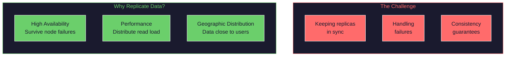
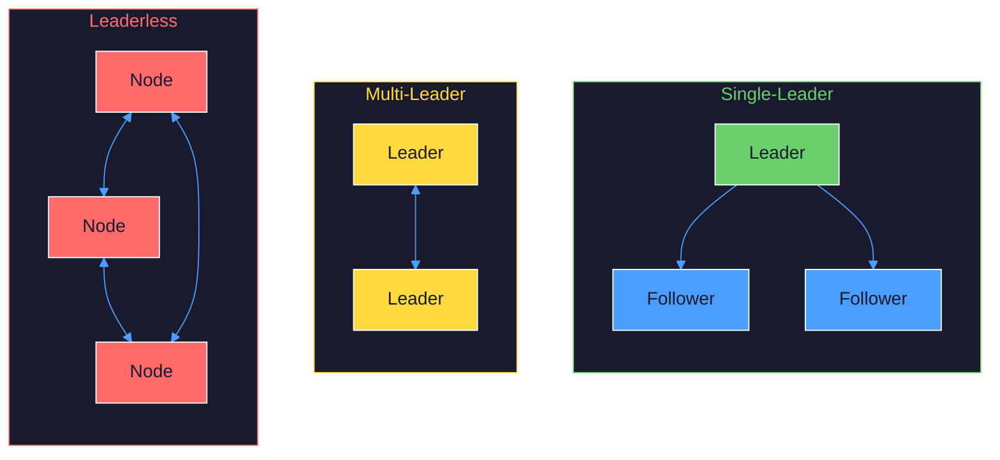
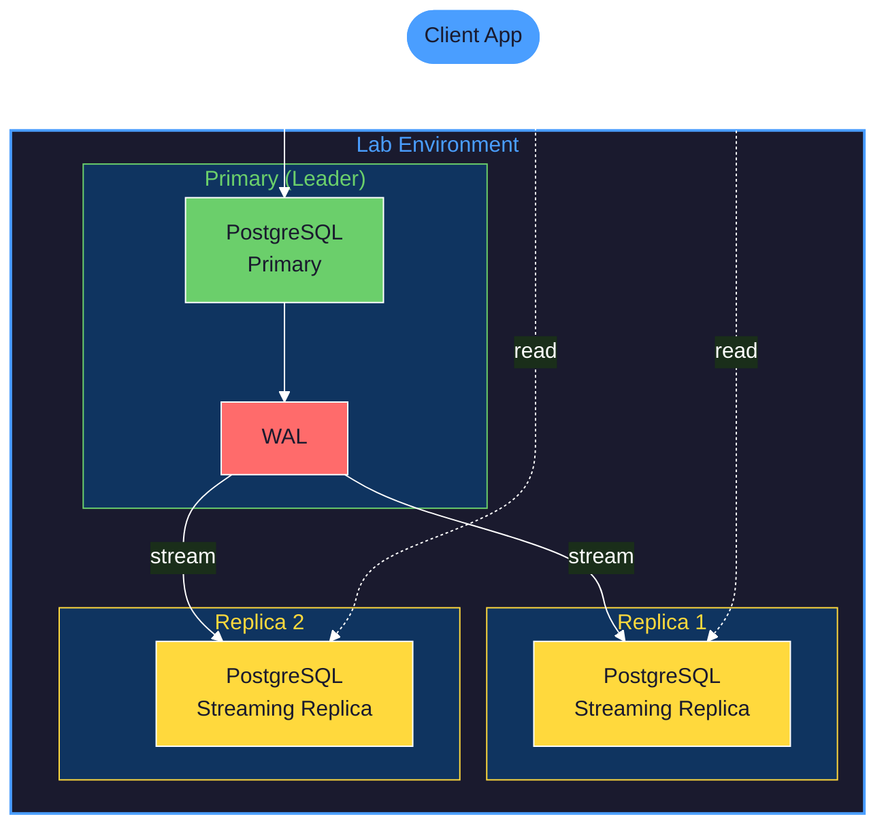
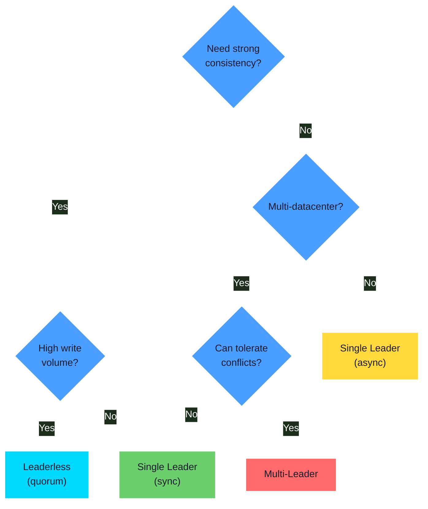

# Lab: Replication in Practice

> **Learning Goal**: Experience replication firsthand—set up leader-follower replication, observe lag, simulate failover, and understand the consistency trade-offs that databases make.

> **DDIA Chapters**: 5 (Replication)

---

## Table of Contents

1. [The Mental Model](#1-the-mental-model)
2. [What You'll Build](#2-what-youll-build)
3. [Phase 0: Single Node Baseline](#phase-0-single-node-baseline)
4. [Phase 1: Leader-Follower Replication](#phase-1-leader-follower-replication)
5. [Phase 2: Observing Replication Lag](#phase-2-observing-replication-lag)
6. [Phase 3: Read-Your-Writes Consistency](#phase-3-read-your-writes-consistency)
7. [Phase 4: Simulating Failover](#phase-4-simulating-failover)
8. [Phase 5: Quorum Reads and Writes](#phase-5-quorum-reads-and-writes)
9. [Comparing Replication Strategies](#comparing-replication-strategies)

---

## 1. The Mental Model

### Why Replicate?



### The Three Replication Architectures



### The Laws of Replication

1. **You can't have both strong consistency AND high availability during partitions.** This is the essence of CAP. You must choose.

2. **Replication lag is inevitable with async replication.** The question is: how do you handle it?

3. **Failover is not free.** Promoting a follower to leader can lose committed writes if the replication was async.

---

## 2. What You'll Build

A hands-on exploration using PostgreSQL with streaming replication:



**Technology Stack:**
- PostgreSQL 16 with streaming replication
- Docker Compose for local cluster
- Go client for testing consistency

---

## Philosophy

> **Supporting Material**: [Chapter 5: Replication](../../part2-distributed-data/05-replication/README.md)

1. **Replication is About Copies, Not Backups** — Replicas serve live traffic. Backups are for disaster recovery. Replication is for availability and performance. The mental model is fundamentally different.

2. **The CAP Theorem is About Trade-offs, Not Limitations** — You cannot have perfect consistency AND availability during network partitions. But you can choose where on the spectrum to sit. Leader-follower chooses consistency. Leaderless can choose availability.

3. **Lag is Not a Bug, It's Physics** — Data must travel over networks, be written to disk, applied to indexes. This takes time. Replication lag is the observable consequence of asynchronous replication. You cannot eliminate it without paying the synchronous replication tax.

4. **Failover is the Hard Part** — Steady-state replication is relatively straightforward. The complexity explodes during failover: detecting failure, electing new leader, reconfiguring clients, handling split-brain. This is where distributed systems get interesting.

5. **Consistency Models are Contracts** — "Eventually consistent" is a contract between database and application. So is "read-your-writes." Understand what contract you're signing before you build on it.

6. **Quorums are the Math of Agreement** — If you write to W nodes and read from R nodes, and W + R > N, you're guaranteed to read the latest write. This simple formula underlies much of distributed systems theory.

---

## Phase 0: Single Node Baseline

### Philosophy

> **DDIA Reference**: [Leaders and Followers](../../part2-distributed-data/05-replication/README.md#leaders-and-followers)

1. **Baseline First, Complexity Later** — Before adding replication, understand what a single node gives you: strong consistency, simple failure modes, zero coordination overhead. This is your comparison point.

2. **Single Node is a Single Point of Failure** — Everything works perfectly until the node dies. Then everything stops. Replication exists because this is unacceptable for production systems.

### Structures & Behaviors

**Prerequisite Structures:**

| Structure | What It Is | If Unfamiliar |
|-----------|------------|---------------|
| **WAL (Write-Ahead Log)** | Sequential log of all changes | PostgreSQL internals |
| **Checkpoint** | Periodic flush of dirty pages | Database recovery |
| **Connection pooling** | Reuse database connections | PgBouncer basics |
| **MVCC** | Multi-version concurrency control | Transaction isolation |

**Behaviors Given These Structures:**

| Behavior | Emerges From | Manifestation |
|----------|--------------|---------------|
| Durability | WAL + fsync | Committed data survives crash |
| Single point of failure | One node | Node down = service down |
| Read/write on same node | No replication | No read scaling |

### Step 0.1: Deploy Single Node

```yaml
# docker-compose.single.yml
version: '3.8'
services:
  postgres:
    image: postgres:16
    container_name: pg-single
    environment:
      POSTGRES_USER: app
      POSTGRES_PASSWORD: secret
      POSTGRES_DB: testdb
    ports:
      - "5432:5432"
    volumes:
      - pg_single_data:/var/lib/postgresql/data
    command: >
      postgres
      -c wal_level=replica
      -c max_wal_senders=10
      -c max_replication_slots=10

volumes:
  pg_single_data:
```

```bash
docker-compose -f docker-compose.single.yml up -d
```

---

### Temporal Narrative: Measuring the Baseline

**t=0 — Developer Intent**

*"I want to understand what a single PostgreSQL node can do before I add replication. What's my baseline for writes/second? Reads/second? What happens when I kill it?"*

---

**t=1 — Developer Action: Benchmark writes**

```bash
pgbench -i -s 10 -h localhost -U app testdb
pgbench -c 10 -j 2 -T 30 -h localhost -U app testdb
```

```
transaction type: <builtin: TPC-B (sort of)>
scaling factor: 10
number of clients: 10
number of threads: 2
duration: 30 s
number of transactions actually processed: 42156
latency average = 7.118 ms
tps = 1404.982 (including connections establishing)
```

*What you're thinking*: "1,400 TPS on a single node with 10 concurrent clients. That's my baseline. Now I know that if I add replicas and TPS drops, replication is the cause."*

---

**t=2 — Developer Action: Test durability**

```bash
# Write data
psql -h localhost -U app testdb -c "INSERT INTO test VALUES (1, 'important data');"

# Kill PostgreSQL brutally
docker kill pg-single

# Restart
docker-compose -f docker-compose.single.yml up -d

# Check data
psql -h localhost -U app testdb -c "SELECT * FROM test WHERE id = 1;"
```

```
 id |     value
----+----------------
  1 | important data
```

*What you're thinking*: "The data survived a hard crash. That's the WAL doing its job—the write was committed before the INSERT returned, so it was in the WAL on disk. PostgreSQL replayed the WAL on recovery."*

---

**t=3 — Developer Action: Measure downtime**

```bash
time docker restart pg-single
```

```
real    0m4.231s
```

*What you're thinking*: "4 seconds of downtime for a restart. During that time, all connections fail. This is the 'single point of failure' problem. Replication will let me survive this."*

### Checkpoint 0

- [ ] Single PostgreSQL node running
- [ ] Baseline TPS measured
- [ ] Understand that durability ≠ availability

---

## Phase 1: Leader-Follower Replication

### Philosophy

> **DDIA Reference**: [Leaders and Followers](../../part2-distributed-data/05-replication/README.md#leaders-and-followers)

1. **One Writer, Many Readers** — All writes go to the leader. This eliminates write conflicts by construction. Followers receive a stream of changes and replay them. Simple, deterministic, correct.

2. **WAL is the Replication Protocol** — PostgreSQL replication is just sending WAL records to replicas. The same log that provides crash recovery also provides replication. Elegant reuse of existing infrastructure.

3. **Synchronous vs Asynchronous is the Key Trade-off** — Synchronous replication waits for follower acknowledgment before committing. Durable but slow. Asynchronous commits immediately. Fast but risks data loss on leader failure.

4. **Read Scaling is the Reward** — With multiple followers, you can distribute read queries. This is why read-heavy workloads love leader-follower replication. Writes don't scale, but that's often acceptable.

### Step 1.1: Deploy Primary + Replicas

```yaml
# docker-compose.replicated.yml
version: '3.8'

services:
  pg-primary:
    image: postgres:16
    container_name: pg-primary
    environment:
      POSTGRES_USER: app
      POSTGRES_PASSWORD: secret
      POSTGRES_DB: testdb
    ports:
      - "5432:5432"
    volumes:
      - pg_primary_data:/var/lib/postgresql/data
      - ./init-primary.sh:/docker-entrypoint-initdb.d/init.sh
    command: >
      postgres
      -c wal_level=replica
      -c max_wal_senders=10
      -c max_replication_slots=10
      -c synchronous_commit=on
      -c hot_standby=on

  pg-replica1:
    image: postgres:16
    container_name: pg-replica1
    environment:
      POSTGRES_USER: app
      POSTGRES_PASSWORD: secret
      POSTGRES_DB: testdb
      PGUSER: replicator
      PGPASSWORD: replicator_password
    ports:
      - "5433:5432"
    volumes:
      - pg_replica1_data:/var/lib/postgresql/data
    depends_on:
      - pg-primary
    command: >
      bash -c "
        until pg_isready -h pg-primary -U app; do sleep 1; done;
        rm -rf /var/lib/postgresql/data/*;
        pg_basebackup -h pg-primary -D /var/lib/postgresql/data -U replicator -Fp -Xs -P -R;
        exec postgres
      "

  pg-replica2:
    image: postgres:16
    container_name: pg-replica2
    environment:
      POSTGRES_USER: app
      POSTGRES_PASSWORD: secret
      POSTGRES_DB: testdb
    ports:
      - "5434:5432"
    volumes:
      - pg_replica2_data:/var/lib/postgresql/data
    depends_on:
      - pg-primary
    command: >
      bash -c "
        until pg_isready -h pg-primary -U app; do sleep 1; done;
        rm -rf /var/lib/postgresql/data/*;
        pg_basebackup -h pg-primary -D /var/lib/postgresql/data -U replicator -Fp -Xs -P -R;
        exec postgres
      "

volumes:
  pg_primary_data:
  pg_replica1_data:
  pg_replica2_data:
```

```bash
# init-primary.sh
#!/bin/bash
set -e

psql -v ON_ERROR_STOP=1 --username "$POSTGRES_USER" --dbname "$POSTGRES_DB" <<-EOSQL
    CREATE USER replicator WITH REPLICATION ENCRYPTED PASSWORD 'replicator_password';
    SELECT pg_create_physical_replication_slot('replica1_slot');
    SELECT pg_create_physical_replication_slot('replica2_slot');
EOSQL

echo "host replication replicator 0.0.0.0/0 md5" >> "$PGDATA/pg_hba.conf"
```

---

### Temporal Narrative: First Replication

**t=0 — Developer Action: Start the cluster**

```bash
docker-compose -f docker-compose.replicated.yml up -d
```

*Waiting for replicas to sync...*

---

**t=1 — Developer Action: Verify replication is working**

```bash
# Check replication status on primary
psql -h localhost -p 5432 -U app testdb -c "SELECT * FROM pg_stat_replication;"
```

```
 pid  | usename    | application_name | client_addr  | state     | sync_state
------+------------+------------------+--------------+-----------+------------
 1234 | replicator | walreceiver      | 172.18.0.3   | streaming | async
 1235 | replicator | walreceiver      | 172.18.0.4   | streaming | async
```

*What you're thinking*: "Two replicas connected, both in 'streaming' state. They're receiving WAL in real-time. `sync_state` is 'async'—the primary doesn't wait for replicas to confirm before acknowledging commits."*

---

**t=2 — Developer Action: Write to primary, read from replica**

```bash
# Write to primary
psql -h localhost -p 5432 -U app testdb -c "INSERT INTO test VALUES (100, 'replicated');"

# Read from replica (should see the data)
psql -h localhost -p 5433 -U app testdb -c "SELECT * FROM test WHERE id = 100;"
```

```
 id  |   value
-----+-----------
 100 | replicated
```

*What you're thinking*: "The data appeared on the replica almost instantly. The WAL record was streamed from primary → replica, and the replica applied it. This is the magic of streaming replication."*

---

**t=3 — Developer Action: Try to write to replica**

```bash
psql -h localhost -p 5433 -U app testdb -c "INSERT INTO test VALUES (101, 'oops');"
```

```
ERROR:  cannot execute INSERT in a read-only transaction
DETAIL:  The server is in read-only mode (standby mode).
```

*What you're thinking*: "The replica is read-only. All writes must go through the primary. This is a fundamental constraint of leader-follower replication—there's exactly one source of truth for writes."*

### Checkpoint 1

- [ ] Primary and 2 replicas running
- [ ] `pg_stat_replication` shows streaming replicas
- [ ] Writes to primary appear on replicas
- [ ] Writes to replicas fail

---

## Phase 2: Observing Replication Lag

### Philosophy

> **DDIA Reference**: [Problems with Replication Lag](../../part2-distributed-data/05-replication/README.md#problems-with-replication-lag)

1. **Lag is Latency Made Visible** — Replication lag is the time between a write on the primary and that write being visible on replicas. It includes network latency, disk I/O, and apply time. You're seeing physics.

2. **Lag Increases Under Load** — When the primary is busy writing, WAL records queue up. When the replica is busy applying, it falls further behind. High load amplifies lag. This is when consistency problems surface.

3. **Monitoring Lag is Non-Negotiable** — You cannot manage what you don't measure. If lag exceeds your application's tolerance, you need alerts. This is operational hygiene.

### Step 2.1: Measure Lag

```go
// cmd/lag-monitor/main.go
package main

import (
    "context"
    "database/sql"
    "fmt"
    "time"

    _ "github.com/lib/pq"
)

func main() {
    primary, _ := sql.Open("postgres", "host=localhost port=5432 user=app password=secret dbname=testdb sslmode=disable")
    replica, _ := sql.Open("postgres", "host=localhost port=5433 user=app password=secret dbname=testdb sslmode=disable")

    // Create table for testing
    primary.Exec("CREATE TABLE IF NOT EXISTS lag_test (id SERIAL, ts TIMESTAMPTZ)")

    for i := 0; i < 100; i++ {
        // Write to primary with current timestamp
        start := time.Now()
        var insertedID int
        primary.QueryRow("INSERT INTO lag_test (ts) VALUES (NOW()) RETURNING id").Scan(&insertedID)

        // Poll replica until we see the row
        for {
            var count int
            replica.QueryRow("SELECT COUNT(*) FROM lag_test WHERE id = $1", insertedID).Scan(&count)
            if count > 0 {
                break
            }
            time.Sleep(time.Millisecond)
        }

        lag := time.Since(start)
        fmt.Printf("Replication lag: %v\n", lag)
        time.Sleep(100 * time.Millisecond)
    }
}
```

---

### Temporal Narrative: Seeing the Lag

**t=0 — Developer Action: Run lag monitor under normal load**

```bash
go run cmd/lag-monitor/main.go
```

```
Replication lag: 1.234ms
Replication lag: 0.891ms
Replication lag: 1.102ms
Replication lag: 0.756ms
...
```

*What you're thinking*: "Sub-millisecond to ~1ms lag under light load. The replica is keeping up. But what happens under heavy write load?"*

---

**t=1 — Developer Action: Generate heavy write load**

```bash
# In another terminal, hammer the primary
pgbench -c 50 -j 4 -T 60 -h localhost -p 5432 -U app testdb &

# Watch lag
go run cmd/lag-monitor/main.go
```

```
Replication lag: 5.234ms
Replication lag: 12.891ms
Replication lag: 23.456ms
Replication lag: 45.102ms
Replication lag: 89.756ms
...
```

*What you're thinking*: "Lag is growing! Under heavy load, the replica can't apply WAL records as fast as the primary generates them. This is the fundamental async replication problem—you trade consistency for throughput."*

---

**t=2 — Developer Action: Query the lag from PostgreSQL**

```bash
psql -h localhost -p 5433 -U app testdb -c "
SELECT
    CASE WHEN pg_last_wal_receive_lsn() = pg_last_wal_replay_lsn()
         THEN 0
         ELSE EXTRACT(EPOCH FROM (now() - pg_last_xact_replay_timestamp()))
    END AS lag_seconds;
"
```

```
 lag_seconds
-------------
       0.089
```

*What you're thinking*: "89 milliseconds behind. That's the delay between when a transaction commits on primary and when it's visible on replica. For most applications, this is acceptable. But if a user writes and immediately reads from a replica, they might not see their own write."*

---

**t=3 — Developer Realization**

*"This is the 'read your own writes' problem from DDIA Chapter 5. The user's write goes to primary, but their next read goes to replica. If the replica is behind, the user sees stale data. I need to either:
1. Route reads for a user to the primary after they write
2. Include a timestamp and only accept reads from replicas that are up-to-date
3. Use synchronous replication (but lose throughput)"*

### Checkpoint 2

- [ ] Can measure replication lag programmatically
- [ ] Understand that lag increases under load
- [ ] Recognize the read-your-writes consistency problem

---

## Phase 3: Read-Your-Writes Consistency

### Philosophy

> **DDIA Reference**: [Reading Your Own Writes](../../part2-distributed-data/05-replication/README.md#reading-your-own-writes)

1. **User Expectations vs System Reality** — Users expect to see their own writes immediately. "I just updated my profile, why does it show the old name?" With async replication, this expectation isn't automatically met.

2. **Application-Level Consistency** — The database doesn't know which user made which write. The application must track this and route reads accordingly. This is a common pattern: push consistency concerns to the application layer.

3. **Time-Based Heuristics** — "Route to primary if user wrote within last 5 seconds" is a simple, effective approach. The window should exceed your typical replication lag.

4. **The Infrastructure Doesn't Know Your Semantics** — Only your application knows what "read your own writes" means in your domain. Only your application can implement it correctly.

### Step 3.1: Implement Read-Your-Writes

```go
// internal/consistency/ryw.go
package consistency

import (
    "context"
    "database/sql"
    "sync"
    "time"
)

type ReadYourWritesDB struct {
    primary *sql.DB
    replica *sql.DB

    mu               sync.RWMutex
    lastWriteByUser  map[string]time.Time
    readOwnWriteWindow time.Duration
}

func New(primary, replica *sql.DB) *ReadYourWritesDB {
    return &ReadYourWritesDB{
        primary:            primary,
        replica:            replica,
        lastWriteByUser:    make(map[string]time.Time),
        readOwnWriteWindow: 5 * time.Second,
    }
}

func (db *ReadYourWritesDB) Write(ctx context.Context, userID string, query string, args ...interface{}) error {
    _, err := db.primary.ExecContext(ctx, query, args...)
    if err != nil {
        return err
    }

    // Record that this user just wrote
    db.mu.Lock()
    db.lastWriteByUser[userID] = time.Now()
    db.mu.Unlock()

    return nil
}

func (db *ReadYourWritesDB) Read(ctx context.Context, userID string, query string, args ...interface{}) (*sql.Rows, error) {
    // Check if this user wrote recently
    db.mu.RLock()
    lastWrite, hasWritten := db.lastWriteByUser[userID]
    db.mu.RUnlock()

    if hasWritten && time.Since(lastWrite) < db.readOwnWriteWindow {
        // User wrote recently - read from primary to guarantee consistency
        return db.primary.QueryContext(ctx, query, args...)
    }

    // Safe to read from replica
    return db.replica.QueryContext(ctx, query, args...)
}
```

---

### Temporal Narrative: Guaranteeing Your Own Writes

**t=0 — Developer Action: Test without read-your-writes**

```go
// Write then immediately read from replica
primary.Exec("INSERT INTO users (id, name) VALUES (1, 'Alice')")
var name string
replica.QueryRow("SELECT name FROM users WHERE id = 1").Scan(&name)
fmt.Println(name)
```

```
sql: no rows in result set   // Oops! Replica hasn't caught up yet
```

*What you're thinking*: "Classic read-your-writes violation. The write succeeded on primary, but the replica hasn't applied it yet. The user would see 'user not found' right after creating their account."*

---

**t=1 — Developer Action: Test with read-your-writes wrapper**

```go
db := consistency.New(primary, replica)

// Write as user "alice"
db.Write(ctx, "alice", "INSERT INTO users (id, name) VALUES (1, 'Alice')")

// Read as same user - will go to primary
rows, _ := db.Read(ctx, "alice", "SELECT name FROM users WHERE id = 1")
// ... returns "Alice" correctly

// Read as different user - can use replica
rows, _ = db.Read(ctx, "bob", "SELECT name FROM users WHERE id = 1")
// ... may or may not see "Alice" depending on replica lag
```

*What you're thinking*: "Now Alice sees her own writes immediately because her reads are routed to primary. Bob's reads can use the replica because he doesn't have a freshness expectation for Alice's data."*

---

**t=2 — Developer Action: Monitor routing decisions**

```go
// Add metrics
if hasWritten && time.Since(lastWrite) < db.readOwnWriteWindow {
    metrics.Inc("db.read.routed_to_primary")
    return db.primary.QueryContext(ctx, query, args...)
}
metrics.Inc("db.read.routed_to_replica")
return db.replica.QueryContext(ctx, query, args...)
```

```
db.read.routed_to_primary: 1,234
db.read.routed_to_replica: 98,766
```

*What you're thinking*: "~1.2% of reads go to primary due to recent writes. The other 98.8% use the replica. This is the best of both worlds—consistency when needed, scale when possible."*

### Checkpoint 3

- [ ] Implemented read-your-writes at application level
- [ ] User's reads after writes go to primary
- [ ] Other users' reads use replica

---

## Phase 4: Simulating Failover

### Philosophy

> **DDIA Reference**: [Handling Node Outages](../../part2-distributed-data/05-replication/README.md#handling-node-outages)

1. **Failure is Certain, Timing is Not** — Every primary will eventually fail. Hardware dies, software crashes, networks partition. The question isn't "if" but "when" and "how do we respond."

2. **Detection is the First Challenge** — How do you know the primary is dead vs just slow? Aggressive timeouts mean false failovers. Conservative timeouts mean longer downtime. There's no perfect answer.

3. **Data Loss is the Price of Asynchronous** — With async replication, the primary may have committed transactions the replicas haven't received. Promoting a replica loses those transactions. This is the fundamental trade-off.

4. **Split-Brain is the Nightmare Scenario** — If the old primary isn't actually dead and comes back, you have two primaries. Both accept writes. Data diverges. Reconciliation is hell. Fencing (STONITH) prevents this.

### Step 4.1: Manual Failover

```bash
# Check current replication state
psql -h localhost -p 5433 -U app testdb -c "SELECT pg_is_in_recovery();"
```

```
 pg_is_in_recovery
-------------------
 t     (true = this is a replica)
```

---

### Temporal Narrative: When the Primary Dies

**t=0 — Developer Action: Kill the primary**

```bash
# Write something important
psql -h localhost -p 5432 -U app testdb -c "INSERT INTO critical_data VALUES (999, 'important');"

# Now kill the primary
docker kill pg-primary
```

---

**t=1 — Developer Action: Observe the impact**

```bash
# Try to write
psql -h localhost -p 5432 -U app testdb -c "SELECT 1;"
```

```
psql: error: connection to server at "localhost" (127.0.0.1), port 5432 failed: Connection refused
```

*What you're thinking*: "Primary is dead. All writes are failing. The application is degraded. I need to promote a replica to primary."*

---

**t=2 — Developer Action: Check if replica has the data**

```bash
psql -h localhost -p 5433 -U app testdb -c "SELECT * FROM critical_data WHERE id = 999;"
```

```
 id  |   value
-----+-----------
 999 | important
```

*What you're thinking*: "Good, the replica has the last write. The WAL record was replicated before the primary died. But this isn't guaranteed—if I had killed the primary immediately after the INSERT returned, the replica might not have received it."*

---

**t=3 — Developer Action: Promote the replica**

```bash
# Promote replica1 to primary
docker exec -it pg-replica1 bash -c "pg_ctl promote -D /var/lib/postgresql/data"
```

```
waiting for server to promote.... done
server promoted
```

```bash
# Verify it's now a primary
psql -h localhost -p 5433 -U app testdb -c "SELECT pg_is_in_recovery();"
```

```
 pg_is_in_recovery
-------------------
 f     (false = this is now the primary!)
```

*What you're thinking*: "Replica1 is now the primary. It can accept writes. But there's a problem—replica2 is still trying to connect to the old primary. I need to reconfigure it to follow the new primary."*

---

**t=4 — Developer Action: Reconfigure remaining replica**

```bash
# Update replica2 to follow new primary
docker exec -it pg-replica2 bash -c "
cat > /var/lib/postgresql/data/postgresql.auto.conf << EOF
primary_conninfo = 'host=pg-replica1 port=5432 user=replicator password=replicator_password'
EOF
"

# Restart replica2
docker restart pg-replica2
```

*What you're thinking*: "Now the topology is: replica1 (new primary) → replica2 (follower). The original primary is dead. When I bring it back, I'll need to reinitialize it as a replica of the new primary."*

---

**t=5 — Developer Realization: The Split-Brain Risk**

*"What if the primary wasn't actually dead—just unreachable? If I promote a replica while the old primary is still running and accepting writes, I have **split-brain**: two nodes both think they're primary. Both accept writes. Data diverges.

This is why production failover systems use:
1. **Fencing**: Ensure the old primary is truly dead (STONITH - Shoot The Other Node In The Head)
2. **Consensus**: Use a quorum to agree on the new primary (etcd, ZooKeeper)
3. **Lease expiration**: The old primary's leadership lease must expire before a new one is elected"*

### Checkpoint 4

- [ ] Successfully promoted replica to primary
- [ ] Understand the risk of async failover (data loss)
- [ ] Recognize split-brain as a failure mode

---

## Phase 5: Quorum Reads and Writes

### Philosophy

> **DDIA Reference**: [Leaderless Replication](../../part2-distributed-data/05-replication/README.md#leaderless-replication)

1. **No Leader Means No Bottleneck** — In leaderless systems, any node can accept writes. No single point of failure, no write bottleneck. But you pay in complexity.

2. **The Quorum Formula: W + R > N** — Write to W nodes, read from R nodes, total of N nodes. If W + R > N, at least one node has both the write and the read—you're guaranteed to see your write. This is the mathematical foundation.

3. **Version Vectors Resolve Conflicts** — Without a single leader, concurrent writes can conflict. Version vectors (vector clocks) track causality. "Last write wins" is simple but loses data. Application-specific merge is correct but complex.

4. **Sloppy Quorums Trade Consistency for Availability** — During network partitions, you might not reach W nodes in the canonical set. Sloppy quorums let you write to any W nodes. Available but potentially inconsistent until hinted handoff repairs.

### Step 5.1: Simulate Quorum Semantics

```go
// internal/quorum/quorum.go
package quorum

import (
    "context"
    "database/sql"
    "errors"
    "sync"
)

type QuorumDB struct {
    nodes []*sql.DB
    n     int // Total nodes
    w     int // Write quorum
    r     int // Read quorum
}

func New(nodes []*sql.DB, w, r int) *QuorumDB {
    return &QuorumDB{
        nodes: nodes,
        n:     len(nodes),
        w:     w,
        r:     r,
    }
}

func (q *QuorumDB) Write(ctx context.Context, key string, value string, version int64) error {
    var wg sync.WaitGroup
    var mu sync.Mutex
    successCount := 0

    for _, node := range q.nodes {
        wg.Add(1)
        go func(db *sql.DB) {
            defer wg.Done()
            _, err := db.ExecContext(ctx,
                "INSERT INTO kv (key, value, version) VALUES ($1, $2, $3) "+
                    "ON CONFLICT (key) DO UPDATE SET value = $2, version = $3 WHERE kv.version < $3",
                key, value, version)
            if err == nil {
                mu.Lock()
                successCount++
                mu.Unlock()
            }
        }(node)
    }

    wg.Wait()

    if successCount < q.w {
        return errors.New("write quorum not met")
    }
    return nil
}

func (q *QuorumDB) Read(ctx context.Context, key string) (string, int64, error) {
    var wg sync.WaitGroup
    var mu sync.Mutex
    type result struct {
        value   string
        version int64
    }
    results := make([]result, 0, q.n)

    for _, node := range q.nodes {
        wg.Add(1)
        go func(db *sql.DB) {
            defer wg.Done()
            var value string
            var version int64
            err := db.QueryRowContext(ctx,
                "SELECT value, version FROM kv WHERE key = $1", key).Scan(&value, &version)
            if err == nil {
                mu.Lock()
                results = append(results, result{value, version})
                mu.Unlock()
            }
        }(node)
    }

    wg.Wait()

    if len(results) < q.r {
        return "", 0, errors.New("read quorum not met")
    }

    // Return the value with highest version
    var best result
    for _, r := range results {
        if r.version > best.version {
            best = r
        }
    }

    return best.value, best.version, nil
}
```

---

### Temporal Narrative: Quorum Consistency

**t=0 — Developer Action: Configure N=3, W=2, R=2**

```go
// W + R = 4 > N = 3, so we guarantee overlap
db := quorum.New(nodes, 2, 2)
```

*What you're thinking*: "With W=2 and R=2, any write goes to at least 2 of 3 nodes. Any read comes from at least 2 of 3 nodes. Since 2 + 2 > 3, there's always at least one node that has both the write and is consulted for the read."*

---

**t=1 — Developer Action: Write and read**

```go
// Write version 1
db.Write(ctx, "user:1", "Alice", 1)

// Read - guaranteed to see version 1
value, version, _ := db.Read(ctx, "user:1")
fmt.Printf("Got: %s (version %d)\n", value, version)
```

```
Got: Alice (version 1)
```

---

**t=2 — Developer Action: Kill one node, still works**

```bash
docker kill node-3
```

```go
// Write still succeeds (2 of 3 nodes up, W=2)
db.Write(ctx, "user:1", "Alice Updated", 2)

// Read still succeeds (2 of 3 nodes up, R=2)
value, version, _ := db.Read(ctx, "user:1")
fmt.Printf("Got: %s (version %d)\n", value, version)
```

```
Got: Alice Updated (version 2)
```

*What you're thinking*: "Beautiful! One node is down, but the system keeps working. This is the availability benefit of quorum systems. As long as W nodes are up for writes and R nodes are up for reads, we're fine."*

---

**t=3 — Developer Action: Kill another node**

```bash
docker kill node-2
```

```go
// Now only 1 of 3 nodes up
err := db.Write(ctx, "user:1", "Alice Again", 3)
fmt.Println(err)
```

```
write quorum not met
```

*What you're thinking*: "Now writes fail because we can't reach 2 nodes. This is the trade-off: quorum systems can tolerate some failures but not too many. With N=3 and W=2, we can survive 1 failure but not 2."*

### Checkpoint 5

- [ ] Implemented quorum reads and writes
- [ ] System survives (N - W) failures for writes
- [ ] System survives (N - R) failures for reads
- [ ] W + R > N guarantees read-your-writes

---

## Comparing Replication Strategies

### Summary Table

| Strategy | Consistency | Availability | Write Latency | Complexity |
|----------|-------------|--------------|---------------|------------|
| Single Leader (async) | Eventual | Survives follower failures | Low | Low |
| Single Leader (sync) | Strong | Survives N-1 failures | Higher | Medium |
| Multi-Leader | Conflict resolution needed | High | Low | High |
| Leaderless (quorum) | Tunable | High | Medium | Medium |

### When to Use Each



---

## References

- Kleppmann, M. (2017). *Designing Data-Intensive Applications*, Chapter 5
- [PostgreSQL Streaming Replication](https://www.postgresql.org/docs/current/warm-standby.html)
- [Dynamo: Amazon's Highly Available Key-value Store](https://www.allthingsdistributed.com/files/amazon-dynamo-sosp2007.pdf)
