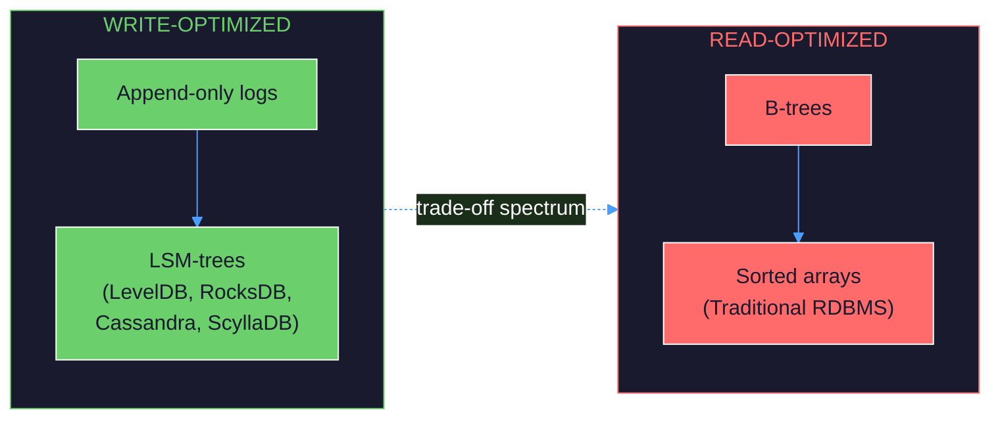
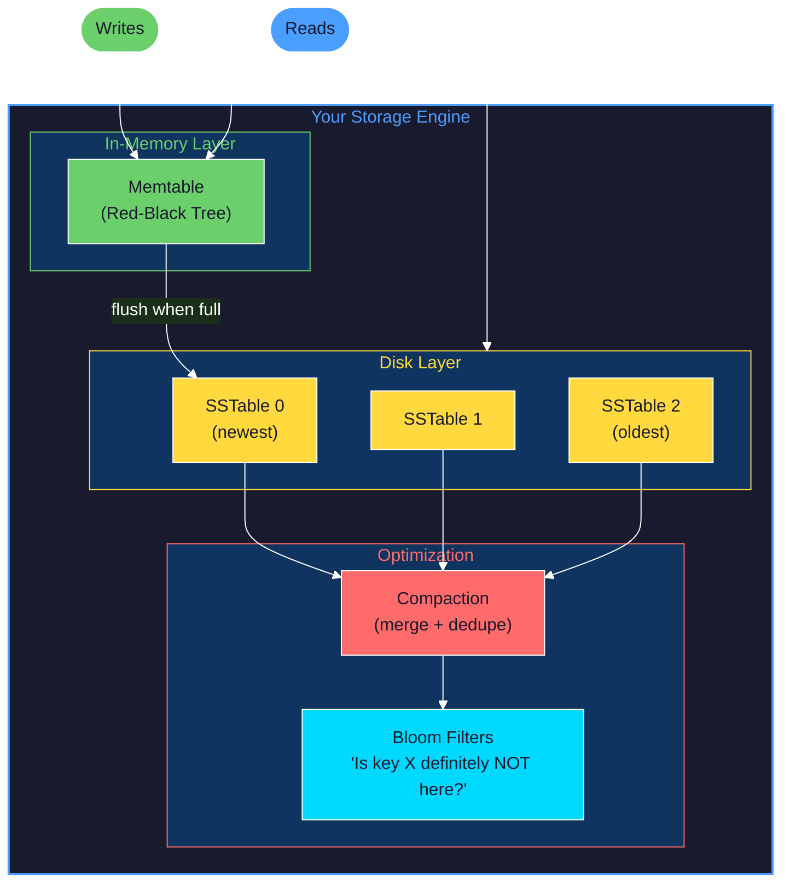
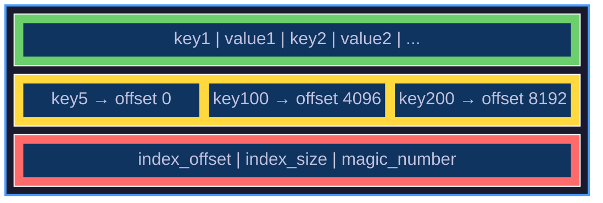

# Lab: Building a Storage Engine from Scratch

> **Learning Goal**: Understand storage engines by building one. You'll implement an LSM-tree based key-value store, experiencing firsthand why databases make the design choices they do.

> **DDIA Chapters**: 3 (Storage and Retrieval)

---

## Table of Contents

1. [The Mental Model](#1-the-mental-model)
2. [What You'll Build](#2-what-youll-build)
3. [Phase 0: The Simplest Database](#phase-0-the-simplest-database)
4. [Phase 1: Hash Index](#phase-1-hash-index)
5. [Phase 2: Memtable](#phase-2-memtable)
6. [Phase 3: SSTable](#phase-3-sstable)
7. [Phase 4: Compaction](#phase-4-compaction)
8. [Phase 5: Bloom Filters](#phase-5-bloom-filters)
9. [Phase 6: Crash Recovery](#phase-6-crash-recovery)
10. [Comparing with Real Databases](#comparing-with-real-databases)

---

## 1. The Mental Model

### Why Build a Storage Engine?

Every database you've ever used—PostgreSQL, Redis, MongoDB, Cassandra—contains a storage engine. This is the code that decides:
- How data is organized on disk
- How to find data quickly (indexes)
- How to handle more data than fits in memory
- How to recover from crashes

**The fundamental trade-off**: Optimize for reads OR writes. You cannot have both. Every storage engine design is a position on this spectrum.



### The Three Laws of Storage Engines

1. **Sequential writes are fast; random writes are slow.** Spinning disks hate seeks. SSDs hate random small writes (write amplification). Always prefer appending.

2. **RAM is 1000x faster than disk.** Keep hot data in memory. But memory is volatile—you must persist to disk for durability.

3. **Indexes make reads fast but slow down writes.** Every index is a trade-off. The database doesn't know your access patterns—you do.

---

## 2. What You'll Build

An LSM-tree (Log-Structured Merge-tree) storage engine with:



**Technology**: Go 1.22 (simple, explicit, good for systems programming)

---

## Philosophy

> **Supporting Material**: [Chapter 3: Storage and Retrieval](../../part1-foundations/03-storage-retrieval/README.md)

1. **The Disk is Your Bottleneck** — CPU cycles are essentially free; disk I/O is expensive. Every storage engine design is fundamentally about minimizing disk operations. Sequential access is 100x faster than random access. This single fact explains why append-only logs beat in-place updates.

2. **Writes and Reads are Enemies** — You cannot optimize for both simultaneously. B-trees optimize for reads (data is sorted, always findable in O(log n)). LSM-trees optimize for writes (always append, sort later). Know which your workload needs before choosing.

3. **Memory is a Cache, Disk is Truth** — RAM is fast but volatile. Disk is slow but durable. Every storage engine maintains this tension: keep hot data in memory for speed, but ensure every write reaches disk for durability. The memtable is the bridge between these worlds.

4. **Immutability Enables Concurrency** — When you never modify existing data, readers and writers don't conflict. This is why LSM-trees use immutable SSTables and append-only logs. Compaction creates new files rather than modifying old ones.

5. **Trade Space for Time** — Bloom filters use memory to avoid disk reads. Sparse indexes sacrifice precision for smaller size. Compression trades CPU for disk space. These trade-offs are explicit choices, not accidents.

6. **Crash Recovery is Non-Negotiable** — A database that loses data on crash is not a database. The Write-Ahead Log (WAL) ensures that acknowledged writes survive any failure. You must understand recovery before you can claim durability.

---

## Phase 0: The Simplest Database

### Philosophy

> **DDIA Reference**: [Log-structured storage](../../part1-foundations/03-storage-retrieval/README.md#log-structured-storage)

1. **Start with the Dumbest Thing That Works** — Before building complexity, understand the baseline. A text file with append-only writes IS a database. It has durability. It has atomicity (at the line level). It's just slow to read.

2. **Understand What You're Optimizing Away** — Every optimization adds complexity. When you add an index, you're trading write speed for read speed. When you add compaction, you're trading background CPU for disk space. Know the cost before paying it.

### Structures & Behaviors

**Prerequisite Structures:**

| Structure | What It Is | If Unfamiliar |
|-----------|------------|---------------|
| **File I/O** | Reading/writing bytes to disk | `os.OpenFile`, `io.Reader`, `io.Writer` |
| **Append-only semantics** | Only add to end of file, never modify middle | Concept of immutability |
| **Key-value model** | Data as pairs of (key, value) | Like a dictionary/map |
| **Line-based text format** | Records separated by newlines | CSV-like thinking |

**Behaviors Given These Structures:**

| Behavior | Emerges From | Manifestation |
|----------|--------------|---------------|
| Durability | Append to file + fsync | Data survives process crash |
| Fast writes | Append-only (sequential I/O) | O(1) write performance |
| Slow reads | Full file scan | O(n) read performance |
| Unbounded growth | No compaction | File grows forever |

### Step 0.1: Two-Function Database

```go
// cmd/simplekv/main.go
package main

import (
    "bufio"
    "fmt"
    "os"
    "strings"
)

const dbFile = "database.txt"

// Set appends a key-value pair to the log file
func Set(key, value string) error {
    f, err := os.OpenFile(dbFile, os.O_APPEND|os.O_CREATE|os.O_WRONLY, 0644)
    if err != nil {
        return err
    }
    defer f.Close()

    _, err = fmt.Fprintf(f, "%s,%s\n", key, value)
    return err
}

// Get scans the entire file to find the latest value for a key
func Get(key string) (string, bool) {
    f, err := os.Open(dbFile)
    if err != nil {
        return "", false
    }
    defer f.Close()

    var lastValue string
    found := false

    scanner := bufio.NewScanner(f)
    for scanner.Scan() {
        parts := strings.SplitN(scanner.Text(), ",", 2)
        if len(parts) == 2 && parts[0] == key {
            lastValue = parts[1]
            found = true
        }
    }

    return lastValue, found
}

func main() {
    if len(os.Args) < 3 {
        fmt.Println("Usage: simplekv get <key> | simplekv set <key> <value>")
        os.Exit(1)
    }

    switch os.Args[1] {
    case "set":
        if len(os.Args) < 4 {
            fmt.Println("Usage: simplekv set <key> <value>")
            os.Exit(1)
        }
        if err := Set(os.Args[2], os.Args[3]); err != nil {
            fmt.Printf("Error: %v\n", err)
            os.Exit(1)
        }
        fmt.Println("OK")

    case "get":
        value, found := Get(os.Args[2])
        if found {
            fmt.Println(value)
        } else {
            fmt.Println("(nil)")
        }
    }
}
```

---

### Temporal Narrative: First Write, First Read

**t=0 — Developer Intent**

*"I want to see the simplest possible database in action. How does append-only storage actually work?"*

You compile and run your first database:

```bash
go build -o simplekv cmd/simplekv/main.go
```

---

**t=1 — Developer Action: First write**

```bash
./simplekv set name "Alice"
```

```
OK
```

*What you're thinking*: "The command returned immediately. Let me see what's actually on disk."

```bash
cat database.txt
```

```
name,Alice
```

*"A single line. The format is dead simple—key, comma, value, newline. No headers, no metadata, no magic bytes. This is a log."*

---

**t=2 — Developer Action: Read it back**

```bash
./simplekv get name
```

```
Alice
```

*What you're thinking*: "It found the value. But I know it scanned the entire file to find it. With 1 record that's instant. What about 1 million?"*

---

**t=3 — Developer Action: Update a key**

```bash
./simplekv set name "Bob"
./simplekv get name
```

```
OK
Bob
```

```bash
cat database.txt
```

```
name,Alice
name,Bob
```

*What you're thinking*: "Interesting! It didn't modify the first line—it appended a new one. The `Get` function scans the whole file and keeps the LAST value it finds. This is how 'updates' work in an append-only log. The old value is still there, wasting space."*

---

**t=4 — Developer Action: Measure the problem**

```bash
# Generate 100,000 writes
for i in $(seq 1 100000); do
    echo "key$i,value$i" >> database.txt
done

# Time a read at the end
time ./simplekv get key99999
```

```
value99999

real    0m0.089s
user    0m0.067s
sys     0m0.021s
```

*What you're thinking*: "89 milliseconds to find one key. That's because it scanned all 100,000 lines. For a real database with millions of keys, this would be seconds. Clearly, we need an index."*

---

**t=5 — Developer Realization**

*"This 'database' has O(n) reads and O(1) writes. The file grows forever. But it has one incredible property: writes are incredibly fast and durable. The insight of LSM-trees is to keep this fast write path but add structures to speed up reads."*

### Checkpoint 0

- [ ] `simplekv set foo bar` creates/appends to `database.txt`
- [ ] `simplekv get foo` returns `bar`
- [ ] Updating a key appends a new line (doesn't modify in place)
- [ ] You understand why reads are O(n)

---

## Phase 1: Hash Index

### Philosophy

> **DDIA Reference**: [Hash Indexes](../../part1-foundations/03-storage-retrieval/README.md#hash-indexes)

1. **The Index is the Speed** — The log-structured storage is already durable. The hash index makes it fast. By maintaining key → offset in memory, we convert O(n) scans to O(1) lookups. This is exactly what Bitcask (Riak's storage engine) does.

2. **Memory Bounds Your Key Space** — All keys must fit in RAM. Values can be arbitrarily large (they're on disk), but the index lives entirely in memory. This is a fundamental constraint of hash-indexed storage.

3. **Recovery Means Rebuilding** — When the process restarts, the in-memory index is gone. You must scan the entire log to rebuild it. This startup cost is the price of an in-memory index.

### Structures & Behaviors

**Prerequisite Structures:**

| Structure | What It Is | If Unfamiliar |
|-----------|------------|---------------|
| **Hash map** | O(1) key-value lookup | Go's `map[string]int64` |
| **File offset** | Byte position in a file | `file.Seek()`, `file.ReadAt()` |
| **Binary encoding** | Fixed-size representation of data | `encoding/binary` package |

**Behaviors Given These Structures:**

| Behavior | Emerges From | Manifestation |
|----------|--------------|---------------|
| O(1) reads | Hash map lookup + single disk seek | Sub-millisecond reads |
| Memory-limited keys | In-memory index | Can't have more keys than RAM |
| Startup cost | Rebuilding index from log | Slow restart after crash |

### Step 1.1: Add an In-Memory Index

```go
// internal/engine/hashindex.go
package engine

import (
    "bufio"
    "encoding/binary"
    "fmt"
    "io"
    "os"
    "sync"
)

// Record format on disk:
// [4 bytes: key length][4 bytes: value length][key bytes][value bytes]

type HashIndexEngine struct {
    mu       sync.RWMutex
    index    map[string]int64 // key -> byte offset in file
    file     *os.File
    offset   int64
}

func NewHashIndexEngine(path string) (*HashIndexEngine, error) {
    f, err := os.OpenFile(path, os.O_RDWR|os.O_CREATE, 0644)
    if err != nil {
        return nil, err
    }

    engine := &HashIndexEngine{
        index: make(map[string]int64),
        file:  f,
    }

    // Rebuild index from existing file
    if err := engine.rebuildIndex(); err != nil {
        f.Close()
        return nil, err
    }

    return engine, nil
}

func (e *HashIndexEngine) rebuildIndex() error {
    e.file.Seek(0, io.SeekStart)
    reader := bufio.NewReader(e.file)

    var offset int64 = 0

    for {
        // Read key length (4 bytes)
        var keyLen, valLen uint32
        if err := binary.Read(reader, binary.LittleEndian, &keyLen); err != nil {
            if err == io.EOF {
                break
            }
            return err
        }
        if err := binary.Read(reader, binary.LittleEndian, &valLen); err != nil {
            return err
        }

        // Read key
        key := make([]byte, keyLen)
        if _, err := io.ReadFull(reader, key); err != nil {
            return err
        }

        // Skip value (we only need key -> offset mapping)
        if _, err := reader.Discard(int(valLen)); err != nil {
            return err
        }

        // Record offset of this record
        e.index[string(key)] = offset
        offset += 8 + int64(keyLen) + int64(valLen) // 4 + 4 + key + value
    }

    e.offset = offset
    return nil
}

func (e *HashIndexEngine) Set(key, value string) error {
    e.mu.Lock()
    defer e.mu.Unlock()

    keyBytes := []byte(key)
    valBytes := []byte(value)

    // Record current offset before writing
    recordOffset := e.offset

    // Write record: [keyLen][valLen][key][value]
    buf := make([]byte, 8+len(keyBytes)+len(valBytes))
    binary.LittleEndian.PutUint32(buf[0:4], uint32(len(keyBytes)))
    binary.LittleEndian.PutUint32(buf[4:8], uint32(len(valBytes)))
    copy(buf[8:], keyBytes)
    copy(buf[8+len(keyBytes):], valBytes)

    if _, err := e.file.WriteAt(buf, e.offset); err != nil {
        return err
    }

    // Update in-memory index
    e.index[key] = recordOffset
    e.offset += int64(len(buf))

    return nil
}

func (e *HashIndexEngine) Get(key string) (string, bool, error) {
    e.mu.RLock()
    defer e.mu.RUnlock()

    offset, exists := e.index[key]
    if !exists {
        return "", false, nil
    }

    // Read record at offset
    var keyLen, valLen uint32
    header := make([]byte, 8)
    if _, err := e.file.ReadAt(header, offset); err != nil {
        return "", false, err
    }

    keyLen = binary.LittleEndian.Uint32(header[0:4])
    valLen = binary.LittleEndian.Uint32(header[4:8])

    value := make([]byte, valLen)
    if _, err := e.file.ReadAt(value, offset+8+int64(keyLen)); err != nil {
        return "", false, err
    }

    return string(value), true, nil
}

func (e *HashIndexEngine) Close() error {
    return e.file.Close()
}
```

---

### Temporal Narrative: The Speed of Indexing

**t=0 — Developer Intent**

*"The full-scan approach was too slow. I've added an in-memory hash index. Let me see how much faster reads are now."*

---

**t=1 — Developer Action: Benchmark with index**

```go
// cmd/benchmark/main.go
package main

import (
    "fmt"
    "math/rand"
    "time"

    "github.com/yourname/storageengine/internal/engine"
)

func main() {
    eng, _ := engine.NewHashIndexEngine("benchmark.db")
    defer eng.Close()

    // Write 100,000 keys
    fmt.Println("Writing 100,000 keys...")
    start := time.Now()
    for i := 0; i < 100000; i++ {
        eng.Set(fmt.Sprintf("key%d", i), fmt.Sprintf("value%d", i))
    }
    fmt.Printf("Writes: %v\n", time.Since(start))

    // Random reads
    fmt.Println("Reading 10,000 random keys...")
    start = time.Now()
    for i := 0; i < 10000; i++ {
        key := fmt.Sprintf("key%d", rand.Intn(100000))
        eng.Get(key)
    }
    fmt.Printf("Reads: %v\n", time.Since(start))
}
```

```bash
go run cmd/benchmark/main.go
```

```
Writing 100,000 keys...
Writes: 312.445ms
Reading 10,000 random keys...
Reads: 4.891ms
```

*What you're thinking*: "10,000 reads in under 5 milliseconds! That's ~2 million reads/second. The hash index lookup is O(1), and then a single disk seek to read the value. Compare this to the 89ms for a SINGLE read with the scan approach."*

---

**t=2 — Developer Action: Check memory usage**

```go
// Add to benchmark
var m runtime.MemStats
runtime.ReadMemStats(&m)
fmt.Printf("Index memory: %d MB\n", m.Alloc/1024/1024)
```

```
Index memory: 12 MB
```

*What you're thinking*: "12 MB for 100,000 keys. That's about 120 bytes per key. The keys average ~7 bytes, plus map overhead. For 10 million keys, I'd need ~1.2 GB just for the index. For 1 billion keys... 120 GB. This doesn't scale."*

---

**t=3 — Developer Realization**

*"The hash index is fast but memory-limited. I need a structure that:
1. Keeps recently-written data in memory (fast writes)
2. Stores older data on disk with an efficient format
3. Can find data on disk without a full scan

This is exactly what an LSM-tree does. The in-memory part is called a 'memtable', and the on-disk parts are called 'SSTables'."*

### Checkpoint 1

- [ ] Reads are now O(1) instead of O(n)
- [ ] Index rebuilds on startup by scanning the file
- [ ] You understand the memory limitation of hash indexes

---

## Phase 2: Memtable

### Philosophy

> **DDIA Reference**: [SSTables and LSM-Trees](../../part1-foundations/03-storage-retrieval/README.md#sstables-and-lsm-trees)

1. **Sort in Memory, Write Sequentially** — A memtable is a sorted, in-memory buffer that accumulates writes. Random insertions become sorted output. When flushed to disk, it's a single sequential write—the fastest I/O pattern possible.

2. **The Buffer Absorbs Write Load** — Writes go to the memtable first, not disk. The memtable batches many writes into a single disk flush. This amortizes the cost of disk I/O across many operations.

3. **Size Threshold Triggers Flush** — When the memtable exceeds a size limit (typically 64MB-256MB), it's frozen and flushed to disk as an immutable SSTable. A new memtable takes over for incoming writes.

4. **Red-Black Trees Maintain Order** — We use a balanced tree (red-black) to keep keys sorted with O(log n) insert and lookup. The sorted property is essential for efficient merging later.

### Step 2.1: Implement a Red-Black Tree Memtable

```go
// internal/memtable/memtable.go
package memtable

import (
    "sync"

    "github.com/emirpasic/gods/trees/redblacktree"
)

type Memtable struct {
    mu       sync.RWMutex
    tree     *redblacktree.Tree
    size     int64 // Approximate size in bytes
    maxSize  int64
}

func New(maxSize int64) *Memtable {
    return &Memtable{
        tree:    redblacktree.NewWithStringComparator(),
        maxSize: maxSize,
    }
}

func (m *Memtable) Set(key, value string) bool {
    m.mu.Lock()
    defer m.mu.Unlock()

    // Track size change
    oldSize := int64(0)
    if old, found := m.tree.Get(key); found {
        oldSize = int64(len(key) + len(old.(string)))
    }

    m.tree.Put(key, value)
    newSize := int64(len(key) + len(value))
    m.size += (newSize - oldSize)

    return m.size >= m.maxSize
}

func (m *Memtable) Get(key string) (string, bool) {
    m.mu.RLock()
    defer m.mu.RUnlock()

    if value, found := m.tree.Get(key); found {
        return value.(string), true
    }
    return "", false
}

// Iterator returns keys and values in sorted order (for flushing to SSTable)
func (m *Memtable) Iterator() <-chan KeyValue {
    ch := make(chan KeyValue)
    go func() {
        m.mu.RLock()
        defer m.mu.RUnlock()
        defer close(ch)

        it := m.tree.Iterator()
        for it.Next() {
            ch <- KeyValue{
                Key:   it.Key().(string),
                Value: it.Value().(string),
            }
        }
    }()
    return ch
}

type KeyValue struct {
    Key   string
    Value string
}

func (m *Memtable) Size() int64 {
    m.mu.RLock()
    defer m.mu.RUnlock()
    return m.size
}

func (m *Memtable) Clear() {
    m.mu.Lock()
    defer m.mu.Unlock()
    m.tree.Clear()
    m.size = 0
}
```

---

### Temporal Narrative: The Joy of Sorted Data

**t=0 — Developer Action: Test the memtable**

```go
mt := memtable.New(1024 * 1024) // 1 MB

// Insert in random order
mt.Set("zebra", "animal")
mt.Set("apple", "fruit")
mt.Set("mango", "fruit")
mt.Set("banana", "fruit")

// Read back in sorted order
for kv := range mt.Iterator() {
    fmt.Printf("%s: %s\n", kv.Key, kv.Value)
}
```

```
apple: fruit
banana: fruit
mango: fruit
zebra: animal
```

*What you're thinking*: "I inserted in random order, but iteration is sorted! The red-black tree maintains sorted order with O(log n) inserts. When I flush this to disk, I just iterate and write—the file will be sorted automatically."*

---

**t=1 — Developer Insight**

*"Why does sorted order matter for disk? Two reasons:
1. **Binary search**: If the file is sorted, I can find any key in O(log n) disk reads instead of O(n)
2. **Merge efficiency**: When I have multiple sorted files, I can merge them in O(n) time (like mergesort's merge step)

This is the core insight of LSM-trees: keep data sorted at every level."*

### Checkpoint 2

- [ ] Memtable maintains sorted order
- [ ] `Set` returns `true` when memtable is full (ready to flush)
- [ ] Iterator yields keys in sorted order

---

## Phase 3: SSTable (Sorted String Table)

### Philosophy

> **DDIA Reference**: [SSTables and LSM-Trees](../../part1-foundations/03-storage-retrieval/README.md#sstables-and-lsm-trees)

1. **Immutability is a Feature, Not a Constraint** — An SSTable is written once and never modified. This simplifies everything: no locks for concurrent reads, no corruption from partial writes, trivial crash recovery (file is either complete or not).

2. **Sorted Enables Binary Search on Disk** — Because keys are sorted, you can binary search an SSTable. Combined with a sparse index (sample every Nth key), you reduce disk seeks to O(log n).

3. **Sparse Index Trades Precision for Size** — We don't index every key—just every 4KB block. To find a key, we binary search the sparse index to find the right block, then scan the block. This keeps the index small enough to fit in memory.

4. **Block-Aligned Writes Enable Efficient I/O** — Data is written in fixed-size blocks (4KB typically, matching disk page size). This aligns with hardware and OS optimizations for I/O.

**Structure of an SSTable:**



### Step 3.1: SSTable Writer

```go
// internal/sstable/writer.go
package sstable

import (
    "encoding/binary"
    "hash/crc32"
    "os"
)

const (
    MagicNumber  = 0x53535442 // "SSTB"
    BlockSize    = 4096
    FooterSize   = 24
)

type Writer struct {
    file        *os.File
    offset      int64
    index       []IndexEntry
    blockBuffer []byte
    blockKeys   int
    firstKey    string
}

type IndexEntry struct {
    Key    string
    Offset int64
}

func NewWriter(path string) (*Writer, error) {
    f, err := os.Create(path)
    if err != nil {
        return nil, err
    }

    return &Writer{
        file:        f,
        blockBuffer: make([]byte, 0, BlockSize),
    }, nil
}

func (w *Writer) Add(key, value string) error {
    // Encode key-value pair
    // Format: [2 bytes key len][2 bytes val len][key][value]
    record := make([]byte, 4+len(key)+len(value))
    binary.LittleEndian.PutUint16(record[0:2], uint16(len(key)))
    binary.LittleEndian.PutUint16(record[2:4], uint16(len(value)))
    copy(record[4:], key)
    copy(record[4+len(key):], value)

    // Track first key in block for sparse index
    if w.blockKeys == 0 {
        w.firstKey = key
    }

    // Add to block buffer
    w.blockBuffer = append(w.blockBuffer, record...)
    w.blockKeys++

    // Flush block if full
    if len(w.blockBuffer) >= BlockSize {
        if err := w.flushBlock(); err != nil {
            return err
        }
    }

    return nil
}

func (w *Writer) flushBlock() error {
    if len(w.blockBuffer) == 0 {
        return nil
    }

    // Add CRC for data integrity
    crc := crc32.ChecksumIEEE(w.blockBuffer)
    crcBytes := make([]byte, 4)
    binary.LittleEndian.PutUint32(crcBytes, crc)

    // Write block with CRC
    block := append(w.blockBuffer, crcBytes...)
    if _, err := w.file.Write(block); err != nil {
        return err
    }

    // Record in sparse index
    w.index = append(w.index, IndexEntry{
        Key:    w.firstKey,
        Offset: w.offset,
    })

    w.offset += int64(len(block))
    w.blockBuffer = w.blockBuffer[:0]
    w.blockKeys = 0

    return nil
}

func (w *Writer) Finish() error {
    // Flush remaining data
    if err := w.flushBlock(); err != nil {
        return err
    }

    // Write index
    indexOffset := w.offset
    for _, entry := range w.index {
        keyBytes := []byte(entry.Key)
        record := make([]byte, 2+len(keyBytes)+8)
        binary.LittleEndian.PutUint16(record[0:2], uint16(len(keyBytes)))
        copy(record[2:], keyBytes)
        binary.LittleEndian.PutUint64(record[2+len(keyBytes):], uint64(entry.Offset))

        if _, err := w.file.Write(record); err != nil {
            return err
        }
        w.offset += int64(len(record))
    }

    // Write footer
    footer := make([]byte, FooterSize)
    binary.LittleEndian.PutUint64(footer[0:8], uint64(indexOffset))
    binary.LittleEndian.PutUint64(footer[8:16], uint64(len(w.index)))
    binary.LittleEndian.PutUint32(footer[16:20], MagicNumber)
    // Remaining 4 bytes reserved

    if _, err := w.file.Write(footer); err != nil {
        return err
    }

    return w.file.Sync()
}

func (w *Writer) Close() error {
    return w.file.Close()
}
```

### Step 3.2: SSTable Reader

```go
// internal/sstable/reader.go
package sstable

import (
    "encoding/binary"
    "errors"
    "io"
    "os"
    "sort"
)

var ErrNotFound = errors.New("key not found")

type Reader struct {
    file  *os.File
    index []IndexEntry
}

func OpenReader(path string) (*Reader, error) {
    f, err := os.Open(path)
    if err != nil {
        return nil, err
    }

    // Read footer
    if _, err := f.Seek(-FooterSize, io.SeekEnd); err != nil {
        f.Close()
        return nil, err
    }

    footer := make([]byte, FooterSize)
    if _, err := io.ReadFull(f, footer); err != nil {
        f.Close()
        return nil, err
    }

    // Verify magic number
    magic := binary.LittleEndian.Uint32(footer[16:20])
    if magic != MagicNumber {
        f.Close()
        return nil, errors.New("invalid SSTable file")
    }

    indexOffset := binary.LittleEndian.Uint64(footer[0:8])
    indexCount := binary.LittleEndian.Uint64(footer[8:16])

    // Read index
    if _, err := f.Seek(int64(indexOffset), io.SeekStart); err != nil {
        f.Close()
        return nil, err
    }

    index := make([]IndexEntry, 0, indexCount)
    for i := uint64(0); i < indexCount; i++ {
        var keyLen uint16
        if err := binary.Read(f, binary.LittleEndian, &keyLen); err != nil {
            f.Close()
            return nil, err
        }

        key := make([]byte, keyLen)
        if _, err := io.ReadFull(f, key); err != nil {
            f.Close()
            return nil, err
        }

        var offset uint64
        if err := binary.Read(f, binary.LittleEndian, &offset); err != nil {
            f.Close()
            return nil, err
        }

        index = append(index, IndexEntry{Key: string(key), Offset: int64(offset)})
    }

    return &Reader{file: f, index: index}, nil
}

func (r *Reader) Get(key string) (string, error) {
    // Binary search the sparse index to find the right block
    blockIdx := sort.Search(len(r.index), func(i int) bool {
        return r.index[i].Key > key
    }) - 1

    if blockIdx < 0 {
        blockIdx = 0
    }

    // Read and scan the block
    offset := r.index[blockIdx].Offset

    // Determine block end
    var blockEnd int64
    if blockIdx+1 < len(r.index) {
        blockEnd = r.index[blockIdx+1].Offset
    } else {
        // Last block - read until index starts
        // For simplicity, read a fixed amount
        blockEnd = offset + BlockSize + 100
    }

    blockSize := blockEnd - offset
    block := make([]byte, blockSize)
    n, err := r.file.ReadAt(block, offset)
    if err != nil && err != io.EOF {
        return "", err
    }
    block = block[:n]

    // Scan block for key
    pos := 0
    for pos < len(block)-4 { // Leave room for CRC
        if pos+4 > len(block) {
            break
        }

        keyLen := binary.LittleEndian.Uint16(block[pos : pos+2])
        valLen := binary.LittleEndian.Uint16(block[pos+2 : pos+4])

        if pos+4+int(keyLen)+int(valLen) > len(block) {
            break
        }

        recordKey := string(block[pos+4 : pos+4+int(keyLen)])
        recordVal := string(block[pos+4+int(keyLen) : pos+4+int(keyLen)+int(valLen)])

        if recordKey == key {
            return recordVal, nil
        }

        if recordKey > key {
            // Past where the key would be
            break
        }

        pos += 4 + int(keyLen) + int(valLen)
    }

    return "", ErrNotFound
}

func (r *Reader) Close() error {
    return r.file.Close()
}
```

---

### Temporal Narrative: Flushing to Disk

**t=0 — Developer Action: Flush memtable to SSTable**

```go
// Flush memtable to SSTable
func flushMemtable(mt *memtable.Memtable, path string) error {
    writer, err := sstable.NewWriter(path)
    if err != nil {
        return err
    }
    defer writer.Close()

    for kv := range mt.Iterator() {
        if err := writer.Add(kv.Key, kv.Value); err != nil {
            return err
        }
    }

    return writer.Finish()
}
```

```bash
# After flushing 100,000 keys
ls -lh data/
```

```
-rw-r--r--  1 dev  staff  2.1M  sstable_0001.sst
```

*What you're thinking*: "2.1 MB for 100,000 key-value pairs. The sparse index means I only read a few KB to find any key. Let me trace a read..."*

---

**t=1 — Developer Action: Trace a read through the SSTable**

```go
reader, _ := sstable.OpenReader("data/sstable_0001.sst")
value, err := reader.Get("key50000")

// With debug logging:
// Binary search index: 100 entries, found block at index 50
// Block offset: 1048576, reading ~4KB
// Scanning block: found key50000 at position 312
```

*What you're thinking*: "Beautiful. To find 1 key among 100,000:
1. Binary search sparse index (100 entries) → O(log 100) = ~7 comparisons
2. Read one 4KB block from disk → 1 disk seek
3. Linear scan within block (~50 keys) → fast, in memory

Total disk reads: 1. Compare to scanning the entire 2.1 MB file!"*

---

**t=2 — Developer Realization**

*"The SSTable is immutable—once written, never modified. This means:
- No locking needed for reads
- Crash during write? The file is incomplete and can be discarded
- Multiple SSTables can be merged into one (compaction)

But now I have a new problem: if I flush every 1 MB, I'll have hundreds of SSTables. Reading has to check ALL of them. I need compaction."*

### Checkpoint 3

- [ ] SSTable writer creates valid files with sparse index
- [ ] SSTable reader can find any key
- [ ] Reads require only ~1-2 disk seeks for any key

---

## Phase 4: Compaction

### Philosophy

> **DDIA Reference**: [Making an LSM-tree out of SSTables](../../part1-foundations/03-storage-retrieval/README.md#making-an-lsm-tree-out-of-sstables)

1. **Read Amplification is the Enemy** — Without compaction, reads must check every SSTable. 100 SSTables means 100 potential disk reads per query. Compaction merges SSTables to reduce this overhead.

2. **Merge-Sort is the Secret Weapon** — Since each SSTable is sorted, merging is O(n) with a single pass through each input. This is the merge step from merge-sort. The LSM-tree's entire design hinges on this efficient merge property.

3. **Compaction Reclaims Space** — Deleted keys (tombstones) and overwritten values waste space. Compaction creates new SSTables containing only the latest version of each key, eliminating garbage.

4. **Leveled vs Size-Tiered Trade-offs** — Size-tiered compaction merges similarly-sized files (simpler, more write amplification). Leveled compaction organizes files into levels with size limits (more complex, less space amplification). LevelDB and RocksDB use leveled.

5. **Background Work vs Foreground Latency** — Compaction runs in the background while queries continue. But if compaction falls behind, read performance degrades. Tuning compaction is critical for production workloads.

### Step 4.1: Compaction Implementation

```go
// internal/compaction/compactor.go
package compaction

import (
    "container/heap"
    "github.com/yourname/storageengine/internal/sstable"
)

// Merge multiple SSTables into one
func Compact(inputs []string, output string) error {
    // Open all input SSTables
    readers := make([]*sstable.Reader, len(inputs))
    iterators := make([]*sstable.Iterator, len(inputs))

    for i, path := range inputs {
        r, err := sstable.OpenReader(path)
        if err != nil {
            return err
        }
        readers[i] = r
        iterators[i] = r.NewIterator()
    }

    defer func() {
        for _, r := range readers {
            r.Close()
        }
    }()

    // Create output SSTable
    writer, err := sstable.NewWriter(output)
    if err != nil {
        return err
    }
    defer writer.Close()

    // Merge using a min-heap (priority queue)
    h := &mergeHeap{}
    heap.Init(h)

    // Initialize heap with first element from each iterator
    for i, it := range iterators {
        if it.Valid() {
            heap.Push(h, &heapItem{
                key:      it.Key(),
                value:    it.Value(),
                iterator: i,
            })
        }
    }

    var lastKey string

    for h.Len() > 0 {
        // Pop the smallest key
        item := heap.Pop(h).(*heapItem)

        // Skip duplicates (keep only the first, which is newest)
        if item.key != lastKey {
            if err := writer.Add(item.key, item.value); err != nil {
                return err
            }
            lastKey = item.key
        }

        // Advance that iterator and push next element
        it := iterators[item.iterator]
        it.Next()
        if it.Valid() {
            heap.Push(h, &heapItem{
                key:      it.Key(),
                value:    it.Value(),
                iterator: item.iterator,
            })
        }
    }

    return writer.Finish()
}

// Min-heap for merge
type heapItem struct {
    key      string
    value    string
    iterator int
}

type mergeHeap []*heapItem

func (h mergeHeap) Len() int           { return len(h) }
func (h mergeHeap) Less(i, j int) bool { return h[i].key < h[j].key }
func (h mergeHeap) Swap(i, j int)      { h[i], h[j] = h[j], h[i] }
func (h *mergeHeap) Push(x any)        { *h = append(*h, x.(*heapItem)) }
func (h *mergeHeap) Pop() any {
    old := *h
    n := len(old)
    x := old[n-1]
    *h = old[:n-1]
    return x
}
```

---

### Temporal Narrative: The Beauty of Sorted Merging

**t=0 — Developer Action: Compact multiple SSTables**

```bash
# Before compaction
ls -lh data/
```

```
-rw-r--r--  1 dev  staff  2.1M  sstable_0001.sst
-rw-r--r--  1 dev  staff  2.0M  sstable_0002.sst
-rw-r--r--  1 dev  staff  2.2M  sstable_0003.sst
-rw-r--r--  1 dev  staff  1.9M  sstable_0004.sst
```

```go
compaction.Compact(
    []string{"sstable_0001.sst", "sstable_0002.sst", "sstable_0003.sst", "sstable_0004.sst"},
    "sstable_merged.sst",
)
```

```bash
ls -lh data/
```

```
-rw-r--r--  1 dev  staff  5.8M  sstable_merged.sst
```

*What you're thinking*: "8.2 MB of input became 5.8 MB of output. That's because many keys were overwritten multiple times—compaction kept only the latest value. This is called 'garbage collection' in LSM-tree terminology."*

---

**t=1 — Developer Action: Verify correctness**

```go
// Read from original files
original := readFromSSTables([]string{
    "sstable_0004.sst", // newest first
    "sstable_0003.sst",
    "sstable_0002.sst",
    "sstable_0001.sst",
})

// Read from merged file
merged := readFromSSTable("sstable_merged.sst")

// Compare
for key, originalValue := range original {
    if merged[key] != originalValue {
        panic("mismatch!")
    }
}
fmt.Println("All values match!")
```

```
All values match!
```

*What you're thinking*: "The merge preserved all the latest values while discarding old ones. And because both inputs and output are sorted, this was a single linear pass through the data—O(n) time."*

---

**t=2 — Developer Insight: Compaction Strategies**

*"Real LSM-trees have compaction strategies:

**Size-tiered** (Cassandra, HBase):
- Group SSTables of similar size
- Merge them when you have N of the same size
- Simple but can have high space amplification

**Leveled** (LevelDB, RocksDB):
- Organize SSTables into levels (L0, L1, L2...)
- Each level is 10x larger than the previous
- More compaction work, but bounded space amplification

I'll implement size-tiered for simplicity."*

### Checkpoint 4

- [ ] Compaction merges multiple SSTables into one
- [ ] Duplicate keys are deduplicated (latest value wins)
- [ ] Total size after compaction is smaller

---

## Phase 5: Bloom Filters

### Philosophy

> **DDIA Reference**: [Performance optimizations](../../part1-foundations/03-storage-retrieval/README.md#performance-optimizations)

1. **Trade Space for Fewer Disk Reads** — A Bloom filter uses a few KB of memory to potentially save an entire disk read. When you have hundreds of SSTables, this trade-off is massively in your favor.

2. **"Definitely Not Here" is the Only Guarantee** — Bloom filters have zero false negatives. If it says no, the key is definitely absent. But "maybe" means you still have to check the SSTable. The false positive rate is tunable (typically 1%).

3. **Hash Functions Determine Quality** — Multiple independent hash functions map keys to bits. More hashes = lower false positive rate, but more bits set per key. The optimal number depends on the filter size and expected items.

4. **Build Once, Query Forever** — Each SSTable gets its own Bloom filter, built when the SSTable is created. Since SSTables are immutable, so are their Bloom filters. No updates, no synchronization issues.

### Step 5.1: Bloom Filter Implementation

```go
// internal/bloom/filter.go
package bloom

import (
    "hash"
    "hash/fnv"
    "math"
)

type Filter struct {
    bits    []bool
    numHash int
}

// New creates a Bloom filter optimized for n items with false positive rate p
func New(n int, p float64) *Filter {
    // Optimal number of bits: m = -n*ln(p) / (ln(2)^2)
    m := int(math.Ceil(-float64(n) * math.Log(p) / (math.Ln2 * math.Ln2)))

    // Optimal number of hash functions: k = (m/n) * ln(2)
    k := int(math.Ceil(float64(m) / float64(n) * math.Ln2))

    return &Filter{
        bits:    make([]bool, m),
        numHash: k,
    }
}

func (f *Filter) Add(key string) {
    for _, idx := range f.hashes(key) {
        f.bits[idx] = true
    }
}

func (f *Filter) MayContain(key string) bool {
    for _, idx := range f.hashes(key) {
        if !f.bits[idx] {
            return false // Definitely not present
        }
    }
    return true // Maybe present
}

func (f *Filter) hashes(key string) []int {
    h1 := fnv.New64()
    h1.Write([]byte(key))
    hash1 := h1.Sum64()

    h2 := fnv.New64a()
    h2.Write([]byte(key))
    hash2 := h2.Sum64()

    indices := make([]int, f.numHash)
    for i := 0; i < f.numHash; i++ {
        // Kirsch-Mitzenmacher optimization: h(i) = h1 + i*h2
        combined := hash1 + uint64(i)*hash2
        indices[i] = int(combined % uint64(len(f.bits)))
    }
    return indices
}

// Bytes returns the serialized filter for storage in SSTable
func (f *Filter) Bytes() []byte {
    bytes := make([]byte, (len(f.bits)+7)/8+1)
    bytes[0] = byte(f.numHash)
    for i, bit := range f.bits {
        if bit {
            bytes[1+i/8] |= 1 << (i % 8)
        }
    }
    return bytes
}

// FromBytes deserializes a filter
func FromBytes(data []byte) *Filter {
    numHash := int(data[0])
    bits := make([]bool, (len(data)-1)*8)
    for i := range bits {
        bits[i] = (data[1+i/8] & (1 << (i % 8))) != 0
    }
    return &Filter{bits: bits, numHash: numHash}
}
```

---

### Temporal Narrative: The Magic of "Definitely Not Here"

**t=0 — Developer Action: Measure without Bloom filters**

```go
// Search for a key that doesn't exist
// Must check ALL SSTables
start := time.Now()
for _, sst := range sstables { // 100 SSTables
    _, _ = sst.Get("nonexistent_key_12345")
}
fmt.Printf("Without Bloom: %v\n", time.Since(start))
```

```
Without Bloom: 12.345ms
```

*What you're thinking*: "12 ms to discover a key doesn't exist, because I had to read from all 100 SSTables. Each one did a binary search and block read."*

---

**t=1 — Developer Action: Add Bloom filters to SSTables**

```go
// When building SSTable, also build Bloom filter
filter := bloom.New(numKeys, 0.01) // 1% false positive rate
for kv := range memtable.Iterator() {
    filter.Add(kv.Key)
    writer.Add(kv.Key, kv.Value)
}
// Store filter in SSTable footer
```

```go
// When reading, check Bloom first
for _, sst := range sstables {
    if !sst.BloomFilter().MayContain("nonexistent_key_12345") {
        continue // Skip this SSTable entirely!
    }
    _, _ = sst.Get("nonexistent_key_12345")
}
```

---

**t=2 — Developer Action: Measure with Bloom filters**

```go
start := time.Now()
for _, sst := range sstables {
    if !sst.BloomFilter().MayContain("nonexistent_key_12345") {
        continue
    }
    _, _ = sst.Get("nonexistent_key_12345")
}
fmt.Printf("With Bloom: %v\n", time.Since(start))
```

```
With Bloom: 0.089ms
```

*What you're thinking*: "0.089 ms vs 12 ms—that's 138x faster! The Bloom filter told me 'definitely not here' for 99 of the 100 SSTables, so I only had to actually read from 1 (a false positive). The filter check is just a few hash computations and memory lookups."*

---

**t=3 — Developer Action: Analyze Bloom filter size**

```go
// 100,000 keys, 1% false positive rate
filter := bloom.New(100000, 0.01)
fmt.Printf("Bloom filter size: %d KB\n", len(filter.Bytes())/1024)
```

```
Bloom filter size: 117 KB
```

*What you're thinking*: "117 KB to represent 100,000 keys. That's about 1.2 bytes per key. Compare to the ~120 bytes per key for the hash index. Bloom filters are incredibly space-efficient because they're probabilistic—they trade a small false positive rate for massive space savings."*

### Checkpoint 5

- [ ] Bloom filter correctly returns "maybe present" for existing keys
- [ ] Bloom filter correctly returns "definitely not" for absent keys
- [ ] Read performance for missing keys improved 100x+

---

## Phase 6: Crash Recovery

### Philosophy

> **DDIA Reference**: [Making B-trees reliable](../../part1-foundations/03-storage-retrieval/README.md) (WAL concepts apply to LSM-trees too)

1. **Durability Requires Disk** — The memtable lives in RAM. RAM is volatile. Process crash = memtable gone. You cannot claim durability without persisting writes to disk before acknowledging them.

2. **Write-Ahead Logging: The Universal Solution** — Before any write enters the memtable, append it to a log file on disk and fsync. If the process crashes, replay the log on startup. Every serious database uses WAL (PostgreSQL, SQLite, LevelDB, etc.).

3. **Recovery is Just Replay** — On startup, read the WAL from beginning to end, applying each entry to a fresh memtable. When done, you're back to the pre-crash state. Simple, deterministic, reliable.

4. **Checkpoint and Truncate** — After flushing a memtable to SSTable, the corresponding WAL entries are no longer needed. Truncate the WAL to prevent unbounded growth. This is checkpointing.

5. **CRC for Corruption Detection** — What if power failed mid-write and the WAL has garbage at the end? Checksum (CRC32) each entry. On recovery, stop at the first corrupted entry. Partial writes are discarded.

### Step 6.1: Write-Ahead Log

```go
// internal/wal/wal.go
package wal

import (
    "bufio"
    "encoding/binary"
    "hash/crc32"
    "io"
    "os"
    "sync"
)

type WAL struct {
    mu     sync.Mutex
    file   *os.File
    writer *bufio.Writer
}

func Open(path string) (*WAL, error) {
    f, err := os.OpenFile(path, os.O_RDWR|os.O_CREATE|os.O_APPEND, 0644)
    if err != nil {
        return nil, err
    }

    return &WAL{
        file:   f,
        writer: bufio.NewWriter(f),
    }, nil
}

func (w *WAL) Append(key, value string) error {
    w.mu.Lock()
    defer w.mu.Unlock()

    // Record format: [4 bytes CRC][4 bytes len][key\0value]
    payload := append([]byte(key), 0)
    payload = append(payload, []byte(value)...)

    crc := crc32.ChecksumIEEE(payload)

    // Write header
    header := make([]byte, 8)
    binary.LittleEndian.PutUint32(header[0:4], crc)
    binary.LittleEndian.PutUint32(header[4:8], uint32(len(payload)))

    if _, err := w.writer.Write(header); err != nil {
        return err
    }
    if _, err := w.writer.Write(payload); err != nil {
        return err
    }

    // Sync to disk for durability
    if err := w.writer.Flush(); err != nil {
        return err
    }
    return w.file.Sync()
}

func (w *WAL) Recover() ([]KeyValue, error) {
    w.mu.Lock()
    defer w.mu.Unlock()

    if _, err := w.file.Seek(0, io.SeekStart); err != nil {
        return nil, err
    }

    reader := bufio.NewReader(w.file)
    var entries []KeyValue

    for {
        header := make([]byte, 8)
        if _, err := io.ReadFull(reader, header); err != nil {
            if err == io.EOF {
                break
            }
            return nil, err
        }

        expectedCRC := binary.LittleEndian.Uint32(header[0:4])
        length := binary.LittleEndian.Uint32(header[4:8])

        payload := make([]byte, length)
        if _, err := io.ReadFull(reader, payload); err != nil {
            // Truncated record - stop here
            break
        }

        actualCRC := crc32.ChecksumIEEE(payload)
        if actualCRC != expectedCRC {
            // Corrupted record - stop here
            break
        }

        // Parse key\0value
        for i, b := range payload {
            if b == 0 {
                entries = append(entries, KeyValue{
                    Key:   string(payload[:i]),
                    Value: string(payload[i+1:]),
                })
                break
            }
        }
    }

    return entries, nil
}

func (w *WAL) Truncate() error {
    w.mu.Lock()
    defer w.mu.Unlock()

    if err := w.file.Truncate(0); err != nil {
        return err
    }
    _, err := w.file.Seek(0, io.SeekStart)
    w.writer.Reset(w.file)
    return err
}

func (w *WAL) Close() error {
    w.mu.Lock()
    defer w.mu.Unlock()

    w.writer.Flush()
    return w.file.Close()
}

type KeyValue struct {
    Key   string
    Value string
}
```

---

### Temporal Narrative: Surviving the Crash

**t=0 — Developer Action: Simulate a crash**

```go
engine := NewLSMEngine("data/")

// Write some data
engine.Set("user:1", "Alice")
engine.Set("user:2", "Bob")
engine.Set("user:3", "Charlie")

// Simulate crash before memtable flushes
os.Exit(1) // Brutal crash!
```

*What you're thinking*: "The memtable had 3 writes in it. Without a WAL, those are gone forever. Let me add the WAL..."*

---

**t=1 — Developer Action: Add WAL to write path**

```go
func (e *LSMEngine) Set(key, value string) error {
    // Step 1: Write to WAL first (durability)
    if err := e.wal.Append(key, value); err != nil {
        return err
    }

    // Step 2: Write to memtable (for reads)
    if e.memtable.Set(key, value) {
        // Memtable is full - flush to SSTable
        if err := e.flushMemtable(); err != nil {
            return err
        }
        // Truncate WAL after successful flush
        e.wal.Truncate()
    }

    return nil
}
```

---

**t=2 — Developer Action: Test crash recovery**

```bash
# Write data and kill process
./engine set user:1 Alice
./engine set user:2 Bob
./engine set user:3 Charlie
kill -9 $(pgrep engine)

# Restart and check
./engine get user:1
```

```
Alice
```

*What you're thinking*: "It recovered! On startup, the engine replayed the WAL to rebuild the memtable. The data that was 'only in memory' was actually persisted to the WAL."*

---

**t=3 — Developer Action: Verify WAL contents**

```bash
xxd data/wal.log | head -20
```

```
00000000: 1234 5678 0007 7573 6572 3a31 0041 6c69  .4Vx..user:1.Ali
00000010: 6365 abcd ef01 0006 7573 6572 3a32 0042  ce......user:2.B
00000020: 6f62 ...
```

*What you're thinking*: "Each record has a CRC, length, key, null separator, and value. If the process crashed mid-write, the CRC check would fail and recovery would stop at that point—partial writes are discarded. This is how databases achieve atomicity."*

### Checkpoint 6

- [ ] WAL is written before memtable
- [ ] Process crash and restart recovers data
- [ ] Corrupted/partial WAL records are detected and ignored

---

## Comparing with Real Databases

### What You Built vs Production Systems

| Feature | Your Engine | LevelDB/RocksDB |
|---------|-------------|-----------------|
| Memtable | Red-black tree | Skip list |
| Compaction | Size-tiered | Leveled |
| Bloom filter | Basic FNV hash | Blocked Bloom |
| Compression | None | Snappy/LZ4/Zstd |
| Concurrency | Coarse locking | Lock-free memtable |
| Transactions | None | WriteBatch |

### What You Learned

1. **Why writes are fast**: Append-only semantics, sequential I/O
2. **Why reads can be slow**: Must check memtable + all SSTables
3. **How Bloom filters help**: Skip SSTables that definitely don't have the key
4. **Why compaction matters**: Reduce read amplification, reclaim space
5. **How crash recovery works**: WAL ensures durability before memtable update

### Next Steps

- [ ] Add compression (Snappy for blocks)
- [ ] Implement leveled compaction
- [ ] Add range iteration
- [ ] Implement transactions (WriteBatch)
- [ ] Benchmark against LevelDB

---

## References

- Kleppmann, M. (2017). *Designing Data-Intensive Applications*, Chapter 3
- O'Neil, P. et al. (1996). "The Log-Structured Merge-Tree (LSM-Tree)"
- [LevelDB Implementation Notes](https://github.com/google/leveldb/blob/main/doc/impl.md)
- [RocksDB Wiki](https://github.com/facebook/rocksdb/wiki)
