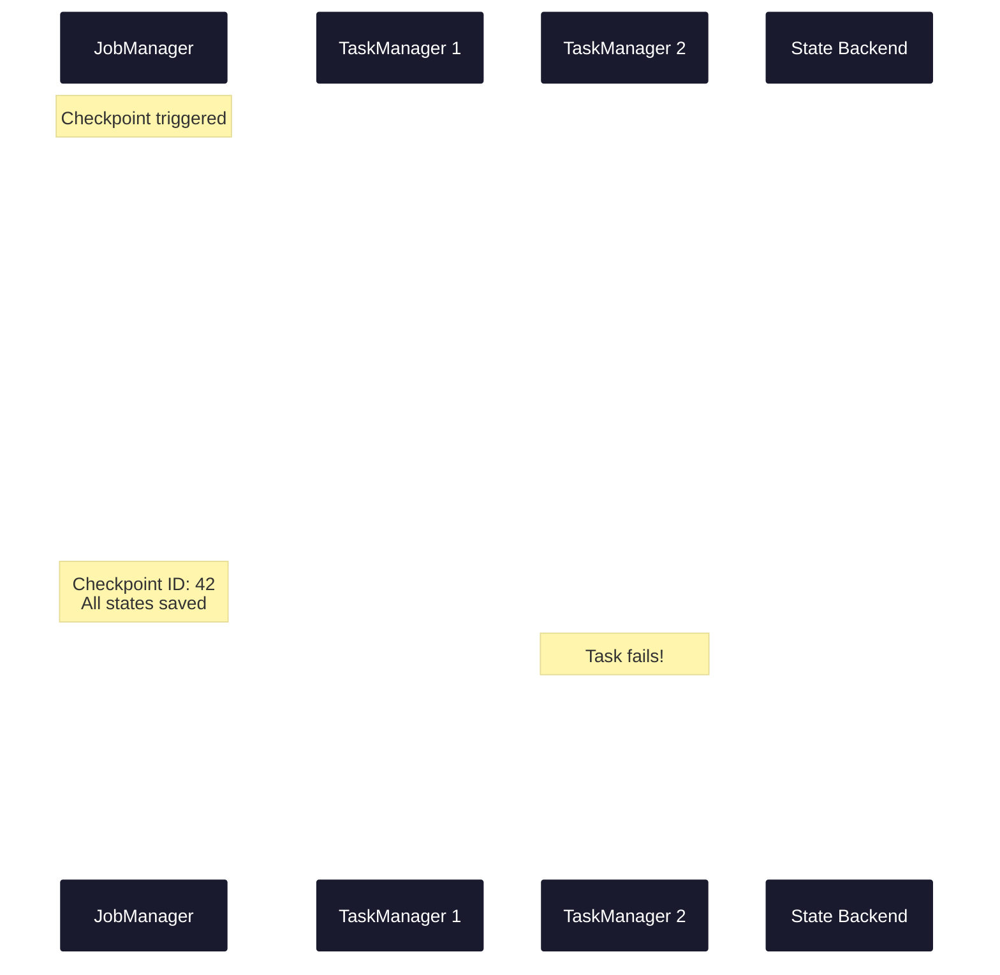

# Lab: Stream Processing Pipeline - Real-Time Analytics with Kafka & Flink

> **Prerequisite:** [Chapter 11: Stream Processing](../../part3-derived-data/11-stream-processing/README.md)

## Overview

This lab builds a **real-time fraud detection system** using Apache Kafka and Apache Flink. You'll implement windowed aggregations, complex event processing, and exactly-once semantics—experiencing the core challenges of stream processing firsthand.

**What you'll build:**
- Kafka-based event streaming infrastructure
- Flink jobs for real-time fraud pattern detection
- Windowed aggregations (tumbling, sliding, session windows)
- Exactly-once processing with checkpointing
- Late event handling with watermarks
- Real-time alerting with side outputs

**Technologies:**
- Apache Kafka 3.7 (event streaming)
- Apache Flink 1.18 (stream processing)
- Flink SQL for declarative stream processing
- Kafka Connect for CDC integration
- ksqlDB for lightweight transformations
- Go for producer/consumer applications

---

## The Philosophy: Why Stream Processing?

```mermaid
%%{init: {'theme': 'base', 'themeVariables': { 'primaryColor': '#1a1a2e', 'primaryTextColor': '#fff', 'primaryBorderColor': '#fff', 'lineColor': '#fff', 'secondaryColor': '#16213e', 'tertiaryColor': '#0f3460'}}}%%
flowchart LR
    subgraph BATCH["Batch Processing"]
        B1["Collect data"]
        B2["Process all at once"]
        B3["Hours of latency"]
    end

    subgraph STREAM["Stream Processing"]
        S1["Process as it arrives"]
        S2["Continuous output"]
        S3["Seconds of latency"]
    end

    subgraph WHY["Why Stream?"]
        W1["Fraud: React in milliseconds"]
        W2["Monitoring: Real-time alerts"]
        W3["Analytics: Live dashboards"]
    end

    BATCH --> |"Too slow for..."| WHY
    STREAM --> |"Enables..."| WHY

    style BATCH fill:#1a1a2e,stroke:#e94560,stroke-width:2px
    style STREAM fill:#16213e,stroke:#0f3460,stroke-width:2px
    style WHY fill:#0f3460,stroke:#e94560,stroke-width:2px
```



**The fundamental insight:** Batch is a special case of stream (a stream with finite bounds). But stream processing must handle challenges batch doesn't face: out-of-order events, late arrivals, and infinite input.

---

## Philosophy

> **Supporting Material**: [Chapter 11: Stream Processing](../../part3-derived-data/11-stream-processing/README.md)

1. **Streams are Unbounded Tables** — A stream is a table with no end. Every event is a row. Unlike batch, you can't wait for "all the data" because there is no "all." This fundamental shift changes everything.

2. **Event Time vs Processing Time** — When did the event happen vs when did you process it? These differ due to network delays, buffering, and retries. Getting this wrong means wrong aggregations.

3. **Exactly-Once is Achievable** — Despite what you may have heard, exactly-once processing is possible. The secret: idempotent operations + deterministic replay. Flink and Kafka together achieve this.

4. **State is the Challenge** — Stateless stream processing is trivial. Stateful processing (aggregations, joins, pattern detection) requires persisting state, recovering it on failure, and keeping it consistent with the stream.

5. **Late Events are Normal** — Events arrive out of order. Watermarks tell you "I believe no event older than X will arrive." But stragglers still come. Your system must handle them gracefully.

6. **The Log is the Truth** — Kafka's log is the single source of truth. Derived systems (Elasticsearch, Redis, your database) are caches that can be rebuilt by replaying the log.

---

## Structures & Behaviors

**Prerequisite Structures:**

| Structure | What It Is | If Unfamiliar |
|-----------|------------|---------------|
| **Event log** | Append-only sequence of immutable events | Kafka fundamentals |
| **Consumer groups** | Load-balanced event consumption | Kafka partitioning |
| **Windowing** | Grouping events by time or count | Time-based aggregation |
| **Watermarks** | Progress indicators for event time | Handling late events |

**Behaviors Given These Structures:**

| Behavior | Emerges From | Manifestation |
|----------|--------------|---------------|
| Exactly-once | Checkpointing + idempotence | No duplicates or losses |
| Scalability | Parallelism + partitioning | Add operators to handle load |
| Fault tolerance | State snapshots + replay | Recover from failures |
| Time semantics | Watermarks + triggers | Correct aggregations despite disorder |

---

## Phase 1: Kafka Infrastructure

### Philosophy

> **DDIA Reference**: [Message Brokers vs Databases](../../part3-derived-data/11-stream-processing/README.md)

1. **Kafka is a Distributed Log, Not a Queue** — Unlike traditional message queues, Kafka retains messages after consumption. This enables replay, multiple consumers, and fault tolerance.

2. **Partitions are the Unit of Parallelism** — Each partition is an independent log. More partitions = more parallelism. But too many partitions = overhead. Find the balance.

3. **Consumer Groups Enable Load Balancing** — Within a group, each partition is consumed by exactly one consumer. Add consumers to scale; remove to consolidate.

### t=0: The Mental Model

**Developer Intent:** "I need to understand Kafka's architecture before building on it."

```mermaid
%%{init: {'theme': 'base', 'themeVariables': { 'primaryColor': '#1a1a2e', 'primaryTextColor': '#fff', 'primaryBorderColor': '#fff', 'lineColor': '#fff', 'secondaryColor': '#16213e', 'tertiaryColor': '#0f3460'}}}%%
flowchart TB
    subgraph PRODUCERS["Producers"]
        P1["Payment Service"]
        P2["User Service"]
        P3["Order Service"]
    end

    subgraph KAFKA["Kafka Cluster"]
        direction TB
        subgraph TOPIC["Topic: transactions"]
            PA["Partition 0"]
            PB["Partition 1"]
            PC["Partition 2"]
        end
    end

    subgraph CONSUMERS["Consumer Group: fraud-detection"]
        C1["Consumer 1<br>→ Partition 0"]
        C2["Consumer 2<br>→ Partition 1"]
        C3["Consumer 3<br>→ Partition 2"]
    end

    P1 --> PA
    P2 --> PB
    P3 --> PC
    PA --> C1
    PB --> C2
    PC --> C3

    style KAFKA fill:#0f3460,stroke:#e94560,stroke-width:2px
    style CONSUMERS fill:#16213e,stroke:#fff,stroke-width:1px
```



**What you're thinking:** "Events are partitioned by key (e.g., user_id), so all events for a user go to the same partition. This enables stateful processing—I can aggregate per-user without coordination."

### t=1: Docker Compose Setup

**Developer Action:** Set up Kafka cluster with Flink.

```yaml
# docker-compose.yml
version: '3.8'

services:
  zookeeper:
    image: confluentinc/cp-zookeeper:7.5.0
    environment:
      ZOOKEEPER_CLIENT_PORT: 2181
    ports:
      - "2181:2181"

  kafka:
    image: confluentinc/cp-kafka:7.5.0
    depends_on:
      - zookeeper
    ports:
      - "9092:9092"
      - "9093:9093"
    environment:
      KAFKA_BROKER_ID: 1
      KAFKA_ZOOKEEPER_CONNECT: zookeeper:2181
      KAFKA_LISTENER_SECURITY_PROTOCOL_MAP: PLAINTEXT:PLAINTEXT,EXTERNAL:PLAINTEXT
      KAFKA_ADVERTISED_LISTENERS: PLAINTEXT://kafka:29092,EXTERNAL://localhost:9092
      KAFKA_OFFSETS_TOPIC_REPLICATION_FACTOR: 1
      KAFKA_TRANSACTION_STATE_LOG_MIN_ISR: 1
      KAFKA_TRANSACTION_STATE_LOG_REPLICATION_FACTOR: 1

  schema-registry:
    image: confluentinc/cp-schema-registry:7.5.0
    depends_on:
      - kafka
    ports:
      - "8081:8081"
    environment:
      SCHEMA_REGISTRY_HOST_NAME: schema-registry
      SCHEMA_REGISTRY_KAFKASTORE_BOOTSTRAP_SERVERS: kafka:29092

  flink-jobmanager:
    image: flink:1.18-scala_2.12-java11
    ports:
      - "8082:8081"
    command: jobmanager
    environment:
      - |
        FLINK_PROPERTIES=
        jobmanager.rpc.address: flink-jobmanager
        state.checkpoints.dir: file:///checkpoints
        state.savepoints.dir: file:///savepoints
    volumes:
      - flink-checkpoints:/checkpoints
      - flink-savepoints:/savepoints

  flink-taskmanager:
    image: flink:1.18-scala_2.12-java11
    depends_on:
      - flink-jobmanager
    command: taskmanager
    environment:
      - |
        FLINK_PROPERTIES=
        jobmanager.rpc.address: flink-jobmanager
        taskmanager.numberOfTaskSlots: 4
    volumes:
      - flink-checkpoints:/checkpoints

  redis:
    image: redis:7-alpine
    ports:
      - "6379:6379"

volumes:
  flink-checkpoints:
  flink-savepoints:
```

### t=2: Create Topics and Schema

**Developer Action:** Define event schemas with Avro.

```bash
# Create topics
docker-compose exec kafka kafka-topics --create \
  --bootstrap-server localhost:9092 \
  --topic transactions \
  --partitions 6 \
  --replication-factor 1

docker-compose exec kafka kafka-topics --create \
  --bootstrap-server localhost:9092 \
  --topic fraud-alerts \
  --partitions 3 \
  --replication-factor 1

docker-compose exec kafka kafka-topics --create \
  --bootstrap-server localhost:9092 \
  --topic user-profiles \
  --partitions 6 \
  --replication-factor 1 \
  --config cleanup.policy=compact
```

```json
// schemas/transaction.avsc
{
  "type": "record",
  "name": "Transaction",
  "namespace": "com.fraud.events",
  "fields": [
    {"name": "transaction_id", "type": "string"},
    {"name": "user_id", "type": "string"},
    {"name": "amount", "type": "double"},
    {"name": "currency", "type": "string"},
    {"name": "merchant_id", "type": "string"},
    {"name": "merchant_category", "type": "string"},
    {"name": "location", "type": {
      "type": "record",
      "name": "Location",
      "fields": [
        {"name": "country", "type": "string"},
        {"name": "city", "type": "string"},
        {"name": "lat", "type": "double"},
        {"name": "lon", "type": "double"}
      ]
    }},
    {"name": "timestamp", "type": "long", "logicalType": "timestamp-millis"},
    {"name": "card_present", "type": "boolean"},
    {"name": "device_id", "type": ["null", "string"], "default": null}
  ]
}
```

```json
// schemas/fraud-alert.avsc
{
  "type": "record",
  "name": "FraudAlert",
  "namespace": "com.fraud.events",
  "fields": [
    {"name": "alert_id", "type": "string"},
    {"name": "transaction_id", "type": "string"},
    {"name": "user_id", "type": "string"},
    {"name": "rule_triggered", "type": "string"},
    {"name": "risk_score", "type": "double"},
    {"name": "details", "type": "string"},
    {"name": "timestamp", "type": "long", "logicalType": "timestamp-millis"}
  ]
}
```

---

## Phase 2: Transaction Producer

### Philosophy

> **DDIA Reference**: [Event Sourcing](../../part3-derived-data/11-stream-processing/README.md)

1. **Key Selection Determines Processing** — Events with the same key go to the same partition. For user-based analytics, key by user_id. All of a user's events will be processed by the same consumer, enabling stateful per-user logic.

2. **Schema Evolution is Your Friend** — Use Avro with a schema registry. Fields can be added, types can evolve, and old consumers keep working. Schemaless JSON seems flexible until you break production.

3. **Realistic Test Data is Invaluable** — Your fraud detection system will be tested against real fraud patterns. Generate realistic data now to find edge cases before production.

### t=3: Go Producer Implementation

**Developer Intent:** "I need a realistic transaction producer that simulates normal and fraudulent patterns."

```go
// cmd/producer/main.go
package main

import (
    "context"
    "encoding/json"
    "fmt"
    "math/rand"
    "time"

    "github.com/segmentio/kafka-go"
)

type Location struct {
    Country string  `json:"country"`
    City    string  `json:"city"`
    Lat     float64 `json:"lat"`
    Lon     float64 `json:"lon"`
}

type Transaction struct {
    TransactionID    string   `json:"transaction_id"`
    UserID           string   `json:"user_id"`
    Amount           float64  `json:"amount"`
    Currency         string   `json:"currency"`
    MerchantID       string   `json:"merchant_id"`
    MerchantCategory string   `json:"merchant_category"`
    Location         Location `json:"location"`
    Timestamp        int64    `json:"timestamp"`
    CardPresent      bool     `json:"card_present"`
    DeviceID         *string  `json:"device_id,omitempty"`
}

var (
    categories = []string{"grocery", "gas", "restaurant", "online", "atm", "travel"}
    cities     = map[string]Location{
        "NYC":    {"US", "New York", 40.7128, -74.0060},
        "LA":     {"US", "Los Angeles", 34.0522, -118.2437},
        "London": {"UK", "London", 51.5074, -0.1278},
        "Tokyo":  {"JP", "Tokyo", 35.6762, 139.6503},
    }
)

type TransactionGenerator struct {
    userProfiles map[string]*UserProfile
    rng          *rand.Rand
}

type UserProfile struct {
    UserID        string
    HomeCity      string
    TypicalAmount float64
    LastLocation  Location
    LastTimestamp int64
}

func NewTransactionGenerator(numUsers int) *TransactionGenerator {
    gen := &TransactionGenerator{
        userProfiles: make(map[string]*UserProfile),
        rng:          rand.New(rand.NewSource(time.Now().UnixNano())),
    }

    cityNames := []string{"NYC", "LA", "London", "Tokyo"}
    for i := 0; i < numUsers; i++ {
        userID := fmt.Sprintf("user-%04d", i)
        homeCity := cityNames[gen.rng.Intn(len(cityNames))]
        gen.userProfiles[userID] = &UserProfile{
            UserID:        userID,
            HomeCity:      homeCity,
            TypicalAmount: 50 + gen.rng.Float64()*200,
            LastLocation:  cities[homeCity],
            LastTimestamp: time.Now().UnixMilli(),
        }
    }

    return gen
}

func (g *TransactionGenerator) GenerateNormal(userID string) Transaction {
    profile := g.userProfiles[userID]
    now := time.Now().UnixMilli()

    // Normal: stay near home, typical amounts
    amount := profile.TypicalAmount * (0.5 + g.rng.Float64())
    location := cities[profile.HomeCity]

    // Small random variation in location
    location.Lat += (g.rng.Float64() - 0.5) * 0.1
    location.Lon += (g.rng.Float64() - 0.5) * 0.1

    profile.LastLocation = location
    profile.LastTimestamp = now

    return Transaction{
        TransactionID:    fmt.Sprintf("txn-%d-%s", now, userID),
        UserID:           userID,
        Amount:           amount,
        Currency:         "USD",
        MerchantID:       fmt.Sprintf("merchant-%d", g.rng.Intn(1000)),
        MerchantCategory: categories[g.rng.Intn(len(categories))],
        Location:         location,
        Timestamp:        now,
        CardPresent:      g.rng.Float64() > 0.3,
    }
}

func (g *TransactionGenerator) GenerateFraudulent(userID string, fraudType string) Transaction {
    profile := g.userProfiles[userID]
    now := time.Now().UnixMilli()

    tx := g.GenerateNormal(userID)
    tx.Timestamp = now

    switch fraudType {
    case "velocity":
        // Many transactions in quick succession
        tx.TransactionID = fmt.Sprintf("txn-velocity-%d-%s", now, userID)

    case "geo_impossible":
        // Transaction from impossible location (too far too fast)
        farCities := []string{"NYC", "LA", "London", "Tokyo"}
        for _, city := range farCities {
            if city != profile.HomeCity {
                tx.Location = cities[city]
                break
            }
        }

    case "high_amount":
        // Unusually high amount
        tx.Amount = profile.TypicalAmount * (10 + g.rng.Float64()*20)

    case "unusual_category":
        // Category user never uses
        tx.MerchantCategory = "casino"
    }

    return tx
}

func main() {
    writer := kafka.NewWriter(kafka.WriterConfig{
        Brokers:  []string{"localhost:9092"},
        Topic:    "transactions",
        Balancer: &kafka.Hash{}, // Partition by key (user_id)
    })
    defer writer.Close()

    gen := NewTransactionGenerator(100)
    users := make([]string, 0, 100)
    for userID := range gen.userProfiles {
        users = append(users, userID)
    }

    ticker := time.NewTicker(100 * time.Millisecond)
    fraudTicker := time.NewTicker(5 * time.Second)

    ctx := context.Background()
    txCount := 0

    for {
        select {
        case <-ticker.C:
            // Generate normal transaction
            userID := users[rand.Intn(len(users))]
            tx := gen.GenerateNormal(userID)
            sendTransaction(ctx, writer, tx)
            txCount++

        case <-fraudTicker.C:
            // Inject fraudulent patterns
            userID := users[rand.Intn(len(users))]
            fraudTypes := []string{"velocity", "geo_impossible", "high_amount"}
            fraudType := fraudTypes[rand.Intn(len(fraudTypes))]

            // For velocity attack, send multiple transactions rapidly
            if fraudType == "velocity" {
                for i := 0; i < 10; i++ {
                    tx := gen.GenerateFraudulent(userID, fraudType)
                    sendTransaction(ctx, writer, tx)
                }
            } else {
                tx := gen.GenerateFraudulent(userID, fraudType)
                sendTransaction(ctx, writer, tx)
            }

            fmt.Printf("Injected %s fraud for %s\n", fraudType, userID)
        }

        if txCount%100 == 0 {
            fmt.Printf("Sent %d transactions\n", txCount)
        }
    }
}

func sendTransaction(ctx context.Context, writer *kafka.Writer, tx Transaction) error {
    value, _ := json.Marshal(tx)

    return writer.WriteMessages(ctx, kafka.Message{
        Key:   []byte(tx.UserID), // Partition by user for stateful processing
        Value: value,
    })
}
```

**What you're thinking:** "By keying on user_id, all transactions for a user go to the same partition. This is crucial—Flink can maintain per-user state without cross-partition coordination."

---

## Phase 3: Flink Fraud Detection

### Philosophy

> **DDIA Reference**: [Stream Joins and State](../../part3-derived-data/11-stream-processing/README.md)

1. **Keyed State is the Enabler** — Each key (user_id) has independent state. Flink partitions by key, so all events for a user hit the same operator instance. This enables per-user pattern detection without coordination.

2. **Compose Simple Rules into Complex Detection** — A single rule (velocity check) is easy. Combining rules (velocity + geo-impossible + amount anomaly) into a weighted score is powerful. Build composable pieces.

3. **Checkpointing is Your Safety Net** — Flink periodically snapshots state to durable storage. On failure, it restores state and replays from Kafka. This is how exactly-once happens.

### t=4: Flink Job Structure

**Developer Intent:** "I'll build multiple fraud detection rules as separate Flink operators, then combine them."

```mermaid
%%{init: {'theme': 'base', 'themeVariables': { 'primaryColor': '#1a1a2e', 'primaryTextColor': '#fff', 'primaryBorderColor': '#fff', 'lineColor': '#fff', 'secondaryColor': '#16213e', 'tertiaryColor': '#0f3460'}}}%%
flowchart TB
    subgraph INPUT["Kafka Source"]
        K["transactions topic"]
    end

    subgraph FLINK["Flink Processing"]
        direction TB
        subgraph PARSE["Parse & Validate"]
            P["Deserialize JSON"]
        end

        subgraph RULES["Fraud Rules (Parallel)"]
            R1["Velocity Check<br>(10+ txn/min)"]
            R2["Geo-Impossible<br>(1000km in 1hr)"]
            R3["Amount Anomaly<br>(5x typical)"]
            R4["New Device<br>+ High Amount"]
        end

        subgraph COMBINE["Score Combination"]
            C["Weighted Risk Score"]
        end
    end

    subgraph OUTPUT["Outputs"]
        A["fraud-alerts topic"]
        M["Metrics"]
        S["Side Output:<br>Suspicious"]
    end

    K --> P
    P --> R1 & R2 & R3 & R4
    R1 & R2 & R3 & R4 --> C
    C --> A & M & S

    style FLINK fill:#0f3460,stroke:#e94560,stroke-width:2px
    style RULES fill:#16213e,stroke:#fff,stroke-width:1px
```



### t=5: Flink Job Implementation

**Developer Action:** Implement the fraud detection pipeline in Java/Scala.

```java
// src/main/java/com/fraud/FraudDetectionJob.java
package com.fraud;

import org.apache.flink.api.common.eventtime.WatermarkStrategy;
import org.apache.flink.api.common.state.ValueState;
import org.apache.flink.api.common.state.ValueStateDescriptor;
import org.apache.flink.api.common.state.MapState;
import org.apache.flink.api.common.state.MapStateDescriptor;
import org.apache.flink.configuration.Configuration;
import org.apache.flink.streaming.api.datastream.DataStream;
import org.apache.flink.streaming.api.datastream.SingleOutputStreamOperator;
import org.apache.flink.streaming.api.environment.StreamExecutionEnvironment;
import org.apache.flink.streaming.api.functions.KeyedProcessFunction;
import org.apache.flink.streaming.api.windowing.assigners.SlidingEventTimeWindows;
import org.apache.flink.streaming.api.windowing.time.Time;
import org.apache.flink.streaming.connectors.kafka.FlinkKafkaConsumer;
import org.apache.flink.streaming.connectors.kafka.FlinkKafkaProducer;
import org.apache.flink.util.Collector;
import org.apache.flink.util.OutputTag;

import java.time.Duration;
import java.util.Properties;

public class FraudDetectionJob {

    // Side output for suspicious (but not confirmed) transactions
    private static final OutputTag<Transaction> SUSPICIOUS_TAG =
        new OutputTag<Transaction>("suspicious") {};

    public static void main(String[] args) throws Exception {
        StreamExecutionEnvironment env = StreamExecutionEnvironment.getExecutionEnvironment();

        // Enable exactly-once checkpointing
        env.enableCheckpointing(60000); // checkpoint every 60 seconds
        env.getCheckpointConfig().setMinPauseBetweenCheckpoints(30000);

        // Kafka consumer configuration
        Properties kafkaProps = new Properties();
        kafkaProps.setProperty("bootstrap.servers", "kafka:29092");
        kafkaProps.setProperty("group.id", "fraud-detection");

        // Source: transactions from Kafka
        FlinkKafkaConsumer<Transaction> consumer = new FlinkKafkaConsumer<>(
            "transactions",
            new TransactionDeserializer(),
            kafkaProps
        );

        // Assign watermarks based on event time
        DataStream<Transaction> transactions = env
            .addSource(consumer)
            .assignTimestampsAndWatermarks(
                WatermarkStrategy.<Transaction>forBoundedOutOfOrderness(Duration.ofSeconds(5))
                    .withTimestampAssigner((tx, ts) -> tx.getTimestamp())
            );

        // Key by user for stateful processing
        DataStream<Transaction> keyedStream = transactions.keyBy(Transaction::getUserId);

        // Rule 1: Velocity check (sliding window)
        SingleOutputStreamOperator<FraudAlert> velocityAlerts = keyedStream
            .window(SlidingEventTimeWindows.of(Time.minutes(1), Time.seconds(10)))
            .process(new VelocityCheckFunction());

        // Rule 2: Geo-impossible travel
        SingleOutputStreamOperator<FraudAlert> geoAlerts = keyedStream
            .process(new GeoImpossibleFunction());

        // Rule 3: Amount anomaly
        SingleOutputStreamOperator<FraudAlert> amountAlerts = keyedStream
            .process(new AmountAnomalyFunction());

        // Combine alerts and output
        DataStream<FraudAlert> allAlerts = velocityAlerts
            .union(geoAlerts)
            .union(amountAlerts);

        // Sink to Kafka
        FlinkKafkaProducer<FraudAlert> alertProducer = new FlinkKafkaProducer<>(
            "fraud-alerts",
            new FraudAlertSerializer(),
            kafkaProps,
            FlinkKafkaProducer.Semantic.EXACTLY_ONCE
        );

        allAlerts.addSink(alertProducer);

        // Also output suspicious transactions to side output
        geoAlerts.getSideOutput(SUSPICIOUS_TAG)
            .addSink(new SuspiciousTransactionSink());

        env.execute("Fraud Detection Pipeline");
    }
}
```

### t=6: Velocity Check Implementation

**Developer Action:** Implement the velocity fraud detection rule.

```java
// src/main/java/com/fraud/rules/VelocityCheckFunction.java
package com.fraud.rules;

import org.apache.flink.streaming.api.functions.windowing.ProcessWindowFunction;
import org.apache.flink.streaming.api.windowing.windows.TimeWindow;
import org.apache.flink.util.Collector;

public class VelocityCheckFunction
    extends ProcessWindowFunction<Transaction, FraudAlert, String, TimeWindow> {

    private static final int VELOCITY_THRESHOLD = 10; // transactions per minute

    @Override
    public void process(
            String userId,
            Context context,
            Iterable<Transaction> transactions,
            Collector<FraudAlert> out) {

        int count = 0;
        Transaction lastTx = null;
        double totalAmount = 0;

        for (Transaction tx : transactions) {
            count++;
            lastTx = tx;
            totalAmount += tx.getAmount();
        }

        if (count >= VELOCITY_THRESHOLD) {
            FraudAlert alert = new FraudAlert(
                java.util.UUID.randomUUID().toString(),
                lastTx.getTransactionId(),
                userId,
                "VELOCITY_ATTACK",
                calculateRiskScore(count, totalAmount),
                String.format("%d transactions in 1 minute, total $%.2f", count, totalAmount),
                System.currentTimeMillis()
            );
            out.collect(alert);
        }
    }

    private double calculateRiskScore(int count, double totalAmount) {
        // Risk increases with both count and amount
        double countScore = Math.min(1.0, count / 20.0);
        double amountScore = Math.min(1.0, totalAmount / 10000.0);
        return (countScore * 0.6) + (amountScore * 0.4);
    }
}
```

### t=7: Geo-Impossible Travel Detection

**Developer Action:** Implement impossible travel detection with stateful processing.

```java
// src/main/java/com/fraud/rules/GeoImpossibleFunction.java
package com.fraud.rules;

import org.apache.flink.api.common.state.ValueState;
import org.apache.flink.api.common.state.ValueStateDescriptor;
import org.apache.flink.configuration.Configuration;
import org.apache.flink.streaming.api.functions.KeyedProcessFunction;
import org.apache.flink.util.Collector;

public class GeoImpossibleFunction
    extends KeyedProcessFunction<String, Transaction, FraudAlert> {

    // Max speed a human can travel (km/h) - accounts for planes
    private static final double MAX_TRAVEL_SPEED_KMH = 1000;

    private transient ValueState<Transaction> lastTransactionState;

    @Override
    public void open(Configuration parameters) {
        ValueStateDescriptor<Transaction> descriptor = new ValueStateDescriptor<>(
            "lastTransaction",
            Transaction.class
        );
        lastTransactionState = getRuntimeContext().getState(descriptor);
    }

    @Override
    public void processElement(
            Transaction tx,
            Context ctx,
            Collector<FraudAlert> out) throws Exception {

        Transaction lastTx = lastTransactionState.value();

        if (lastTx != null) {
            double distance = calculateDistance(
                lastTx.getLocation().getLat(),
                lastTx.getLocation().getLon(),
                tx.getLocation().getLat(),
                tx.getLocation().getLon()
            );

            long timeDiffMs = tx.getTimestamp() - lastTx.getTimestamp();
            double timeDiffHours = timeDiffMs / (1000.0 * 60 * 60);

            if (timeDiffHours > 0) {
                double requiredSpeed = distance / timeDiffHours;

                if (requiredSpeed > MAX_TRAVEL_SPEED_KMH) {
                    FraudAlert alert = new FraudAlert(
                        java.util.UUID.randomUUID().toString(),
                        tx.getTransactionId(),
                        tx.getUserId(),
                        "GEO_IMPOSSIBLE",
                        calculateRiskScore(requiredSpeed, distance),
                        String.format(
                            "Impossible travel: %.0f km in %.1f hours (%.0f km/h required). " +
                            "From %s to %s",
                            distance, timeDiffHours, requiredSpeed,
                            lastTx.getLocation().getCity(),
                            tx.getLocation().getCity()
                        ),
                        System.currentTimeMillis()
                    );
                    out.collect(alert);
                }
            }
        }

        // Update state
        lastTransactionState.update(tx);
    }

    // Haversine formula for distance calculation
    private double calculateDistance(double lat1, double lon1, double lat2, double lon2) {
        final double R = 6371; // Earth's radius in km

        double dLat = Math.toRadians(lat2 - lat1);
        double dLon = Math.toRadians(lon2 - lon1);

        double a = Math.sin(dLat / 2) * Math.sin(dLat / 2) +
                   Math.cos(Math.toRadians(lat1)) * Math.cos(Math.toRadians(lat2)) *
                   Math.sin(dLon / 2) * Math.sin(dLon / 2);

        double c = 2 * Math.atan2(Math.sqrt(a), Math.sqrt(1 - a));

        return R * c;
    }

    private double calculateRiskScore(double speed, double distance) {
        // Higher risk for more extreme cases
        double speedRatio = speed / MAX_TRAVEL_SPEED_KMH;
        return Math.min(1.0, speedRatio * 0.5 + (distance / 10000) * 0.5);
    }
}
```

**What you're thinking:** "The state is keyed by user_id, so each user has their own 'last transaction' state. Flink handles the state management, checkpointing, and recovery automatically."

---

## Phase 4: Windowing Deep Dive

### Philosophy

> **DDIA Reference**: [Reasoning About Time](../../part3-derived-data/11-stream-processing/README.md)

1. **Windows Make Infinite Streams Finite** — You can't aggregate infinite data. Windows bound the data you're working with. Choose the window type based on your use case.

2. **Tumbling vs Sliding vs Session** — Tumbling (non-overlapping) for simple aggregations. Sliding (overlapping) for moving averages. Session (gap-based) for user activity bursts.

3. **Event Time is Truth, Processing Time is Convenience** — Use event time for correctness. Processing time windows are simpler but give wrong results when events are delayed.

### t=8: Window Types Comparison

**Developer Intent:** "I need to understand when to use each window type."

```mermaid
%%{init: {'theme': 'base', 'themeVariables': { 'primaryColor': '#1a1a2e', 'primaryTextColor': '#fff', 'primaryBorderColor': '#fff', 'lineColor': '#fff', 'secondaryColor': '#16213e', 'tertiaryColor': '#0f3460'}}}%%
flowchart TB
    subgraph TUMBLING["Tumbling Window<br>(Non-overlapping)"]
        T1["[0-5min]"]
        T2["[5-10min]"]
        T3["[10-15min]"]
    end

    subgraph SLIDING["Sliding Window<br>(Overlapping)"]
        S1["[0-5min]"]
        S2["[2-7min]"]
        S3["[4-9min]"]
    end

    subgraph SESSION["Session Window<br>(Gap-based)"]
        SE1["Activity burst 1"]
        SE2["gap"]
        SE3["Activity burst 2"]
    end

    subgraph USES["Use Cases"]
        U1["Tumbling: Hourly reports"]
        U2["Sliding: Moving averages"]
        U3["Session: User sessions"]
    end

    TUMBLING --> U1
    SLIDING --> U2
    SESSION --> U3

    style TUMBLING fill:#1a1a2e,stroke:#e94560,stroke-width:2px
    style SLIDING fill:#16213e,stroke:#0f3460,stroke-width:2px
    style SESSION fill:#0f3460,stroke:#e94560,stroke-width:2px
```



### t=9: Session Window for Behavioral Analysis

**Developer Action:** Implement session-based fraud detection.

```java
// src/main/java/com/fraud/rules/SessionAnomalyFunction.java
package com.fraud.rules;

import org.apache.flink.streaming.api.windowing.assigners.EventTimeSessionWindows;
import org.apache.flink.streaming.api.windowing.time.Time;
import org.apache.flink.streaming.api.functions.windowing.ProcessWindowFunction;
import org.apache.flink.streaming.api.windowing.windows.TimeWindow;
import org.apache.flink.util.Collector;

import java.util.*;

public class SessionAnomalyFunction
    extends ProcessWindowFunction<Transaction, FraudAlert, String, TimeWindow> {

    // Session gap: 30 minutes of inactivity ends a session
    public static final Time SESSION_GAP = Time.minutes(30);

    @Override
    public void process(
            String userId,
            Context context,
            Iterable<Transaction> transactions,
            Collector<FraudAlert> out) {

        List<Transaction> txList = new ArrayList<>();
        transactions.forEach(txList::add);

        // Analyze session behavior
        SessionStats stats = analyzeSession(txList);

        // Check for anomalies
        List<String> anomalies = new ArrayList<>();

        // Unusual session length
        if (stats.durationMinutes > 120) {
            anomalies.add("Session longer than 2 hours");
        }

        // Too many different merchants
        if (stats.uniqueMerchants > 20) {
            anomalies.add("20+ different merchants in session");
        }

        // Geographic spread within session
        if (stats.maxDistanceKm > 100) {
            anomalies.add("Transactions 100+ km apart in session");
        }

        // Card-not-present after card-present in same session
        if (stats.hasCardPresentThenNotPresent) {
            anomalies.add("Card-not-present after in-person transaction");
        }

        if (!anomalies.isEmpty()) {
            FraudAlert alert = new FraudAlert(
                UUID.randomUUID().toString(),
                txList.get(txList.size() - 1).getTransactionId(),
                userId,
                "SESSION_ANOMALY",
                calculateSessionRiskScore(stats, anomalies.size()),
                String.join("; ", anomalies),
                System.currentTimeMillis()
            );
            out.collect(alert);
        }
    }

    private SessionStats analyzeSession(List<Transaction> transactions) {
        SessionStats stats = new SessionStats();

        if (transactions.isEmpty()) return stats;

        // Sort by timestamp
        transactions.sort(Comparator.comparingLong(Transaction::getTimestamp));

        stats.transactionCount = transactions.size();
        stats.durationMinutes = (transactions.get(transactions.size() - 1).getTimestamp() -
                                 transactions.get(0).getTimestamp()) / (1000 * 60);

        Set<String> merchants = new HashSet<>();
        boolean sawCardPresent = false;
        double maxDistance = 0;

        Transaction prev = null;
        for (Transaction tx : transactions) {
            merchants.add(tx.getMerchantId());

            if (tx.isCardPresent()) {
                sawCardPresent = true;
            } else if (sawCardPresent) {
                stats.hasCardPresentThenNotPresent = true;
            }

            if (prev != null) {
                double distance = calculateDistance(
                    prev.getLocation().getLat(), prev.getLocation().getLon(),
                    tx.getLocation().getLat(), tx.getLocation().getLon()
                );
                maxDistance = Math.max(maxDistance, distance);
            }
            prev = tx;
        }

        stats.uniqueMerchants = merchants.size();
        stats.maxDistanceKm = maxDistance;

        return stats;
    }

    private double calculateSessionRiskScore(SessionStats stats, int anomalyCount) {
        return Math.min(1.0, 0.2 * anomalyCount + 0.1 * (stats.transactionCount / 50.0));
    }

    // Haversine formula (same as GeoImpossibleFunction)
    private double calculateDistance(double lat1, double lon1, double lat2, double lon2) {
        // ... implementation
        return 0;
    }

    private static class SessionStats {
        int transactionCount;
        long durationMinutes;
        int uniqueMerchants;
        double maxDistanceKm;
        boolean hasCardPresentThenNotPresent;
    }
}
```

---

## Phase 5: Exactly-Once Semantics

### Philosophy

> **DDIA Reference**: [Fault Tolerance](../../part3-derived-data/11-stream-processing/README.md)

1. **Exactly-Once is At-Least-Once Plus Idempotence** — The processor will retry on failure (at-least-once). If your operations are idempotent, retries produce the same result as a single execution. That's exactly-once semantics.

2. **Checkpoints are Consistent Cuts** — A checkpoint captures the state of all operators at the same logical point in the stream. On recovery, you restore to this consistent snapshot and replay from known Kafka offsets.

3. **The Two Generals Problem Applies to Sinks** — You can't atomically commit both your internal state and an external side effect. Idempotent sinks or transactional sinks are the only solutions.

### t=10: Understanding Checkpointing

**Developer Intent:** "I need to guarantee exactly-once processing even when failures occur."



### t=11: Idempotent Sinks

**Developer Action:** Implement idempotent alert publishing.

```java
// src/main/java/com/fraud/sink/IdempotentAlertSink.java
package com.fraud.sink;

import org.apache.flink.streaming.api.functions.sink.RichSinkFunction;
import org.apache.flink.configuration.Configuration;
import redis.clients.jedis.Jedis;
import redis.clients.jedis.JedisPool;

public class IdempotentAlertSink extends RichSinkFunction<FraudAlert> {

    private transient JedisPool jedisPool;
    private transient Jedis jedis;

    // Deduplication window: 1 hour
    private static final int DEDUP_TTL_SECONDS = 3600;

    @Override
    public void open(Configuration parameters) {
        jedisPool = new JedisPool("redis", 6379);
        jedis = jedisPool.getResource();
    }

    @Override
    public void invoke(FraudAlert alert, Context context) throws Exception {
        String dedupeKey = "alert:" + alert.getAlertId();

        // Check if we've already processed this alert
        if (jedis.exists(dedupeKey)) {
            // Already processed - skip (idempotent)
            return;
        }

        // Mark as processed BEFORE taking action (at-least-once to exactly-once)
        jedis.setex(dedupeKey, DEDUP_TTL_SECONDS, "1");

        // Now safe to take action
        sendAlert(alert);
        updateMetrics(alert);
    }

    private void sendAlert(FraudAlert alert) {
        // Send to downstream systems (webhook, PagerDuty, etc.)
        // This is idempotent because we checked dedupeKey first
    }

    private void updateMetrics(FraudAlert alert) {
        // Increment counters, update dashboards
        jedis.hincrBy("fraud:stats", alert.getRuleTriggered(), 1);
        jedis.hincrByFloat("fraud:total_risk", "score", alert.getRiskScore());
    }

    @Override
    public void close() {
        if (jedis != null) jedis.close();
        if (jedisPool != null) jedisPool.close();
    }
}
```

**What you're thinking:** "The deduplication key must be set BEFORE taking the action. If we crash after the action but before setting the key, we'll retry on recovery—but the action is idempotent."

---

## Phase 6: Late Event Handling

### Philosophy

> **DDIA Reference**: [Reasoning About Time](../../part3-derived-data/11-stream-processing/README.md)

1. **Watermarks are Heuristics, Not Guarantees** — A watermark says "I don't expect events older than this timestamp." But networks delay, clocks skew, and systems partition. Late events are inevitable.

2. **Allowed Lateness is Your Safety Buffer** — The gap between "watermark has passed" and "window is truly closed" lets you handle the 99th percentile of late arrivals without reprocessing the entire stream.

3. **Side Outputs are for the Long Tail** — Events that arrive after the allowed lateness window can't update their windows—but they shouldn't disappear. Route them to a side output for separate processing or auditing.

4. **Late Doesn't Mean Wrong** — A transaction that arrives 2 minutes late still happened. Your system must decide: reprocess the window, store for batch correction, or accept the approximation.

### t=12: Watermarks and Allowed Lateness

**Developer Intent:** "Real events arrive out of order. I need to handle late arrivals correctly."

```java
// src/main/java/com/fraud/FraudDetectionJobWithLateEvents.java
package com.fraud;

import org.apache.flink.streaming.api.windowing.time.Time;
import org.apache.flink.streaming.api.datastream.SingleOutputStreamOperator;
import org.apache.flink.util.OutputTag;

public class FraudDetectionJobWithLateEvents {

    // Side output for late events
    private static final OutputTag<Transaction> LATE_EVENTS =
        new OutputTag<Transaction>("late-events") {};

    public void configureWindowWithLateness(DataStream<Transaction> stream) {

        SingleOutputStreamOperator<FraudAlert> result = stream
            .keyBy(Transaction::getUserId)
            .window(TumblingEventTimeWindows.of(Time.minutes(5)))

            // Allow events up to 1 minute late
            .allowedLateness(Time.minutes(1))

            // Send very late events to side output instead of dropping
            .sideOutputLateData(LATE_EVENTS)

            .process(new VelocityCheckFunction());

        // Handle late events separately
        DataStream<Transaction> lateEvents = result.getSideOutput(LATE_EVENTS);
        lateEvents.addSink(new LateEventHandler());
    }
}
```



```mermaid
%%{init: {'theme': 'base', 'themeVariables': { 'primaryColor': '#1a1a2e', 'primaryTextColor': '#fff', 'primaryBorderColor': '#fff', 'lineColor': '#fff', 'secondaryColor': '#16213e', 'tertiaryColor': '#0f3460'}}}%%
flowchart TB
    subgraph TIMELINE["Event Timeline"]
        direction LR
        E1["Event A<br>t=10:00:00"]
        E2["Event B<br>t=10:00:05"]
        E3["Watermark<br>t=10:00:03"]
        E4["Event C<br>t=10:00:02<br>(LATE!)"]
    end

    subgraph HANDLING["Late Event Handling"]
        direction TB
        H1["Within allowed<br>lateness?"]
        H2["YES: Update<br>window result"]
        H3["NO: Side output<br>or drop"]
    end

    TIMELINE --> HANDLING

    style TIMELINE fill:#1a1a2e,stroke:#e94560,stroke-width:2px
    style HANDLING fill:#0f3460,stroke:#fff,stroke-width:1px
```

**What you're thinking:** "The watermark is my assertion that no events with timestamp < watermark will arrive. But real systems have outliers, so `allowedLateness` gives me a safety buffer."

---

## Running the Lab

### Quick Start

```bash
# Start infrastructure
docker-compose up -d

# Wait for services to be ready
sleep 30

# Create topics
./scripts/create-topics.sh

# Start the transaction producer
go run cmd/producer/main.go

# Submit Flink job (in separate terminal)
docker-compose exec flink-jobmanager flink run \
  /opt/flink/jobs/fraud-detection.jar

# Watch alerts
docker-compose exec kafka kafka-console-consumer \
  --bootstrap-server localhost:9092 \
  --topic fraud-alerts \
  --from-beginning

# View Flink dashboard
open http://localhost:8082
```

### Monitoring Queries

```sql
-- ksqlDB for ad-hoc analysis

-- Create stream from transactions
CREATE STREAM transactions (
    transaction_id VARCHAR KEY,
    user_id VARCHAR,
    amount DOUBLE,
    currency VARCHAR,
    merchant_category VARCHAR,
    timestamp BIGINT
) WITH (
    KAFKA_TOPIC='transactions',
    VALUE_FORMAT='JSON',
    TIMESTAMP='timestamp'
);

-- Real-time transaction counts per category
SELECT
    merchant_category,
    COUNT(*) as tx_count,
    SUM(amount) as total_amount
FROM transactions
WINDOW TUMBLING (SIZE 1 MINUTE)
GROUP BY merchant_category
EMIT CHANGES;

-- Users with most transactions
SELECT
    user_id,
    COUNT(*) as tx_count
FROM transactions
WINDOW TUMBLING (SIZE 5 MINUTES)
GROUP BY user_id
HAVING COUNT(*) > 5
EMIT CHANGES;
```

---

## Key Takeaways

| Concept | Implementation | Why It Matters |
|---------|----------------|----------------|
| **Event time vs processing time** | Watermarks + timestamps | Correct aggregations |
| **Stateful processing** | KeyedState per user | Detect patterns over time |
| **Exactly-once** | Checkpointing + idempotent sinks | No duplicates or losses |
| **Late events** | allowedLateness + side outputs | Handle real-world disorder |
| **Windowing** | Tumbling/Sliding/Session | Time-based aggregations |

## Connection to DDIA Concepts

This lab demonstrates:
- **Chapter 10:** Batch vs stream duality (same logic, different bounds)
- **Chapter 11:** Event sourcing, stream joins, fault tolerance
- **Chapter 12:** Log-based integration, derived data, exactly-once semantics

---

## Further Challenges

1. **Add stream-table join** with user profile enrichment from compacted topic
2. **Implement event sourcing** for fraud case management
3. **Build real-time dashboard** with Flink SQL + Superset
4. **Add ML-based scoring** with TensorFlow Serving integration
5. **Implement backpressure handling** for traffic spikes

---

*"The log is the heart of a stream processing system. It's an append-only sequence of records that provides durability, ordering, and replayability—the same properties that make databases reliable."*
