# Infrastructure Deep-Dives

Comprehensive guides for mastering **Kafka** and **Kubernetes**—the foundational infrastructure technologies that underpin modern distributed systems.

---

## Philosophy

These deep-dives are designed with a specific learning philosophy:

1. **Mental Models Before Mechanics** — Understand *why* before *how*. Each technology has core abstractions that, once internalized, make everything else click.

2. **Temporal Narratives** — Learning happens through doing. Each guide walks through developer journeys (t=0, t=1, t=2...) showing the evolution of understanding.

3. **Production Reality** — Lab exercises aren't toys. They demonstrate real failure modes, recovery patterns, and operational concerns.

4. **Cross-Pollination** — Kafka and Kubernetes intersect constantly in production. These guides reference each other and connect to [DDIA concepts](../data-intensive-apps/) and [DevOps practices](../multi-agent-cognition/p1/DEVOPS_IMPLEMENTATION_GUIDE.md).

---

## Technology Dependency Graph

```mermaid
%%{init: {'theme': 'base', 'themeVariables': { 'primaryColor': '#1a1a2e', 'primaryTextColor': '#fff', 'primaryBorderColor': '#fff', 'lineColor': '#fff', 'secondaryColor': '#16213e', 'tertiaryColor': '#0f3460'}}}%%
flowchart TB
    subgraph FOUNDATION["Foundation"]
        LINUX["Linux Fundamentals"]
        DOCKER["Container Basics"]
        NET["Networking"]
    end

    subgraph KAFKA["Kafka Deep-Dive"]
        K0["Phase 0: Mental Model"]
        K1["Phase 1: Cluster Fundamentals"]
        K2["Phase 2: Event Sourcing"]
        K3["Phase 3: Stream Processing"]
        K4["Phase 4: Microservices Patterns"]
        K5["Phase 5: Production Ops"]
    end

    subgraph K8S["Kubernetes Deep-Dive"]
        KS0["Phase 0: Mental Model"]
        KS1["Phase 1: Core Concepts"]
        KS2["Phase 2: Stateful Workloads"]
        KS3["Phase 3: Networking"]
        KS4["Phase 4: Observability"]
        KS5["Phase 5: Production Patterns"]
    end

    subgraph INTEGRATION["Integration"]
        KAFKA_ON_K8S["Kafka on Kubernetes"]
        FLINK_ON_K8S["Flink on Kubernetes"]
    end

    LINUX --> K0
    LINUX --> KS0
    DOCKER --> K1
    DOCKER --> KS1
    NET --> K1
    NET --> KS3

    K0 --> K1 --> K2 --> K3 --> K4 --> K5
    KS0 --> KS1 --> KS2 --> KS3 --> KS4 --> KS5

    K1 --> KAFKA_ON_K8S
    KS2 --> KAFKA_ON_K8S
    K3 --> FLINK_ON_K8S
    KS2 --> FLINK_ON_K8S

    style FOUNDATION fill:#0f3460,stroke:#e94560,stroke-width:2px
    style KAFKA fill:#16213e,stroke:#e94560,stroke-width:2px
    style K8S fill:#1a1a2e,stroke:#e94560,stroke-width:2px
    style INTEGRATION fill:#0f3460,stroke:#fff,stroke-width:1px
```



---

## Learning Paths

### Path A: Kafka First (Recommended for Backend Engineers)

If you're building event-driven systems or microservices:

1. **[Kafka Deep-Dive](./kafka-deep-dive/README.md)** — Master Kafka fundamentals, then event sourcing and stream processing
2. **[Kubernetes Deep-Dive](./kubernetes-deep-dive/README.md)** — Learn to deploy and operate Kafka on Kubernetes

### Path B: Kubernetes First (Recommended for Platform Engineers)

If you're building infrastructure or platform teams:

1. **[Kubernetes Deep-Dive](./kubernetes-deep-dive/README.md)** — Master orchestration, then stateful workloads
2. **[Kafka Deep-Dive](./kafka-deep-dive/README.md)** — Deploy Kafka as a stateful workload, understand its operational needs

### Path C: Parallel (For Experienced Engineers)

If you have some familiarity with both:

- Work through Phase 0-1 of both guides to solidify mental models
- Jump to specific phases as needed for your current project

---

## Cross-References

These guides integrate with:

| Resource | Relationship |
|----------|--------------|
| [DEVOPS_IMPLEMENTATION_GUIDE](../multi-agent-cognition/p1/DEVOPS_IMPLEMENTATION_GUIDE.md) | Kafka extends Phase 4 (Messaging), K8s extends Phase 2 (Core) |
| [DDIA: Stream Processing](../data-intensive-apps/part3-derived-data/11-stream-processing/README.md) | Theoretical foundation for Kafka Phases 2-4 |
| [DDIA: Replication](../data-intensive-apps/part2-distributed-data/05-replication/README.md) | Explains Kafka's replication model |
| [DDIA: Partitioning](../data-intensive-apps/part2-distributed-data/06-partitioning/README.md) | Explains Kafka's partitioning strategy |
| [DDIA: Distributed Failures](../data-intensive-apps/part2-distributed-data/08-distributed-systems-trouble/README.md) | Context for production hardening in both guides |

---

## Deep-Dives

### [Kafka Deep-Dive](./kafka-deep-dive/README.md)

From append-only logs to production event-driven architectures.

| Phase | Focus | Key Concepts |
|-------|-------|--------------|
| 0 | Mental Model | Log abstraction, partitions, offsets, consumer groups |
| 1 | Cluster Fundamentals | Brokers, replication, ISR, controller |
| 2 | Event Sourcing & CQRS | Events as facts, projections, schema evolution |
| 3 | Stream Processing | Kafka Streams, ksqlDB, Flink integration |
| 4 | Microservices Patterns | Sagas, outbox pattern, CDC |
| 5 | Production Operations | Monitoring, scaling, disaster recovery |

### [Kubernetes Deep-Dive](./kubernetes-deep-dive/README.md)

From container orchestration to production-grade platform engineering.

| Phase | Focus | Key Concepts |
|-------|-------|--------------|
| 0 | Mental Model | Reconciliation loops, desired state, API objects |
| 1 | Core Concepts | Pods, Deployments, Services, ConfigMaps |
| 2 | Stateful Workloads | StatefulSets, PV/PVC, Operators |
| 3 | Networking | Service types, Ingress, NetworkPolicies |
| 4 | Observability | Prometheus, Grafana, Loki, Tempo |
| 5 | Production Patterns | HPA, PDB, resource management |

---

## Prerequisites

Before starting either deep-dive:

- [ ] Linux command line proficiency
- [ ] Docker basics (images, containers, volumes, networks)
- [ ] Basic networking (TCP/IP, DNS, HTTP)
- [ ] A development machine with 16GB+ RAM for local clusters

---

## Quick Start

```bash
# Clone and navigate
cd docs/projects/infrastructure

# For Kafka: Start with mental model
open kafka-deep-dive/README.md

# For Kubernetes: Start with mental model
open kubernetes-deep-dive/README.md
```
