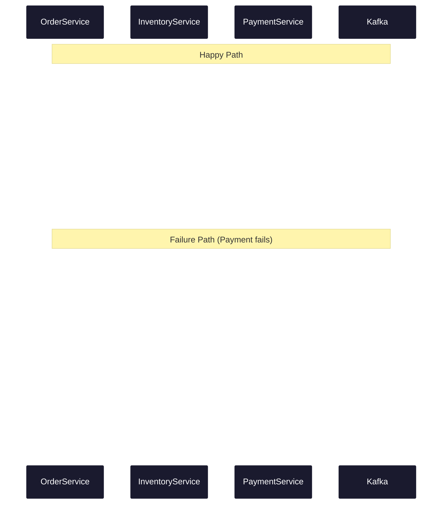

# Kafka Deep-Dive: From Fundamentals to Production Patterns

A temporal narrative through mastering Apache Kafka—from understanding the log abstraction to building production event-driven architectures.

> **Supporting Material**: Integrates with [DEVOPS_IMPLEMENTATION_GUIDE Phase 4](../../multi-agent-cognition/p1/DEVOPS_IMPLEMENTATION_GUIDE.md#phase-4-messaging--event-streaming) and [DDIA Chapter 11: Stream Processing](../../data-intensive-apps/part3-derived-data/11-stream-processing/README.md)

---

## Table of Contents

1. [Philosophy](#philosophy)
2. [Architecture Overview](#architecture-overview)
3. [Phase 0: Mental Model Foundation](#phase-0-mental-model-foundation)
4. [Phase 1: Cluster Fundamentals](#phase-1-cluster-fundamentals)
5. [Phase 2: Event Sourcing & CQRS](#phase-2-event-sourcing--cqrs)
6. [Phase 3: Stream Processing Pipeline](#phase-3-stream-processing-pipeline)
7. [Phase 4: Microservices Messaging Patterns](#phase-4-microservices-messaging-patterns)
8. [Phase 5: Production Operations](#phase-5-production-operations)
9. [Troubleshooting Playbook](#troubleshooting-playbook)

---

## Philosophy

> **DDIA Reference**: [Chapter 11: Stream Processing](../../data-intensive-apps/part3-derived-data/11-stream-processing/README.md)

1. **The Log is the Fundamental Abstraction** — Kafka is, at its core, a distributed append-only log. Unlike traditional message queues where consumption deletes messages, Kafka retains messages based on time or size. This simple difference enables replay, multiple consumers, and fault tolerance through reprocessing. Every other Kafka concept derives from this.

2. **Partitions are the Unit of Parallelism** — A topic is split into partitions, and each partition is an independent log. Want more throughput? Add partitions. Each partition can be consumed by exactly one consumer in a consumer group. The number of partitions is your parallelism ceiling—choose carefully, because you can add but never remove partitions.

3. **Offsets are Your Bookmark** — Each message in a partition has a sequential offset. Consumers track their position by storing offsets. This simple mechanism—"I've read up to offset 42"—enables at-least-once, at-most-once, and exactly-once delivery semantics depending on when you commit.

4. **Consumer Groups Enable Load Balancing** — Within a consumer group, partitions are distributed among consumers. Add a consumer, and partitions rebalance. Remove one, and others take over. This is automatic horizontal scaling—but rebalancing has costs (paused consumption, potential duplicates).

5. **Producers Own Partitioning** — The producer decides which partition receives each message, typically by hashing the message key. This decision determines ordering guarantees: messages with the same key go to the same partition and are processed in order.

6. **Replication Provides Durability** — Each partition is replicated across multiple brokers. The leader handles all reads and writes; followers replicate. If the leader dies, a follower promotes. The In-Sync Replicas (ISR) set tracks which replicas are caught up.

7. **Exactly-Once is Achievable** — Through idempotent producers (deduplication via sequence numbers) and transactional writes (atomic multi-partition writes), Kafka achieves exactly-once semantics. The cost: slightly higher latency and operational complexity.

8. **Kafka is a Database** — With compacted topics, Kafka becomes a distributed key-value store. With Kafka Streams, it becomes a stream processing engine with state. Don't think of Kafka as just a message queue—it's a storage and compute platform.

---

## Architecture Overview

```mermaid
%%{init: {'theme': 'base', 'themeVariables': { 'primaryColor': '#1a1a2e', 'primaryTextColor': '#fff', 'primaryBorderColor': '#fff', 'lineColor': '#fff', 'secondaryColor': '#16213e', 'tertiaryColor': '#0f3460'}}}%%
flowchart TB
    subgraph PRODUCERS["Producers"]
        P1["Producer 1"]
        P2["Producer 2"]
    end

    subgraph CLUSTER["Kafka Cluster"]
        subgraph B1["Broker 1"]
            T1P0L["Topic1-P0<br>(Leader)"]
            T1P1F["Topic1-P1<br>(Follower)"]
        end
        subgraph B2["Broker 2"]
            T1P0F["Topic1-P0<br>(Follower)"]
            T1P1L["Topic1-P1<br>(Leader)"]
        end
        subgraph B3["Broker 3"]
            T1P0F2["Topic1-P0<br>(Follower)"]
            T1P1F2["Topic1-P1<br>(Follower)"]
        end
        CTRL["Controller<br>(KRaft)"]
    end

    subgraph CONSUMERS["Consumer Group"]
        C1["Consumer 1<br>→ P0"]
        C2["Consumer 2<br>→ P1"]
    end

    P1 --> T1P0L
    P2 --> T1P1L
    T1P0L --> C1
    T1P1L --> C2

    T1P0L -.->|replicate| T1P0F
    T1P0L -.->|replicate| T1P0F2
    T1P1L -.->|replicate| T1P1F
    T1P1L -.->|replicate| T1P1F2

    style CLUSTER fill:#16213e,stroke:#e94560,stroke-width:2px
    style PRODUCERS fill:#0f3460,stroke:#fff,stroke-width:1px
    style CONSUMERS fill:#0f3460,stroke:#fff,stroke-width:1px
```



---

## Phase 0: Mental Model Foundation

### Objective

Internalize Kafka's core abstractions before touching any code. Understand *why* the log abstraction is powerful, *how* partitioning enables scale, and *what* offsets mean for delivery guarantees.

### Philosophy

> **DDIA Reference**: [Log-based Message Brokers](../../data-intensive-apps/part3-derived-data/11-stream-processing/README.md)

1. **Append-Only is the Insight** — Traditional databases overwrite data in place. Kafka only appends. This seemingly simple constraint enables: immutable history, simple replication (just copy the log), and consumer flexibility (each reads at their own pace).

2. **The Log is Ordered** — Within a partition, messages have a total order. Across partitions, there's no order guarantee. Design your keys such that events requiring ordering share a key.

3. **Retention is Not Deletion** — Messages aren't deleted when consumed. They're retained until the retention policy (time or size) expires them. This means you can add new consumers that start from the beginning.

4. **Consumers are Decoupled** — Producers don't know about consumers. Consumers don't affect each other. This decoupling is what makes Kafka a durable message bus rather than a request-response system.

### Structures & Behaviors

**Prerequisite Structures**

| Structure | What It Is | If Unfamiliar |
|-----------|------------|---------------|
| Append-only log | Data structure where writes only add to the end | Think of a write-ahead log or transaction log |
| Distributed systems | Multiple machines coordinating over network | Understand basic RPC, failure modes |
| Consensus protocols | Agreement algorithms (Raft, ZAB) | Read about leader election |
| Binary serialization | Encoding data for wire transfer (Avro, Protobuf) | [DDIA Chapter 4](../../data-intensive-apps/part1-foundations/04-encoding-evolution/README.md) |

**Behaviors Given These Structures**

| Behavior | Emerges From | Manifestation |
|----------|--------------|---------------|
| Durability | Replication + fsync to disk | Messages survive broker failures |
| Horizontal scaling | Partitioning + consumer groups | Add brokers/consumers for throughput |
| Replayability | Offset tracking + retention | Reprocess from any historical point |
| Ordering guarantees | Partition-level sequential writes | Same-key messages processed in order |
| Decoupled producers/consumers | Log as intermediary | Producers/consumers scale independently |

### The Log Mental Model

```mermaid
%%{init: {'theme': 'base', 'themeVariables': { 'primaryColor': '#1a1a2e', 'primaryTextColor': '#fff', 'primaryBorderColor': '#fff', 'lineColor': '#fff', 'secondaryColor': '#16213e', 'tertiaryColor': '#0f3460'}}}%%
flowchart LR
    subgraph PARTITION["Partition 0"]
        direction LR
        M0["Offset 0<br>msg-a"]
        M1["Offset 1<br>msg-b"]
        M2["Offset 2<br>msg-c"]
        M3["Offset 3<br>msg-d"]
        M4["Offset 4<br>msg-e"]
        WRITE["← Writes<br>append here"]
    end

    subgraph CONSUMERS["Consumer Positions"]
        C1["Consumer A<br>offset: 2"]
        C2["Consumer B<br>offset: 4"]
        C3["Consumer C<br>offset: 0"]
    end

    M0 --> M1 --> M2 --> M3 --> M4 --> WRITE
    C1 -.-> M2
    C2 -.-> M4
    C3 -.-> M0

    style PARTITION fill:#16213e,stroke:#e94560,stroke-width:2px
    style CONSUMERS fill:#0f3460,stroke:#fff,stroke-width:1px
```



### t=0: Developer Intent

**Developer Intent:** "I want to understand what makes Kafka different from RabbitMQ or Redis Pub/Sub."

*What you're thinking:* "I've used message queues before. Messages go in, messages come out. What's special about Kafka?"

### t=1: The Key Difference

**Mental Model Shift:**

```
Traditional Queue:          Kafka Log:
┌──────────────────┐        ┌──────────────────────────────┐
│ msg → [queue] → │        │ [0][1][2][3][4][5] → append  │
│     (deleted)    │        │  ↑     ↑        ↑            │
└──────────────────┘        │ C1    C2       C3            │
                            │ (all reading independently)   │
                            └──────────────────────────────┘
```

*What you're thinking:* "So in Kafka, consumption doesn't delete the message. Multiple consumers can read the same message. And I can replay from the past."

### t=2: Partitions and Keys

**Developer Realization:** "If I have one log, I can only write as fast as one disk. Partitions let me parallelize."

```
Topic: orders (3 partitions)

Key: user-123    → hash(user-123) % 3 = Partition 0
Key: user-456    → hash(user-456) % 3 = Partition 1
Key: user-123    → hash(user-123) % 3 = Partition 0  (same as before!)

Result: All events for user-123 land in Partition 0, in order.
```

*What you're thinking:* "The key determines the partition. Same key = same partition = ordering preserved. I need to choose my keys wisely."

### t=3: Consumer Groups

**Developer Action:** Understand how consumers scale.

```
Consumer Group: order-processors

Partition 0 → Consumer A
Partition 1 → Consumer B
Partition 2 → Consumer C

Add Consumer D:
Partition 0 → Consumer A
Partition 1 → Consumer B
Partition 2 → Consumer C
Consumer D → idle (no partitions left!)

Lesson: You can't have more consumers than partitions.
```

*What you're thinking:* "Consumer count is capped by partition count. If I want 10 consumers, I need at least 10 partitions. But more partitions = more overhead. Trade-off."

### t=4: Offset Semantics

**Developer Intent:** "How do I guarantee I process every message exactly once?"

```
Three strategies:

1. At-most-once:
   Commit offset BEFORE processing.
   If crash during processing → message lost.

2. At-least-once:
   Commit offset AFTER processing.
   If crash after processing but before commit → message reprocessed.

3. Exactly-once:
   Use transactions OR make processing idempotent.
   Idempotent: processing same message twice = same result.
```

*What you're thinking:* "Exactly-once is hard. The safest approach is at-least-once with idempotent handlers. I'll design my consumers to handle duplicates."

### Checkpoint 0

- [ ] You can explain the log abstraction without mentioning "message queue"
- [ ] You understand why the same key always routes to the same partition
- [ ] You can describe the trade-off between partition count and parallelism
- [ ] You know the difference between at-least-once and exactly-once
- [ ] You can explain why Kafka enables replay but RabbitMQ doesn't

---

## Phase 1: Cluster Fundamentals

### Objective

Build and operate a multi-broker Kafka cluster. Understand replication, ISR (In-Sync Replicas), leader election, and the controller's role.

### Philosophy

> **DDIA Reference**: [Replication](../../data-intensive-apps/part2-distributed-data/05-replication/README.md)

1. **Leaders Handle Traffic, Followers Replicate** — Every partition has one leader and N-1 followers. All client reads and writes go to the leader. Followers exist only for failover—they pull from the leader and stay in sync.

2. **ISR is Your Safety Metric** — The In-Sync Replicas set contains the leader plus all followers that are "caught up" (within `replica.lag.time.max.ms`). Messages are only considered committed when written to all ISR members. A shrinking ISR signals trouble.

3. **The Controller Manages Metadata** — One broker is the controller (elected via KRaft consensus or ZooKeeper). It handles partition leader election, broker registration, and topic creation. Controller failover is automatic.

4. **acks=all is Durable, acks=1 is Fast** — `acks=all` waits for all ISR replicas to acknowledge. `acks=1` waits only for the leader. `acks=0` doesn't wait at all. Durability vs. latency trade-off.

5. **min.insync.replicas Prevents Data Loss** — If ISR shrinks below this threshold, writes are rejected. Setting `min.insync.replicas=2` with `replication.factor=3` means you can lose one broker without losing data or availability.

### Structures & Behaviors

**Prerequisite Structures**

| Structure | What It Is | If Unfamiliar |
|-----------|------------|---------------|
| KRaft (Kafka Raft) | Kafka's built-in consensus for metadata | Raft protocol basics |
| Replication | Copying data across nodes for fault tolerance | Leader-follower replication |
| Network partitions | When nodes can't communicate | CAP theorem implications |

**Behaviors Given These Structures**

| Behavior | Emerges From | Manifestation |
|----------|--------------|---------------|
| Automatic failover | Controller + ISR tracking | New leader elected in seconds |
| Data durability | Replication + acks=all | Survives broker failures |
| Consistent reads | Leader-only reads | No stale data from followers |
| Under-replication detection | ISR monitoring | Alerts when replicas fall behind |

### t=0: Starting a Local Cluster

**Developer Intent:** "I want to run a 3-broker cluster locally to understand replication."

```yaml
# docker-compose.yaml
version: '3.8'
services:
  kafka-1:
    image: confluentinc/cp-kafka:7.5.0
    hostname: kafka-1
    container_name: kafka-1
    ports:
      - "9092:9092"
    environment:
      KAFKA_NODE_ID: 1
      KAFKA_LISTENER_SECURITY_PROTOCOL_MAP: CONTROLLER:PLAINTEXT,PLAINTEXT:PLAINTEXT,PLAINTEXT_HOST:PLAINTEXT
      KAFKA_ADVERTISED_LISTENERS: PLAINTEXT://kafka-1:29092,PLAINTEXT_HOST://localhost:9092
      KAFKA_LISTENERS: PLAINTEXT://kafka-1:29092,CONTROLLER://kafka-1:29093,PLAINTEXT_HOST://0.0.0.0:9092
      KAFKA_CONTROLLER_LISTENER_NAMES: CONTROLLER
      KAFKA_CONTROLLER_QUORUM_VOTERS: 1@kafka-1:29093,2@kafka-2:29093,3@kafka-3:29093
      KAFKA_PROCESS_ROLES: broker,controller
      KAFKA_OFFSETS_TOPIC_REPLICATION_FACTOR: 3
      KAFKA_TRANSACTION_STATE_LOG_REPLICATION_FACTOR: 3
      KAFKA_TRANSACTION_STATE_LOG_MIN_ISR: 2
      CLUSTER_ID: 'MkU3OEVBNTcwNTJENDM2Qk'
    volumes:
      - kafka-1-data:/var/lib/kafka/data

  kafka-2:
    image: confluentinc/cp-kafka:7.5.0
    hostname: kafka-2
    container_name: kafka-2
    ports:
      - "9093:9093"
    environment:
      KAFKA_NODE_ID: 2
      KAFKA_LISTENER_SECURITY_PROTOCOL_MAP: CONTROLLER:PLAINTEXT,PLAINTEXT:PLAINTEXT,PLAINTEXT_HOST:PLAINTEXT
      KAFKA_ADVERTISED_LISTENERS: PLAINTEXT://kafka-2:29092,PLAINTEXT_HOST://localhost:9093
      KAFKA_LISTENERS: PLAINTEXT://kafka-2:29092,CONTROLLER://kafka-2:29093,PLAINTEXT_HOST://0.0.0.0:9093
      KAFKA_CONTROLLER_LISTENER_NAMES: CONTROLLER
      KAFKA_CONTROLLER_QUORUM_VOTERS: 1@kafka-1:29093,2@kafka-2:29093,3@kafka-3:29093
      KAFKA_PROCESS_ROLES: broker,controller
      CLUSTER_ID: 'MkU3OEVBNTcwNTJENDM2Qk'
    volumes:
      - kafka-2-data:/var/lib/kafka/data

  kafka-3:
    image: confluentinc/cp-kafka:7.5.0
    hostname: kafka-3
    container_name: kafka-3
    ports:
      - "9094:9094"
    environment:
      KAFKA_NODE_ID: 3
      KAFKA_LISTENER_SECURITY_PROTOCOL_MAP: CONTROLLER:PLAINTEXT,PLAINTEXT:PLAINTEXT,PLAINTEXT_HOST:PLAINTEXT
      KAFKA_ADVERTISED_LISTENERS: PLAINTEXT://kafka-3:29092,PLAINTEXT_HOST://localhost:9094
      KAFKA_LISTENERS: PLAINTEXT://kafka-3:29092,CONTROLLER://kafka-3:29093,PLAINTEXT_HOST://0.0.0.0:9094
      KAFKA_CONTROLLER_LISTENER_NAMES: CONTROLLER
      KAFKA_CONTROLLER_QUORUM_VOTERS: 1@kafka-1:29093,2@kafka-2:29093,3@kafka-3:29093
      KAFKA_PROCESS_ROLES: broker,controller
      CLUSTER_ID: 'MkU3OEVBNTcwNTJENDM2Qk'
    volumes:
      - kafka-3-data:/var/lib/kafka/data

volumes:
  kafka-1-data:
  kafka-2-data:
  kafka-3-data:
```

```bash
docker-compose up -d
```

*What you're thinking:* "Three brokers, each running both broker and controller roles (KRaft mode). No ZooKeeper needed. The `CONTROLLER_QUORUM_VOTERS` tells each node about the others."

### t=1: Creating a Replicated Topic

**Developer Action:** Create a topic with replication.

```bash
docker exec kafka-1 kafka-topics --create \
  --bootstrap-server localhost:29092 \
  --topic orders \
  --partitions 6 \
  --replication-factor 3 \
  --config min.insync.replicas=2
```

```bash
docker exec kafka-1 kafka-topics --describe \
  --bootstrap-server localhost:29092 \
  --topic orders
```

```
Topic: orders   TopicId: abc123   PartitionCount: 6   ReplicationFactor: 3
  Partition: 0  Leader: 1  Replicas: 1,2,3  Isr: 1,2,3
  Partition: 1  Leader: 2  Replicas: 2,3,1  Isr: 2,3,1
  Partition: 2  Leader: 3  Replicas: 3,1,2  Isr: 3,1,2
  Partition: 3  Leader: 1  Replicas: 1,3,2  Isr: 1,3,2
  Partition: 4  Leader: 2  Replicas: 2,1,3  Isr: 2,1,3
  Partition: 5  Leader: 3  Replicas: 3,2,1  Isr: 3,2,1
```

*What you're thinking:* "Leaders are distributed across brokers (load balancing). Replicas list all brokers with copies. ISR = Replicas means everything is in sync. Good."

### t=2: The Broker Failure Narrative

**Developer Intent:** "What happens when a broker dies?"

```bash
# Kill broker 2
docker stop kafka-2
```

```bash
docker exec kafka-1 kafka-topics --describe \
  --bootstrap-server localhost:29092 \
  --topic orders
```

```
Topic: orders   TopicId: abc123   PartitionCount: 6   ReplicationFactor: 3
  Partition: 0  Leader: 1  Replicas: 1,2,3  Isr: 1,3      ← Broker 2 gone from ISR
  Partition: 1  Leader: 3  Replicas: 2,3,1  Isr: 3,1      ← New leader: 3 (was 2)
  Partition: 2  Leader: 3  Replicas: 3,1,2  Isr: 3,1
  Partition: 3  Leader: 1  Replicas: 1,3,2  Isr: 1,3
  Partition: 4  Leader: 1  Replicas: 2,1,3  Isr: 1,3      ← New leader: 1 (was 2)
  Partition: 5  Leader: 3  Replicas: 3,2,1  Isr: 3,1
```

*What you're thinking:* "Broker 2 is gone. Partitions it led (1 and 4) elected new leaders from the remaining ISR. ISR now shows only 2 brokers. Writes still work because min.insync.replicas=2 and we have 2 in ISR."

### t=3: Under-Replicated Partitions

**Developer Action:** Check cluster health.

```bash
docker exec kafka-1 kafka-topics --describe \
  --bootstrap-server localhost:29092 \
  --under-replicated-partitions
```

```
Topic: orders   Partition: 0  Leader: 1  Replicas: 1,2,3  Isr: 1,3
Topic: orders   Partition: 1  Leader: 3  Replicas: 2,3,1  Isr: 3,1
...
```

*What you're thinking:* "Under-replicated means Replicas ≠ ISR. This is a warning sign—we've lost redundancy. If another broker fails, we might lose data."

### t=4: Recovery

**Developer Action:** Bring broker 2 back.

```bash
docker start kafka-2
sleep 10
docker exec kafka-1 kafka-topics --describe \
  --bootstrap-server localhost:29092 \
  --topic orders
```

```
Topic: orders   TopicId: abc123   PartitionCount: 6   ReplicationFactor: 3
  Partition: 0  Leader: 1  Replicas: 1,2,3  Isr: 1,3,2    ← Back in sync!
  Partition: 1  Leader: 3  Replicas: 2,3,1  Isr: 3,1,2
  ...
```

*What you're thinking:* "Broker 2 rejoined the cluster and caught up (entered ISR). It didn't immediately become leader—that requires preferred leader election. The cluster self-healed."

### t=5: Consumer Group Rebalancing

**Developer Intent:** "How do consumers handle broker failures?"

```go
// cmd/consumer/main.go
package main

import (
    "context"
    "fmt"
    "os"
    "os/signal"

    "github.com/confluentinc/confluent-kafka-go/v2/kafka"
)

func main() {
    consumer, err := kafka.NewConsumer(&kafka.ConfigMap{
        "bootstrap.servers":  "localhost:9092,localhost:9093,localhost:9094",
        "group.id":           "order-processors",
        "auto.offset.reset":  "earliest",
        "enable.auto.commit": false,
    })
    if err != nil {
        panic(err)
    }
    defer consumer.Close()

    consumer.SubscribeTopics([]string{"orders"}, func(c *kafka.Consumer, e kafka.Event) error {
        switch ev := e.(type) {
        case kafka.AssignedPartitions:
            fmt.Printf("Assigned: %v\n", ev.Partitions)
            c.Assign(ev.Partitions)
        case kafka.RevokedPartitions:
            fmt.Printf("Revoked: %v\n", ev.Partitions)
            c.Unassign()
        }
        return nil
    })

    ctx, cancel := signal.NotifyContext(context.Background(), os.Interrupt)
    defer cancel()

    for {
        select {
        case <-ctx.Done():
            return
        default:
            msg, err := consumer.ReadMessage(100)
            if err != nil {
                continue
            }
            fmt.Printf("Partition %d, Offset %d: %s\n",
                msg.TopicPartition.Partition,
                msg.TopicPartition.Offset,
                string(msg.Value))
            consumer.CommitMessage(msg)
        }
    }
}
```

*What you're thinking:* "When partitions are assigned or revoked, my callback fires. I can use this to pause processing, commit pending work, and prepare for the new assignment."

### Checkpoint 1

- [ ] You have a 3-broker KRaft cluster running locally
- [ ] You can create a topic with replication-factor=3
- [ ] You understand what ISR means and how to check it
- [ ] You've simulated a broker failure and observed leader election
- [ ] You know the difference between acks=1 and acks=all

---

## Phase 2: Event Sourcing & CQRS

### Objective

Implement event-driven architecture using Kafka as the event store. Understand events vs. commands, projections, and schema evolution.

### Philosophy

> **DDIA Reference**: [Event Sourcing](../../data-intensive-apps/part3-derived-data/11-stream-processing/README.md)

1. **Events are Facts, State is Derived** — An event says "OrderPlaced at 2:30 PM with items X, Y, Z." Current state ("order is shipped") is computed by replaying events. Facts are immutable; interpretations can change.

2. **Commands vs Events** — A command is a request: "PlaceOrder." It might fail (insufficient inventory). An event is a fact: "OrderPlaced." It already happened. Never name events as commands.

3. **CQRS Separates Read and Write** — Command Query Responsibility Segregation: optimize writes for appending events, optimize reads with materialized views. Different models for different concerns.

4. **Projections are Derived Views** — A projection consumes events and builds a read-optimized model (e.g., "current order status"). If the projection corrupts, replay events to rebuild it.

5. **Schema Evolution is Essential** — Events are immutable, but your understanding evolves. Avro + Schema Registry enables backward-compatible changes. Old consumers read new events; new consumers read old events.

6. **Snapshots Accelerate Recovery** — Replaying millions of events is slow. Periodically snapshot aggregate state. On recovery, load snapshot + replay events after it.

### Structures & Behaviors

**Prerequisite Structures**

| Structure | What It Is | If Unfamiliar |
|-----------|------------|---------------|
| Event sourcing | Storing state changes as events | Martin Fowler's Event Sourcing article |
| CQRS | Separate read/write models | Microsoft CQRS pattern |
| Schema Registry | Central schema storage for Avro/Protobuf | Confluent Schema Registry docs |
| Aggregates | DDD concept: consistency boundary | Domain-Driven Design basics |

**Behaviors Given These Structures**

| Behavior | Emerges From | Manifestation |
|----------|--------------|---------------|
| Complete audit trail | Append-only event log | Every state change recorded |
| Temporal queries | Event timestamps | "What was order status at 3pm?" |
| Projection flexibility | Events as source of truth | Build new views without schema migration |
| Schema compatibility | Registry + Avro | Old and new code coexist |

### t=0: Defining Events

**Developer Intent:** "I want to model an order lifecycle as events."

```protobuf
// proto/orders/v1/events.proto
syntax = "proto3";
package orders.v1;

import "google/protobuf/timestamp.proto";

message OrderPlaced {
    string order_id = 1;
    string customer_id = 2;
    repeated OrderItem items = 3;
    int64 total_cents = 4;
    google.protobuf.Timestamp placed_at = 5;
}

message OrderItem {
    string product_id = 1;
    int32 quantity = 2;
    int64 unit_price_cents = 3;
}

message InventoryReserved {
    string order_id = 1;
    repeated ReservationItem reservations = 2;
    google.protobuf.Timestamp reserved_at = 3;
}

message ReservationItem {
    string product_id = 1;
    int32 quantity = 2;
}

message PaymentProcessed {
    string order_id = 1;
    string payment_id = 2;
    int64 amount_cents = 3;
    google.protobuf.Timestamp processed_at = 4;
}

message OrderShipped {
    string order_id = 1;
    string tracking_number = 2;
    string carrier = 3;
    google.protobuf.Timestamp shipped_at = 4;
}

message OrderCancelled {
    string order_id = 1;
    string reason = 2;
    google.protobuf.Timestamp cancelled_at = 3;
}
```

*What you're thinking:* "Each event is a fact about what happened. OrderPlaced has all data needed to understand the placement. Events are named in past tense because they already happened."

### t=1: Publishing Events

**Developer Action:** Create an event publisher service.

```go
// internal/events/publisher.go
package events

import (
    "context"
    "encoding/json"
    "time"

    "github.com/confluentinc/confluent-kafka-go/v2/kafka"
    "github.com/google/uuid"
)

type Publisher struct {
    producer *kafka.Producer
    topic    string
}

func NewPublisher(brokers, topic string) (*Publisher, error) {
    producer, err := kafka.NewProducer(&kafka.ConfigMap{
        "bootstrap.servers":   brokers,
        "acks":                "all",
        "enable.idempotence":  true,
        "retries":             3,
        "retry.backoff.ms":    100,
    })
    if err != nil {
        return nil, err
    }

    return &Publisher{producer: producer, topic: topic}, nil
}

type Event struct {
    ID        string    `json:"id"`
    Type      string    `json:"type"`
    Timestamp time.Time `json:"timestamp"`
    Data      any       `json:"data"`
}

func (p *Publisher) Publish(ctx context.Context, aggregateID string, eventType string, data any) error {
    event := Event{
        ID:        uuid.New().String(),
        Type:      eventType,
        Timestamp: time.Now().UTC(),
        Data:      data,
    }

    value, err := json.Marshal(event)
    if err != nil {
        return err
    }

    deliveryChan := make(chan kafka.Event, 1)
    err = p.producer.Produce(&kafka.Message{
        TopicPartition: kafka.TopicPartition{
            Topic:     &p.topic,
            Partition: kafka.PartitionAny,
        },
        Key:   []byte(aggregateID), // Order ID as key for ordering
        Value: value,
    }, deliveryChan)

    if err != nil {
        return err
    }

    // Wait for delivery confirmation
    e := <-deliveryChan
    m := e.(*kafka.Message)
    if m.TopicPartition.Error != nil {
        return m.TopicPartition.Error
    }

    return nil
}
```

*What you're thinking:* "The aggregate ID (order ID) is the message key. All events for an order go to the same partition, maintaining order. `enable.idempotence=true` handles retries without duplicates."

### t=2: Building a Projection

**Developer Intent:** "I want a read model that shows current order status."

```go
// internal/projections/order_status.go
package projections

import (
    "context"
    "encoding/json"
    "sync"

    "github.com/confluentinc/confluent-kafka-go/v2/kafka"
)

type OrderStatus struct {
    OrderID     string `json:"order_id"`
    CustomerID  string `json:"customer_id"`
    Status      string `json:"status"`
    TotalCents  int64  `json:"total_cents"`
    PlacedAt    string `json:"placed_at"`
    UpdatedAt   string `json:"updated_at"`
}

type OrderStatusProjection struct {
    mu       sync.RWMutex
    orders   map[string]*OrderStatus
    consumer *kafka.Consumer
}

func NewOrderStatusProjection(brokers, groupID string) (*OrderStatusProjection, error) {
    consumer, err := kafka.NewConsumer(&kafka.ConfigMap{
        "bootstrap.servers":  brokers,
        "group.id":           groupID,
        "auto.offset.reset":  "earliest", // Start from beginning to rebuild
        "enable.auto.commit": false,
    })
    if err != nil {
        return nil, err
    }

    return &OrderStatusProjection{
        orders:   make(map[string]*OrderStatus),
        consumer: consumer,
    }, nil
}

func (p *OrderStatusProjection) Run(ctx context.Context) error {
    p.consumer.SubscribeTopics([]string{"order-events"}, nil)

    for {
        select {
        case <-ctx.Done():
            return nil
        default:
            msg, err := p.consumer.ReadMessage(100)
            if err != nil {
                continue
            }

            if err := p.handleEvent(msg); err != nil {
                // Log error, potentially send to dead letter queue
                continue
            }

            p.consumer.CommitMessage(msg)
        }
    }
}

func (p *OrderStatusProjection) handleEvent(msg *kafka.Message) error {
    var event Event
    if err := json.Unmarshal(msg.Value, &event); err != nil {
        return err
    }

    p.mu.Lock()
    defer p.mu.Unlock()

    orderID := string(msg.Key)

    switch event.Type {
    case "OrderPlaced":
        var data OrderPlacedData
        if err := mapToStruct(event.Data, &data); err != nil {
            return err
        }
        p.orders[orderID] = &OrderStatus{
            OrderID:    orderID,
            CustomerID: data.CustomerID,
            Status:     "placed",
            TotalCents: data.TotalCents,
            PlacedAt:   event.Timestamp.Format(time.RFC3339),
            UpdatedAt:  event.Timestamp.Format(time.RFC3339),
        }

    case "InventoryReserved":
        if order, ok := p.orders[orderID]; ok {
            order.Status = "inventory_reserved"
            order.UpdatedAt = event.Timestamp.Format(time.RFC3339)
        }

    case "PaymentProcessed":
        if order, ok := p.orders[orderID]; ok {
            order.Status = "paid"
            order.UpdatedAt = event.Timestamp.Format(time.RFC3339)
        }

    case "OrderShipped":
        if order, ok := p.orders[orderID]; ok {
            order.Status = "shipped"
            order.UpdatedAt = event.Timestamp.Format(time.RFC3339)
        }

    case "OrderCancelled":
        if order, ok := p.orders[orderID]; ok {
            order.Status = "cancelled"
            order.UpdatedAt = event.Timestamp.Format(time.RFC3339)
        }
    }

    return nil
}

func (p *OrderStatusProjection) GetOrder(orderID string) (*OrderStatus, bool) {
    p.mu.RLock()
    defer p.mu.RUnlock()
    order, ok := p.orders[orderID]
    return order, ok
}
```

*What you're thinking:* "The projection consumes events and maintains an in-memory map. In production, this would write to a database. The key insight: if this crashes, I can rebuild by replaying from offset 0."

### t=3: Schema Evolution

**Developer Intent:** "I need to add a field to OrderPlaced without breaking consumers."

```json
// schema-registry: Register new version

// Version 1 (original)
{
  "type": "record",
  "name": "OrderPlaced",
  "fields": [
    {"name": "order_id", "type": "string"},
    {"name": "customer_id", "type": "string"},
    {"name": "total_cents", "type": "long"}
  ]
}

// Version 2 (add shipping_address with default)
{
  "type": "record",
  "name": "OrderPlaced",
  "fields": [
    {"name": "order_id", "type": "string"},
    {"name": "customer_id", "type": "string"},
    {"name": "total_cents", "type": "long"},
    {"name": "shipping_address", "type": ["null", "string"], "default": null}
  ]
}
```

*What you're thinking:* "New field with a default = backward compatible. Old consumers ignore it. New consumers get it. This is why Avro with Schema Registry matters—it enforces compatibility rules."

### Checkpoint 2

- [ ] You can explain the difference between events and commands
- [ ] You've built a projection that derives state from events
- [ ] You understand how to rebuild a projection by replaying events
- [ ] You know how to evolve schemas without breaking consumers
- [ ] You can articulate why the aggregate ID should be the message key

---

## Phase 3: Stream Processing Pipeline

### Objective

Build real-time data processing with Kafka Streams, ksqlDB, and Apache Flink. Master windowing, stream-table joins, and stateful operations.

### Philosophy

> **DDIA Reference**: [Stream Processing](../../data-intensive-apps/part3-derived-data/11-stream-processing/README.md)

1. **Streams are Unbounded Tables** — A Kafka topic is a table that grows forever. You query it continuously. This mental model unifies batch and stream processing under one abstraction.

2. **Event Time vs Processing Time** — Event time: when did the event happen? Processing time: when did you process it? Use event time for correctness (aggregating late events correctly). Use processing time only when you don't care.

3. **State is the Challenge** — Stateless transformations (map, filter) are trivial. Stateful operations (aggregations, joins) require durable state. Kafka Streams stores state in RocksDB; Flink uses checkpointing.

4. **Watermarks Handle Late Events** — A watermark asserts "I don't expect events older than timestamp X." But late events happen. Allowed lateness gives a buffer; side outputs handle the truly late.

5. **Windowing Makes Infinite Finite** — You can't aggregate infinite data. Windows bound what you're aggregating: tumbling (non-overlapping), sliding (overlapping), or session (gap-based).

6. **Exactly-Once Across Systems Requires Care** — Within Kafka Streams, exactly-once is built-in. Across Kafka → external database requires idempotent writes or distributed transactions.

### Structures & Behaviors

**Prerequisite Structures**

| Structure | What It Is | If Unfamiliar |
|-----------|------------|---------------|
| Kafka Streams | Java library for stream processing | Streams DSL basics |
| ksqlDB | SQL engine for Kafka | SQL syntax |
| Apache Flink | Distributed stream processing | Flink architecture |
| Windowing | Grouping events by time | Window types |

**Behaviors Given These Structures**

| Behavior | Emerges From | Manifestation |
|----------|--------------|---------------|
| Real-time aggregations | Windowing + state stores | "Orders per minute" updating live |
| Stream-table joins | KTable semantics | Enriching events with reference data |
| Exactly-once processing | Transactions + checkpointing | Correct counts despite failures |
| Late event handling | Watermarks + allowed lateness | Late events update windows |

### t=0: Kafka Streams Basics

**Developer Intent:** "I want to count orders per customer in real-time."

```java
// src/main/java/com/example/streams/OrderCountApp.java
package com.example.streams;

import org.apache.kafka.common.serialization.Serdes;
import org.apache.kafka.streams.KafkaStreams;
import org.apache.kafka.streams.StreamsBuilder;
import org.apache.kafka.streams.StreamsConfig;
import org.apache.kafka.streams.kstream.*;

import java.time.Duration;
import java.util.Properties;

public class OrderCountApp {

    public static void main(String[] args) {
        Properties props = new Properties();
        props.put(StreamsConfig.APPLICATION_ID_CONFIG, "order-count-app");
        props.put(StreamsConfig.BOOTSTRAP_SERVERS_CONFIG, "localhost:9092");
        props.put(StreamsConfig.DEFAULT_KEY_SERDE_CLASS_CONFIG, Serdes.String().getClass());
        props.put(StreamsConfig.DEFAULT_VALUE_SERDE_CLASS_CONFIG, Serdes.String().getClass());

        // Enable exactly-once semantics
        props.put(StreamsConfig.PROCESSING_GUARANTEE_CONFIG, StreamsConfig.EXACTLY_ONCE_V2);

        StreamsBuilder builder = new StreamsBuilder();

        // Read order events
        KStream<String, String> orders = builder.stream("order-events");

        // Count orders per customer in 5-minute tumbling windows
        KTable<Windowed<String>, Long> orderCounts = orders
            .groupByKey()
            .windowedBy(TimeWindows.ofSizeWithNoGrace(Duration.ofMinutes(5)))
            .count(Materialized.as("order-counts-store"));

        // Output to a topic
        orderCounts.toStream()
            .map((windowedKey, count) -> KeyValue.pair(
                windowedKey.key() + "@" + windowedKey.window().start(),
                count.toString()
            ))
            .to("order-counts");

        KafkaStreams streams = new KafkaStreams(builder.build(), props);
        streams.start();

        Runtime.getRuntime().addShutdownHook(new Thread(streams::close));
    }
}
```

*What you're thinking:* "The topology reads events, groups by key (customer ID), windows into 5-minute buckets, and counts. State is stored in RocksDB. `EXACTLY_ONCE_V2` means transactional writes to output topics."

### t=1: Stream-Table Join

**Developer Intent:** "I want to enrich order events with customer name."

```java
// Stream-Table Join: Enrich orders with customer data
StreamsBuilder builder = new StreamsBuilder();

// Order events (stream)
KStream<String, OrderEvent> orders = builder.stream(
    "order-events",
    Consumed.with(Serdes.String(), orderEventSerde)
);

// Customer data (compacted topic = table)
KTable<String, Customer> customers = builder.table(
    "customers",
    Consumed.with(Serdes.String(), customerSerde)
);

// Join: order.customer_id -> customer.id
KStream<String, EnrichedOrder> enrichedOrders = orders
    .selectKey((key, order) -> order.getCustomerId()) // Re-key by customer_id
    .join(
        customers,
        (order, customer) -> new EnrichedOrder(
            order.getOrderId(),
            order.getCustomerId(),
            customer.getName(),
            customer.getEmail(),
            order.getTotalCents()
        ),
        Joined.with(Serdes.String(), orderEventSerde, customerSerde)
    );

enrichedOrders.to("enriched-orders", Produced.with(Serdes.String(), enrichedOrderSerde));
```

*What you're thinking:* "The customers topic is compacted—it retains the latest value per key. Kafka Streams materializes it as a KTable. When an order arrives, it joins with the current customer record."

### t=2: ksqlDB for SQL Users

**Developer Intent:** "I want to query streams with SQL."

```sql
-- Create a stream from the orders topic
CREATE STREAM orders (
    order_id VARCHAR KEY,
    customer_id VARCHAR,
    total_cents BIGINT,
    placed_at TIMESTAMP
) WITH (
    KAFKA_TOPIC = 'order-events',
    VALUE_FORMAT = 'JSON',
    TIMESTAMP = 'placed_at'
);

-- Create a table from the customers topic
CREATE TABLE customers (
    customer_id VARCHAR PRIMARY KEY,
    name VARCHAR,
    email VARCHAR
) WITH (
    KAFKA_TOPIC = 'customers',
    VALUE_FORMAT = 'JSON'
);

-- Stream-table join
CREATE STREAM enriched_orders AS
SELECT
    o.order_id,
    o.customer_id,
    c.name AS customer_name,
    c.email AS customer_email,
    o.total_cents
FROM orders o
LEFT JOIN customers c ON o.customer_id = c.customer_id
EMIT CHANGES;

-- Tumbling window aggregation
CREATE TABLE orders_per_hour AS
SELECT
    customer_id,
    WINDOWSTART AS window_start,
    WINDOWEND AS window_end,
    COUNT(*) AS order_count,
    SUM(total_cents) AS total_revenue
FROM orders
WINDOW TUMBLING (SIZE 1 HOUR)
GROUP BY customer_id
EMIT CHANGES;

-- Push query: continuous results
SELECT * FROM orders_per_hour EMIT CHANGES;

-- Pull query: point-in-time lookup
SELECT * FROM orders_per_hour WHERE customer_id = 'cust-123';
```

*What you're thinking:* "ksqlDB gives me SQL semantics over streams. EMIT CHANGES makes it a continuous query. Great for prototyping before writing Java."

### t=3: Apache Flink for Complex Processing

**Developer Intent:** "I need more sophisticated stream processing with event time semantics."

```java
// src/main/java/com/example/flink/FraudDetectionJob.java
package com.example.flink;

import org.apache.flink.api.common.eventtime.WatermarkStrategy;
import org.apache.flink.connector.kafka.source.KafkaSource;
import org.apache.flink.connector.kafka.source.enumerator.initializer.OffsetsInitializer;
import org.apache.flink.streaming.api.datastream.DataStream;
import org.apache.flink.streaming.api.environment.StreamExecutionEnvironment;
import org.apache.flink.streaming.api.windowing.assigners.SlidingEventTimeWindows;
import org.apache.flink.streaming.api.windowing.time.Time;

import java.time.Duration;

public class FraudDetectionJob {

    public static void main(String[] args) throws Exception {
        StreamExecutionEnvironment env = StreamExecutionEnvironment.getExecutionEnvironment();

        // Enable checkpointing for exactly-once
        env.enableCheckpointing(60000);

        KafkaSource<Transaction> source = KafkaSource.<Transaction>builder()
            .setBootstrapServers("localhost:9092")
            .setTopics("transactions")
            .setGroupId("fraud-detection")
            .setStartingOffsets(OffsetsInitializer.earliest())
            .setValueOnlyDeserializer(new TransactionDeserializer())
            .build();

        DataStream<Transaction> transactions = env.fromSource(
            source,
            WatermarkStrategy
                .<Transaction>forBoundedOutOfOrderness(Duration.ofSeconds(30))
                .withTimestampAssigner((tx, timestamp) -> tx.getTimestamp()),
            "Kafka Source"
        );

        // Detect velocity fraud: >5 transactions in 1 minute
        DataStream<FraudAlert> alerts = transactions
            .keyBy(Transaction::getUserId)
            .window(SlidingEventTimeWindows.of(Time.minutes(1), Time.seconds(10)))
            .process(new VelocityFraudDetector(5));

        alerts.print();

        env.execute("Fraud Detection Job");
    }
}
```

*What you're thinking:* "Flink gives me event time processing with watermarks. The `forBoundedOutOfOrderness(30 seconds)` handles late events up to 30 seconds. Checkpointing enables exactly-once recovery."

### Checkpoint 3

- [ ] You can explain the difference between event time and processing time
- [ ] You've built a windowed aggregation with Kafka Streams
- [ ] You understand stream-table joins and when to use them
- [ ] You can write a ksqlDB query with tumbling windows
- [ ] You know how Flink's watermarks handle late events

---

## Phase 4: Microservices Messaging Patterns

### Objective

Implement saga patterns, the outbox pattern, and CDC (Change Data Capture) for reliable microservices communication.

### Philosophy

> **DDIA Reference**: [Transactions](../../data-intensive-apps/part2-distributed-data/07-transactions/README.md)

1. **Sagas Replace Distributed Transactions** — Two-phase commit doesn't scale and has availability problems. Sagas coordinate multi-service operations through events and compensating actions.

2. **The Outbox Pattern Guarantees Delivery** — Can you atomically write to a database AND publish to Kafka? No—they're separate systems. The outbox pattern: write event to an outbox table in the same DB transaction, then publish from the outbox.

3. **CDC Makes Databases Event Sources** — Debezium reads the database's transaction log (WAL) and publishes changes to Kafka. Your existing database becomes an event source without code changes.

4. **Choreography vs Orchestration** — Choreography: each service reacts to events independently. Orchestration: a central coordinator controls the flow. Choreography is simpler but harder to debug; orchestration is explicit but creates a coordinator dependency.

5. **Idempotency Enables Retry** — Consumers will receive duplicate messages (at-least-once delivery). Design handlers to produce the same result on repeated calls. Store processed message IDs and skip duplicates.

6. **Dead Letter Queues Catch Failures** — Messages that fail processing repeatedly go to a DLQ. Don't lose them—analyze, fix the bug, and replay.

### Structures & Behaviors

**Prerequisite Structures**

| Structure | What It Is | If Unfamiliar |
|-----------|------------|---------------|
| Saga pattern | Long-running transaction across services | Microservices Patterns book |
| Outbox pattern | Event publishing via database table | Transactional outbox |
| CDC | Capturing database changes as events | Debezium documentation |
| Compensating actions | Undoing partial work | Saga rollback |

**Behaviors Given These Structures**

| Behavior | Emerges From | Manifestation |
|----------|--------------|---------------|
| Eventual consistency | Saga + events | All services eventually consistent |
| Reliable publishing | Outbox + CDC | No lost events despite crashes |
| Audit trail | CDC captures all changes | Complete history in Kafka |
| Debugging distributed flows | Correlation IDs | Trace requests across services |

### t=0: The Saga Pattern

**Developer Intent:** "I need to coordinate an order across OrderService, InventoryService, and PaymentService."



*What you're thinking:* "Each service publishes what it did. Other services react. If payment fails, we publish PaymentFailed, and InventoryService compensates by releasing the reservation."

### t=1: Implementing Saga Participants

**Developer Action:** Implement the InventoryService saga participant.

```go
// internal/inventory/saga.go
package inventory

import (
    "context"
    "encoding/json"

    "github.com/confluentinc/confluent-kafka-go/v2/kafka"
)

type SagaParticipant struct {
    consumer  *kafka.Consumer
    producer  *kafka.Producer
    repo      *Repository
    processed map[string]bool // Idempotency tracking
}

func (s *SagaParticipant) Run(ctx context.Context) error {
    s.consumer.SubscribeTopics([]string{"order-events", "payment-events"}, nil)

    for {
        select {
        case <-ctx.Done():
            return nil
        default:
            msg, err := s.consumer.ReadMessage(100)
            if err != nil {
                continue
            }

            // Idempotency check
            messageID := string(msg.Headers[0].Value) // Assume message ID in header
            if s.processed[messageID] {
                s.consumer.CommitMessage(msg)
                continue
            }

            if err := s.handleMessage(ctx, msg); err != nil {
                // Send to DLQ after retries
                s.sendToDLQ(msg, err)
                continue
            }

            s.processed[messageID] = true
            s.consumer.CommitMessage(msg)
        }
    }
}

func (s *SagaParticipant) handleMessage(ctx context.Context, msg *kafka.Message) error {
    var event Event
    if err := json.Unmarshal(msg.Value, &event); err != nil {
        return err
    }

    orderID := string(msg.Key)

    switch event.Type {
    case "OrderPlaced":
        // Reserve inventory
        var data OrderPlacedData
        if err := mapToStruct(event.Data, &data); err != nil {
            return err
        }

        if err := s.repo.ReserveInventory(ctx, data.Items); err != nil {
            // Publish failure event
            return s.publishEvent(orderID, "InventoryReservationFailed", map[string]any{
                "order_id": orderID,
                "reason":   err.Error(),
            })
        }

        // Publish success event
        return s.publishEvent(orderID, "InventoryReserved", map[string]any{
            "order_id": orderID,
            "items":    data.Items,
        })

    case "PaymentFailed", "OrderCancelled":
        // Compensate: release reserved inventory
        return s.repo.ReleaseInventory(ctx, orderID)
    }

    return nil
}

func (s *SagaParticipant) publishEvent(key, eventType string, data any) error {
    event := Event{
        Type:      eventType,
        Timestamp: time.Now().UTC(),
        Data:      data,
    }
    value, _ := json.Marshal(event)

    topic := "inventory-events"
    return s.producer.Produce(&kafka.Message{
        TopicPartition: kafka.TopicPartition{Topic: &topic},
        Key:            []byte(key),
        Value:          value,
    }, nil)
}
```

*What you're thinking:* "Each event type triggers an action. On OrderPlaced, I reserve. On PaymentFailed, I release (compensate). Idempotency via message ID tracking ensures safety on retries."

### t=2: The Outbox Pattern

**Developer Intent:** "I need to atomically write to my database AND publish an event."

```go
// internal/orders/outbox.go
package orders

import (
    "context"
    "database/sql"
    "encoding/json"
    "time"

    "github.com/google/uuid"
)

type OutboxRepository struct {
    db *sql.DB
}

// PlaceOrder atomically creates order AND queues event
func (r *OutboxRepository) PlaceOrder(ctx context.Context, order Order) error {
    tx, err := r.db.BeginTx(ctx, nil)
    if err != nil {
        return err
    }
    defer tx.Rollback()

    // 1. Insert order
    _, err = tx.ExecContext(ctx, `
        INSERT INTO orders (id, customer_id, total_cents, status, created_at)
        VALUES ($1, $2, $3, $4, $5)
    `, order.ID, order.CustomerID, order.TotalCents, "placed", time.Now())
    if err != nil {
        return err
    }

    // 2. Insert event into outbox (same transaction!)
    event := map[string]any{
        "order_id":    order.ID,
        "customer_id": order.CustomerID,
        "total_cents": order.TotalCents,
        "items":       order.Items,
    }
    eventJSON, _ := json.Marshal(event)

    _, err = tx.ExecContext(ctx, `
        INSERT INTO outbox (id, aggregate_type, aggregate_id, event_type, payload, created_at)
        VALUES ($1, $2, $3, $4, $5, $6)
    `, uuid.New().String(), "order", order.ID, "OrderPlaced", eventJSON, time.Now())
    if err != nil {
        return err
    }

    return tx.Commit()
}
```

```sql
-- Outbox table schema
CREATE TABLE outbox (
    id UUID PRIMARY KEY,
    aggregate_type VARCHAR(100) NOT NULL,
    aggregate_id VARCHAR(100) NOT NULL,
    event_type VARCHAR(100) NOT NULL,
    payload JSONB NOT NULL,
    created_at TIMESTAMPTZ NOT NULL,
    published_at TIMESTAMPTZ
);

CREATE INDEX idx_outbox_unpublished ON outbox (created_at) WHERE published_at IS NULL;
```

*What you're thinking:* "Order and outbox event are in the same transaction. Either both commit or neither. A separate process (or Debezium) reads the outbox and publishes to Kafka."

### t=3: CDC with Debezium

**Developer Intent:** "I want Debezium to automatically publish database changes to Kafka."

```json
// debezium-connector-config.json
{
  "name": "orders-outbox-connector",
  "config": {
    "connector.class": "io.debezium.connector.postgresql.PostgresConnector",
    "database.hostname": "postgres",
    "database.port": "5432",
    "database.user": "debezium",
    "database.password": "secret",
    "database.dbname": "orders",
    "database.server.name": "orders",
    "plugin.name": "pgoutput",
    "publication.name": "dbz_publication",
    "slot.name": "debezium",

    "table.include.list": "public.outbox",

    "transforms": "outbox",
    "transforms.outbox.type": "io.debezium.transforms.outbox.EventRouter",
    "transforms.outbox.table.field.event.type": "event_type",
    "transforms.outbox.table.field.event.key": "aggregate_id",
    "transforms.outbox.table.field.event.payload": "payload",
    "transforms.outbox.route.by.field": "aggregate_type",
    "transforms.outbox.route.topic.replacement": "${routedByValue}-events"
  }
}
```

*What you're thinking:* "Debezium reads the PostgreSQL WAL, captures inserts to the outbox table, and uses the EventRouter transform to publish to topic `order-events`. No polling, no application code changes."

### Checkpoint 4

- [ ] You can draw a saga sequence diagram with compensating actions
- [ ] You've implemented the outbox pattern with a single transaction
- [ ] You understand how Debezium captures changes from the WAL
- [ ] You can explain choreography vs orchestration trade-offs
- [ ] You know how to make message handlers idempotent

---

## Phase 5: Production Operations

### Objective

Monitor, scale, and recover Kafka in production. Master consumer lag, partition management, and disaster recovery.

### Philosophy

> **DDIA Reference**: [The Trouble with Distributed Systems](../../data-intensive-apps/part2-distributed-data/08-distributed-systems-trouble/README.md)

1. **Consumer Lag is Your Primary Metric** — Lag = how far behind consumers are. Growing lag means consumers can't keep up. This is the first sign of trouble—monitor it religiously.

2. **Under-Replicated Partitions Signal Trouble** — When ISR shrinks below replication factor, you've lost redundancy. Another failure could cause data loss. Treat this as a critical alert.

3. **Partition Count is Forever** — You can add partitions but never remove them. Adding partitions also invalidates key-based ordering for existing keys (they may now route to different partitions). Plan partition count carefully.

4. **Broker Balancing Prevents Hotspots** — Leaders aren't automatically balanced. Some brokers may have more leaders than others, creating hotspots. Run partition reassignment periodically.

5. **Log Retention Trades Space for Time** — Longer retention = more replay capability but more disk. Compaction keeps only latest value per key—useful for tables but not event streams.

6. **Test Failure Scenarios** — "I think it handles broker failure" isn't good enough. Actually kill a broker. Actually force a rebalance. Verify your assumptions.

### Structures & Behaviors

**Prerequisite Structures**

| Structure | What It Is | If Unfamiliar |
|-----------|------------|---------------|
| JMX metrics | Java Management Extensions for monitoring | Kafka metrics docs |
| Prometheus | Time-series metrics database | Prometheus basics |
| Consumer groups | Coordinated consumers for load balancing | Phase 0 of this guide |

**Behaviors Given These Structures**

| Behavior | Emerges From | Manifestation |
|----------|--------------|---------------|
| Early warning | Consumer lag metrics | Alert before users notice |
| Capacity planning | Throughput metrics | Know when to add brokers |
| Incident response | Under-replicated alerts | Fix before data loss |
| Performance tuning | Latency percentiles | Optimize configuration |

### t=0: Essential Metrics

**Developer Intent:** "What should I monitor in production?"

```yaml
# prometheus/kafka-alerts.yaml
groups:
  - name: kafka-critical
    rules:
      # Consumer lag growing
      - alert: KafkaConsumerLagHigh
        expr: kafka_consumer_group_lag > 10000
        for: 5m
        labels:
          severity: warning
        annotations:
          summary: "Consumer {{ $labels.group }} lag exceeds 10k messages"

      # Under-replicated partitions
      - alert: KafkaUnderReplicatedPartitions
        expr: kafka_server_replicamanager_underreplicatedpartitions > 0
        for: 2m
        labels:
          severity: critical
        annotations:
          summary: "Broker {{ $labels.instance }} has under-replicated partitions"

      # No leader for partition
      - alert: KafkaOfflinePartitions
        expr: kafka_controller_kafkacontroller_offlinepartitionscount > 0
        for: 1m
        labels:
          severity: critical
        annotations:
          summary: "Kafka has offline partitions"

      # ISR shrinking
      - alert: KafkaISRShrink
        expr: kafka_server_replicamanager_isrshrinks_total > 0
        for: 1m
        labels:
          severity: warning
        annotations:
          summary: "ISR shrinking on broker {{ $labels.instance }}"

      # Producer errors
      - alert: KafkaProducerErrors
        expr: rate(kafka_producer_record_error_total[5m]) > 0
        for: 2m
        labels:
          severity: warning
        annotations:
          summary: "Kafka producer experiencing errors"
```

*What you're thinking:* "These four metrics cover the critical failure modes: lag (consumers behind), under-replication (redundancy lost), offline partitions (availability lost), and ISR changes (replication health)."

### t=1: Diagnosing Consumer Lag

**Developer Action:** Investigate growing consumer lag.

```bash
# Check consumer group status
kafka-consumer-groups --bootstrap-server localhost:9092 \
  --describe --group order-processors
```

```
GROUP            TOPIC           PARTITION  CURRENT-OFFSET  LOG-END-OFFSET  LAG
order-processors order-events    0          15000           25000           10000
order-processors order-events    1          14500           24500           10000
order-processors order-events    2          15500           25500           10000
```

*What you're thinking:* "Lag is 10k per partition. Either producers are faster than consumers, or consumers are slow."

```bash
# Check consumer assignment
kafka-consumer-groups --bootstrap-server localhost:9092 \
  --describe --group order-processors --members

CONSUMER-ID                       HOST          CLIENT-ID        #PARTITIONS
consumer-1-abc123                 /10.0.0.5     consumer-1       2
consumer-2-def456                 /10.0.0.6     consumer-2       1
```

*What you're thinking:* "Only 2 consumers for 3 partitions. Partition 2 is stuck on consumer-1 with 2 others. I should scale to 3 consumers."

### t=2: Scaling Consumers

**Developer Action:** Add consumers to reduce lag.

```yaml
# kubernetes/consumer-deployment.yaml
apiVersion: apps/v1
kind: Deployment
metadata:
  name: order-processor
spec:
  replicas: 6  # Increase from 2 to 6 (2 per partition)
  selector:
    matchLabels:
      app: order-processor
  template:
    spec:
      containers:
        - name: processor
          image: order-processor:latest
          resources:
            requests:
              cpu: "500m"
              memory: "512Mi"
            limits:
              cpu: "1000m"
              memory: "1Gi"
```

*What you're thinking:* "Wait—you can't have more consumers than partitions! With 3 partitions and 6 consumers, 3 will be idle. I need to either add partitions or limit replicas to 3."

### t=3: Adding Partitions

**Developer Intent:** "I need more parallelism, so I'll add partitions."

```bash
# Add partitions (CAUTION: can't undo!)
kafka-topics --bootstrap-server localhost:9092 \
  --topic order-events \
  --alter \
  --partitions 12
```

**Warning:**
```
Adding partitions BREAKS key-based ordering for existing keys!

Before: key "user-123" → hash % 6 = partition 2
After:  key "user-123" → hash % 12 = partition 8

Events for user-123 now split across partition 2 (old) and 8 (new).
```

*What you're thinking:* "This is a breaking change for ordering. I should only add partitions during a quiet period, or accept that historical and new events for the same key may be in different partitions."

### t=4: Partition Reassignment

**Developer Intent:** "Leaders are unevenly distributed. I need to rebalance."

```bash
# Check leader distribution
kafka-topics --bootstrap-server localhost:9092 --describe --topic order-events \
  | grep Leader | awk '{print $6}' | sort | uniq -c
```

```
  8 1    # Broker 1 has 8 leaders
  2 2    # Broker 2 has 2 leaders
  2 3    # Broker 3 has 2 leaders
```

```bash
# Generate reassignment plan
kafka-reassign-partitions --bootstrap-server localhost:9092 \
  --topics-to-move-json-file topics.json \
  --broker-list "1,2,3" \
  --generate > reassignment.json

# Execute reassignment
kafka-reassign-partitions --bootstrap-server localhost:9092 \
  --reassignment-json-file reassignment.json \
  --execute

# Verify completion
kafka-reassign-partitions --bootstrap-server localhost:9092 \
  --reassignment-json-file reassignment.json \
  --verify
```

*What you're thinking:* "Reassignment moves data between brokers. It impacts performance while running. Do this during low-traffic periods."

### t=5: Disaster Recovery

**Developer Intent:** "How do I recover from a multi-broker failure?"

```bash
# Scenario: Lost brokers 2 and 3. Only broker 1 remains.
# Check topic state
kafka-topics --bootstrap-server localhost:9092 --describe --topic order-events
```

```
Topic: order-events   PartitionCount: 6   ReplicationFactor: 3
  Partition: 0  Leader: 1  Replicas: 1,2,3  Isr: 1     ← Only 1 in ISR
  Partition: 1  Leader: none  Replicas: 2,3,1  Isr:    ← NO LEADER!
  ...
```

*What you're thinking:* "Partition 1's leader was on broker 2 or 3. With both gone and broker 1 not in the original ISR, there's no eligible leader. This partition is offline."

**Recovery options:**
1. **Bring back broker 2 or 3** — They have the latest data
2. **Unclean leader election** — Promote broker 1 despite data loss risk

```bash
# Enable unclean leader election (EMERGENCY ONLY)
kafka-configs --bootstrap-server localhost:9092 \
  --alter --entity-type topics --entity-name order-events \
  --add-config unclean.leader.election.enable=true
```

*What you're thinking:* "Unclean election means potential data loss—broker 1 may be behind. Only use this when availability trumps consistency. Document the decision."

### Checkpoint 5

- [ ] You have Prometheus alerts for consumer lag and under-replication
- [ ] You can diagnose and fix growing consumer lag
- [ ] You understand the trade-offs of adding partitions
- [ ] You can rebalance leaders across brokers
- [ ] You know when (and when not) to use unclean leader election

---

## Troubleshooting Playbook

### Problem: Messages Not Appearing

```bash
# 1. Verify topic exists
kafka-topics --bootstrap-server localhost:9092 --list | grep my-topic

# 2. Check producer configuration
# - Is bootstrap.servers correct?
# - Is acks blocking on unavailable replicas?

# 3. Check for producer errors in logs
grep -i "error\|exception" producer.log

# 4. Verify with console producer
echo "test" | kafka-console-producer --bootstrap-server localhost:9092 --topic my-topic

# 5. Consume to verify
kafka-console-consumer --bootstrap-server localhost:9092 --topic my-topic --from-beginning
```

### Problem: Consumer Lag Growing

```bash
# 1. Check consumer group state
kafka-consumer-groups --bootstrap-server localhost:9092 --describe --group my-group

# 2. Check if consumers are alive
kafka-consumer-groups --bootstrap-server localhost:9092 --describe --group my-group --members

# 3. Check for rebalancing (frequent "Assigned/Revoked" in logs)
# If yes, increase session.timeout.ms

# 4. Profile consumer processing time
# If slow, optimize processing or scale consumers

# 5. Check network latency between consumers and brokers
```

### Problem: Broker Won't Start

```bash
# 1. Check logs
docker logs kafka-1 2>&1 | tail -100

# 2. Common issues:
# - Cluster ID mismatch (wipe data directory)
# - Port already in use
# - Memory limits too low

# 3. Verify KRaft quorum is reachable
nc -zv kafka-2 29093

# 4. Check disk space
df -h /var/lib/kafka/data
```

### Problem: Rebalance Storm

```bash
# Symptoms: Frequent "Assigned/Revoked" logs, processing pauses

# 1. Increase session timeout (default 45s may be too short)
session.timeout.ms=60000
heartbeat.interval.ms=20000

# 2. Check for long GC pauses
# Tune JVM heap if needed

# 3. Consider static membership
group.instance.id=consumer-1  # Prevents rebalance on restart

# 4. Use cooperative rebalancing
partition.assignment.strategy=org.apache.kafka.clients.consumer.CooperativeStickyAssignor
```

---

## Next Steps

After completing this deep-dive:

1. **[Kubernetes Deep-Dive](../kubernetes-deep-dive/README.md)** — Deploy Kafka on Kubernetes with StatefulSets
2. **[DDIA Stream Processing](../../data-intensive-apps/part3-derived-data/11-stream-processing/README.md)** — Theoretical foundations
3. **[DEVOPS Phase 4](../../multi-agent-cognition/p1/DEVOPS_IMPLEMENTATION_GUIDE.md#phase-4-messaging--event-streaming)** — Integration with the full DevOps stack
