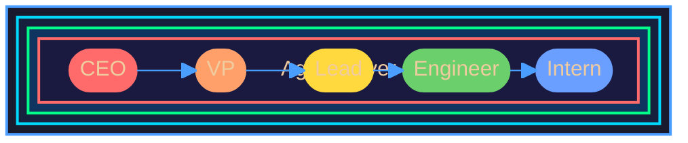
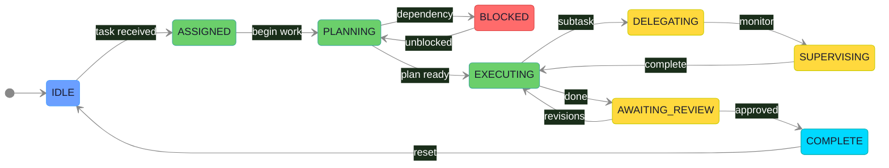
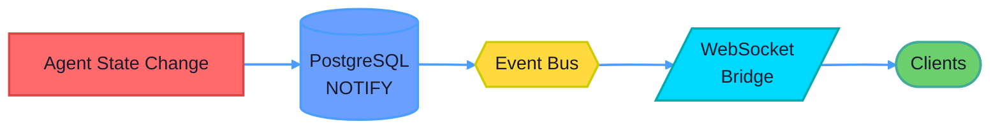

# Multi-Agent Cognition System

A hierarchical AI agent orchestration framework with human-proxy organizational patterns, real-time observability, and resilient execution.

## System Overview

This system enables multiple AI agents to collaborate within a corporate-style hierarchy (CEO → VP → Lead → Engineer → Intern), where each agent operates as an autonomous state machine while participating in coordinated workflows. The architecture addresses the fundamental challenge of **temporal frequency mismatch** — users expect millisecond responsiveness, but LLM calls operate on second-scale latencies.

## Core Architectural Concepts

### Concentric Cycles Model
The system operates across five temporal rings, each with distinct latency characteristics:

| Ring | Layer | Timescale | Example |
|------|-------|-----------|---------|
| 1 (Outer) | User Experience | Minutes | Full workflow completion |
| 2 | Tenant Session | 10-60s | Multi-agent task chains |
| 3 | Org Chart Instance | 5-15s | Single delegation cycle |
| 4 | Agent Task | 1-5s | Individual decision |
| 5 (Inner) | LLM Call | 100ms-10s | Token generation |

### Agent State Machine
Each agent follows a deterministic lifecycle:

### Checkpoint-First Durability
Every state transition persists to PostgreSQL before acknowledgment. This guarantees:
- Maximum data loss: ~2 seconds
- Deterministic replay on failure
- Full auditability of all state changes

### Event-Driven Communication

## Key Design Decisions

| Decision | Rationale | Trade-off |
|----------|-----------|-----------|
| PostgreSQL as event bus | Transactional consistency with state | ~10K events/s ceiling |
| Hierarchical agent model | Maps to intuitive org structures | Deep trees add latency |
| Per-agent priority queues | Agents manage own cognitive load | Complexity in queue scoring |
| Multi-tenant single cluster | Resource efficiency | Noisy neighbor risk (mitigated by RLS) |

## Technology Stack

| Layer | Technologies |
|-------|-------------|
| Orchestration | Kubernetes (GKE/EKS), Istio service mesh |
| Runtime | TypeScript (agents), Go (event bus, core) |
| Data | PostgreSQL 16 + Citus, Redis Cluster, NATS JetStream |
| Observability | OpenTelemetry, Grafana LGTM stack |
| Security | HashiCorp Vault, mTLS, Row-Level Security |

## Documentation Structure

The documentation follows a layered bottom-up approach across two phases:

### Phase 0: Core Architecture (`p0/`)
| File | Layer | Content |
|------|-------|---------|
| `02-concentric-cycles.html` | 0 | Mental model — temporal frequency mismatch |
| `03-architecture-structure.html` | 1 | System structure — tenants, OCIs, agents |
| `04-behavior-flow.html` | 2 | Event flow — WebSocket protocol, pub/sub |
| `05-resilience-observability.html` | 3 | Operations — checkpoints, tracing, recovery |
| `06-implementation-code.html` | 4 | Implementation — TypeScript/Go code patterns |
| `07-interactive-org-chart.html` | Demo | Live workflow simulation |

### Phase 1: Advanced Extensions (`p1/`)
| File | Layer | Content |
|------|-------|---------|
| `02-cloud-infra.html` | 1b | Production infrastructure — K8s, Istio, Vault |
| `03-agent-cognition.html` | 2b | Cognitive architecture — memory, narrative, reflection |
| `04-cognition-simulation.html` | Demo | Interactive cognition visualization |

## Agent Cognition Model

Inspired by "Generative Agents: Interactive Simulacra of Human Behavior" (Park et al.), each agent maintains:

1. **Memory Stream** — Chronological log with vector embeddings for semantic retrieval
2. **Internal Narrative** — Observable first-person reasoning trace
3. **Priority Conversation Queue** — Weighted scoring for managing concurrent interactions
4. **Reflection Cycles** — Periodic synthesis of memories into higher-level insights

## Getting Started

1. Open `p0/01-index.html` for the Phase 0 navigation hub
2. Read layers 0-4 sequentially for conceptual understanding
3. Explore `p1/` for production infrastructure and cognitive extensions
4. Run the interactive simulations to see the system in action

## Architecture Principles

- **Observable by Default** — OpenTelemetry spans propagate through full agent hierarchy
- **Resilience First** — Failure recovery designed in, not bolted on
- **Multi-Tenant Native** — Row-level security from inception
- **Temporal Awareness** — Explicit handling of timescale mismatches
- **Hierarchical Autonomy** — Agents self-manage within delegated authority
