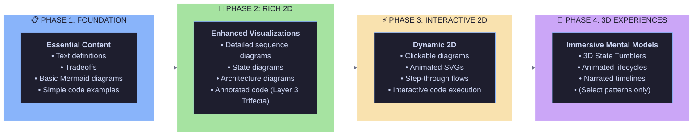
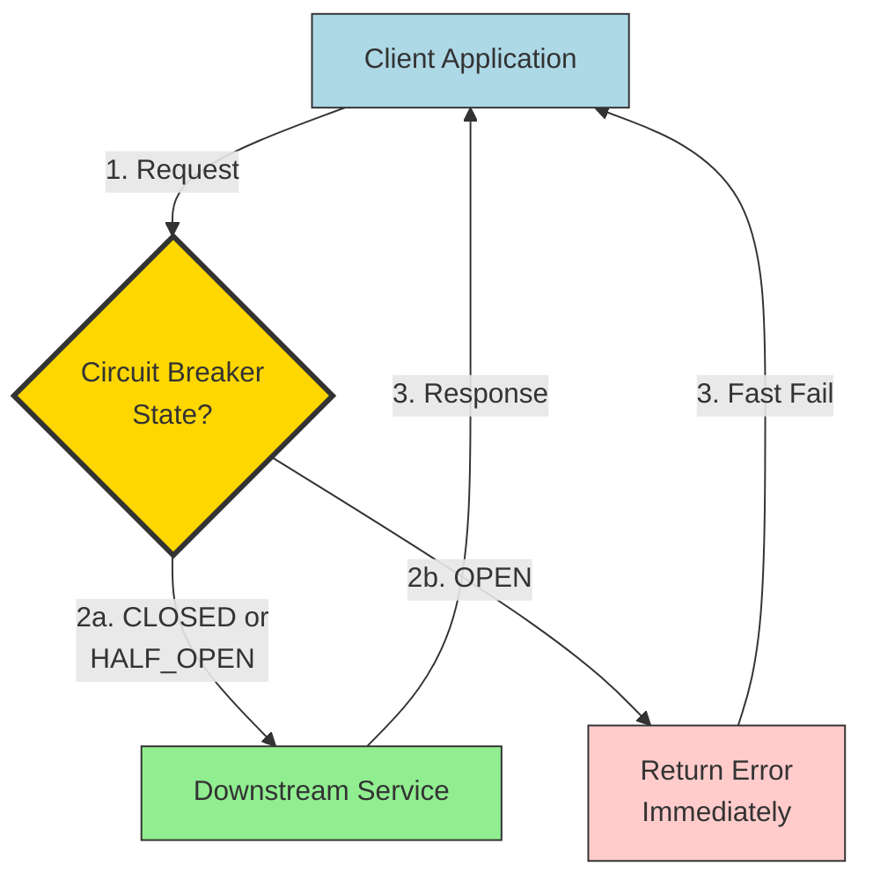

# Pattern Content Enhancement Proposal

**Author**: Backend Engineer
**Date**: 2025-12-28
**Status**: Revised - Reconciled with Existing Planning Documentation
**Purpose**: Comprehensive strategy to transform 165 pattern scaffolds into complete, pedagogically effective learning materials

---

## Revision Notes

**Key Corrections from Initial Draft**:

1. ✅ **Layer 3 Trifecta**: Updated to use proper `ActionReasonAnnotation[]` schema (separate data structure) instead of embedded code comments
2. ✅ **Schema Status**: Clarified that **all schemas already exist** in `src/data/schema.ts` - no infrastructure building needed, only content population
3. ✅ **Question Types**: Aligned with official specification from `02-data-model.md` (context-level-identification, action-identification, reason-identification, etc.)
4. ✅ **Planning Alignment**: Reconciled with all 13 planning documents and IMPLEMENTATION_ROADMAP.md
5. ✅ **Focus Shift**: Changed from "build schema + populate" to "populate existing schema systematically"

---

## Executive Summary

We have successfully generated 165 pattern files from the corpus, representing all 6 system qualities (Performance, Reliability, Scalability, Security, Observability, Maintainability). The technical infrastructure is working: pattern loading, card generation, and UI display are functional.

**The Challenge**: Every pattern file currently contains TODO stubs for critical learning content. We have the skeleton, but we need the substance.

**The Opportunity**: With our 6-layer progressive mastery system and SBVP meta-domains, we can create an unprecedented learning experience—but only if we systematically populate each pattern with rich, pedagogically sound content.

**This Proposal**: Outlines a comprehensive, layer-by-layer strategy to enhance pattern content quality, focusing on questions/answers, code snippets, and visualization diagrams that support the learning goals of each layer.

---

## Current State Assessment

### What We Have ✅

1. **Technical Infrastructure**
   - 165 pattern files with complete corpus metadata (name, emoji, tagline, hierarchy)
   - **Complete Zod schema** (src/data/schema.ts) with all 6 layers defined:
     - L1: ConceptSchema (name, emoji, tagline, definition, problemSolved, tradeoffs, relatedPatterns)
     - L2: StructureSchema (participants, diagram, flow, invariants)
     - L3: CodeExampleSchema with Layer 3 Trifecta (contextDilation, annotations, highlights)
     - L4: SystemContextSchema (typicalPlacement, interactsWith, architecturalBoundaries)
     - L5: ImplementationSchema (technology implementations)
     - L6: SystemReferenceSchema (usedInSystems)
     - SBVP: PhilosophySchema, VisualizationSchema (cross-cutting)
   - Pattern loading system (patternsSlice.ts)
   - Card generation engine (cardGenerator.ts) - currently L1 only
   - 825 L1 flashcards generated (5 per pattern)
   - Frontend UI displaying all 6 quality badges
   - SM-2 spaced repetition algorithm ready for integration

2. **Architectural Vision**
   - 6-layer progressive mastery system (L1: Concept → L6: System Composition)
   - SBVP meta-domains (Structure, Behavior, Visualization, Philosophy)
   - Layer 3 Trifecta (Context Dilation + Action-Reason Annotations + Raw Code)
   - Grammar-based combinatorial card generation (600+ cards per pattern potential)

3. **Comprehensive Planning Documentation**
   - **01-vision-philosophy.md**: 6-layer system, SBVP meta-domains, SM-2 integration
   - **02-data-model.md**: Complete entity specs, Layer 3 Trifecta, DSL grammar for card generation
   - **03-redux-architecture.md**: Normalized state tree design
   - **04-spaced-repetition.md**: SM-2 algorithm, layer progression logic
   - **05-tech-stack.md**: React, Redux Toolkit, Dexie, React Three Fiber
   - **06-app-architecture.md**: Directory structure, component patterns
   - **07-user-flows.md**: Study session and exploration flows
   - **08-data-pipeline.md**: Corpus → Patterns → Flashcards transformation
   - **09-mvp-scope.md**: 8-phase implementation roadmap
   - **10-13**: Session visualization, 3D viz, persistence, distribution strategy
   - **IMPLEMENTATION_ROADMAP.md**: Phase-by-phase checklist (currently at Phase 0)
   - **99-open-questions.md**: Design decisions and recommendations

### What's Missing ❌

1. **Pattern Content (All 165 patterns) - Schema exists, but all fields have TODO placeholders**

   **L1: Concept** (ConceptSchema fields):
   - `concept.definition`: "TODO: Expand from corpus tagline..."
   - `concept.problemSolved`: "TODO: What problem does this pattern solve?"
   - `concept.tradeoffs.pros`: ["TODO: List advantages"]
   - `concept.tradeoffs.cons`: ["TODO: List drawbacks"]
   - `concept.relatedPatterns`: [] (empty arrays)

   **L2: Structure** (StructureSchema fields):
   - `structure.participants`: [{ name: "TODO", role: "TODO", responsibilities: ["TODO"] }]
   - `structure.diagram`: Placeholder Mermaid (`graph TB\n Start --> Action --> End`)
   - `structure.flow`: [{ step: 1, actor: "TODO", action: "TODO", description: "TODO" }]
   - `structure.invariants`: ["TODO: List pattern invariants"]

   **L3: Code Expression** (CodeExampleSchema fields):
   - `codeExamples`: [{ code: "// TODO: Add runnable TypeScript example", ... }]
   - Missing `contextDilation` object
   - Missing `annotations` array (ActionReasonAnnotation[])
   - Missing `highlights` array (CodeHighlight[])

   **L4-L6: Optional fields - completely unpopulated**:
   - `systemContext?`: undefined (SystemContextSchema)
   - `implementations?`: undefined (ImplementationSchema[])
   - `usedInSystems?`: undefined (SystemReferenceSchema[])
   - `philosophy?`: undefined (PhilosophySchema)
   - `visualization?`: undefined (VisualizationSchema)

2. **Question/Answer Content**
   - No explicit Q&A pairs authored for any layer
   - Current card generator uses templates, but has no rich source material
   - No scaffolding for different question types per layer

3. **Visualization Assets**
   - No real Mermaid diagrams (only placeholders)
   - No SVG diagrams
   - No animation specifications
   - No visual metaphors documented

4. **Code Examples**
   - No Layer 3 Trifecta implementations (Context Dilation, Action-Reason annotations)
   - No multi-language examples
   - No real-world use cases
   - No runnable code demonstrations

---

## Vision & Learning Goals

### What Success Looks Like

A learner studying the **Circuit Breaker** pattern should be able to:

**After L1 (Concept)**:

- Define what a circuit breaker is in their own words
- Explain why it exists (prevent cascading failures)
- Identify it when reviewing system diagrams or code
- Articulate tradeoffs (reliability vs. added complexity)

**After L2 (Structure & Behavior)**:

- Draw the state machine (Closed → Open → Half-Open)
- Name the participants (CircuitBreaker, ServiceClient, FailureThreshold, ResetTimeout)
- Describe the interaction flow step-by-step
- Recognize invariants (must track consecutive failures, must timeout before retry)

**After L3 (Code Expression)**:

- Read a circuit breaker implementation and understand WHAT each section does
- Understand WHY each decision was made (error counting, state transitions, timeout logic)
- Recognize the pattern in different languages/libraries
- Compare different implementation strategies (manual vs. library-based)

**After L4 (System Integration)**:

- Identify WHERE circuit breakers belong in a microservice architecture
- Understand placement decisions (client-side vs. gateway vs. service mesh)
- Recognize anti-patterns (circuit breaker on database connections vs. service calls)

**After L5 (Technology Mapping)**:

- Know which libraries/tools implement circuit breakers (Resilience4j, Polly, Hystrix, Envoy)
- Understand technology-specific nuances and tradeoffs
- Choose appropriate tools for given tech stacks

**After L6 (System Composition)**:

- Analyze how companies combine circuit breakers with retries, bulkheads, timeouts
- Understand real-world system compositions (Netflix, AWS, Google)
- Design comprehensive resilience strategies

### SBVP Domain Goals

Each layer emphasizes different SBVP aspects:

- **L1**: Philosophy (WHY) + Visualization (mental model diagrams)
- **L2**: Structure (WHAT) + Behavior (HOW)
- **L3**: Behavior (implementation mechanics) + Structure (code organization)
- **L4**: Structure (architectural placement) + Philosophy (design principles)
- **L5**: Structure (technology landscape) + Behavior (tool-specific behavior)
- **L6**: Philosophy (strategic decisions) + Visualization (system diagrams)

---

## Layer-by-Layer Content Requirements

### Layer 1: Concept - "What & Why"

**Learning Goal**: Build foundational mental model and problem recognition

**Content Needed**:

1. **Extended Definition** (150-250 words)
   - Expand corpus tagline into comprehensive explanation
   - Include metaphors/analogies for intuition
   - Example (Circuit Breaker): "Like an electrical circuit breaker in your home that trips when current exceeds safe levels, a software circuit breaker monitors service calls and 'trips' to prevent cascading failures when error rates exceed thresholds. Instead of continuing to hammer a failing service, the circuit breaker opens, immediately returning errors and giving the downstream service time to recover."

2. **Problem Solved** (100-150 words)
   - Specific pain points this pattern addresses
   - What happens WITHOUT this pattern
   - Example: "Without circuit breakers, when Service A calls Service B and B is down, A wastes resources on doomed requests. These pile up, consuming threads and memory. Eventually A becomes unresponsive, cascading the failure upstream to Service C, D, E... The entire system can collapse from a single service failure."

3. **Tradeoffs** (3-5 pros, 3-5 cons)
   - **Pros**: Specific advantages with context
   - **Cons**: Real limitations and costs
   - Example Pros: "Prevents cascading failures", "Faster failure detection than timeouts alone", "Gives failing services time to recover"
   - Example Cons: "Adds latency overhead on every call", "False positives during traffic spikes", "Requires tuning threshold parameters"

4. **Related Patterns** (3-8 patterns)
   - Patterns in same family
   - Complementary patterns (often used together)
   - Alternative patterns (solve similar problems differently)
   - Example: [retry, timeout, bulkhead, fallback, health-check]

5. **Visualization Diagrams**
   - Mental model diagram (abstract, conceptual)
   - Problem/solution before/after diagram
   - Example: Flow diagram showing cascading failure WITHOUT circuit breaker vs. graceful degradation WITH circuit breaker

**Question Types for L1 Cards**:

- **Definition**: "What is a circuit breaker?"
- **Problem Identification**: "What problem does a circuit breaker solve?"
- **Pattern Recognition**: "You see code that tracks consecutive errors and stops making calls after a threshold. What pattern is this?"
- **Tradeoff Analysis**: "What's a key tradeoff when using circuit breakers?"
- **When to Use**: "When should you apply a circuit breaker?"

---

### Layer 2: Structure & Behavior - "How It Works"

**Learning Goal**: Understand components and interactions at abstract level

**Content Needed**:

1. **Participants** (3-7 components)
   - Name (e.g., "State Machine", "Failure Threshold", "Reset Timeout")
   - Role (e.g., "Tracks current state (Closed/Open/Half-Open)")
   - Responsibilities (2-4 specific duties)
   - Example:
     ```typescript
     {
       name: "State Machine",
       role: "Tracks circuit state and manages transitions",
       responsibilities: [
         "Maintain current state (Closed/Open/Half-Open)",
         "Enforce state transition rules",
         "Expose state query methods"
       ]
     }
     ```

2. **Interaction Flow** (5-12 steps)
   - Step number
   - Actor (which participant)
   - Action (what they do)
   - Description (why/how)
   - Example:
     ```typescript
     {
       step: 1,
       actor: "Client",
       action: "Calls protected service through circuit breaker",
       description: "Client doesn't call service directly; all calls go through circuit breaker wrapper"
     },
     {
       step: 2,
       actor: "Circuit Breaker",
       action: "Checks current state",
       description: "If OPEN, immediately return error without calling service. If CLOSED or HALF_OPEN, proceed."
     }
     ```

3. **Behavior Diagrams**
   - **Sequence Diagram**: Step-by-step message flow between participants
   - **State Diagram**: State machine with transitions and conditions
   - Example (Circuit Breaker state diagram):

     ```mermaid
     stateDiagram-v2
       [*] --> Closed
       Closed --> Open: Failures exceed threshold
       Open --> HalfOpen: Reset timeout expires
       HalfOpen --> Closed: Success
       HalfOpen --> Open: Failure

       Closed: ✅ Requests pass through\nCount consecutive failures
       Open: ❌ Requests fail immediately\nWait for reset timeout
       HalfOpen: 🔄 Allow test request\nSuccess → Closed\nFailure → Open
     ```

4. **Invariants** (3-6 constraints)
   - Rules that MUST always hold true
   - Conditions that define correct behavior
   - Example:
     - "Circuit MUST transition to Open when consecutive failures >= threshold"
     - "Circuit MUST NOT call service when state is Open"
     - "Half-Open state MUST allow exactly one test request before deciding next state"
     - "Reset timeout MUST be positive and non-zero"

**Question Types for L2 Cards**:

- **Component Identification**: "What component tracks the circuit state?"
- **Responsibility**: "What is the Failure Threshold responsible for?"
- **Flow Understanding**: "What happens when the circuit is Open and a request arrives?"
- **State Transitions**: "When does the circuit transition from Half-Open to Closed?"
- **Invariant Recognition**: "True or False: A circuit breaker can call the service when in Open state."

---

### Layer 3: Code Expression - "Concrete Implementation"

**Learning Goal**: Read and understand real code implementing the pattern

**Content Needed**:

1. **Layer 3 Trifecta Structure** (per 02-data-model.md specification)

   The Layer 3 Trifecta consists of three separate, orthogonal components that together enable deep code comprehension:

   **a) Context Dilation** (ContextDilation schema)
   - **level**: "micro" | "local" | "module" | "system" | "ecosystem"
   - **scope**: Brief description of what code section encompasses
   - **prerequisites**: Array of concepts learner should know first
   - **systemPosition**: Where this code lives in larger architecture

   Example:

   ```typescript
   contextDilation: {
     level: "module",
     scope: "Circuit breaker state machine managing failure detection",
     prerequisites: ["State machines", "Error handling", "Timeouts"],
     systemPosition: "Wraps outbound service calls in API Gateway or Service Layer"
   }
   ```

   **b) Action-Reason Annotations** (ActionReasonAnnotation[] schema)
   - **Separate data structure** (NOT embedded comments in code)
   - Each annotation covers a line range and explains WHAT + WHY
   - Includes contextLevel (zoom level for this specific annotation)
   - Can reference relatedConcepts to link to other patterns

   Example:

   ```typescript
   annotations: [
     {
       id: "cb-state-init",
       lines: [2, 4],
       action: "Initialize state tracking variables",
       reason:
         "Circuit breaker must remember: current state, failure count, and last failure time to make trip decisions",
       contextLevel: "local",
       relatedConcepts: ["state-machine", "failure-detection"],
     },
     {
       id: "cb-open-check",
       lines: [12, 18],
       action: "Check if circuit should transition from OPEN to HALF-OPEN",
       reason:
         "After timeout, we probe with one request to test if downstream recovered—this prevents permanent lockout",
       contextLevel: "module",
       relatedConcepts: ["timeout-pattern", "graceful-degradation"],
     },
   ];
   ```

   **c) Raw Code + Highlights** (CodeExample schema)
   - Complete, runnable implementation (100-300 lines)
   - Syntax highlighted
   - Optional CodeHighlight[] for quick scanning of key sections
   - Each highlight maps to SBVP domain (structure/behavior/visualization/philosophy)

   Example:

   ```typescript
   highlights: [
     {
       lines: [2, 4],
       label: "State initialization",
       sbvpDomain: "structure",
     },
     {
       lines: [12, 18],
       label: "State transition logic",
       sbvpDomain: "behavior",
     },
   ];
   ```

   **UI Manifestation** (per 02-data-model.md):
   - Answer side shows **three sub-tabs**:
     - **Context Tab**: Shows dilation level + system position diagram
     - **Action-Reason Tab**: Side-by-side code + annotations (like code review overlay)
     - **Code Tab**: Pure syntax-highlighted implementation with highlights

2. **Multiple Code Examples per Pattern** (2-5 examples)
   - **Basic Implementation**: Core pattern in TypeScript (primary)
   - **Alternative Language**: Same pattern in Python/Go/Java/Rust
   - **Library-Based**: Using popular library (Resilience4j, Polly, etc.)
   - **Real-World Usage**: How it's actually used in a system
   - **Anti-Pattern**: Common mistake to avoid

3. **Code Example Structure** (CodeExample schema):

   ```typescript
   {
     id: "circuit-breaker-ts-basic",
     language: "typescript",
     title: "Circuit Breaker - Basic Implementation",
     description: "Self-contained circuit breaker wrapping async functions with state management and failure tracking",
     code: `
       // Full TypeScript implementation
       // (Clean code without inline comments - annotations are separate)
       class CircuitBreaker {
         private state: 'closed' | 'open' | 'half-open' = 'closed';
         private consecutiveFailures = 0;
         private openedAt: number | null = null;

         // ... rest of implementation
       }
     `,
     runnable: true,

     // Context Dilation (separate from code)
     contextDilation: {
       level: "module",
       scope: "Self-contained circuit breaker class wrapping async functions",
       prerequisites: ["State machines", "Async/await", "Error handling"],
       systemPosition: "Wraps outbound HTTP/RPC calls in API Gateway or Service Layer"
     },

     // Action-Reason Annotations (separate from code)
     annotations: [
       {
         id: "cb-state-vars",
         lines: [3, 5],
         action: "Initialize state tracking variables",
         reason: "Must track current state, consecutive failures, and open timestamp to manage transitions",
         contextLevel: "local",
         relatedConcepts: ["state-machine", "failure-detection"]
       },
       // ... more annotations for other line ranges
     ],

     // Code Highlights (separate from code)
     highlights: [
       {
         lines: [3, 5],
         label: "State variables",
         sbvpDomain: "structure"
       },
       {
         lines: [12, 24],
         label: "State transition logic",
         sbvpDomain: "behavior"
       }
     ]
   }
   ```

   **Additional Content** (not in schema, but useful for learning):
   - **Key Takeaways** (3-5 bullets): Main lessons from this code example
   - **Common Pitfalls** (3-5 bullets): Mistakes to avoid

**Question Types for L3 Cards** (per 02-data-model.md specification):

**3a. Context Dilation questions:**

- **context-level-identification**: "At what zoom level should you think about this code?" (micro/local/module/system/ecosystem)
- **system-position-identification**: "Where does this code sit in a larger system?"
- **prerequisite-identification**: "What concepts must you understand before reading this code?"

**3b. Action-Reason questions:**

- **action-identification**: "What is lines 12-18 doing?"
- **reason-identification**: "WHY do lines 12-18 exist?"
- **action-to-pattern**: "Given this action-reason pair: 'Check timeout to probe recovery', which pattern is this?"
- **pattern-to-action**: "What action-reason pairs would you expect in a Circuit Breaker implementation?"

**3c. Raw Code questions:**

- **code-identification**: "Which pattern is this code implementing?"
- **code-completion**: "Complete this implementation: `if (this.state === 'half-open' && success) { this.state = ___ }`"
- **bug-finding**: "What's wrong with this circuit breaker implementation?"

---

### Layer 4: System Integration - "Where in Architecture"

**Learning Goal**: Understand where pattern fits in larger system design

**Content Needed**:

1. **Architectural Placement** (2-5 scenarios)
   - Diagram showing WHERE in system architecture
   - Description of placement rationale
   - Example (Circuit Breaker):
     - **Scenario 1**: Client-side circuit breaker in API Gateway
       - Diagram: API Gateway → [Circuit Breaker] → Downstream Services
       - Rationale: "Centralized failure protection, easier monitoring, reduces duplicate logic"
     - **Scenario 2**: Service-to-service circuit breakers
       - Diagram: Service A → [CB to B] → Service B, Service A → [CB to C] → Service C
       - Rationale: "Fine-grained control, isolated failures per dependency"
     - **Scenario 3**: Service Mesh (Envoy sidecar)
       - Diagram: App Container + Envoy Sidecar [Circuit Breaker] → Network
       - Rationale: "Zero code changes, consistent policy across all services"

2. **Integration Patterns** (3-6 patterns)
   - How pattern interacts with other components
   - Configuration and wiring
   - Example:
     - "Integrate with HTTP client library (axios, fetch) via interceptors"
     - "Wire into dependency injection container as singleton per dependency"
     - "Configure thresholds via environment variables or config service"

3. **System Context Diagram**
   - Full system view with pattern highlighted
   - Data flow showing pattern's role
   - Example: C4 Container diagram showing microservices with circuit breakers at service boundaries

4. **Anti-Patterns at System Level** (2-4 anti-patterns)
   - Common mistakes in architectural placement
   - Example:
     - "❌ Circuit breaker on database connections (use connection pooling instead)"
     - "❌ Circuit breaker on synchronous internal method calls (unnecessary overhead)"
     - "✅ Circuit breaker on external HTTP APIs, message queues, external databases"

**Question Types for L4 Cards**:

- **Placement Decision**: "Where should you place circuit breakers in a microservice architecture?"
- **Integration**: "How do you integrate a circuit breaker with an HTTP client?"
- **Anti-Pattern Detection**: "Why is putting a circuit breaker on database connections an anti-pattern?"
- **Design Choice**: "Client-side circuit breakers vs. service mesh circuit breakers: when to use each?"

---

### Layer 5: Technology Mapping - "Which Tools"

**Learning Goal**: Navigate technology landscape, choose appropriate tools

**Content Needed**:

1. **Technology Implementations** (5-12 technologies per pattern)
   - Name and ecosystem (e.g., "Resilience4j - Java/Spring")
   - Key features and strengths
   - Code snippet showing usage
   - When to choose it
   - Example:

     ```typescript
     {
       name: "Resilience4j",
       ecosystem: "Java / Spring Boot",
       description: "Lightweight, modular resilience library inspired by Hystrix",
       features: [
         "Functional programming style with decorators",
         "Low memory overhead (no thread pools)",
         "First-class Spring Boot integration",
         "Comprehensive metrics and health indicators"
       ],
       usageExample: `
         CircuitBreakerConfig config = CircuitBreakerConfig.custom()
           .failureRateThreshold(50)
           .waitDurationInOpenState(Duration.ofSeconds(30))
           .build();

         CircuitBreaker breaker = CircuitBreaker.of("backend", config);

         Supplier<String> decorated = CircuitBreaker
           .decorateSupplier(breaker, backendService::call);
       `,
       whenToChoose: "Spring Boot projects, modern Java apps, when you want lightweight library without Netflix dependencies"
     }
     ```

2. **Technology Comparison Matrix**
   - Side-by-side comparison of 3-5 major implementations
   - Dimensions: Performance, Features, Ecosystem, Learning Curve, Maturity
   - Example (Circuit Breaker tools):
     | Tool | Language | Overhead | Maturity | Best For |
     |------|----------|----------|----------|----------|
     | Resilience4j | Java | Low | High | Spring Boot apps |
     | Polly | C# | Low | High | .NET services |
     | Hystrix | Java | High | Deprecated | Legacy Netflix stack |
     | go-resiliency | Go | Low | Medium | Go microservices |
     | Envoy | N/A | Medium | High | Service mesh, any language |

3. **Cloud Provider Implementations**
   - AWS, Azure, GCP services that provide this pattern
   - Example: AWS App Mesh, Azure Service Fabric, GCP Cloud Load Balancing

4. **Decision Tree**
   - Flow chart to help choose technology
   - Based on language, ecosystem, requirements
   - Example:
     ```mermaid
     graph TD
       Start[Need Circuit Breaker] --> Lang{Language?}
       Lang -->|Java| Spring{Using Spring?}
       Lang -->|C#| Polly[Use Polly]
       Lang -->|Go| GoRes[Use go-resiliency]
       Lang -->|Any| Mesh{Service Mesh?}
       Spring -->|Yes| R4j[Use Resilience4j]
       Spring -->|No| R4jStand[Use Resilience4j Standalone]
       Mesh -->|Yes| Envoy[Use Envoy/Istio]
       Mesh -->|No| Lang
     ```

**Question Types for L5 Cards**:

- **Tool Identification**: "Which library provides circuit breakers for Spring Boot?"
- **Feature Comparison**: "What's the key difference between Resilience4j and Hystrix?"
- **Technology Choice**: "You're building a .NET microservice. Which circuit breaker library should you use?"
- **Cloud Mapping**: "Which AWS service provides circuit breaker functionality?"

---

### Layer 6: System Composition - "Real-World Systems"

**Learning Goal**: Understand how patterns combine in production systems

**Content Needed**:

1. **Real-World Case Studies** (2-5 per pattern)
   - Company name (Netflix, AWS, Google, Uber, etc.)
   - System description
   - How pattern is used
   - Why it was chosen
   - Results/impact
   - Example:
     ```typescript
     {
       company: "Netflix",
       system: "API Gateway (Zuul)",
       description: "Netflix processes billions of API requests daily across hundreds of microservices",
       patternUsage: "Circuit breakers at every service boundary, implemented via Hystrix (now Resilience4j)",
       rationale: [
         "Prevent cascading failures across service dependency chains",
         "Graceful degradation - serve cached/stale data when services fail",
         "Fast failure - don't waste resources on doomed requests"
       ],
       composition: [
         "Circuit Breaker + Bulkhead (isolated thread pools per dependency)",
         "Circuit Breaker + Fallback (return cached recommendations)",
         "Circuit Breaker + Timeout (don't wait indefinitely)",
         "Circuit Breaker + Retry (try again after circuit closes)"
       ],
       impact: "Reduced cascading failure incidents by 90%, improved P99 latency during partial outages",
       source: "https://netflixtechblog.com/fault-tolerance-in-a-high-volume-distributed-system-91ab4faae74a"
     }
     ```

2. **Pattern Composition Diagrams**
   - Show how multiple patterns work together
   - Example: Circuit Breaker + Retry + Timeout + Fallback combined
   - Sequence diagram showing all patterns in action during a failure scenario

3. **Architecture Decision Records (ADRs)**
   - Why companies chose this pattern over alternatives
   - What constraints influenced the decision
   - Example: "Uber chose Envoy's circuit breakers over library-based because they needed cross-language consistency and zero code changes"

4. **Anti-Patterns in Production** (2-4 real examples)
   - War stories of pattern misuse
   - What went wrong and why
   - How it was fixed
   - Example: "Company X put aggressive circuit breakers on their payment service. During Black Friday traffic spike, false positives opened circuits, blocking legitimate purchases. Lost $2M in revenue before they adjusted thresholds."

**Question Types for L6 Cards**:

- **Case Study Recognition**: "How does Netflix use circuit breakers in their API gateway?"
- **Composition Understanding**: "Why does Netflix combine circuit breakers with bulkheads?"
- **Decision Analysis**: "Why did Uber choose Envoy over Resilience4j for circuit breaking?"
- **Anti-Pattern Learning**: "What went wrong when Company X used aggressive circuit breaker thresholds on Black Friday?"

---

## Content Maturation Journey

### Philosophy: Crawl → Walk → Run

Content enhancement follows a **progressive sophistication model**. We start with foundational 2D content and evolve toward advanced 3D experiences for select patterns.



### Phase 1: Foundation (Weeks 1-8)

**Goal**: All 165 patterns have **complete L1-L3 content** with **2D static visualizations**

**Content Requirements**:

- ✅ L1: Text-based (definition, problemSolved, tradeoffs, relatedPatterns)
- ✅ L2: Static Mermaid diagrams (sequence, state, flowchart)
- ✅ L3: Code examples with basic annotations
- ✅ Basic philosophy and use cases

**Visualization Strategy**: **2D Mermaid Only**

- Sequence diagrams for interaction flows
- State diagrams for state machines
- Flowcharts for decision trees
- C4 Container diagrams for system context

**Acceptance Criteria**:

- Every pattern has at least 1 Mermaid diagram that renders correctly
- Diagrams use consistent styling and color scheme
- Diagrams are referenced in L2 structure.diagram field

---

### Phase 2: Rich 2D Visualizations (Weeks 9-12)

**Goal**: Enhance critical patterns (30-50) with **detailed 2D visualizations**

**Content Requirements**:

- ✅ Multiple diagram types per pattern (sequence + state + architecture)
- ✅ Real-world analogy diagrams
- ✅ Before/after problem/solution comparisons
- ✅ Full Layer 3 Trifecta (contextDilation, annotations, highlights)

**Visualization Strategy**: **Enhanced 2D**

- Multiple Mermaid diagrams per pattern (3-5)
- Problem/solution split-screen diagrams
- Visual metaphors (Circuit Breaker as electrical breaker)
- Color-coded component interactions

**Patterns to Enhance**:

- All Reliability patterns (Circuit Breaker, Retry, Bulkhead, etc.)
- Top 20 Performance patterns (Cache-Aside, CDN, etc.)
- Top 10 Scalability patterns (Load Balancing, Sharding, etc.)

---

### Phase 3: Interactive 2D (Weeks 13-16)

**Goal**: Add **interactivity** to 2D visualizations for select patterns (10-20)

**Content Requirements**:

- ✅ Animated SVG diagrams (CSS/JS animations)
- ✅ Step-through flows (click to advance through sequence)
- ✅ Clickable architecture diagrams (zoom into components)
- ✅ Interactive code execution (Sandpack integration)

**Visualization Strategy**: **Dynamic 2D**

- SVG animations for state transitions
- Clickable sequence diagrams (advance step-by-step)
- Hover effects showing component details
- Live code editors with pattern implementation

**Technology**:

- SVG + CSS animations
- React state for step-through control
- Sandpack for live code execution

**Patterns to Enhance**:

- Circuit Breaker (animated state transitions)
- Cache-Aside (animated read/write flow)
- Retry with Backoff (animated timeline)

---

### Phase 4: 3D Experiences (Weeks 17-20+) - **SUPPLEMENTAL**

**Goal**: Create **immersive 3D visualizations** for **state machine patterns only** (5-10 patterns)

**Content Requirements**:

- ✅ Full PatternVisualization data model (per 11-3d-visualizations.md)
- ✅ 3D State Tumbler with rotating state cards
- ✅ Animated lifecycle with narration
- ✅ Live counters, graphs, timers on state cards
- ✅ 20-30 second animation timeline

**Visualization Strategy**: **3D Tumbler Paradigm** (React Three Fiber)

- 3D rotating carousel with state cards
- CLOSED → OPEN → HALF-OPEN transitions
- Counters incrementing (failures: 2/3)
- Graphs showing threshold crossings
- Narration: "Circuit OPENS. Requests blocked immediately."

**Technology**:

- React Three Fiber
- @react-three/drei
- Framer Motion 3D
- Zustand for animation state

**Patterns Eligible for 3D** (state machines only):

- ✅ Circuit Breaker (3 states: CLOSED/OPEN/HALF-OPEN)
- ✅ Saga Pattern (orchestration vs choreography states)
- ✅ State Pattern (explicit state machine)
- ✅ Bulkhead (resource pool states)
- ✅ Rate Limiter (token bucket states)
- ⚠️ NOT for non-state-machine patterns (Cache-Aside, Retry, Load Balancing)

**Why Supplemental**:

- 3D requires significant authoring time (4-8 hours per pattern vs 1-2 hours for 2D)
- Only valuable for state machines where rotation metaphor makes sense
- 2D diagrams already convey the information; 3D adds memorability
- Phase 6 in IMPLEMENTATION_ROADMAP.md (post-MVP)

---

### Content Maturation Strategy Summary

| Phase                       | Scope               | Visualization                   | Timeline     | Effort             |
| --------------------------- | ------------------- | ------------------------------- | ------------ | ------------------ |
| **Phase 1: Foundation**     | All 165 patterns    | 2D Mermaid (static)             | Weeks 1-8    | 165 × 10h = 1,650h |
| **Phase 2: Rich 2D**        | Top 50 patterns     | Enhanced 2D (multiple diagrams) | Weeks 9-12   | 50 × 3h = 150h     |
| **Phase 3: Interactive 2D** | Top 20 patterns     | Animated SVG, clickable         | Weeks 13-16  | 20 × 4h = 80h      |
| **Phase 4: 3D**             | 5-10 state machines | 3D Tumbler + animation          | Weeks 17-20+ | 10 × 8h = 80h      |
| **Total**                   | -                   | -                               | 20 weeks     | ~2,000h            |

**Key Principle**: **Every pattern gets 2D. Select patterns get 3D.**

---

## Content Enhancement Strategy

### Prioritization: Which Patterns First?

**Phase 1: Core Reliability Patterns (Weeks 1-2)**

- Circuit Breaker
- Retry
- Timeout
- Bulkhead
- Fallback
- Health Check

_Rationale_: Most fundamental, highest usage, clear examples, teach well together

**Phase 2: Caching & Performance (Weeks 3-4)**

- Cache-Aside
- Write-Through Cache
- Write-Behind Cache
- Read-Through Cache
- CDN
- Debouncing
- Throttling

_Rationale_: Second most common, concrete implementations, performance impact

**Phase 3: Scalability Patterns (Weeks 5-6)**

- Load Balancing
- Sharding
- Partitioning
- Horizontal Scaling
- Vertical Scaling
- Auto-Scaling
- Connection Pooling

_Rationale_: Critical for system design interviews, good architectural examples

**Phase 4: Security & Observability (Weeks 7-8)**

- JWT, OAuth 2.0, OIDC, SAML
- OpenTelemetry, Distributed Tracing
- Metrics (RED/USE methods)
- Logging patterns

_Rationale_: Growing importance, good technology mapping examples

**Phase 5: Remaining Patterns (Weeks 9-12)**

- Long tail of specialized patterns
- Fill gaps in each quality category

### Authoring Workflow

**For Each Pattern**:

1. **Research Phase** (30-60 min)
   - Read authoritative sources (Martin Fowler, Microsoft Docs, AWS Well-Architected)
   - Find real-world examples (Netflix, Uber, Google tech blogs)
   - Collect code examples from GitHub, official docs
   - Screenshot/save diagrams for reference

2. **L1 Content Creation** (60-90 min)
   - Write extended definition (150-250 words)
   - Document problem solved (100-150 words)
   - List tradeoffs (3-5 pros, 3-5 cons)
   - Identify related patterns (3-8)
   - Create mental model diagram in Mermaid
   - Create before/after problem/solution diagram

3. **L2 Content Creation** (90-120 min)
   - Identify participants (3-7 components)
   - Define responsibilities for each
   - Map interaction flow (5-12 steps)
   - Create sequence diagram in Mermaid
   - Create state diagram if applicable
   - Document invariants (3-6 constraints)

4. **L3 Content Creation** (120-180 min)
   - Write context dilation (50-100 words)
   - Implement basic version with Action-Reason annotations (100-300 lines)
   - Create 2-3 additional examples (alternative language, library-based, real-world)
   - Document key takeaways (3-5)
   - Document common pitfalls (3-5)
   - Test code for correctness

5. **L4 Content Creation** (90-120 min)
   - Create 2-5 architectural placement diagrams
   - Document integration patterns (3-6)
   - Create system context diagram (C4 Container level)
   - Document anti-patterns (2-4)

6. **L5 Content Creation** (120-150 min)
   - Research 5-12 technology implementations
   - Create code examples for each (basic usage)
   - Build comparison matrix
   - Create decision tree diagram
   - Document cloud provider offerings

7. **L6 Content Creation** (90-120 min)
   - Find 2-5 real-world case studies
   - Document each thoroughly (company, system, usage, rationale, impact)
   - Create pattern composition diagrams
   - Find/document production anti-patterns (war stories)

8. **Review & QA** (30-60 min)
   - Verify all code examples run
   - Check all diagrams render correctly
   - Validate cross-references between related patterns
   - Proofread for clarity and accuracy
   - Test flashcard generation with new content

**Total Time Per Pattern**: ~10-14 hours of focused work

**For 165 Patterns**: ~1,650-2,310 hours = 41-58 weeks of full-time work for one person

### Collaborative Approaches

**Option A: Engineer-Led Sequential**

- One engineer owns 3-5 patterns at a time
- Deep research, high quality
- Slow but thorough
- Timeline: 12+ months

**Option B: Parallel Team (Recommended)**

- 3-4 engineers each own a quality category
- Engineer 1: Performance (89 patterns)
- Engineer 2: Reliability (37 patterns)
- Engineer 3: Observability + Security + Maintainability (30 patterns)
- Engineer 4: Scalability + Review/QA (9 patterns + QA)
- Timeline: 3-4 months

**Option C: AI-Assisted Hybrid**

- Use Claude/GPT-4 to generate first drafts of L1-L3 content
- Human engineer reviews, edits, enhances
- Human writes L4-L6 (requires deeper system thinking)
- Faster but requires careful QA
- Timeline: 2-3 months for one engineer

**Option D: Community Crowdsourcing**

- Open source the pattern repository
- Contributors submit PRs for individual patterns
- Maintainers review and merge
- Slower, variable quality, but scalable
- Timeline: Ongoing, never "done"

---

## Quality Standards

### Content Quality Checklist

**L1: Concept**

- [ ] Definition is 150-250 words, clear, uses metaphor
- [ ] Problem solved is 100-150 words, specific pain points
- [ ] 3-5 pros and 3-5 cons listed with context
- [ ] 3-8 related patterns identified
- [ ] Mental model diagram created (Mermaid)
- [ ] Before/after problem/solution diagram created

**L2: Structure & Behavior**

- [ ] 3-7 participants identified with roles and responsibilities
- [ ] 5-12 interaction flow steps documented
- [ ] Sequence diagram created (Mermaid)
- [ ] State diagram created if applicable
- [ ] 3-6 invariants documented

**L3: Code Expression**

- [ ] Context dilation written (50-100 words)
- [ ] Basic implementation with Action-Reason annotations (100-300 lines)
- [ ] Code runs without errors
- [ ] 2-3 additional examples (different languages/libraries)
- [ ] 3-5 key takeaways documented
- [ ] 3-5 common pitfalls documented

**L4: System Integration**

- [ ] 2-5 architectural placement scenarios with diagrams
- [ ] 3-6 integration patterns documented
- [ ] System context diagram created (C4 Container)
- [ ] 2-4 anti-patterns documented

**L5: Technology Mapping**

- [ ] 5-12 technology implementations researched
- [ ] Code examples for each technology
- [ ] Comparison matrix created
- [ ] Decision tree diagram created
- [ ] Cloud provider offerings documented

**L6: System Composition**

- [ ] 2-5 real-world case studies documented
- [ ] Pattern composition diagrams created
- [ ] ADRs or rationale documented
- [ ] 2-4 production anti-patterns (war stories)

### Diagram Quality Standards

**Mermaid Diagrams**:

- Use high contrast colors (dark text on light background)
- Label all nodes clearly
- Use consistent styling within pattern
- Add legend if needed
- Test rendering in UI before committing

**Example Good Mermaid Diagram**:



### Code Quality Standards

**TypeScript Examples**:

- Use modern ES6+ syntax
- Include type annotations
- Follow consistent formatting (Prettier)
- Add Action-Reason comments for complex logic
- Include error handling
- Make it runnable (no undefined dependencies)

**Multi-Language Examples**:

- Idiomatic code for each language
- Equivalent functionality across languages
- Highlight language-specific nuances

---

## Question/Answer Generation

### Question Type Taxonomy

Based on our grammar: `<card> ::= <pattern> × <layer> × <domain> × <facet> × <question_type>`

**L1 Question Types**:

1. **Definition** (Structure): "What is X?"
2. **Problem Identification** (Philosophy): "What problem does X solve?"
3. **Pattern Recognition** (Behavior): "Identify X in this scenario/code"
4. **Tradeoff Analysis** (Philosophy): "What are the tradeoffs of X?"
5. **When to Use** (Philosophy): "When should you use X?"

**L2 Question Types**:

1. **Component Identification** (Structure): "What component does Y?"
2. **Responsibility** (Structure): "What is component Z responsible for?"
3. **Flow Understanding** (Behavior): "What happens in step N?"
4. **State Transitions** (Behavior): "When does state change from A to B?"
5. **Invariant Recognition** (Structure): "True/False: invariant statement"

**L3 Question Types**:

1. **Code Reading** (Behavior): "What does this code do?"
2. **Why This Way** (Philosophy): "Why is this implemented like this?"
3. **Spot the Bug** (Structure): "What's wrong with this code?"
4. **Fill the Blank** (Behavior): "Complete this code: `___`"
5. **Refactor Recognition** (Structure): "How would you refactor this?"

**L4 Question Types**:

1. **Placement Decision** (Structure): "Where does X belong in architecture?"
2. **Integration** (Behavior): "How do you integrate X with Y?"
3. **Anti-Pattern Detection** (Philosophy): "Why is this placement wrong?"
4. **Design Choice** (Philosophy): "X vs Y: when to use each?"

**L5 Question Types**:

1. **Tool Identification** (Structure): "Which tool provides X for ecosystem Y?"
2. **Feature Comparison** (Structure): "What's the difference between tool A and B?"
3. **Technology Choice** (Philosophy): "Given constraints C, which tool should you use?"
4. **Cloud Mapping** (Structure): "Which cloud service provides X?"

**L6 Question Types**:

1. **Case Study Recognition** (Behavior): "How does company X use pattern Y?"
2. **Composition Understanding** (Philosophy): "Why combine patterns A and B?"
3. **Decision Analysis** (Philosophy): "Why did company X choose approach Y?"
4. **Anti-Pattern Learning** (Behavior): "What went wrong in this scenario?"

### Example Q&A Set for Circuit Breaker L1

**Q1 (Definition - Structure)**:

- **Question**: "What is a circuit breaker pattern?"
- **Answer**: "A circuit breaker monitors service calls and prevents cascading failures by 'tripping' (opening) when error rates exceed thresholds. Like an electrical circuit breaker, it stops flow when things go wrong, giving the system time to recover instead of hammering a failing service."
- **SBVP Domain**: Structure
- **Difficulty**: Easy

**Q2 (Problem Identification - Philosophy)**:

- **Question**: "What problem does a circuit breaker solve?"
- **Answer**: "Without circuit breakers, when Service B fails, Service A wastes resources on doomed requests. These pile up, consuming threads and memory until A becomes unresponsive, cascading the failure upstream. Circuit breakers prevent this cascade by failing fast and giving failing services time to recover."
- **SBVP Domain**: Philosophy
- **Difficulty**: Easy

**Q3 (Pattern Recognition - Behavior)**:

- **Question**: "You review code that tracks consecutive errors and immediately returns failures after a threshold without calling a service. What pattern is this?"
- **Answer**: "Circuit Breaker"
- **SBVP Domain**: Behavior
- **Difficulty**: Medium

**Q4 (Tradeoff Analysis - Philosophy)**:

- **Question**: "What's a key tradeoff when using circuit breakers?"
- **Answer**: "PRO: Prevents cascading failures and gives services time to recover. CON: Adds latency overhead on every call and requires careful threshold tuning to avoid false positives during traffic spikes."
- **SBVP Domain**: Philosophy
- **Difficulty**: Medium

**Q5 (When to Use - Philosophy)**:

- **Question**: "When should you apply a circuit breaker pattern?"
- **Answer**: "Use circuit breakers on external service calls (HTTP APIs, RPC, message queues) where failures could cascade. Don't use on synchronous internal method calls or database connections (use connection pooling instead)."
- **SBVP Domain**: Philosophy
- **Difficulty**: Hard

### Answer Quality Standards

**Good Answers**:

- Concise (1-3 sentences for simple, 3-5 for complex)
- Specific (avoid vague generalities)
- Accurate (technically correct)
- Contextual (explain why, not just what)
- Memorable (use analogies, concrete examples)

**Bad Answers**:

- ❌ "A circuit breaker is a pattern." (too vague)
- ❌ "It's used to improve performance." (inaccurate)
- ❌ "It monitors things and does stuff." (not specific)

**Good Answers**:

- ✅ "A circuit breaker monitors service calls and prevents cascading failures by 'tripping' when error rates exceed thresholds."
- ✅ "Use circuit breakers on external HTTP APIs and RPC calls, not on database connections or internal methods."

---

## Implementation Approach

### Tooling

**Content Authoring**:

- VSCode with Markdown + Mermaid preview
- Mermaid Live Editor (https://mermaid.live) for diagram iteration
- TypeScript playground for code validation
- AI assistants (Claude/GPT-4) for draft generation

**Code Examples**:

- TypeScript: TSX with ts-node for execution
- Python: Jupyter notebooks for interactive examples
- Java: Maven/Gradle projects for library examples
- Go: Go playground or local modules

**Diagram Creation**:

- Mermaid for all diagrams (sequence, state, flowchart, C4)
- Excalidraw for hand-drawn style diagrams if needed
- SVG export from Mermaid for high-quality rendering

**Quality Assurance**:

- Automated tests for code examples (vitest, pytest, etc.)
- Markdown linting (markdownlint)
- Mermaid syntax validation
- Spell check (cSpell)

### Integration with Existing System

**Pattern File Schema** (Already Complete in src/data/schema.ts):

```typescript
interface Pattern {
  id: string;
  slug: string;
  corpusPath: string;
  hierarchy: Hierarchy;

  // L1: Concept (REQUIRED) - Need content
  concept: {
    name: string;
    emoji: string;
    tagline: string;
    definition: string; // ← Populate
    problemSolved: string; // ← Populate
    tradeoffs: {
      // ← Populate
      pros: string[];
      cons: string[];
    };
    relatedPatterns: string[]; // ← Populate
  };

  // L2: Structure (REQUIRED) - Need content
  structure: {
    participants: Participant[]; // ← Populate
    diagram: string; // ← Create Mermaid
    flow: FlowStep[]; // ← Populate
    invariants: string[]; // ← Populate
  };

  // L3: Code Expression (REQUIRED) - Need implementations
  codeExamples: CodeExample[]; // ← Populate with Layer 3 Trifecta

  // L4: System Integration (OPTIONAL) - Already in schema
  systemContext?: {
    typicalPlacement: string[]; // ← Populate
    interactsWith: string[]; // ← Populate
    architecturalBoundaries: string[]; // ← Populate
  };

  // L5: Technology Mapping (OPTIONAL) - Already in schema
  implementations?: Implementation[]; // ← Populate
  // Implementation includes: id, name, type, languages, description, links, codeSnippet

  // L6: System Composition (OPTIONAL) - Already in schema
  usedInSystems?: SystemReference[]; // ← Populate
  // SystemReference includes: systemId, systemName, howUsed, source

  // SBVP Cross-Cutting (OPTIONAL) - Already in schema
  philosophy?: {
    coreProblem: string; // ← Populate
    designPrinciple: string; // ← Populate
    historicalContext?: string; // ← Populate
    alternativesRejected: string[]; // ← Populate
    mentalModel: string; // ← Populate
  };

  visualization?: {
    staticDiagram: string; // ← Mermaid
    animatedDiagram?: string; // ← Mermaid (optional)
    realWorldAnalogy: string; // ← Populate
    useCases: UseCaseExample[]; // ← Populate
  };

  // Metadata (OPTIONAL)
  tags?: string[];
  difficulty?: "beginner" | "intermediate" | "advanced";
}
```

**Schema Status**:
✅ **NO SCHEMA UPDATES NEEDED** - All fields already defined in src/data/schema.ts
✅ All TypeScript interfaces already exist with Zod validation
✅ ActionReasonAnnotation, CodeHighlight, ContextDilation fully specified
✅ Philosophy and Visualization schemas complete

**Task**: Populate content for 165 patterns, not build infrastructure

**Card Generator Updates**:
Currently `cardGenerator.ts` only handles L1. We need:

1. L2 card generators (components, flow, states, invariants)
2. L3 card generators (code reading, why, bugs, fill-blank, refactor)
3. L4 card generators (placement, integration, anti-patterns, design)
4. L5 card generators (tools, comparison, choice, cloud)
5. L6 card generators (case studies, composition, decisions, war stories)

**Example L3 Card Generator**:

```typescript
function generateL3CodeReadingCard(
  pattern: Pattern,
  example: CodeExample,
): Flashcard {
  // Extract a meaningful code snippet (10-30 lines)
  const snippet = extractSnippet(example.code, "meaningful-section");

  return {
    id: `${pattern.id}-l3-code-reading-${example.id}`,
    patternId: pattern.id,
    layer: 3,
    questionType: "code-reading",
    sbvpDomain: "behavior",
    question: `What does this code section do?\n\n\`\`\`${example.language}\n${snippet}\n\`\`\``,
    answer: extractActionReasonAnnotation(snippet),
    difficulty: "medium",
    tags: [pattern.hierarchy.quality, "code-reading", example.language],
  };
}
```

### Migration Strategy

**Phase 1: Pilot Patterns** (Weeks 1-2)

1. Choose 3 pilot patterns for complete authoring:
   - **Circuit Breaker** (Reliability, clear state machine, well-documented)
   - **Cache-Aside** (Performance, different category, simpler flow)
   - **Retry** (Reliability, behavioral, complements Circuit Breaker)
2. Manually author **complete L1-L6 content** for these 3 patterns
3. Populate all schema fields:
   - L1: definition, problemSolved, tradeoffs, relatedPatterns
   - L2: participants, diagram, flow, invariants
   - L3: codeExamples with full Layer 3 Trifecta (contextDilation, annotations, highlights)
   - L4: systemContext (placement, interactions, boundaries)
   - L5: implementations (5-12 technologies per pattern)
   - L6: usedInSystems (2-5 case studies)
   - SBVP: philosophy, visualization
4. Test card generation with real content (should generate 50-100+ cards per pattern)
5. Build L2-L3 card generator functions to consume new content
6. Validate with 5-10 beta users
7. Iterate on content format based on feedback

**Phase 2: Content Authoring Workflow** (Weeks 3-4) 8. Document lessons learned from pilot 9. Create content authoring templates and checklists 10. Set up authoring tools (Mermaid editor, code formatters, QA scripts) 11. Assign patterns to team members by quality category 12. Begin batch authoring (10-20 patterns per week per engineer)

**Phase 3: Batch Production** (Weeks 5-12) 13. Follow prioritization order (Reliability → Performance → Scalability → others) 14. Weekly review cycles for quality assurance 15. Continuous card generator updates as new content types emerge 16. Track completeness metrics via automated dashboard

**Phase 4: Integration & Launch** (Weeks 13-16) 17. Complete L2-L6 card generators for all question types 18. Build UI components: - `<AnnotationOverlay>` for action-reason pairs (L3) - `<ArchitectureDiagram>` for system placement (L4) - `<TechComparison>` for implementation matrix (L5) - `<CaseStudyView>` for real-world systems (L6) 19. Implement layer progression gates (80% mastery required) 20. Phased rollout to users: L1 → L2 → L3 → L4-L6

---

## Resource Requirements

### Time Estimates

**Per Pattern** (Full L1-L6 Content):

- Research: 30-60 min
- L1 Content: 60-90 min
- L2 Content: 90-120 min
- L3 Content: 120-180 min
- L4 Content: 90-120 min
- L5 Content: 120-150 min
- L6 Content: 90-120 min
- Review/QA: 30-60 min
- **Total**: 10-14 hours per pattern

**Total for 165 Patterns**:

- **Minimum**: 1,650 hours = 41 weeks @ 40 hrs/week
- **Maximum**: 2,310 hours = 58 weeks @ 40 hrs/week

### Team Options

**Option A: Solo Engineer (12+ months)**

- 1 engineer, full-time
- Sequential authoring
- High quality, slow delivery
- Cost: 1 FTE × 12 months

**Option B: Small Team (3-4 months)**

- 3-4 engineers, full-time
- Parallel work by quality category
- Faster delivery, coordination overhead
- Cost: 4 FTE × 3 months = 12 FTE-months

**Option C: AI-Assisted Solo (2-3 months)**

- 1 engineer + AI tools
- AI generates drafts, human reviews/enhances
- Faster but requires careful QA
- Cost: 1 FTE × 2-3 months + AI API costs (~$500-1000)

### External Resources

**Research Sources** (Free):

- Martin Fowler's Patterns (martinfowler.com)
- Microsoft Architecture Docs (docs.microsoft.com/azure/architecture)
- AWS Well-Architected Framework (aws.amazon.com/architecture)
- Google SRE Books (sre.google/books)
- Tech blogs (Netflix, Uber, LinkedIn, Airbnb)

**Paid Resources** (Optional):

- O'Reilly Learning subscription ($500/year for team access)
- Pluralsight/Udemy courses on specific patterns
- Design Patterns books (Gang of Four, Enterprise Patterns, etc.)

---

## Success Metrics

### Content Completeness Metrics

**Target**: 100% of patterns have complete L1-L3 content, 80% have L4-L6

**Measurement**:

```typescript
// Automated completeness check
function calculatePatternCompleteness(pattern: Pattern): number {
  let score = 0;

  // L1 (20 points)
  if (pattern.concept.definition.length >= 150) score += 4;
  if (pattern.concept.problemSolved.length >= 100) score += 4;
  if (pattern.concept.tradeoffs.pros.length >= 3) score += 4;
  if (pattern.concept.tradeoffs.cons.length >= 3) score += 4;
  if (pattern.concept.relatedPatterns.length >= 3) score += 4;

  // L2 (20 points)
  if (pattern.structure.participants.length >= 3) score += 5;
  if (pattern.structure.flow.length >= 5) score += 5;
  if (!pattern.structure.diagram.includes("TODO")) score += 5;
  if (pattern.structure.invariants.length >= 3) score += 5;

  // L3 (20 points)
  if (pattern.codeExamples.length >= 2) score += 10;
  if (pattern.codeExamples[0].code.length >= 100) score += 10;

  // L4 (20 points)
  if (pattern.systemContext?.placements.length >= 2) score += 10;
  if (pattern.systemContext?.antiPatterns.length >= 2) score += 10;

  // L5 (10 points)
  if (pattern.technologyMapping?.implementations.length >= 5) score += 10;

  // L6 (10 points)
  if (pattern.composition?.caseStudies.length >= 2) score += 10;

  return score; // 0-100
}
```

**Dashboard**:

- Overall completeness: 75% complete
- By layer: L1 (100%), L2 (95%), L3 (80%), L4 (60%), L5 (50%), L6 (40%)
- By quality: Performance (85%), Reliability (90%), Scalability (70%), Security (60%), Observability (55%), Maintainability (50%)

### Learning Effectiveness Metrics

**Target**: 70%+ retention at 7 days, 15-20 min session duration, 20-30 cards per session

**Measurement** (from existing SM-2 system):

- **Retention Rate**: % of cards answered correctly on first review
- **Learning Velocity**: Cards graduating from L1 → L2 per week
- **Engagement**: Daily active users, session duration, cards reviewed per session
- **Difficulty Calibration**: % of cards rated "too easy" vs "too hard"

**A/B Testing**:

- Compare learning outcomes with rich content (L1-L6) vs minimal content (L1 only)
- Measure retention, engagement, self-reported usefulness
- Iterate on content format based on results

### User Feedback Metrics

**Qualitative Feedback**:

- User surveys after 1 week, 1 month, 3 months
- Questions: "How helpful is the code example?" "Are the diagrams clear?" "Do the case studies add value?"
- Net Promoter Score (NPS)

**Content Quality Ratings**:

- Users rate each card 1-5 stars
- Flag confusing content, inaccurate information, outdated examples
- Feedback loop to content authors for iteration

---

## Recommendations

### Immediate Next Steps

1. **Get Architect Approval** on this proposal (Week 1, Day 1-2)
   - Review revised proposal with architect
   - Validate approach and priorities
   - Confirm resource allocation decision (parallel team vs AI-assisted vs solo)
   - Agree on timeline (3 months aggressive vs 6 months balanced)
   - Clarify scope (all 165 patterns vs top 50-80 most impactful)

2. **Pilot Program** (Week 1-2)
   - Choose 3 patterns: Circuit Breaker, Cache-Aside, Retry
   - Manually author **complete L1-L6 content** for these 3 using existing schema
   - Populate all fields:
     - concept, structure, codeExamples (with Layer 3 Trifecta)
     - systemContext, implementations, usedInSystems
     - philosophy, visualization
   - Test card generation with real content
   - Build L2-L3 card generator prototypes
   - Validate with 5-10 beta users
   - Document lessons learned and iterate

3. **Build Tooling** (Week 2-3)
   - Automated completeness checker script (calculates % complete per pattern)
   - Mermaid diagram validator (syntax check + render test)
   - Code example test runner (verify TypeScript/Python/Go examples compile/run)
   - Content quality dashboard (track progress by layer, quality, pattern)
   - ActionReasonAnnotation helper (UI to map line ranges to annotations)

4. **Scale Production** (Week 4-16)
   - Assemble team based on architect decision
   - Create content authoring templates from pilot learnings
   - Begin batch authoring following prioritization order
   - Weekly review/QA cycles
   - Track metrics on dashboard
   - Continuous card generator updates

### Open Questions for Architect

1. **Resource Allocation**
   - Should we pursue Option B (parallel team) or Option C (AI-assisted solo)?
   - What's the acceptable timeline? (3 months aggressive vs 6 months balanced vs 12 months thorough)

2. **Scope**
   - Should we complete all 165 patterns or focus on top 50-80 most impactful?
   - Should we aim for full L1-L6 or just L1-L4 initially?

3. **Quality vs Speed**
   - Should we prioritize depth (complete L1-L6 for fewer patterns) or breadth (L1-L3 for all patterns)?

4. **External Collaboration**
   - Should we consider open-sourcing pattern content to crowdsource contributions?
   - Should we partner with technical reviewers from companies mentioned in case studies?

5. **AI Assistance**
   - Should we use Claude/GPT-4 to generate first drafts of content?
   - What level of human review is required for AI-generated content?

6. **Tooling Investment**
   - Should we build custom diagram authoring tools or use existing Mermaid editors?
   - Should we integrate code execution (Sandpack) now or defer to later phase?

---

## Conclusion

We have built a strong technical foundation for the learning system, but **content is king**. The 165 pattern scaffolds are waiting to be filled with rich, pedagogically sound material that brings the 6-layer vision to life.

This proposal outlines a comprehensive, systematic approach to content enhancement:

- **Clear requirements** for each layer (L1-L6) and domain (SBVP)
- **Concrete examples** of what good content looks like
- **Realistic timelines** (10-14 hours per pattern × 165 = ~2,000 hours)
- **Practical workflows** (research, author, review, QA)
- **Team options** (solo, parallel, AI-assisted)
- **Quality standards** and success metrics

**Next Step**: Review with architect, get approval on approach and resources, then launch pilot program with 3 patterns.

**The Prize**: A world-class software pattern learning system that takes engineers from "What is a circuit breaker?" to "How does Netflix compose circuit breakers with bulkheads and fallbacks at scale?" through progressive mastery.

Let's build this together.

---

**Appendix A: Example Completed Pattern (Circuit Breaker L1-L2)**

See next section for a fully fleshed-out example of Circuit Breaker with complete L1 and L2 content to serve as a template.

**Appendix B: Content Authoring Checklist**

Printable checklist for engineers authoring pattern content (one checklist per pattern).

**Appendix C: Diagram Style Guide**

Mermaid diagram templates and styling guidelines for consistency.

---

_End of Proposal_
