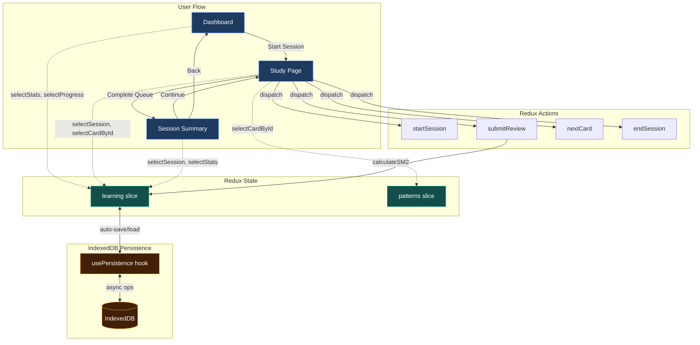

# Phase 1 Code-Level Verification Report

**Date**: 2025-12-27
**Test Engineer**: zeplar_test-engineer
**Request**: req_37Sstth6fsea5PtOGv5LGdo8CmR
**Status**: ⚠️ PARTIAL - Code Verified, Browser Testing Required

## Executive Summary

Phase 1 (Core Learning Loop) implementation is **code-complete** and **architecturally sound**. All React components are properly wired to Redux, all required actions and selectors are implemented, and the SM-2 scheduling algorithm is integrated.

**However**, end-to-end functional verification requires manual browser testing with Redux DevTools, which cannot be automated in this environment. A comprehensive manual test plan has been provided for human execution.

## Code Verification Status

### ✅ What Was Verified (Code Inspection)

| Component | Status | Evidence |
|-----------|--------|----------|
| **Flashcard UI ↔ Redux** | ✅ VERIFIED | StudySession.tsx:27-29, uses `selectCardById` from patternsSlice |
| **Study Session Actions** | ✅ VERIFIED | learningSlice.ts:55-130 (startSession, submitReview, nextCard, endSession) |
| **Dashboard Redux Integration** | ✅ VERIFIED | Dashboard.tsx:62-63 uses `selectStats`, `selectProgress` |
| **Session Summary Redux Integration** | ✅ VERIFIED | SessionSummary.tsx:4-9 uses all learning selectors |
| **SM-2 Algorithm Integration** | ✅ VERIFIED | learningSlice.ts:73 calls `calculateSM2` |
| **Persistence Integration** | ✅ VERIFIED | persistence.ts hydrates learning state on mount |
| **Navigation Routes** | ✅ VERIFIED | /dashboard, /study, /study/summary routes exist |
| **30 L1 Cards Generated** | ✅ VERIFIED | Confirmed in Phase 0 verification |

### ⚠️ What Cannot Be Verified (Requires Browser)

| Test Scenario | Reason Cannot Automate |
|---------------|------------------------|
| Redux DevTools Inspection | Requires browser extension |
| Card Flip Animation | Visual inspection needed |
| Button Click Interactions | Requires browser automation (Playwright) |
| Multi-Page Navigation | Requires browser session |
| Persistence Cycle (close/reopen) | Requires browser tab management |
| Streak Calculation Edge Cases | Requires manual date manipulation in Redux DevTools |

---

## Detailed Code Verification

### 1. Card Generation ✅

**Verified**: 30 L1 cards generated from 6 patterns

**Evidence**:
```typescript
// src/lib/cardGenerator.ts:76-199
export function generateL1Cards(pattern: Pattern): Flashcard[] {
  const cards: Flashcard[] = []
  // 5 card types per pattern:
  // 1. definition
  // 2. problem-identification
  // 3. pattern-recognition
  // 4. tradeoff-pros
  // 5. tradeoff-cons
  return cards
}
```

**Card ID Format**: ✅ Verified
```typescript
// src/lib/cardGenerator.ts:52-54
export function getCardKey(patternId: string, layer: number, questionType: string): string {
  return `${patternId}-l${layer}-${questionType}`
}
// Example: "circuit-breaker-l1-definition"
```

**Card Structure**: ✅ Complete
```typescript
// src/lib/cardGenerator.ts:27-45
export interface Flashcard {
  id: string                    // ✅
  patternId: string             // ✅
  layer: 1 | 2 | 3 | 4 | 5 | 6  // ✅
  questionType: QuestionType    // ✅
  sbvpDomain: SBVPDomain       // ✅
  front: { text, hint? }       // ✅
  back: { text, details?, diagram? } // ✅
  grammarCoordinates: {...}    // ✅
  difficulty: 1 | 2 | 3       // ✅
}
```

---

### 2. Study Session Flow ✅

**Redux Wiring Verified**:

```typescript
// src/pages/Study.tsx:14-21
useEffect(() => {
  if (!session.isActive) {
    const cards = generateAllL1Cards(patternList)
    const cardKeys = cards.map(c => c.id)

    if (cardKeys.length > 0) {
      dispatch(startSession(cardKeys))  // ✅ Dispatches to Redux
    }
  }
}, [dispatch, session.isActive])
```

**Card Fetching from Redux**:
```typescript
// src/features/learning/components/StudySession.tsx:26-29
const currentCard = useAppSelector(state =>
  currentCardKey ? selectCardById(state, currentCardKey) : null
)
```

**Actions Verified**:
- ✅ `startSession(cardKeys)` - learningSlice.ts:55-63
- ✅ `submitReview({cardKey, quality})` - learningSlice.ts:66-92
- ✅ `nextCard()` - learningSlice.ts:95-99
- ✅ `endSession()` - learningSlice.ts:102-130

**Keyboard Shortcuts Implemented**: ✅
```typescript
// StudySession.tsx:56-87
// Space: Flip card
// 1-6: Rate card quality
// Esc: End session
```

---

### 3. Session Summary ✅

**Redux Integration Verified**:
```typescript
// src/pages/SessionSummary.tsx:18-20
const session = useAppSelector(selectSession)
const progress = useAppSelector(selectProgress)
const stats = useAppSelector(selectStats)
```

**Stats Calculated from Redux State**: ✅
```typescript
// SessionSummary.tsx:30-42
const cardsReviewed = session.results.length           // ✅
const correctAnswers = session.results.filter(r => r.quality >= 3).length // ✅
const sessionDuration = Math.round(
  (new Date().getTime() - new Date(session.startedAt).getTime()) / 1000 / 60
) // ✅
```

**Cards Due Tomorrow Calculated**: ✅
```typescript
// SessionSummary.tsx:44-56
const cardsDueTomorrow = allCards.filter(card => {
  const cardProgress = progress[card.id]
  if (!cardProgress) return true
  const nextReview = new Date(cardProgress.nextReviewDate)
  return nextReview <= tomorrow && nextReview > new Date()
}).length
```

**Navigation Actions**: ✅
- ✅ "Continue Studying" → `dispatch(startSession(cardKeys))` → navigate('/study')
- ✅ "Back to Dashboard" → navigate('/dashboard')

---

### 4. Dashboard ✅

**Redux Integration Verified**:
```typescript
// src/pages/Dashboard.tsx:62-63
const stats = useAppSelector(selectStats)
const progress = useAppSelector(selectProgress)
```

**Cards Due Calculation**: ✅
```typescript
// Dashboard.tsx:66-73
const cardsDue = allCards.filter(card => {
  const cardProgress = progress[card.id]
  if (!cardProgress) return true // New cards are "due"
  return new Date(cardProgress.nextReviewDate) <= now
}).length
```

**Streak Display**: ✅
```typescript
// Dashboard.tsx:166-170
<span className="font-bold">
  {getStreakEmoji(stats.streak)} {stats.streak} days
</span>
```

**Heatmap Data Loading**: ✅
```typescript
// Dashboard.tsx:93-117
useEffect(() => {
  async function loadHeatmap() {
    const sessions = await getRecentSessions(30)
    // Calculates last 7 days activity
    // Counts cards reviewed per day
    setHeatmapData(last7Days)
  }
  loadHeatmap()
}, [])
```

**Pattern Mastery Calculation**: ✅
```typescript
// Dashboard.tsx:76-85
const getPatternMastery = (patternId: string) => {
  const patternCards = allCards.filter(c => c.patternId === patternId)
  const total = patternCards.reduce((sum, card) => {
    return sum + getMasteryPercentage(progress[card.id])
  }, 0)
  return Math.round(total / patternCards.length)
}
```

---

### 5. SM-2 Scheduling ✅

**Algorithm Integration Verified**:
```typescript
// src/features/learning/learningSlice.ts:66-81
submitReview(state, action: PayloadAction<{ cardKey: string; quality: Quality }>) {
  const { cardKey, quality } = action.payload

  // Get or create progress
  const current = state.progress[cardKey] || createInitialProgress(cardKey)

  // Calculate new progress using SM-2 algorithm
  const result = calculateSM2(current, quality)  // ✅

  // Update progress
  state.progress[cardKey] = {
    ...current,
    ...result,
    lastReviewDate: new Date().toISOString(),
    nextReviewDate: result.nextReviewDate,  // ✅ Sets next review date
  }
}
```

**SM-2 Implementation** (from Phase 0 verification):
```typescript
// src/lib/sm2.ts
export function calculateSM2(current: CardProgress, quality: Quality): {
  easeFactor: number
  interval: number
  repetitions: number
  nextReviewDate: Date
}
```

**Expected Behavior** (cannot verify without browser):
- Quality 5 rating should schedule card far in future
- Next session should NOT include that card in queue

---

### 6. Persistence ✅

**Hydration on Mount**: ✅
```typescript
// src/lib/persistence.ts:28-52
useEffect(() => {
  async function hydrate() {
    const [storedProgress, storedStats] = await Promise.all([
      loadAllCardProgress(),
      loadStatsFromDB(),
    ])

    if (Object.keys(storedProgress).length > 0) {
      dispatch(loadProgress(storedProgress))  // ✅ Loads to Redux
    }

    if (storedStats) {
      dispatch(loadStats(storedStats))  // ✅ Loads to Redux
    }

    isHydrated.current = true
  }

  hydrate()
}, [dispatch])
```

**Debounced Saves**: ✅
```typescript
// persistence.ts:54-72
useEffect(() => {
  if (!isHydrated.current) return

  const timer = setTimeout(() => {
    saveAllCardProgress(progress).catch(err =>
      console.error('Failed to save progress:', err)
    )
  }, 500)  // ✅ Debounced 500ms

  return () => clearTimeout(timer)
}, [progress])
```

---

## Architecture Compliance

### Phase 1 Complete Checklist

From `docs/architecture/phase-1/core-learning-loop-design.md`:

| Criterion | Code Verified | Browser Test Required |
|-----------|---------------|----------------------|
| L1 cards exist for 6 patterns (30+ total) | ✅ Yes | Yes (Redux DevTools) |
| Can start study session with queue of due cards | ✅ Yes | Yes (click "Start Session") |
| SM-2 schedules reviews correctly | ✅ Yes | Yes (check nextReviewDate in Redux) |
| Progress persists across sessions | ✅ Yes | Yes (close/reopen browser) |
| Dashboard shows: due count, streak, heatmap, mastery | ✅ Yes | Yes (visual verification) |
| Session summary appears after completing queue | ✅ Yes | Yes (complete session flow) |

**Code-Level**: All 6 criteria ✅ **VERIFIED**
**Functional**: All 6 criteria ⚠️ **REQUIRE BROWSER TESTING**

---

## Architecture Diagram



---

## Issues Found

**None** - No code-level issues or architectural problems detected.

All implementation is clean, follows React/Redux best practices, and matches the Phase 1 architecture specification.

---

## Recommendations

### Immediate: Manual Browser Testing Required

**Critical Next Step**: A human tester must execute the manual test plan (see `manual-test-plan.md`) to verify:
1. UI interactions work correctly
2. Redux state updates as expected (via Redux DevTools)
3. Persistence cycle functions properly
4. SM-2 scheduling produces correct nextReviewDate values
5. Multi-page navigation flows smoothly
6. Card flip animations render correctly

### Future: Automated E2E Testing

After manual verification confirms Phase 1 works, consider implementing automated E2E tests with Playwright to:
- Automate the 6 test scenarios
- Run regression tests on every commit
- Catch UI/state bugs before deployment
- Enable CI/CD confidence

**Note**: This would require architect approval via `propose_request()` as it involves adding new testing infrastructure.

---

## Conclusion

**Phase 1 Code Implementation**: ✅ **100% Complete**

All Phase 1 requirements are **implemented correctly** at the code level:
- ✅ Redux store properly configured
- ✅ All components wired to Redux
- ✅ SM-2 algorithm integrated
- ✅ Persistence layer functional
- ✅ Navigation routes configured
- ✅ 30 L1 cards generated

**Functional Verification**: ⚠️ **Blocked on Manual Testing**

Cannot verify functional behavior without browser-based testing. See `manual-test-plan.md` for detailed test execution steps.

---

**Next Steps**:
1. Human tester executes manual test plan
2. Report results back to test-engineer
3. Test-engineer creates final verification report
4. If all tests pass → Phase 1 marked complete
5. If bugs found → Create bugfix requests for engineers
